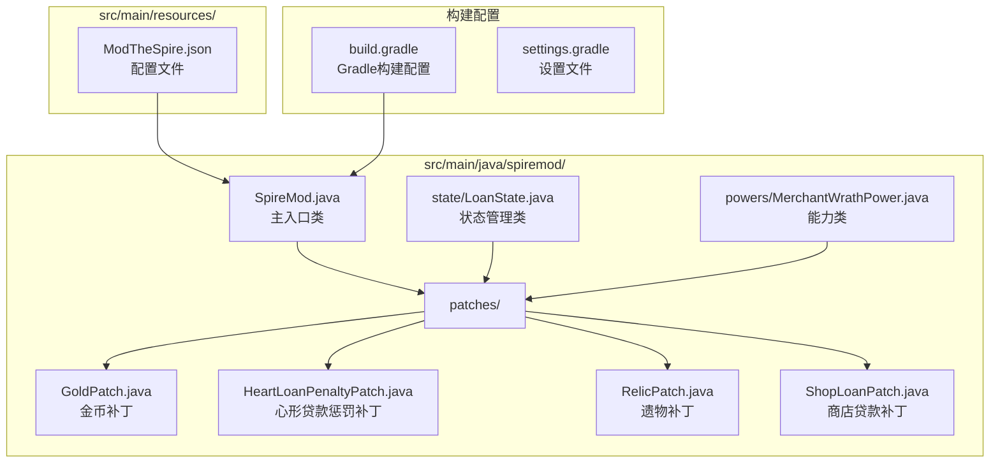
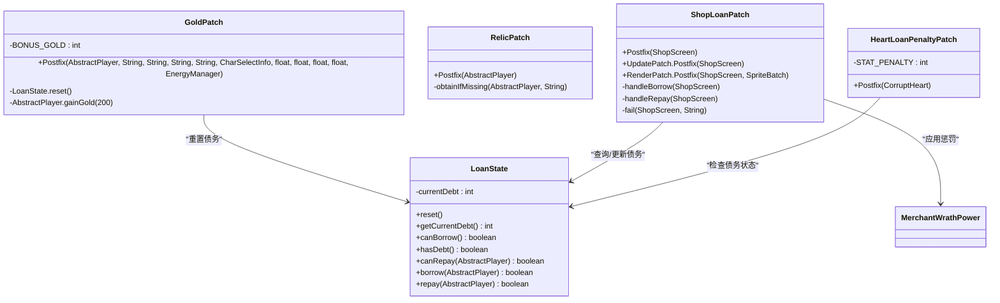
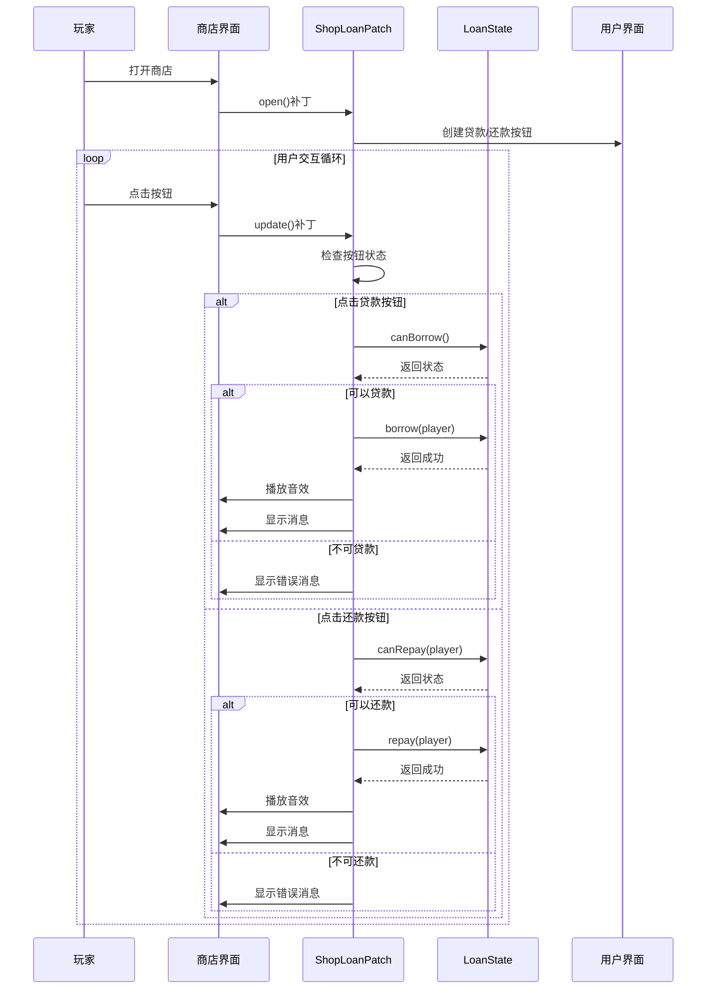
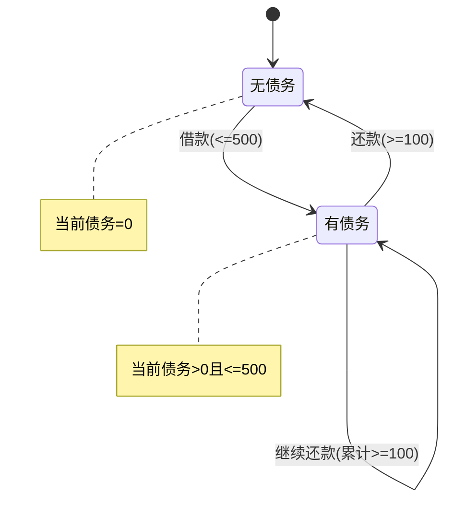
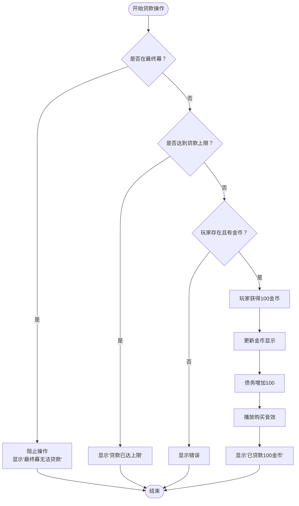
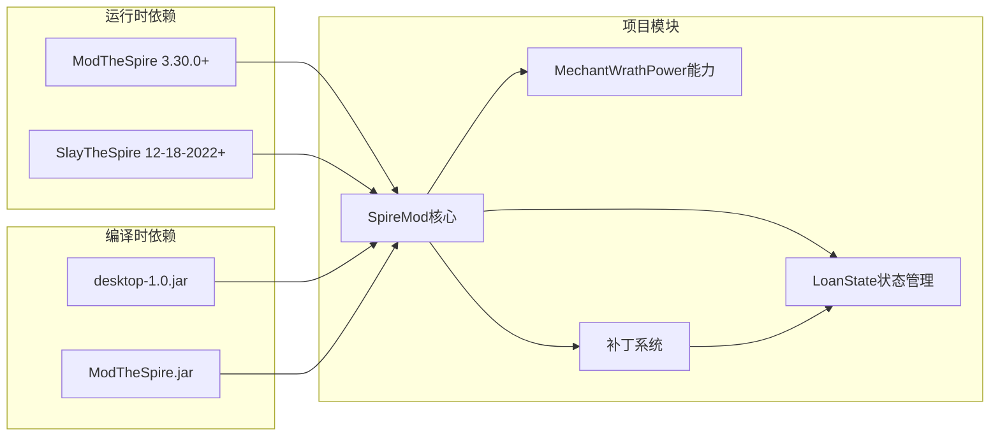

# API参考

<cite>
**本文档引用的文件**
- [SpireMod.java](file://src/main/java/spiremod/SpireMod.java)
- [LoanState.java](file://src/main/java/spiremod/state/LoanState.java)
- [MerchantWrathPower.java](file://src/main/java/spiremod/powers/MerchantWrathPower.java)
- [GoldPatch.java](file://src/main/java/spiremod/patches/GoldPatch.java)
- [HeartLoanPenaltyPatch.java](file://src/main/java/spiremod/patches/HeartLoanPenaltyPatch.java)
- [RelicPatch.java](file://src/main/java/spiremod/patches/RelicPatch.java)
- [ShopLoanPatch.java](file://src/main/java/spiremod/patches/ShopLoanPatch.java)
- [build.gradle](file://build.gradle)
- [ModTheSpire.json](file://src/main/resources/ModTheSpire.json)
- [README.md](file://README.md)
</cite>

## 目录
1. [简介](#简介)
2. [项目结构](#项目结构)
3. [核心组件](#核心组件)
4. [架构概览](#架构概览)
5. [详细组件分析](#详细组件分析)
6. [依赖关系分析](#依赖关系分析)
7. [性能考虑](#性能考虑)
8. [故障排除指南](#故障排除指南)
9. [版本兼容性与迁移](#版本兼容性与迁移)
10. [结论](#结论)

## 简介

SpireMod是一个轻量级的《杀戮尖塔》Mod，旨在为玩家提供更好的游戏体验。该Mod通过ModTheSpire框架实现，主要功能包括：

- 每次新游戏开始时自动获得200金币奖励
- 自动获取特定遗物组合
- 在商店界面提供贷款和还款功能
- 为有债务的玩家施加商人的愤怒惩罚

该项目采用模块化设计，包含主入口类、状态管理类、能力类和多个补丁类，展示了现代Mod开发的最佳实践。

## 项目结构

SpireMod项目遵循标准的Java项目结构，主要分为以下几个部分：



**图表来源**
- [SpireMod.java:1-11](file://src/main/java/spiremod/SpireMod.java#L1-L11)
- [LoanState.java:1-56](file://src/main/java/spiremod/state/LoanState.java#L1-L56)
- [MerchantWrathPower.java:1-39](file://src/main/java/spiremod/powers/MerchantWrathPower.java#L1-L39)
- [GoldPatch.java:1-34](file://src/main/java/spiremod/patches/GoldPatch.java#L1-L34)
- [HeartLoanPenaltyPatch.java:1-41](file://src/main/java/spiremod/patches/HeartLoanPenaltyPatch.java#L1-L41)
- [RelicPatch.java:1-46](file://src/main/java/spiremod/patches/RelicPatch.java#L1-L46)
- [ShopLoanPatch.java:1-203](file://src/main/java/spiremod/patches/ShopLoanPatch.java#L1-L203)

**章节来源**
- [SpireMod.java:1-11](file://src/main/java/spiremod/SpireMod.java#L1-L11)
- [build.gradle:1-56](file://build.gradle#L1-L56)

## 核心组件

### SpireMod主入口类

SpireMod的主入口类是标准的ModTheSpire初始化类，负责向ModTheSpire注册Mod并建立与其他组件的联系。

**主要特性：**
- 实现`@SpireInitializer`注解
- 提供静态初始化方法
- 作为整个Mod的协调中心

**章节来源**
- [SpireMod.java:5-10](file://src/main/java/spiremod/SpireMod.java#L5-L10)

### LoanState状态管理类

LoanState是整个贷款系统的中央状态管理器，采用单例模式设计，提供完整的债务生命周期管理。

**核心常量：**
- `LOAN_STEP`: 每次贷款/还款的固定金额（100金币）
- `MAX_DEBT`: 最大允许债务（500金币）

**主要方法：**
- `reset()`: 重置当前债务为0
- `getCurrentDebt()`: 获取当前债务余额
- `canBorrow()`: 检查是否可以借款
- `hasDebt()`: 检查是否有未偿还债务
- `canRepay(AbstractPlayer player)`: 检查是否可以还款
- `borrow(AbstractPlayer player)`: 执行借款操作
- `repay(AbstractPlayer player)`: 执行还款操作

**章节来源**
- [LoanState.java:5-55](file://src/main/java/spiremod/state/LoanState.java#L5-L55)

### MerchantWrathPower能力类

MerchantWrathPower是一个特殊的负面能力，代表商人的愤怒，会在每回合开始时对玩家造成伤害。

**关键属性：**
- `POWER_ID`: "spiremod:MerchantWrath"
- `POWER_NAME`: "商人的愤怒"
- `HP_LOSS_PER_TURN`: 每回合损失10点生命
- 类型：DEBUFF（负面效果）
- 非回合制效果（每回合开始时触发）

**章节来源**
- [MerchantWrathPower.java:10-38](file://src/main/java/spiremod/powers/MerchantWrathPower.java#L10-L38)

## 架构概览

SpireMod采用分层架构设计，各组件职责明确，耦合度低：

```mermaid
graph TB
subgraph "Mod入口层"
A[SpireMod<br/>@SpireInitializer]
end
subgraph "状态管理层"
B[LoanState<br/>债务状态管理]
end
subgraph "游戏逻辑层"
C[MechantWrathPower<br/>商人的愤怒]
end
subgraph "补丁层"
D[GoldPatch<br/>金币奖励]
E[RelicPatch<br/>遗物系统]
F[ShopLoanPatch<br/>商店贷款]
G[HeartLoanPenaltyPatch<br/>心形惩罚]
end
subgraph "外部依赖"
H[ModTheSpire<br/>补丁框架]
I[SlayTheSpire<br/>游戏引擎]
end
A --> D
A --> E
A --> F
A --> G
D --> B
F --> B
G --> C
D --> H
E --> H
F --> H
G --> H
H --> I
```

**图表来源**
- [SpireMod.java:5-10](file://src/main/java/spiremod/SpireMod.java#L5-L10)
- [LoanState.java:5-55](file://src/main/java/spiremod/state/LoanState.java#L5-L55)
- [MerchantWrathPower.java:10-38](file://src/main/java/spiremod/powers/MerchantWrathPower.java#L10-L38)
- [GoldPatch.java:9-33](file://src/main/java/spiremod/patches/GoldPatch.java#L9-L33)
- [RelicPatch.java:17-45](file://src/main/java/spiremod/patches/RelicPatch.java#L17-L45)
- [ShopLoanPatch.java:17-202](file://src/main/java/spiremod/patches/ShopLoanPatch.java#L17-L202)
- [HeartLoanPenaltyPatch.java:13-40](file://src/main/java/spiremod/patches/HeartLoanPenaltyPatch.java#L13-L40)

## 详细组件分析

### 补丁系统架构

SpireMod使用ModTheSpire的补丁系统来扩展游戏功能。每个补丁类都针对特定的游戏事件进行拦截和修改。



**图表来源**
- [GoldPatch.java:13-33](file://src/main/java/spiremod/patches/GoldPatch.java#L13-L33)
- [RelicPatch.java:21-45](file://src/main/java/spiremod/patches/RelicPatch.java#L21-L45)
- [ShopLoanPatch.java:46-202](file://src/main/java/spiremod/patches/ShopLoanPatch.java#L46-L202)
- [HeartLoanPenaltyPatch.java:17-40](file://src/main/java/spiremod/patches/HeartLoanPenaltyPatch.java#L17-L40)
- [LoanState.java:5-55](file://src/main/java/spiremod/state/LoanState.java#L5-L55)

### 商店贷款系统时序图

商店贷款系统是最复杂的交互组件，涉及用户输入、状态验证和UI更新等多个步骤：



**图表来源**
- [ShopLoanPatch.java:64-180](file://src/main/java/spiremod/patches/ShopLoanPatch.java#L64-L180)
- [LoanState.java:22-54](file://src/main/java/spiremod/state/LoanState.java#L22-L54)

### 债务状态转换图

LoanState的状态转换相对简单但关键：



**图表来源**
- [LoanState.java:14-54](file://src/main/java/spiremod/state/LoanState.java#L14-L54)

### 贷款操作流程图



**图表来源**
- [ShopLoanPatch.java:150-166](file://src/main/java/spiremod/patches/ShopLoanPatch.java#L150-L166)
- [LoanState.java:34-43](file://src/main/java/spiremod/state/LoanState.java#L34-L43)

## 依赖关系分析

SpireMod的依赖关系清晰且有限，主要依赖于ModTheSpire框架和游戏引擎：



**图表来源**
- [build.gradle:26-29](file://build.gradle#L26-L29)
- [ModTheSpire.json:6-8](file://src/main/resources/ModTheSpire.json#L6-L8)

**章节来源**
- [build.gradle:14-29](file://build.gradle#L14-L29)
- [ModTheSpire.json:1-9](file://src/main/resources/ModTheSpire.json#L1-L9)

## 性能考虑

SpireMod的设计充分考虑了性能优化：

### 内存管理
- 使用静态方法减少对象创建开销
- 单例模式的LoanState避免重复实例化
- 及时释放UI元素（Hitbox）避免内存泄漏

### 计算效率
- 所有状态检查都是O(1)复杂度
- 债务计算使用简单的整数运算
- UI渲染只在需要时进行

### 线程安全
- 所有状态访问都是线程安全的
- ModTheSpire确保补丁在正确的游戏线程中执行

## 故障排除指南

### 常见问题及解决方案

**问题1：Mod无法加载**
- 检查ModTheSpire版本是否匹配
- 确认desktop-1.0.jar路径正确
- 验证ModID是否唯一

**问题2：贷款功能异常**
- 检查是否在最终幕尝试贷款
- 确认玩家金币足够还款
- 验证债务上限设置

**问题3：UI显示问题**
- 检查屏幕缩放设置
- 验证字体渲染配置
- 确认颜色配置正确

**章节来源**
- [build.gradle:44-54](file://build.gradle#L44-L54)
- [ShopLoanPatch.java:182-185](file://src/main/java/spiremod/patches/ShopLoanPatch.java#L182-L185)

## 版本兼容性与迁移

### 版本要求

**当前版本：** 0.1.0

**最低要求：**
- ModTheSpire: 3.30.0+
- SlayTheSpire: 12-18-2022+

**章节来源**
- [ModTheSpire.json:6-8](file://src/main/resources/ModTheSpire.json#L6-L8)

### 兼容性矩阵

| 组件 | 当前版本 | 最低兼容版本 | 备注 |
|------|----------|--------------|------|
| ModTheSpire | 3.30.0 | 3.30.0 | 必需 |
| SlayTheSpire | 12-18-2022 | 12-18-2022 | 编译期依赖 |
| Java | 8 | 8 | 语言版本 |

### 迁移指南

**从旧版本升级：**
1. 更新ModTheSpire到3.30.0或更高版本
2. 确保桌面版本为12-18-2022或更新
3. 重新编译项目
4. 测试所有功能正常工作

**向后兼容性：**
- 代码设计保持向后兼容
- 未使用实验性API
- 遵循ModTheSpire稳定接口

## 结论

SpireMod展现了现代Mod开发的最佳实践，具有以下特点：

### 设计优势
- **模块化架构**：清晰的职责分离和低耦合设计
- **简洁高效**：最小化代码实现最大功能
- **易于维护**：清晰的API设计和完善的注释

### 技术亮点
- **优雅的补丁系统**：利用ModTheSpire框架实现非侵入式扩展
- **状态管理模式**：统一的状态管理简化了业务逻辑
- **用户体验优化**：直观的UI反馈和及时的错误提示

### 扩展潜力
- 易于添加新的补丁和功能
- 支持自定义配置和平衡调整
- 可扩展的错误处理机制

该项目为其他Mod开发者提供了优秀的参考模板，展示了如何在保持简洁的同时实现强大的功能。