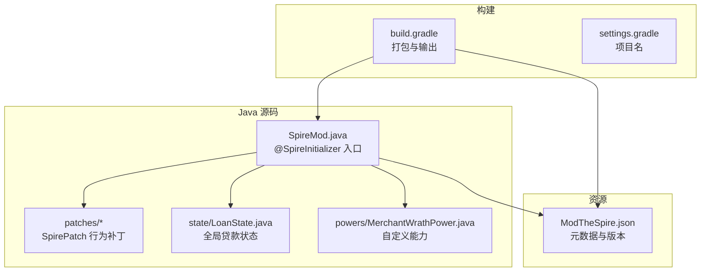
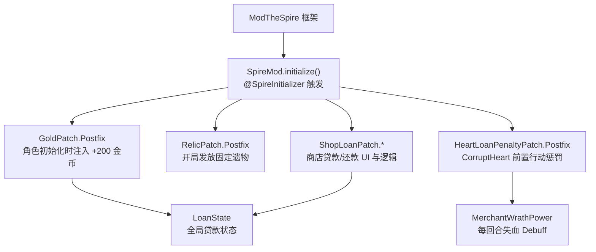
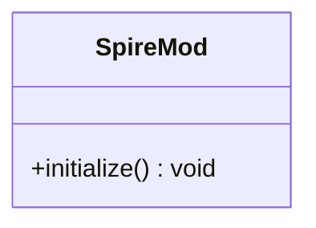
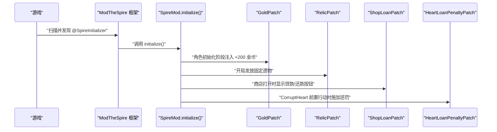
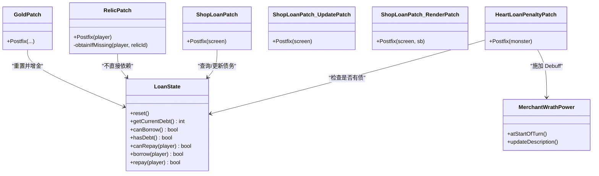
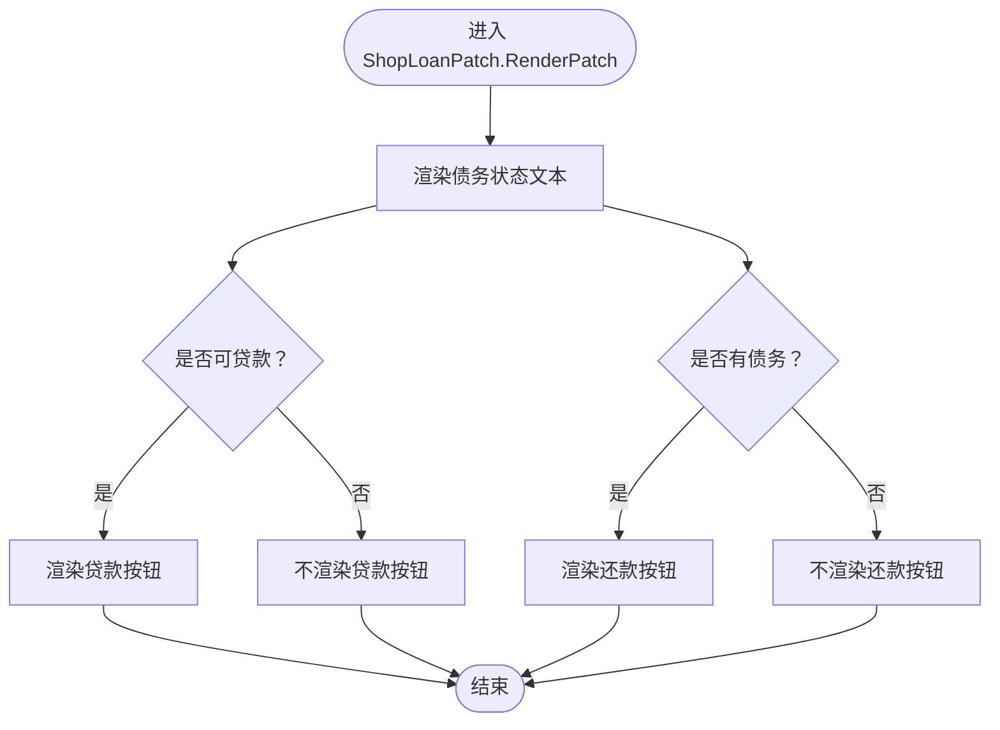
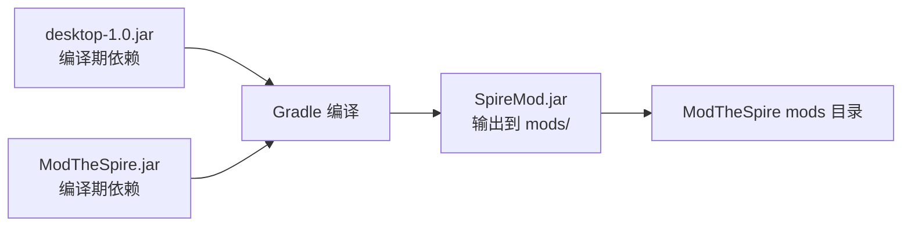

# 核心API

<cite>
**本文引用的文件**
- [SpireMod.java](file://src/main/java/spiremod/SpireMod.java)
- [GoldPatch.java](file://src/main/java/spiremod/patches/GoldPatch.java)
- [RelicPatch.java](file://src/main/java/spiremod/patches/RelicPatch.java)
- [ShopLoanPatch.java](file://src/main/java/spiremod/patches/ShopLoanPatch.java)
- [HeartLoanPenaltyPatch.java](file://src/main/java/spiremod/patches/HeartLoanPenaltyPatch.java)
- [MerchantWrathPower.java](file://src/main/java/spiremod/powers/MerchantWrathPower.java)
- [LoanState.java](file://src/main/java/spiremod/state/LoanState.java)
- [ModTheSpire.json](file://src/main/resources/ModTheSpire.json)
- [build.gradle](file://build.gradle)
- [settings.gradle](file://settings.gradle)
- [README.md](file://README.md)
- [2026-06-15-spiremod-lightweight-design.md](file://docs/superpowers/specs/2026-06-15-spiremod-lightweight-design.md)
</cite>

## 目录
1. [简介](#简介)
2. [项目结构](#项目结构)
3. [核心组件](#核心组件)
4. [架构总览](#架构总览)
5. [详细组件分析](#详细组件分析)
6. [依赖分析](#依赖分析)
7. [性能考虑](#性能考虑)
8. [故障排查指南](#故障排查指南)
9. [结论](#结论)
10. [附录](#附录)

## 简介
本文件为 SpireMod 核心 API 的参考文档，聚焦于主入口类与初始化流程，详解 @SpireInitializer 注解的职责与使用方式，并梳理 initialize() 方法的调用时机与参数语义。文档同时给出类图与初始化时序图，帮助开发者理解 Mod 加载的完整生命周期；并提供与其他组件（补丁、状态、能力）的集成方式与最佳实践，以及正确的注册与初始化示例路径。

## 项目结构
SpireMod 采用“轻量级设计”，完全基于 ModTheSpire 的 SpirePatch 机制，不依赖 BaseMod。核心结构如下：
- 入口类：SpireMod.java，标注 @SpireInitializer，提供静态 initialize() 方法用于触发 Mod 初始化。
- 补丁模块：patches 包含多个 SpirePatch，分别在角色初始化、遗物发放、商店交互、心脏战等节点注入行为。
- 状态模块：state 包含 LoanState，提供贷款系统的全局状态管理。
- 能力模块：powers 包含自定义 Debuff 能力 MerchantWrathPower。
- 资源清单：ModTheSpire.json 提供 Mod 元数据与版本约束。
- 构建配置：build.gradle 将 Mod 打包并输出至 ModTheSpire 的 mods 目录。

图表来源
- [SpireMod.java:1-11](file://src/main/java/spiremod/SpireMod.java#L1-L11)
- [LoanState.java:1-56](file://src/main/java/spiremod/state/LoanState.java#L1-L56)
- [MerchantWrathPower.java:1-39](file://src/main/java/spiremod/powers/MerchantWrathPower.java#L1-L39)
- [ModTheSpire.json:1-10](file://src/main/resources/ModTheSpire.json#L1-L10)
- [build.gradle:1-56](file://build.gradle#L1-L56)

章节来源
- [SpireMod.java:1-11](file://src/main/java/spiremod/SpireMod.java#L1-L11)
- [build.gradle:1-56](file://build.gradle#L1-L56)
- [settings.gradle:1-2](file://settings.gradle#L1-L2)
- [README.md:1-47](file://README.md#L1-L47)
- [2026-06-15-spiremod-lightweight-design.md:23-41](file://docs/superpowers/specs/2026-06-15-spiremod-lightweight-design.md#L23-L41)

## 核心组件
- 主入口类 SpireMod
  - 作用：通过 @SpireInitializer 标注，向 ModTheSpire 框架声明该类为 Mod 初始化入口。
  - 初始化方法：public static void initialize()，内部构造新实例以触发初始化逻辑。
- Mod 元数据清单 ModTheSpire.json
  - 作用：提供 modid、名称、作者、描述、版本及对 STS/MTS 版本的要求。
- 构建脚本 build.gradle
  - 作用：配置 Java 工具链、编译期依赖（桌面版 JAR 与 ModTheSpire）、打包任务并将产物输出到 ModTheSpire 的 mods 目录。

章节来源
- [SpireMod.java:5-10](file://src/main/java/spiremod/SpireMod.java#L5-L10)
- [ModTheSpire.json:1-10](file://src/main/resources/ModTheSpire.json#L1-L10)
- [build.gradle:8-29](file://build.gradle#L8-L29)
- [build.gradle:35-55](file://build.gradle#L35-L55)

## 架构总览
SpireMod 的运行时架构围绕“入口类 + 多个 SpirePatch + 全局状态 + 自定义能力”展开。入口类负责被 ModTheSpire 发现并调用 initialize()；随后各补丁在特定游戏阶段生效，共同完成“开局金币+200、发放固定遗物、贷款系统、心脏惩罚”等目标。

图表来源
- [SpireMod.java:7-9](file://src/main/java/spiremod/SpireMod.java#L7-L9)
- [GoldPatch.java:16-32](file://src/main/java/spiremod/patches/GoldPatch.java#L16-L32)
- [RelicPatch.java:22-44](file://src/main/java/spiremod/patches/RelicPatch.java#L22-L44)
- [ShopLoanPatch.java:46-202](file://src/main/java/spiremod/patches/ShopLoanPatch.java#L46-L202)
- [HeartLoanPenaltyPatch.java:20-39](file://src/main/java/spiremod/patches/HeartLoanPenaltyPatch.java#L20-L39)
- [LoanState.java:14-54](file://src/main/java/spiremod/state/LoanState.java#L14-L54)
- [MerchantWrathPower.java:10-38](file://src/main/java/spiremod/powers/MerchantWrathPower.java#L10-L38)

## 详细组件分析

### 入口类 SpireMod 与 @SpireInitializer
- 注解作用
  - @SpireInitializer 告知 ModTheSpire：该类是 Mod 的初始化入口，框架会在合适时机调用其 initialize() 方法。
- initialize() 方法
  - 调用时机：由 ModTheSpire 在加载流程中发现并调用，无需手动调用。
  - 参数：无参数。
  - 行为：构造新的 SpireMod 实例，从而触发类初始化与静态块执行（若存在），并可在此处进行进一步的初始化逻辑。
- 最佳实践
  - 保持 initialize() 方法简洁，将复杂初始化委托给构造函数或专用初始化方法。
  - 确保入口类位于根包下且与 Mod 元数据一致，便于 ModTheSpire 正确识别。

图表来源
- [SpireMod.java:5-10](file://src/main/java/spiremod/SpireMod.java#L5-L10)

章节来源
- [SpireMod.java:5-10](file://src/main/java/spiremod/SpireMod.java#L5-L10)
- [2026-06-15-spiremod-lightweight-design.md:51-53](file://docs/superpowers/specs/2026-06-15-spiremod-lightweight-design.md#L51-L53)

### 初始化时序图（从 Mod 加载到补丁生效）
该时序图展示了 Mod 加载与初始化的关键步骤，以及补丁在游戏关键节点的触发顺序。

图表来源
- [SpireMod.java:7-9](file://src/main/java/spiremod/SpireMod.java#L7-L9)
- [GoldPatch.java:16-32](file://src/main/java/spiremod/patches/GoldPatch.java#L16-L32)
- [RelicPatch.java:22-44](file://src/main/java/spiremod/patches/RelicPatch.java#L22-L44)
- [ShopLoanPatch.java:46-202](file://src/main/java/spiremod/patches/ShopLoanPatch.java#L46-L202)
- [HeartLoanPenaltyPatch.java:20-39](file://src/main/java/spiremod/patches/HeartLoanPenaltyPatch.java#L20-L39)

### 补丁组件与集成方式
- GoldPatch
  - 触发点：角色初始化阶段，Postfix 注入 +200 金币并重置贷款状态。
  - 集成要点：确保仅在新开一局时生效，避免读档重复发放。
- RelicPatch
  - 触发点：initializeStarterRelics，按顺序检查并发放固定遗物，避免重复。
  - 集成要点：使用 RelicLibrary 获取原版遗物副本，通过 instantObtain 添加至玩家。
- ShopLoanPatch
  - 触发点：ShopScreen.open/update/render，绘制贷款/还款按钮，处理点击与渲染。
  - 集成要点：根据 LoanState 当前债务与上限控制按钮可用性；最终幕禁用贷款。
- HeartLoanPenaltyPatch
  - 触发点：CorruptHeart.usePreBattleAction，若玩家有债务则施加力量/敏捷-10与 MerchantWrathPower。
  - 集成要点：仅在有债务时生效，避免空指针。

图表来源
- [GoldPatch.java:16-32](file://src/main/java/spiremod/patches/GoldPatch.java#L16-L32)
- [RelicPatch.java:22-44](file://src/main/java/spiremod/patches/RelicPatch.java#L22-L44)
- [ShopLoanPatch.java:46-202](file://src/main/java/spiremod/patches/ShopLoanPatch.java#L46-L202)
- [HeartLoanPenaltyPatch.java:20-39](file://src/main/java/spiremod/patches/HeartLoanPenaltyPatch.java#L20-L39)
- [LoanState.java:14-54](file://src/main/java/spiremod/state/LoanState.java#L14-L54)
- [MerchantWrathPower.java:28-37](file://src/main/java/spiremod/powers/MerchantWrathPower.java#L28-L37)

章节来源
- [GoldPatch.java:9-33](file://src/main/java/spiremod/patches/GoldPatch.java#L9-L33)
- [RelicPatch.java:17-45](file://src/main/java/spiremod/patches/RelicPatch.java#L17-L45)
- [ShopLoanPatch.java:17-203](file://src/main/java/spiremod/patches/ShopLoanPatch.java#L17-L203)
- [HeartLoanPenaltyPatch.java:13-41](file://src/main/java/spiremod/patches/HeartLoanPenaltyPatch.java#L13-L41)
- [MerchantWrathPower.java:10-39](file://src/main/java/spiremod/powers/MerchantWrathPower.java#L10-L39)

### 状态与能力组件
- LoanState
  - 职责：维护当前债务、最大债务、借还逻辑与可用性判断。
  - 关键方法：reset、getCurrentDebt、canBorrow、hasDebt、canRepay、borrow、repay。
- MerchantWrathPower
  - 职责：回合开始造成固定失血，作为债务惩罚的可视化与机制体现。

图表来源
- [ShopLoanPatch.java:100-147](file://src/main/java/spiremod/patches/ShopLoanPatch.java#L100-L147)
- [LoanState.java:18-32](file://src/main/java/spiremod/state/LoanState.java#L18-L32)

章节来源
- [LoanState.java:5-56](file://src/main/java/spiremod/state/LoanState.java#L5-L56)
- [MerchantWrathPower.java:10-39](file://src/main/java/spiremod/powers/MerchantWrathPower.java#L10-L39)

## 依赖分析
- 编译期依赖
  - desktop-1.0.jar：杀戮尖塔游戏类（仅编译期）。
  - ModTheSpire.jar：Mod 加载与补丁框架（仅编译期）。
- 运行时依赖
  - ModTheSpire 框架负责扫描 @SpireInitializer 并调用 initialize()。
- 构建输出
  - 打包任务将编译产物与资源清单合并为 SpireMod.jar，并输出至 ModTheSpire 的 mods 目录。

图表来源
- [build.gradle:26-29](file://build.gradle#L26-L29)
- [build.gradle:35-55](file://build.gradle#L35-L55)
- [ModTheSpire.json:1-10](file://src/main/resources/ModTheSpire.json#L1-L10)

章节来源
- [build.gradle:14-29](file://build.gradle#L14-L29)
- [build.gradle:35-55](file://build.gradle#L35-L55)
- [README.md:13-36](file://README.md#L13-L36)

## 性能考虑
- 补丁数量与触发频率
  - ShopLoanPatch 在 update/render 中频繁检查输入与渲染，建议保持逻辑轻量，避免在渲染路径做重型计算。
- 状态访问
  - LoanState 为静态单例式状态，访问成本低；但需注意多线程与并发场景下的可见性问题（通常由 ModTheSpire 生命周期保证主线程安全）。
- 资源加载
  - 使用 RelicLibrary 获取原版遗物副本时，尽量减少重复查找；RelicPatch 已通过一次性获取副本并立即添加，符合良好实践。

## 故障排查指南
- Mod 未被 ModTheSpire 发现
  - 检查入口类是否标注 @SpireInitializer，且位于根包下；确认 ModTheSpire.json 的 modid 与入口类一致。
- 初始化失败或异常
  - 确认 initialize() 方法未抛出未捕获异常；必要时在构造函数中增加日志或容错处理。
- 补丁未生效
  - 核对补丁的 @SpirePatch 注解目标类与方法签名是否与游戏版本匹配；确保补丁类在打包后的 JAR 内。
- 商店贷款按钮不可用
  - 检查 LoanState.canBorrow()/canRepay() 返回值；确认当前是否处于最终幕（禁用贷款）。
- 心脏战未施加惩罚
  - 确认玩家是否有债务；检查 HeartLoanPenaltyPatch 是否在正确的前置行动阶段触发。

章节来源
- [SpireMod.java:5-10](file://src/main/java/spiremod/SpireMod.java#L5-L10)
- [ShopLoanPatch.java:150-185](file://src/main/java/spiremod/patches/ShopLoanPatch.java#L150-L185)
- [HeartLoanPenaltyPatch.java:20-39](file://src/main/java/spiremod/patches/HeartLoanPenaltyPatch.java#L20-L39)

## 结论
SpireMod 以最小化依赖的方式实现了“开局福利 + 贷款系统 + 心脏惩罚”的核心玩法。通过 @SpireInitializer 与 initialize() 的约定，ModTheSpire 能够可靠地发现并初始化 Mod；配合多个 SpirePatch 与 LoanState、MerchantWrathPower 等组件，形成清晰的职责边界与可维护的扩展点。遵循本文的最佳实践与排障建议，可确保 Mod 在不同环境中稳定运行。

## 附录
- 示例：正确注册与初始化 Mod
  - 入口类：参见 [SpireMod.java:5-10](file://src/main/java/spiremod/SpireMod.java#L5-L10)
  - 元数据清单：参见 [ModTheSpire.json:1-10](file://src/main/resources/ModTheSpire.json#L1-L10)
  - 构建输出：参见 [build.gradle:35-55](file://build.gradle#L35-L55)
  - 说明：ModTheSpire 会在启动时扫描 @SpireInitializer 并调用 initialize()，无需手动调用。