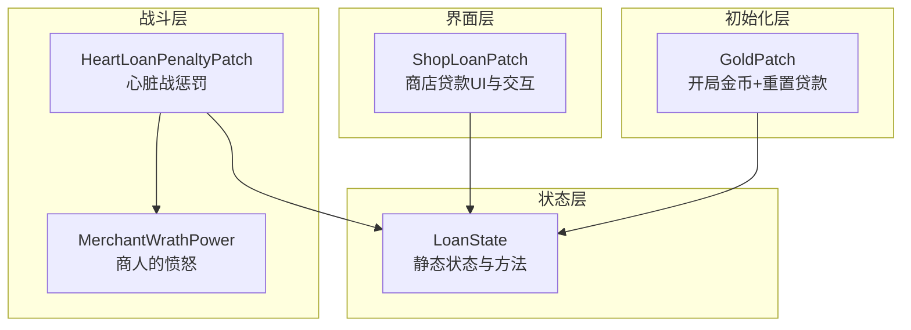
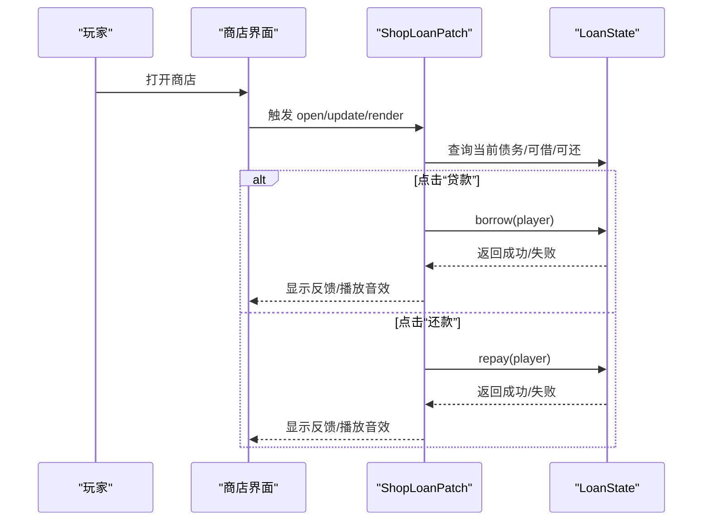
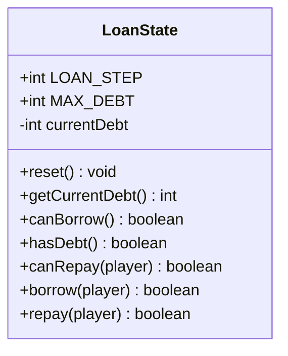
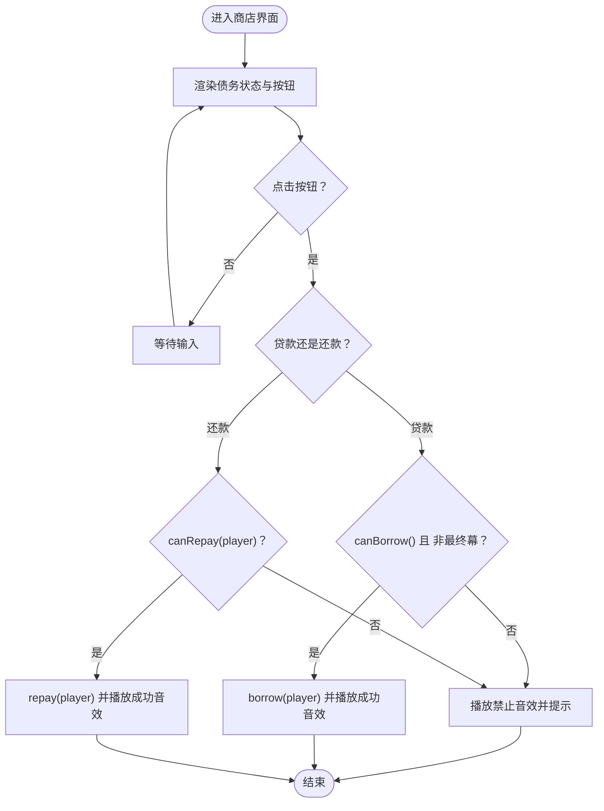
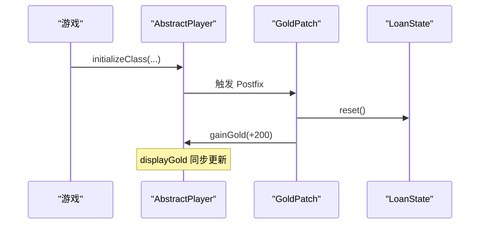
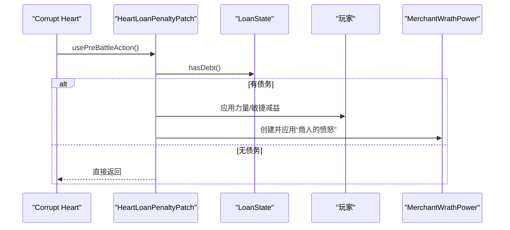

# 状态管理API

<cite>
**本文引用的文件**
- [LoanState.java](file://src/main/java/spiremod/state/LoanState.java)
- [ShopLoanPatch.java](file://src/main/java/spiremod/patches/ShopLoanPatch.java)
- [GoldPatch.java](file://src/main/java/spiremod/patches/GoldPatch.java)
- [HeartLoanPenaltyPatch.java](file://src/main/java/spiremod/patches/HeartLoanPenaltyPatch.java)
- [MerchantWrathPower.java](file://src/main/java/spiremod/powers/MerchantWrathPower.java)
- [SpireMod.java](file://src/main/java/spiremod/SpireMod.java)
- [2026-06-15-spiremod-lightweight-design.md](file://docs/superpowers/specs/2026-06-15-spiremod-lightweight-design.md)
- [README.md](file://README.md)
</cite>

## 目录
1. [简介](#简介)
2. [项目结构](#项目结构)
3. [核心组件](#核心组件)
4. [架构总览](#架构总览)
5. [详细组件分析](#详细组件分析)
6. [依赖分析](#依赖分析)
7. [性能考量](#性能考量)
8. [故障排查指南](#故障排查指南)
9. [结论](#结论)
10. [附录](#附录)

## 简介
本文件为 LoanState 状态管理 API 的权威参考文档。LoanState 提供贷款金额管理、最大债务限制与当前债务状态查询等核心功能，并通过补丁系统在商店界面中提供“贷款/还款”交互，同时在特定战斗阶段对有债务的玩家施加惩罚。本文将从静态方法与属性、状态同步与线程安全、数据持久化策略、状态转换图、并发访问示例、错误处理与边界条件、以及不同游戏阶段的状态查询与更新等方面进行系统性说明。

## 项目结构
- 核心状态类位于 state 包，负责全局贷款状态的维护与查询。
- 补丁系统通过 SpirePatch 在关键节点修改游戏行为，如商店界面、角色初始化、最终幕禁用贷款、心脏战施加惩罚等。
- 动作与效果通过 Mod 的自定义 Power 实现，例如“商人的愤怒”。



图表来源
- [LoanState.java:1-56](file://src/main/java/spiremod/state/LoanState.java#L1-L56)
- [ShopLoanPatch.java:1-202](file://src/main/java/spiremod/patches/ShopLoanPatch.java#L1-L202)
- [GoldPatch.java:1-34](file://src/main/java/spiremod/patches/GoldPatch.java#L1-L34)
- [HeartLoanPenaltyPatch.java:1-41](file://src/main/java/spiremod/patches/HeartLoanPenaltyPatch.java#L1-L41)
- [MerchantWrathPower.java:1-39](file://src/main/java/spiremod/powers/MerchantWrathPower.java#L1-L39)

章节来源
- [2026-06-15-spiremod-lightweight-design.md:23-41](file://docs/superpowers/specs/2026-06-15-spiremod-lightweight-design.md#L23-L41)

## 核心组件
- LoanState：全局贷款状态管理器，提供静态常量与静态方法，用于查询与变更当前债务。
- ShopLoanPatch：在商店界面添加贷款/还款按钮，渲染债务状态，并根据 LoanState 的能力执行借还操作。
- GoldPatch：角色初始化时重置贷款状态并发放初始金币。
- HeartLoanPenaltyPatch：在最终幕 Corrupt Heart 战前，若玩家有债务则施加力量/敏捷减益与“商人的愤怒”。
- MerchantWrathPower：回合开始造成固定伤害的负面效果。

章节来源
- [LoanState.java:1-56](file://src/main/java/spiremod/state/LoanState.java#L1-L56)
- [ShopLoanPatch.java:1-202](file://src/main/java/spiremod/patches/ShopLoanPatch.java#L1-L202)
- [GoldPatch.java:1-34](file://src/main/java/spiremod/patches/GoldPatch.java#L1-L34)
- [HeartLoanPenaltyPatch.java:1-41](file://src/main/java/spiremod/patches/HeartLoanPenaltyPatch.java#L1-L41)
- [MerchantWrathPower.java:1-39](file://src/main/java/spiremod/powers/MerchantWrathPower.java#L1-L39)

## 架构总览
LoanState 作为单一职责的状态持有者，被多个补丁模块以只读或写入的方式访问。其状态变化与游戏事件（商店交互、角色初始化、战斗开始）耦合，形成清晰的职责分离。



图表来源
- [ShopLoanPatch.java:46-180](file://src/main/java/spiremod/patches/ShopLoanPatch.java#L46-L180)
- [LoanState.java:34-54](file://src/main/java/spiremod/state/LoanState.java#L34-L54)

## 详细组件分析

### LoanState 类
- 静态常量
  - LOAN_STEP：单次借/还金额步进值
  - MAX_DEBT：最大债务上限
- 静态字段
  - currentDebt：当前总债务
- 静态方法
  - reset()：将 currentDebt 归零
  - getCurrentDebt()：返回当前债务
  - canBorrow()：判断是否未达上限
  - hasDebt()：判断是否存在债务
  - canRepay(player)：判断是否有债务且玩家金币足够一次还清步进额
  - borrow(player)：在满足条件时增加玩家金币与当前债务
  - repay(player)：在满足条件时减少玩家金币与当前债务



图表来源
- [LoanState.java:5-55](file://src/main/java/spiremod/state/LoanState.java#L5-L55)

章节来源
- [LoanState.java:1-56](file://src/main/java/spiremod/state/LoanState.java#L1-L56)

### 商店贷款交互（ShopLoanPatch）
- 渲染逻辑：在商店界面右上方渲染“债务 X/Y”的状态文本；根据 LoanState 的能力显示“贷款/还款”按钮。
- 输入处理：在 update 中响应点击，调用 LoanState 的 canBorrow/canRepay/borrow/repay，并根据结果播放音效与提示。
- 条件控制：
  - 最终幕禁用贷款（isFinalActShop）
  - 仅当存在债务时显示“还款”按钮
  - 仅当未达上限且非最终幕时显示“贷款”按钮



图表来源
- [ShopLoanPatch.java:46-180](file://src/main/java/spiremod/patches/ShopLoanPatch.java#L46-L180)
- [LoanState.java:22-54](file://src/main/java/spiremod/state/LoanState.java#L22-L54)

章节来源
- [ShopLoanPatch.java:1-202](file://src/main/java/spiremod/patches/ShopLoanPatch.java#L1-L202)

### 初始化与数据持久化（GoldPatch）
- 在角色初始化时重置贷款状态并发放初始金币，确保每局开始时债务归零、金币增加。
- 该模式将贷款状态与“每局开始”绑定，实现跨关卡的持久化语义（每局独立状态）。



图表来源
- [GoldPatch.java:16-32](file://src/main/java/spiremod/patches/GoldPatch.java#L16-L32)
- [LoanState.java:14-16](file://src/main/java/spiremod/state/LoanState.java#L14-L16)

章节来源
- [GoldPatch.java:1-34](file://src/main/java/spiremod/patches/GoldPatch.java#L1-L34)

### 战斗阶段惩罚（HeartLoanPenaltyPatch 与 MerchantWrathPower）
- 若玩家有债务，在最终幕 Corrupt Heart 战前施加力量/敏捷减益与“商人的愤怒”。
- “商人的愤怒”在回合开始造成固定伤害，体现债务带来的持续惩罚。



图表来源
- [HeartLoanPenaltyPatch.java:20-39](file://src/main/java/spiremod/patches/HeartLoanPenaltyPatch.java#L20-L39)
- [MerchantWrathPower.java:29-31](file://src/main/java/spiremod/powers/MerchantWrathPower.java#L29-L31)

章节来源
- [HeartLoanPenaltyPatch.java:1-41](file://src/main/java/spiremod/patches/HeartLoanPenaltyPatch.java#L1-L41)
- [MerchantWrathPower.java:1-39](file://src/main/java/spiremod/powers/MerchantWrathPower.java#L1-L39)

## 依赖分析
- 组件内聚与耦合
  - LoanState 为纯状态持有者，方法均为静态，便于全局访问但需注意并发与一致性。
  - ShopLoanPatch 对 LoanState 进行只读/写入调用，耦合度低，职责清晰。
  - GoldPatch 与 HeartLoanPenaltyPatch 分别在初始化与战斗前对 LoanState 进行只读/副作用触发，耦合度低。
- 外部依赖
  - 使用 ModTheSpire 的 SpirePatch 注解进行热补丁注入。
  - 依赖游戏内部类（如 AbstractPlayer、ShopScreen、AbstractDungeon 等）进行状态与 UI 交互。

```mermaid
graph LR
LS["LoanState"] <- --> SP["ShopLoanPatch"]
LS <- --> GP["GoldPatch"]
LS <- --> HLP["HeartLoanPenaltyPatch"]
HLP --> MW["MerchantWrathPower"]
```

图表来源
- [LoanState.java:1-56](file://src/main/java/spiremod/state/LoanState.java#L1-L56)
- [ShopLoanPatch.java:15-15](file://src/main/java/spiremod/patches/ShopLoanPatch.java#L15-L15)
- [GoldPatch.java:7-7](file://src/main/java/spiremod/patches/GoldPatch.java#L7-L7)
- [HeartLoanPenaltyPatch.java:10-10](file://src/main/java/spiremod/patches/HeartLoanPenaltyPatch.java#L10-L10)

章节来源
- [SpireMod.java:5-10](file://src/main/java/spiremod/SpireMod.java#L5-L10)

## 性能考量
- 静态状态访问：LoanState 的方法均为 O(1)，查询与更新成本极低。
- UI 刷新：商店界面渲染与输入检测在 update/render 中按帧执行，建议避免在热点路径中做昂贵操作。
- 数据持久化：每局开始重置状态，避免跨局状态污染，降低持久化复杂度。
- 并发风险：当前实现为单线程游戏逻辑，不存在多线程竞争；若未来引入异步或多线程，需考虑原子性与可见性问题。

## 故障排查指南
- 无法贷款
  - 检查是否达到最大债务上限
  - 检查是否处于最终幕（商店禁用贷款）
  - 检查 LoanState.borrow 的前置条件
- 无法还款
  - 检查是否存在债务
  - 检查玩家金币是否至少为一次还清步进额
  - 检查 LoanState.repay 的前置条件
- 界面按钮不可见
  - “还款”按钮仅在存在债务时显示
  - “贷款”按钮仅在非最终幕且未达上限时显示
- 惩罚未生效
  - 确认玩家确有债务
  - 确认当前为最终幕 Corrupt Heart 战前
- 状态未重置
  - 确认角色初始化流程已触发 GoldPatch

章节来源
- [ShopLoanPatch.java:187-197](file://src/main/java/spiremod/patches/ShopLoanPatch.java#L187-L197)
- [LoanState.java:22-32](file://src/main/java/spiremod/state/LoanState.java#L22-L32)
- [GoldPatch.java:29-31](file://src/main/java/spiremod/patches/GoldPatch.java#L29-L31)
- [HeartLoanPenaltyPatch.java:20-39](file://src/main/java/spiremod/patches/HeartLoanPenaltyPatch.java#L20-L39)

## 结论
LoanState 以简洁的静态接口实现了贷款状态的统一管理，配合补丁系统在商店、初始化与战斗阶段完成完整的行为闭环。其设计遵循单一职责与低耦合原则，具备良好的可维护性与扩展性。对于未来增强，建议在需要跨局持久化时引入持久化存储与版本迁移策略，并在多线程环境下加强线程安全。

## 附录

### API 参考摘要
- 常量
  - LOAN_STEP：单次借/还金额步进值
  - MAX_DEBT：最大债务上限
- 方法
  - reset()：重置当前债务为 0
  - getCurrentDebt()：获取当前债务
  - canBorrow()：是否可借（未达上限）
  - hasDebt()：是否存在债务
  - canRepay(player)：是否可还（存在债务且玩家金币足够）
  - borrow(player)：借入一步额度并更新状态
  - repay(player)：偿还一步额度并更新状态

章节来源
- [LoanState.java:6-7](file://src/main/java/spiremod/state/LoanState.java#L6-L7)
- [LoanState.java:14-54](file://src/main/java/spiremod/state/LoanState.java#L14-L54)

### 不同游戏阶段的状态查询与更新
- 初始化阶段
  - 通过 GoldPatch 重置贷款状态并发放初始金币
- 商店阶段
  - 通过 ShopLoanPatch 查询与更新贷款状态，提供 UI 交互
- 战斗阶段
  - 通过 HeartLoanPenaltyPatch 在特定敌人前施加惩罚
- 结束阶段
  - 下一局开始时再次重置贷款状态

章节来源
- [GoldPatch.java:29-31](file://src/main/java/spiremod/patches/GoldPatch.java#L29-L31)
- [ShopLoanPatch.java:106-122](file://src/main/java/spiremod/patches/ShopLoanPatch.java#L106-L122)
- [HeartLoanPenaltyPatch.java:20-39](file://src/main/java/spiremod/patches/HeartLoanPenaltyPatch.java#L20-L39)