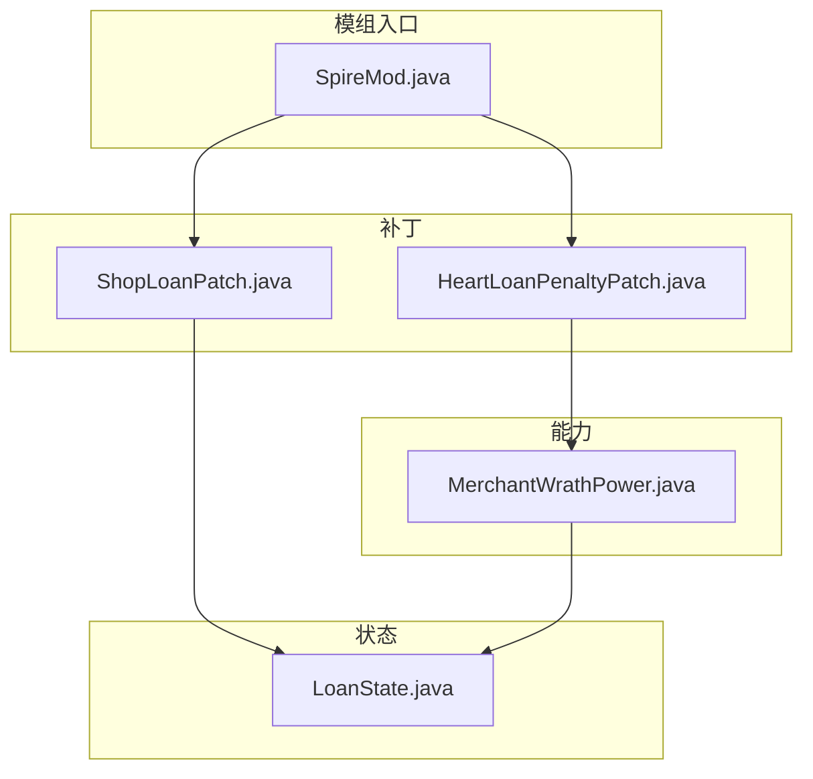
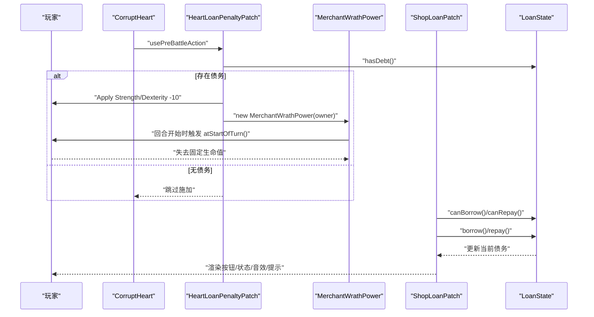
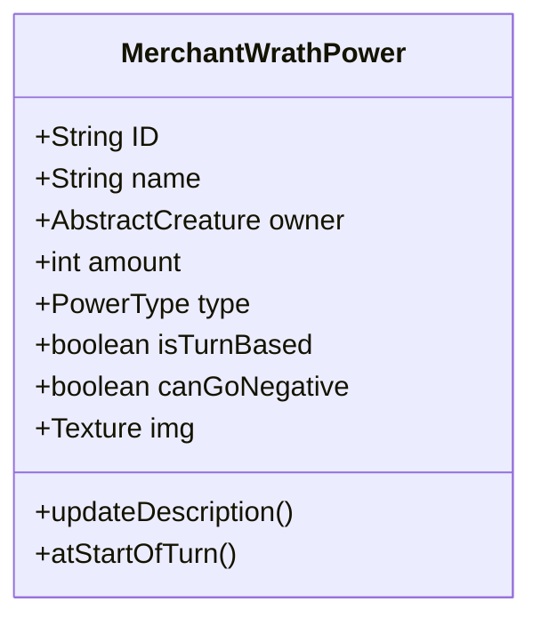
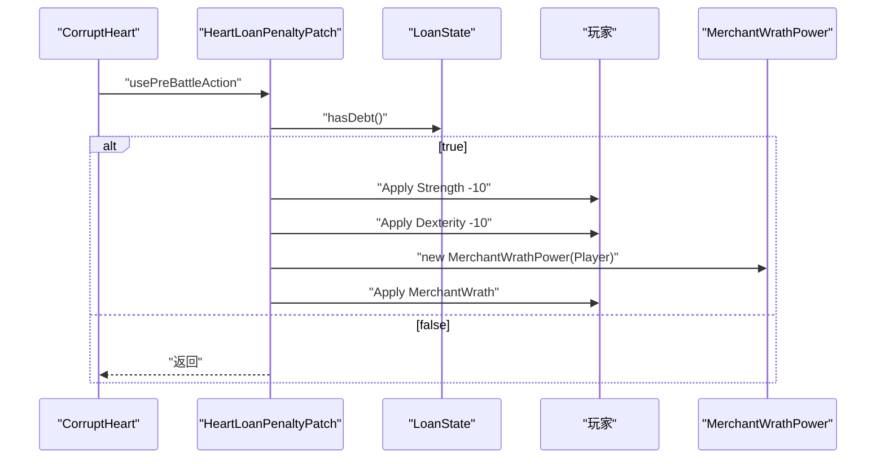
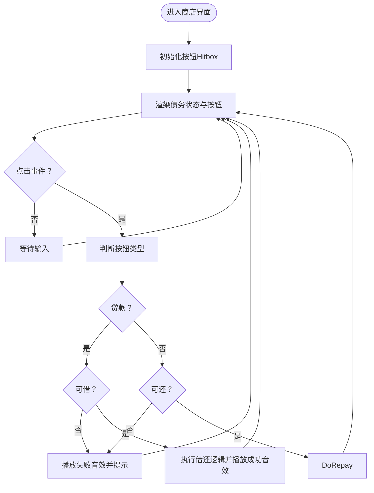
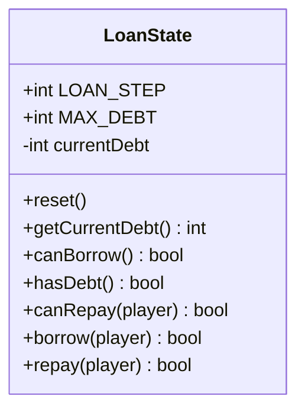
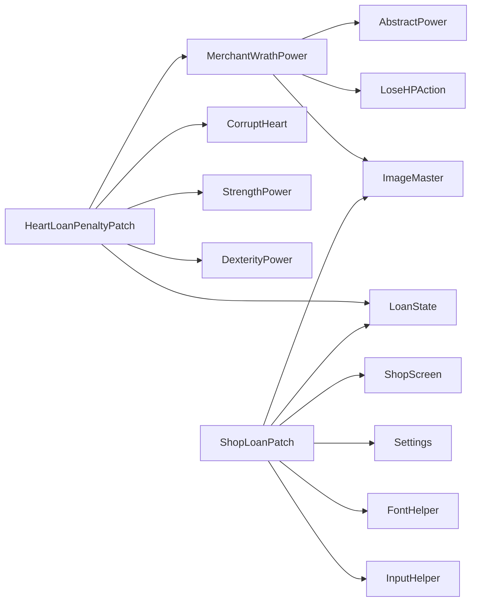

# 能力系统API

<cite>
**本文引用的文件**
- [MerchantWrathPower.java](file://src/main/java/spiremod/powers/MerchantWrathPower.java)
- [HeartLoanPenaltyPatch.java](file://src/main/java/spiremod/patches/HeartLoanPenaltyPatch.java)
- [ShopLoanPatch.java](file://src/main/java/spiremod/patches/ShopLoanPatch.java)
- [LoanState.java](file://src/main/java/spiremod/state/LoanState.java)
- [SpireMod.java](file://src/main/java/spiremod/SpireMod.java)
- [README.md](file://README.md)
</cite>

## 目录
1. [简介](#简介)
2. [项目结构](#项目结构)
3. [核心组件](#核心组件)
4. [架构总览](#架构总览)
5. [详细组件分析](#详细组件分析)
6. [依赖分析](#依赖分析)
7. [性能考虑](#性能考虑)
8. [故障排除指南](#故障排除指南)
9. [结论](#结论)
10. [附录](#附录)

## 简介
本文件为“MerchantWrathPower（商人的愤怒）”能力系统的API参考文档，面向Mod开发者与高级玩家，系统性梳理该能力的构造与属性、回调方法的行为、数值与触发条件、与游戏核心机制的集成方式（UI、音效、战斗状态），并提供继承与扩展能力的实践指南。该能力在每回合开始时对拥有者造成固定生命值损失，作为“贷款债务”的惩罚机制的一部分，贯穿商店交互与特定怪物战前应用。

## 项目结构
- 模组入口：SpireMod.java 提供Mod初始化入口，交由ModTheSpire加载。
- 能力实现：MerchantWrathPower.java 定义能力的ID、名称、图标、类型、数值与回合回调。
- 集成补丁：
  - HeartLoanPenaltyPatch.java 在CorruptHeart战前根据是否存在债务，为玩家施加力量/敏捷减益与该能力。
  - ShopLoanPatch.java 在商店界面渲染“贷款/还款”按钮、状态提示，并处理点击逻辑与音效反馈。
- 状态管理：LoanState.java 维护全局债务状态（当前债务、最大债务、借还判定与执行）。

图表来源
- [SpireMod.java:1-11](file://src/main/java/spiremod/SpireMod.java#L1-L11)
- [MerchantWrathPower.java:1-39](file://src/main/java/spiremod/powers/MerchantWrathPower.java#L1-L39)
- [HeartLoanPenaltyPatch.java:1-40](file://src/main/java/spiremod/patches/HeartLoanPenaltyPatch.java#L1-L40)
- [ShopLoanPatch.java:1-202](file://src/main/java/spiremod/patches/ShopLoanPatch.java#L1-L202)
- [LoanState.java:1-55](file://src/main/java/spiremod/state/LoanState.java#L1-L55)

章节来源
- [SpireMod.java:1-11](file://src/main/java/spiremod/SpireMod.java#L1-L11)
- [README.md:1-47](file://README.md#L1-L47)

## 核心组件
- MerchantWrathPower（商人的愤怒）
  - 能力ID：spiremod:MerchantWrath
  - 名称：商人的愤怒
  - 类型：Debuff（负面）
  - 图标：使用白色方块纹理（WHITE_SQUARE_IMG）
  - 数值：每回合失去固定生命值（常量10）
  - 回合特性：非回合制持续（isTurnBased=false），不可为负数（canGoNegative=false）
  - 关键回调：
    - atStartOfTurn：回合开始时触发，闪动提示并造成一次生命值损失
    - updateDescription：根据amount动态生成描述文本
- HeartLoanPenaltyPatch（心之债惩罚补丁）
  - 触发条件：CorruptHeart使用战前动作时，且全局存在债务
  - 效果：为玩家施加力量与敏捷各-10的负面状态，随后施加“商人的愤怒”
- ShopLoanPatch（商店贷款补丁）
  - 渲染：在商店界面右下角绘制“贷款/还款”按钮与债务状态
  - 交互：处理点击、禁用条件（最终幕不可贷款、金币不足、达到上限）、播放音效与显示提示
- LoanState（贷款状态）
  - 常量：每次借还步进100，最大债务500
  - 方法：重置、查询当前债务、是否可借/可还、执行借还操作

章节来源
- [MerchantWrathPower.java:10-38](file://src/main/java/spiremod/powers/MerchantWrathPower.java#L10-L38)
- [HeartLoanPenaltyPatch.java:17-39](file://src/main/java/spiremod/patches/HeartLoanPenaltyPatch.java#L17-L39)
- [ShopLoanPatch.java:21-202](file://src/main/java/spiremod/patches/ShopLoanPatch.java#L21-L202)
- [LoanState.java:5-55](file://src/main/java/spiremod/state/LoanState.java#L5-L55)

## 架构总览
“商人的愤怒”能力通过补丁在特定条件下被施加到玩家身上；随后在每回合开始时造成固定伤害。商店界面提供债务可视化与借还交互，驱动LoanState的状态变化，从而影响能力的触发条件与UI呈现。

图表来源
- [HeartLoanPenaltyPatch.java:20-39](file://src/main/java/spiremod/patches/HeartLoanPenaltyPatch.java#L20-L39)
- [MerchantWrathPower.java:28-32](file://src/main/java/spiremod/powers/MerchantWrathPower.java#L28-L32)
- [ShopLoanPatch.java:150-180](file://src/main/java/spiremod/patches/ShopLoanPatch.java#L150-L180)
- [LoanState.java:22-54](file://src/main/java/spiremod/state/LoanState.java#L22-L54)

## 详细组件分析

### MerchantWrathPower（商人的愤怒）
- 公共方法与属性
  - 构造函数：接收拥有者，设置ID、名称、拥有者、数值、类型、图标、描述更新
  - atStartOfTurn：回合开始时闪动提示并造成一次固定生命值损失
  - updateDescription：根据当前amount生成描述文本
- 数据与复杂度
  - amount为常量（10），描述生成O(1)，回合触发O(1)
- 错误处理与边界
  - canGoNegative=false，避免数值为负；isTurnBased=false确保非回合循环触发
- 性能影响
  - 单次回合触发仅一次行动入栈，开销极低

图表来源
- [MerchantWrathPower.java:10-38](file://src/main/java/spiremod/powers/MerchantWrathPower.java#L10-L38)

章节来源
- [MerchantWrathPower.java:10-38](file://src/main/java/spiremod/powers/MerchantWrathPower.java#L10-L38)

### HeartLoanPenaltyPatch（心之债惩罚补丁）
- 行为
  - 在CorruptHeart战前动作后，若存在债务，则为玩家施加力量与敏捷各-10，并施加“商人的愤怒”
- 触发条件
  - 必须存在债务（LoanState.hasDebt()）
- 集成点
  - 通过ApplyPowerAction将多个状态叠加至玩家

图表来源
- [HeartLoanPenaltyPatch.java:20-39](file://src/main/java/spiremod/patches/HeartLoanPenaltyPatch.java#L20-L39)
- [LoanState.java:26-28](file://src/main/java/spiremod/state/LoanState.java#L26-L28)

章节来源
- [HeartLoanPenaltyPatch.java:17-39](file://src/main/java/spiremod/patches/HeartLoanPenaltyPatch.java#L17-L39)

### ShopLoanPatch（商店贷款补丁）
- UI与交互
  - 渲染区域：右下角绘制“贷款/还款”按钮与债务状态（当前/上限）
  - 交互逻辑：根据当前场景与状态决定按钮可用性，处理点击、禁用与音效
- 触发条件与状态
  - 最终幕（TheEnding）禁用贷款
  - 达到上限或金币不足时禁用相应按钮
- 音效与提示
  - 成功借还播放购买音效，失败播放无法购买音效，并弹出提示文本

图表来源
- [ShopLoanPatch.java:46-94](file://src/main/java/spiremod/patches/ShopLoanPatch.java#L46-L94)
- [ShopLoanPatch.java:150-180](file://src/main/java/spiremod/patches/ShopLoanPatch.java#L150-L180)
- [LoanState.java:22-32](file://src/main/java/spiremod/state/LoanState.java#L22-L32)

章节来源
- [ShopLoanPatch.java:21-202](file://src/main/java/spiremod/patches/ShopLoanPatch.java#L21-L202)
- [LoanState.java:5-55](file://src/main/java/spiremod/state/LoanState.java#L5-L55)

### LoanState（贷款状态）
- 常量
  - LOAN_STEP=100：每次借还步进
  - MAX_DEBT=500：最大债务上限
- 方法
  - reset：重置当前债务为0
  - getCurrentDebt：获取当前债务
  - canBorrow/canRepay：基于当前债务与玩家金币判断
  - borrow/repay：执行借还并同步显示金币

图表来源
- [LoanState.java:5-55](file://src/main/java/spiremod/state/LoanState.java#L5-L55)

章节来源
- [LoanState.java:5-55](file://src/main/java/spiremod/state/LoanState.java#L5-L55)

## 依赖分析
- MerchantWrathPower依赖于：
  - AbstractPower（父类能力框架）
  - ImageMaster（用于设置图标纹理）
  - LoseHPAction（造成生命值损失）
- HeartLoanPenaltyPatch依赖于：
  - CorruptHeart（目标怪物）
  - StrengthPower/DexterityPower（施加属性减益）
  - MerchantWrathPower（施加能力）
  - LoanState（债务判定）
- ShopLoanPatch依赖于：
  - ShopScreen（商店界面）
  - LoanState（借还判定与执行）
  - Settings/FontHelper/ImageMaster/InputHelper（UI与输入）

图表来源
- [MerchantWrathPower.java:3-8](file://src/main/java/spiremod/powers/MerchantWrathPower.java#L3-L8)
- [HeartLoanPenaltyPatch.java:3-11](file://src/main/java/spiremod/patches/HeartLoanPenaltyPatch.java#L3-L11)
- [ShopLoanPatch.java:3-15](file://src/main/java/spiremod/patches/ShopLoanPatch.java#L3-L15)

章节来源
- [MerchantWrathPower.java:3-8](file://src/main/java/spiremod/powers/MerchantWrathPower.java#L3-L8)
- [HeartLoanPenaltyPatch.java:3-11](file://src/main/java/spiremod/patches/HeartLoanPenaltyPatch.java#L3-L11)
- [ShopLoanPatch.java:3-15](file://src/main/java/spiremod/patches/ShopLoanPatch.java#L3-L15)

## 性能考虑
- MerchantWrathPower的回合触发为O(1)，仅一次行动入栈，对帧率影响可忽略。
- ShopLoanPatch在渲染阶段进行状态计算与按钮绘制，逻辑分支简单，性能开销极低。
- LoanState为静态状态管理，访问与更新均为O(1)，适合频繁调用。

## 故障排除指南
- 商人之怒未生效
  - 检查是否满足债务条件：HeartLoanPenaltyPatch仅在LoanState.hasDebt()为true时施加能力
  - 确认回合开始事件是否正常触发：atStartOfTurn应在每回合开始时被调用
- 商店界面无贷款/还款按钮
  - 检查是否处于最终幕（TheEnding）：最终幕禁用贷款
  - 检查当前债务与金币：达到上限或金币不足时按钮会被禁用
- UI状态不同步
  - 确保在借还后同步更新显示金币（displayGold），以保证UI一致

章节来源
- [HeartLoanPenaltyPatch.java:20-23](file://src/main/java/spiremod/patches/HeartLoanPenaltyPatch.java#L20-L23)
- [ShopLoanPatch.java:187-197](file://src/main/java/spiremod/patches/ShopLoanPatch.java#L187-L197)
- [LoanState.java:34-54](file://src/main/java/spiremod/state/LoanState.java#L34-L54)

## 结论
“商人的愤怒”能力通过简洁明确的数值与回合回调，实现了与贷款系统的深度耦合。配合商店UI与状态机，形成从“债务产生—能力施加—回合惩罚—借还缓解”的完整闭环。该设计易于扩展：可替换数值、调整图标、引入条件触发或多重惩罚，同时保持对Mod框架的最小侵入。

## 附录

### 开发指南：如何继承与扩展能力
- 继承步骤
  - 新建类继承AbstractPower，设置ID、名称、图标、类型与数值
  - 实现updateDescription以适配动态数值
  - 根据需要覆写回合回调（如atStartOfTurn、onPlayerTurnStart、atEndOfRound等）
- 扩展建议
  - 将数值改为可配置字段，便于平衡性调整
  - 引入条件变量（如仅在特定层数或状态时生效）
  - 自定义图标与描述，提升辨识度
- 集成要点
  - 在合适的补丁中按需施加新能力（参考HeartLoanPenaltyPatch）
  - 若涉及UI或商店交互，参考ShopLoanPatch的渲染与交互模式
  - 使用LoanState作为债务/状态判定的统一入口

章节来源
- [MerchantWrathPower.java:10-38](file://src/main/java/spiremod/powers/MerchantWrathPower.java#L10-L38)
- [HeartLoanPenaltyPatch.java:20-39](file://src/main/java/spiremod/patches/HeartLoanPenaltyPatch.java#L20-L39)
- [ShopLoanPatch.java:46-148](file://src/main/java/spiremod/patches/ShopLoanPatch.java#L46-L148)