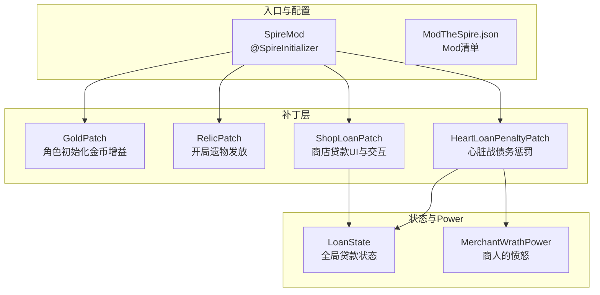
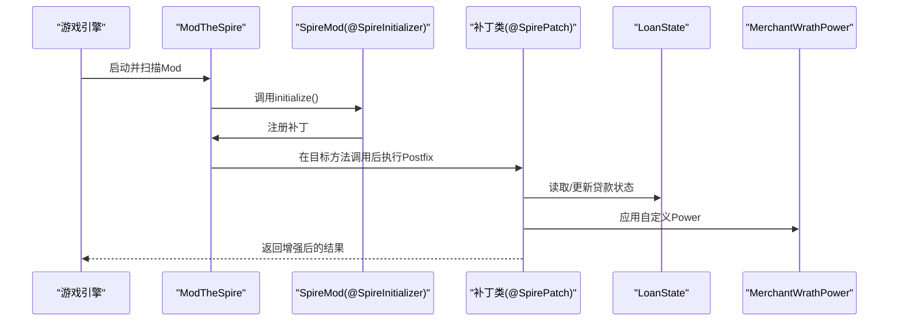
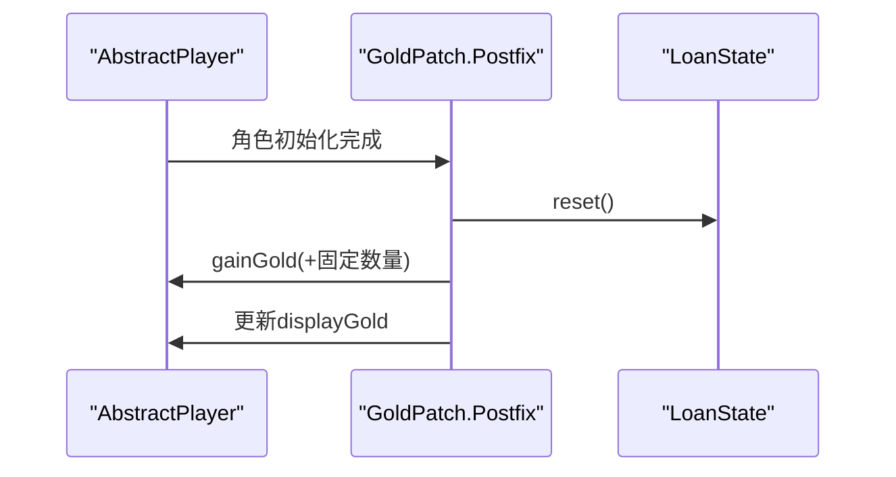
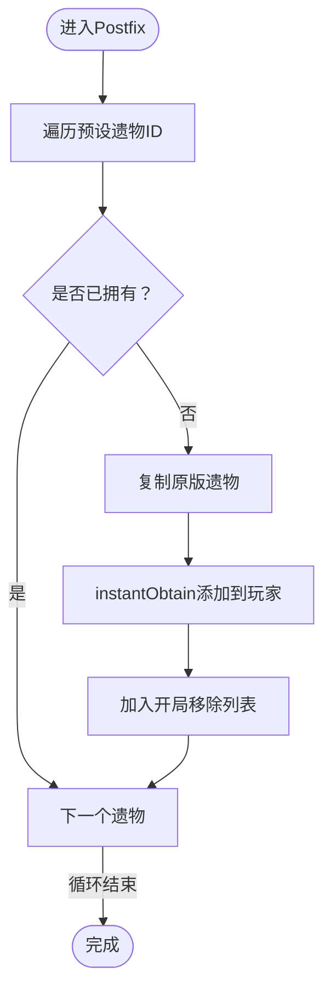
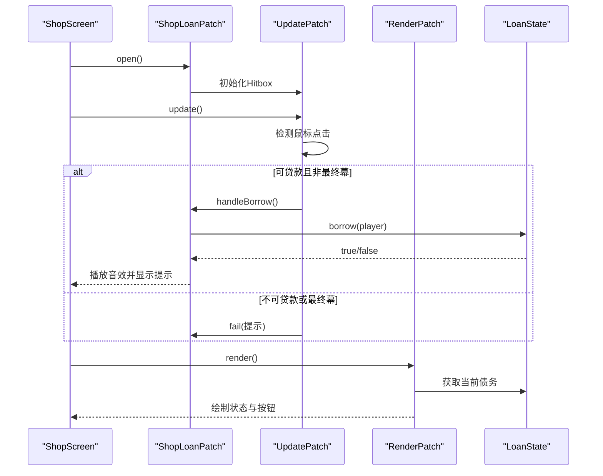
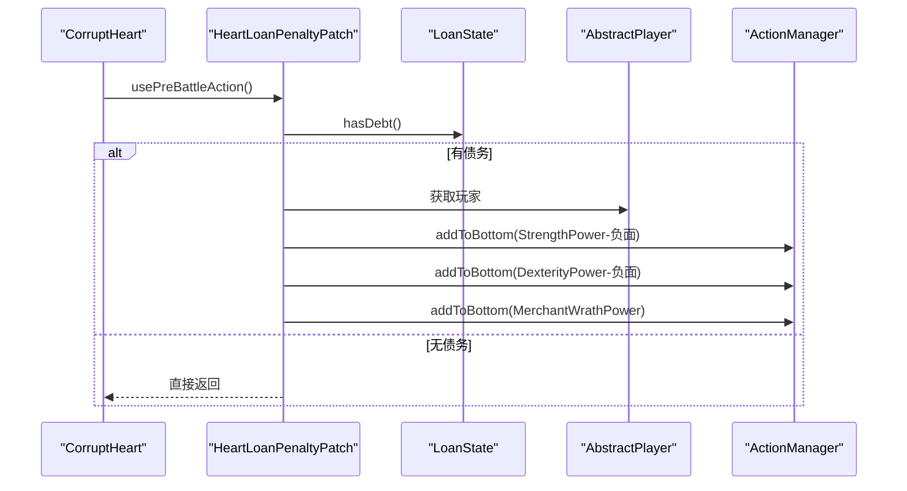
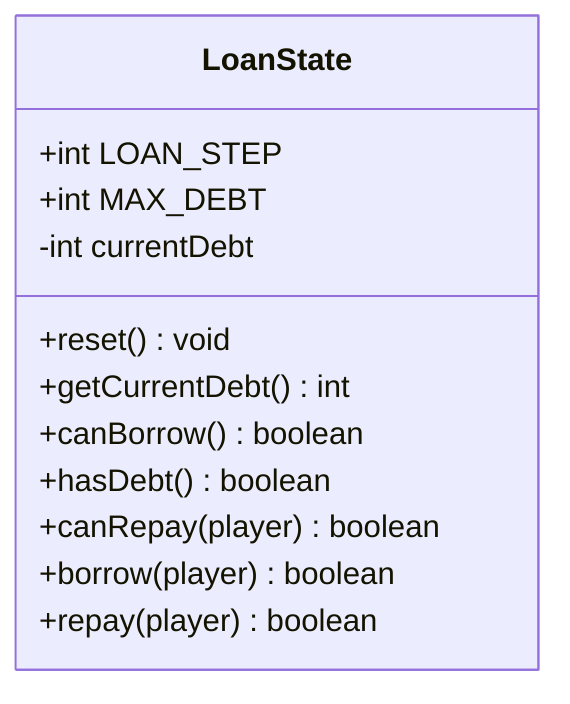
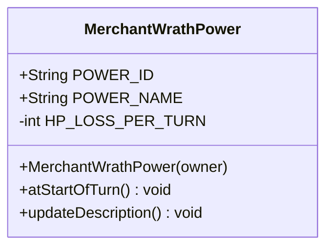
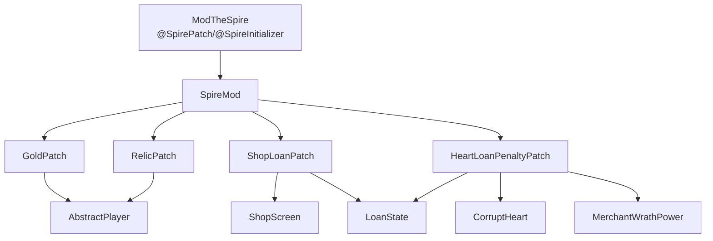

# 补丁系统API

<cite>
**本文引用的文件**
- [GoldPatch.java](file://src/main/java/spiremod/patches/GoldPatch.java)
- [RelicPatch.java](file://src/main/java/spiremod/patches/RelicPatch.java)
- [ShopLoanPatch.java](file://src/main/java/spiremod/patches/ShopLoanPatch.java)
- [HeartLoanPenaltyPatch.java](file://src/main/java/spiremod/patches/HeartLoanPenaltyPatch.java)
- [LoanState.java](file://src/main/java/spiremod/state/LoanState.java)
- [MerchantWrathPower.java](file://src/main/java/spiremod/powers/MerchantWrathPower.java)
- [SpireMod.java](file://src/main/java/spiremod/SpireMod.java)
- [ModTheSpire.json](file://src/main/resources/ModTheSpire.json)
- [README.md](file://README.md)
- [2026-06-15-spiremod-lightweight-design.md](file://docs/superpowers/specs/2026-06-15-spiremod-lightweight-design.md)
</cite>

## 目录
1. [简介](#简介)
2. [项目结构](#项目结构)
3. [核心组件](#核心组件)
4. [架构总览](#架构总览)
5. [详细组件分析](#详细组件分析)
6. [依赖关系分析](#依赖关系分析)
7. [性能考虑](#性能考虑)
8. [故障排查指南](#故障排查指南)
9. [结论](#结论)
10. [附录](#附录)

## 简介
本文件为补丁系统API的权威参考文档，面向希望基于ModTheSpire框架开发或集成补丁的开发者与高级用户。文档围绕以下目标展开：
- 全面记录各补丁类的公共接口与职责边界
- 详解SpirePatch注解的使用方式与补丁生命周期管理
- 深入说明各补丁注入点、参数传递机制与返回值处理
- 提供补丁冲突处理、优先级管理与调试技巧
- 展示如何编写自定义补丁与最佳实践

本项目采用纯SpirePatch设计，不依赖BaseMod，通过@SpireInitializer注册Mod，并在多个关键游戏节点进行非侵入式增强。

## 项目结构
项目采用按功能域分层的组织方式：
- patches：存放所有SpirePatch补丁类，分别负责金币增益、遗物发放、商店贷款UI与交互、心脏战斗惩罚
- powers：存放自定义Power，如“商人的愤怒”
- state：存放全局状态管理，如贷款状态
- resources：Mod元数据与清单文件
- 根目录：构建脚本与设计文档

图表来源
- [SpireMod.java:1-11](file://src/main/java/spiremod/SpireMod.java#L1-L11)
- [GoldPatch.java:1-34](file://src/main/java/spiremod/patches/GoldPatch.java#L1-L34)
- [RelicPatch.java:1-46](file://src/main/java/spiremod/patches/RelicPatch.java#L1-L46)
- [ShopLoanPatch.java:1-203](file://src/main/java/spiremod/patches/ShopLoanPatch.java#L1-L203)
- [HeartLoanPenaltyPatch.java:1-41](file://src/main/java/spiremod/patches/HeartLoanPenaltyPatch.java#L1-L41)
- [LoanState.java:1-56](file://src/main/java/spiremod/state/LoanState.java#L1-L56)
- [MerchantWrathPower.java:1-39](file://src/main/java/spiremod/powers/MerchantWrathPower.java#L1-L39)
- [ModTheSpire.json:1-10](file://src/main/resources/ModTheSpire.json#L1-L10)

章节来源
- [SpireMod.java:1-11](file://src/main/java/spiremod/SpireMod.java#L1-L11)
- [ModTheSpire.json:1-10](file://src/main/resources/ModTheSpire.json#L1-L10)
- [2026-06-15-spiremod-lightweight-design.md:23-41](file://docs/superpowers/specs/2026-06-15-spiremod-lightweight-design.md#L23-L41)

## 核心组件
本节概述四大补丁类及其职责：
- GoldPatch：在角色初始化时重置贷款状态并为玩家增加固定金币数量，确保新一局开始时的初始金库与贷款状态一致
- RelicPatch：在角色初始化遗物阶段，向玩家强制发放一组预设的原版遗物，若已拥有则跳过，避免重复
- ShopLoanPatch：在商店界面打开时注入贷款/还款按钮，通过update/render子补丁处理输入与渲染，提供贷款上限、最终幕禁用、金币不足等交互反馈
- HeartLoanPenaltyPatch：在CorruptHeart进入战斗前应用惩罚，对玩家施加强度与敏捷的负面效果以及“商人的愤怒”Debuff

章节来源
- [GoldPatch.java:1-34](file://src/main/java/spiremod/patches/GoldPatch.java#L1-L34)
- [RelicPatch.java:1-46](file://src/main/java/spiremod/patches/RelicPatch.java#L1-L46)
- [ShopLoanPatch.java:1-203](file://src/main/java/spiremod/patches/ShopLoanPatch.java#L1-L203)
- [HeartLoanPenaltyPatch.java:1-41](file://src/main/java/spiremod/patches/HeartLoanPenaltyPatch.java#L1-L41)

## 架构总览
补丁系统遵循“入口注册 + 多点注入”的架构模式：
- @SpireInitializer负责在运行时注册Mod，使ModTheSpire扫描并加载所有补丁类
- 各补丁类通过@SpirePatch声明目标类与方法，选择合适的回调位置（如Postfix）执行增强逻辑
- 全局状态由LoanState集中管理，被多个补丁共享；自定义Power由MerchantWrathPower提供

图表来源
- [SpireMod.java:1-11](file://src/main/java/spiremod/SpireMod.java#L1-L11)
- [GoldPatch.java:1-34](file://src/main/java/spiremod/patches/GoldPatch.java#L1-L34)
- [RelicPatch.java:1-46](file://src/main/java/spiremod/patches/RelicPatch.java#L1-L46)
- [ShopLoanPatch.java:1-203](file://src/main/java/spiremod/patches/ShopLoanPatch.java#L1-L203)
- [HeartLoanPenaltyPatch.java:1-41](file://src/main/java/spiremod/patches/HeartLoanPenaltyPatch.java#L1-L41)
- [LoanState.java:1-56](file://src/main/java/spiremod/state/LoanState.java#L1-L56)
- [MerchantWrathPower.java:1-39](file://src/main/java/spiremod/powers/MerchantWrathPower.java#L1-L39)

## 详细组件分析

### GoldPatch：金币增益机制
- 注入点：AbstractPlayer.initializeClass（Postfix）
- 参数传递：接收角色实例与初始化参数（图像URL、角色外观、血量框尺寸、能量管理器等），但主要使用角色实例进行金币操作
- 返回值处理：无返回值，直接修改角色金币与显示值
- 关键行为：
  - 重置贷款状态（防止跨局遗留债务）
  - 为玩家增加固定金币数量
  - 同步显示金币数值，确保UI即时反映变化
- 生命周期：仅在角色初始化时触发，读档场景不重复执行

图表来源
- [GoldPatch.java:1-34](file://src/main/java/spiremod/patches/GoldPatch.java#L1-L34)
- [LoanState.java:1-56](file://src/main/java/spiremod/state/LoanState.java#L1-L56)

章节来源
- [GoldPatch.java:1-34](file://src/main/java/spiremod/patches/GoldPatch.java#L1-L34)
- [LoanState.java:1-56](file://src/main/java/spiremod/state/LoanState.java#L1-L56)

### RelicPatch：遗物发放逻辑
- 注入点：AbstractPlayer.initializeStarterRelics（Postfix）
- 参数传递：接收角色实例，内部通过RelicLibrary获取预设遗物并尝试instantObtain
- 返回值处理：无返回值，直接向玩家遗物栏添加
- 关键行为：
  - 对每种预设遗物调用obtainIfMissing，若已拥有则跳过
  - 使用RelicLibrary.getRelic().makeCopy()复制原版遗物
  - 将遗物添加至玩家遗物栏指定位置，并标记在开局移除列表中（避免与原版流程冲突）
- 生命周期：仅在角色初始化时触发，读档场景不重复执行

图表来源
- [RelicPatch.java:1-46](file://src/main/java/spiremod/patches/RelicPatch.java#L1-L46)

章节来源
- [RelicPatch.java:1-46](file://src/main/java/spiremod/patches/RelicPatch.java#L1-L46)

### ShopLoanPatch：商店贷款系统
- 注入点与子补丁：
  - open：在商店界面打开时初始化按钮Hitbox位置与状态
  - update（内部类UpdatePatch）：处理鼠标悬停、点击事件，根据条件启用/禁用按钮并调用处理逻辑
  - render（内部类RenderPatch）：绘制债务状态文本与贷款/还款按钮，根据可用性切换颜色
- 参数传递：Postfix接收ShopScreen实例，内部通过静态字段维护按钮Hitbox
- 返回值处理：无返回值，通过addToBottom队列与UI反馈消息实现副作用
- 关键行为：
  - 债务上限与步长：每次贷款/还款+100金币，上限500
  - 最终幕禁用：TheEnding场景禁止贷款
  - 金币不足：还款失败时播放无法购买音效并提示
  - 成功反馈：贷款/还款成功时播放购买音效并显示提示
- 生命周期：随商店界面生命周期执行，按钮状态在open/update/render之间保持

图表来源
- [ShopLoanPatch.java:1-203](file://src/main/java/spiremod/patches/ShopLoanPatch.java#L1-L203)
- [LoanState.java:1-56](file://src/main/java/spiremod/state/LoanState.java#L1-L56)

章节来源
- [ShopLoanPatch.java:1-203](file://src/main/java/spiremod/patches/ShopLoanPatch.java#L1-L203)
- [LoanState.java:1-56](file://src/main/java/spiremod/state/LoanState.java#L1-L56)

### HeartLoanPenaltyPatch：心脏战斗惩罚
- 注入点：CorruptHeart.usePreBattleAction（Postfix）
- 参数传递：接收CorruptHeart实例，内部通过AbstractDungeon.player获取玩家
- 返回值处理：无返回值，通过actionManager.addToBottom队列施加Power
- 关键行为：
  - 仅当玩家存在债务时施加惩罚
  - 施加强度与敏捷的负面效果（相同数值）
  - 施加“商人的愤怒”Debuff，回合开始时造成固定HP损失
- 生命周期：在CorruptHeart进入战斗前触发，与贷款状态强关联

图表来源
- [HeartLoanPenaltyPatch.java:1-41](file://src/main/java/spiremod/patches/HeartLoanPenaltyPatch.java#L1-L41)
- [MerchantWrathPower.java:1-39](file://src/main/java/spiremod/powers/MerchantWrathPower.java#L1-L39)
- [LoanState.java:1-56](file://src/main/java/spiremod/state/LoanState.java#L1-L56)

章节来源
- [HeartLoanPenaltyPatch.java:1-41](file://src/main/java/spiremod/patches/HeartLoanPenaltyPatch.java#L1-L41)
- [MerchantWrathPower.java:1-39](file://src/main/java/spiremod/powers/MerchantWrathPower.java#L1-L39)
- [LoanState.java:1-56](file://src/main/java/spiremod/state/LoanState.java#L1-L56)

### LoanState：全局贷款状态
- 数据模型：静态整型currentDebt，常量LOAN_STEP=100，MAX_DEBT=500
- 接口：
  - reset()：重置currentDebt为0
  - getCurrentDebt()：返回当前债务
  - canBorrow()：判断是否未达上限
  - hasDebt()：判断是否存在债务
  - canRepay(player)：判断是否有债务且玩家金币足够
  - borrow(player)：增加金币与债务，返回布尔结果
  - repay(player)：减少金币与债务，返回布尔结果
- 复杂度：均为O(1)，线性时间与常量空间
- 依赖：依赖AbstractPlayer进行金币增减操作

图表来源
- [LoanState.java:1-56](file://src/main/java/spiremod/state/LoanState.java#L1-L56)

章节来源
- [LoanState.java:1-56](file://src/main/java/spiremod/state/LoanState.java#L1-L56)

### MerchantWrathPower：商人的愤怒
- 功能：回合开始时对拥有者造成固定HP损失，类型为Debuff，非回合制Power
- 关键属性：POWER_ID、POWER_NAME、HP_LOSS_PER_TURN、类型与是否回合制
- 生命周期：持续存在直至被移除，每回合触发一次

图表来源
- [MerchantWrathPower.java:1-39](file://src/main/java/spiremod/powers/MerchantWrathPower.java#L1-L39)

章节来源
- [MerchantWrathPower.java:1-39](file://src/main/java/spiremod/powers/MerchantWrathPower.java#L1-L39)

## 依赖关系分析
- 运行时框架：ModTheSpire（@SpirePatch、@SpireInitializer）
- 游戏类：AbstractPlayer、AbstractDungeon、ShopScreen、CorruptHeart、ApplyPowerAction、StrengthPower、DexterityPower
- 自定义类：MerchantWrathPower、LoanState
- 构建与配置：ModTheSpire.json（mod清单）、SpireMod.java（入口）

图表来源
- [SpireMod.java:1-11](file://src/main/java/spiremod/SpireMod.java#L1-L11)
- [GoldPatch.java:1-34](file://src/main/java/spiremod/patches/GoldPatch.java#L1-L34)
- [RelicPatch.java:1-46](file://src/main/java/spiremod/patches/RelicPatch.java#L1-L46)
- [ShopLoanPatch.java:1-203](file://src/main/java/spiremod/patches/ShopLoanPatch.java#L1-L203)
- [HeartLoanPenaltyPatch.java:1-41](file://src/main/java/spiremod/patches/HeartLoanPenaltyPatch.java#L1-L41)
- [LoanState.java:1-56](file://src/main/java/spiremod/state/LoanState.java#L1-L56)
- [MerchantWrathPower.java:1-39](file://src/main/java/spiremod/powers/MerchantWrathPower.java#L1-L39)

章节来源
- [SpireMod.java:1-11](file://src/main/java/spiremod/SpireMod.java#L1-L11)
- [ModTheSpire.json:1-10](file://src/main/resources/ModTheSpire.json#L1-L10)

## 性能考虑
- 补丁执行频率：GoldPatch与RelicPatch在角色初始化时各执行一次，开销极低
- ShopLoanPatch：update/render在商店界面每帧执行，但仅在按钮可见时进行Hitbox更新与渲染，且逻辑分支简单，性能影响可忽略
- LoanState：纯静态状态管理，无复杂计算
- MerchantWrathPower：每回合一次判定，开销微小
- 建议：避免在高频帧循环中进行昂贵操作；本项目已通过局部化状态与简单分支实现高效运行

## 故障排查指南
- 补丁未生效
  - 检查@SpireInitializer是否正确标注并被ModTheSpire扫描
  - 确认@SpirePatch的目标类与方法签名匹配（可通过反编译源码核对）
  - 验证ModTheSpire.json中的modid与版本号
- 商店贷款按钮不可见
  - 确认当前场景非最终幕（TheEnding）
  - 检查是否已达贷款上限
  - 确认玩家金币充足用于还款
- 心脏战斗未施加惩罚
  - 确认玩家存在债务
  - 检查CorruptHeart.usePreBattleAction是否被正确拦截
- 金币显示异常
  - 确认GoldPatch与LoanState.borrow/repay是否同步更新displayGold
- 调试技巧
  - 使用日志输出关键分支（如canBorrow/canRepay/hasDebt）
  - 在补丁Postfix中打印目标对象ID与状态
  - 利用ModTheSpire提供的调试工具查看补丁加载顺序与冲突

章节来源
- [SpireMod.java:1-11](file://src/main/java/spiremod/SpireMod.java#L1-L11)
- [ModTheSpire.json:1-10](file://src/main/resources/ModTheSpire.json#L1-L10)
- [ShopLoanPatch.java:1-203](file://src/main/java/spiremod/patches/ShopLoanPatch.java#L1-L203)
- [HeartLoanPenaltyPatch.java:1-41](file://src/main/java/spiremod/patches/HeartLoanPenaltyPatch.java#L1-L41)
- [LoanState.java:1-56](file://src/main/java/spiremod/state/LoanState.java#L1-L56)

## 结论
本补丁系统以轻量、稳定为核心目标，通过@SpirePatch与@SpireInitializer实现对游戏关键节点的非侵入式增强。GoldPatch与RelicPatch保证新局初始体验，ShopLoanPatch提供可玩的经济系统，HeartLoanPenaltyPatch强化策略深度。LoanState与MerchantWrathPower构成清晰的状态与效果模型，便于扩展与维护。建议在新增补丁时遵循现有命名与生命周期约定，确保兼容性与可维护性。

## 附录

### 补丁生命周期与优先级管理
- 生命周期
  - 角色初始化：GoldPatch与RelicPatch在initializeClass/initializeStarterRelics之后执行
  - 商店界面：ShopLoanPatch在open/update/render期间执行
  - 战斗前：HeartLoanPenaltyPatch在usePreBattleAction之后执行
- 优先级
  - ModTheSpire按类加载顺序扫描补丁，通常无需显式声明优先级
  - 若存在潜在冲突，建议在同一目标方法上使用不同回调位置（如Postfix vs Prefix）以明确执行顺序
  - 避免在同一方法上同时使用多个可能相互影响的Postfix

章节来源
- [GoldPatch.java:1-34](file://src/main/java/spiremod/patches/GoldPatch.java#L1-L34)
- [RelicPatch.java:1-46](file://src/main/java/spiremod/patches/RelicPatch.java#L1-L46)
- [ShopLoanPatch.java:1-203](file://src/main/java/spiremod/patches/ShopLoanPatch.java#L1-L203)
- [HeartLoanPenaltyPatch.java:1-41](file://src/main/java/spiremod/patches/HeartLoanPenaltyPatch.java#L1-L41)

### 编写自定义补丁的最佳实践
- 明确注入点：使用@SpirePatch标注目标类与方法，必要时通过反编译源码核对签名
- 保持幂等：确保补丁在多次执行时不会产生副作用（如重复发放）
- 状态隔离：将全局状态封装在独立类中（如LoanState），避免分散更新
- UI一致性：更新显示值（如displayGold）以保证UI即时反映
- 错误处理：对空引用与边界条件进行检查（如player为空、金币不足）
- 文档化：为每个补丁添加注释说明注入点、参数、返回值与副作用

章节来源
- [ShopLoanPatch.java:1-203](file://src/main/java/spiremod/patches/ShopLoanPatch.java#L1-L203)
- [LoanState.java:1-56](file://src/main/java/spiremod/state/LoanState.java#L1-L56)
- [MerchantWrathPower.java:1-39](file://src/main/java/spiremod/powers/MerchantWrathPower.java#L1-L39)