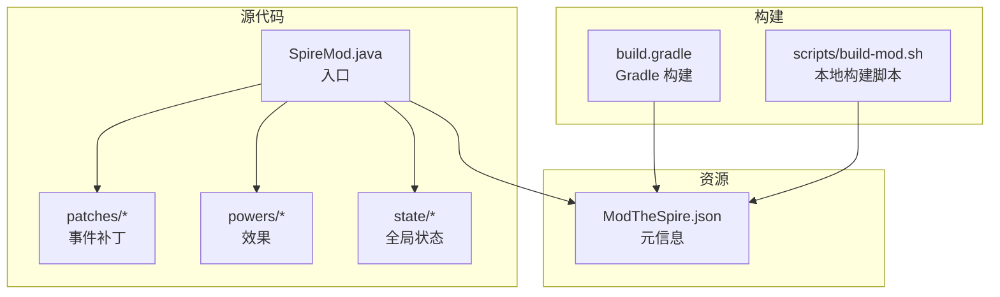
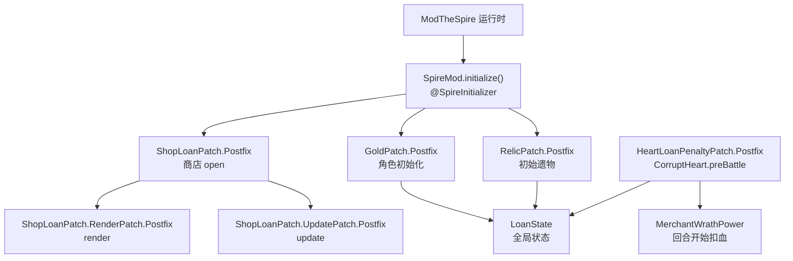
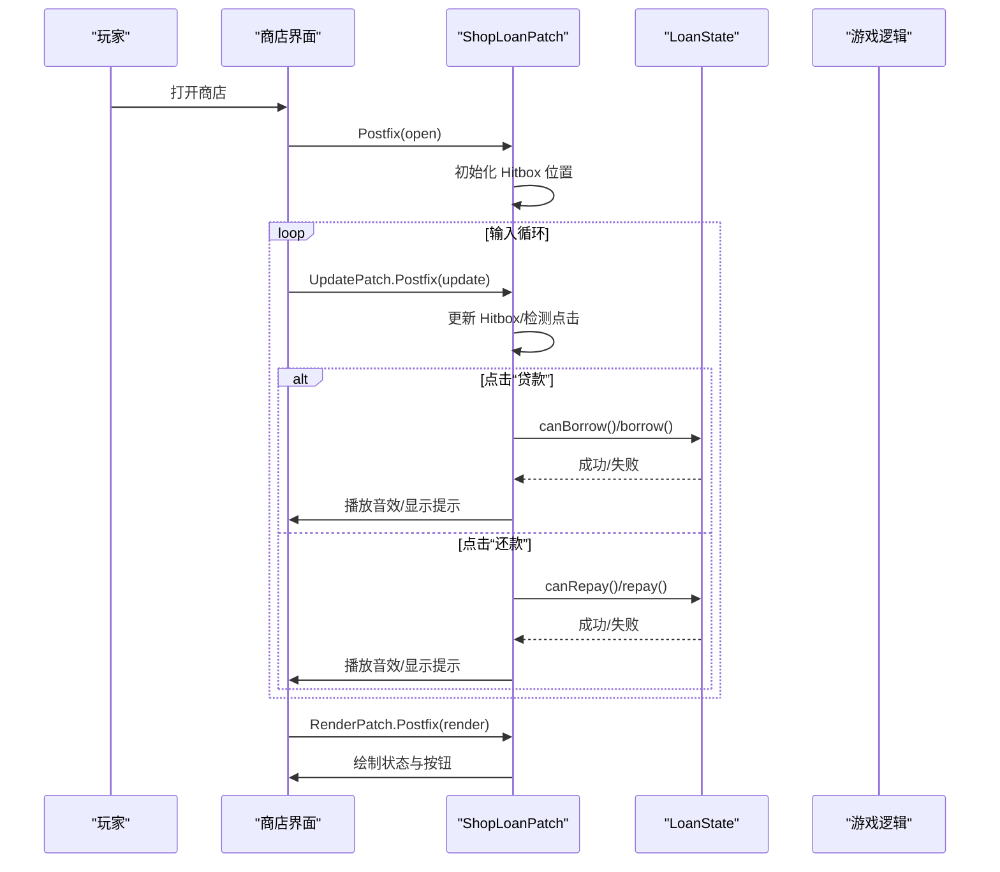
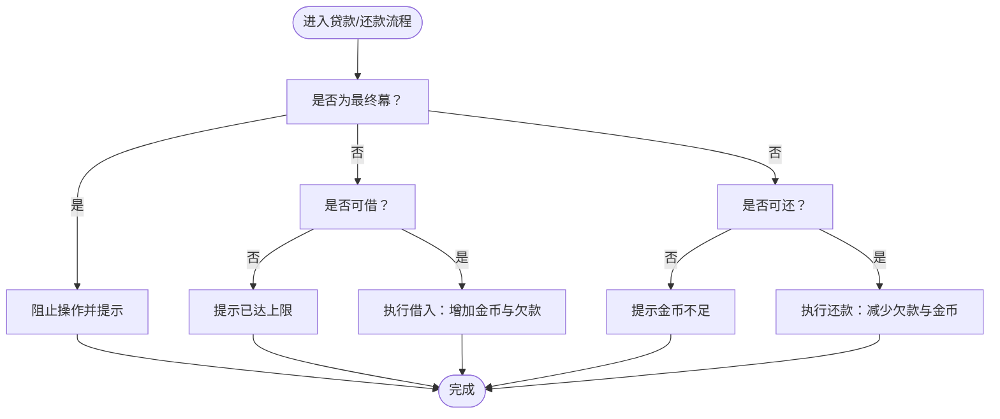
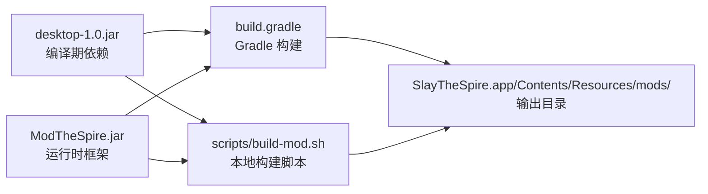

# 开发指南

<cite>
**本文引用的文件**
- [README.md](file://README.md)
- [build.gradle](file://build.gradle)
- [settings.gradle](file://settings.gradle)
- [scripts/build-mod.sh](file://scripts/build-mod.sh)
- [src/main/java/spiremod/SpireMod.java](file://src/main/java/spiremod/SpireMod.java)
- [src/main/java/spiremod/patches/GoldPatch.java](file://src/main/java/spiremod/patches/GoldPatch.java)
- [src/main/java/spiremod/patches/RelicPatch.java](file://src/main/java/spiremod/patches/RelicPatch.java)
- [src/main/java/spiremod/patches/ShopLoanPatch.java](file://src/main/java/spiremod/patches/ShopLoanPatch.java)
- [src/main/java/spiremod/patches/HeartLoanPenaltyPatch.java](file://src/main/java/spiremod/patches/HeartLoanPenaltyPatch.java)
- [src/main/java/spiremod/powers/MerchantWrathPower.java](file://src/main/java/spiremod/powers/MerchantWrathPower.java)
- [src/main/java/spiremod/state/LoanState.java](file://src/main/java/spiremod/state/LoanState.java)
- [src/main/resources/ModTheSpire.json](file://src/main/resources/ModTheSpire.json)
- [docs/superpowers/specs/2026-06-15-spiremod-lightweight-design.md](file://docs/superpowers/specs/2026-06-15-spiremod-lightweight-design.md)
</cite>

## 目录
1. [简介](#简介)
2. [项目结构](#项目结构)
3. [核心组件](#核心组件)
4. [架构总览](#架构总览)
5. [详细组件分析](#详细组件分析)
6. [依赖分析](#依赖分析)
7. [性能考量](#性能考量)
8. [故障排除指南](#故障排除指南)
9. [结论](#结论)
10. [附录](#附录)

## 简介
本指南面向希望为 SpireMod 贡献或扩展功能的开发者，涵盖开发环境搭建、IDE 配置、调试与热重载、补丁开发最佳实践、新功能开发流程、代码审查清单、性能优化与安全注意事项，以及如何扩展现有功能、新增补丁类与集成第三方库的方法。项目基于 ModTheSpire 的 SpirePatch 机制，采用轻量设计，不依赖 BaseMod，便于快速迭代与维护。

## 项目结构
SpireMod 采用清晰的分层结构：入口类负责注册 Mod；补丁模块集中于 patches 包，按游戏事件划分；状态管理位于 state 包；增益/减益效果位于 powers 包；资源清单位于 resources 目录；构建脚本支持 Gradle 与本地 shell 脚本两种方式。

图表来源
- [src/main/java/spiremod/SpireMod.java:1-11](file://src/main/java/spiremod/SpireMod.java#L1-L11)
- [src/main/java/spiremod/patches/GoldPatch.java:1-34](file://src/main/java/spiremod/patches/GoldPatch.java#L1-L34)
- [src/main/java/spiremod/patches/RelicPatch.java:1-46](file://src/main/java/spiremod/patches/RelicPatch.java#L1-L46)
- [src/main/java/spiremod/patches/ShopLoanPatch.java:1-203](file://src/main/java/spiremod/patches/ShopLoanPatch.java#L1-L203)
- [src/main/java/spiremod/patches/HeartLoanPenaltyPatch.java:1-41](file://src/main/java/spiremod/patches/HeartLoanPenaltyPatch.java#L1-L41)
- [src/main/java/spiremod/powers/MerchantWrathPower.java:1-39](file://src/main/java/spiremod/powers/MerchantWrathPower.java#L1-L39)
- [src/main/java/spiremod/state/LoanState.java:1-56](file://src/main/java/spiremod/state/LoanState.java#L1-L56)
- [src/main/resources/ModTheSpire.json:1-10](file://src/main/resources/ModTheSpire.json#L1-L10)
- [build.gradle:1-56](file://build.gradle#L1-L56)
- [scripts/build-mod.sh:1-39](file://scripts/build-mod.sh#L1-L39)

章节来源
- [docs/superpowers/specs/2026-06-15-spiremod-lightweight-design.md:23-41](file://docs/superpowers/specs/2026-06-15-spiremod-lightweight-design.md#L23-L41)
- [README.md:1-47](file://README.md#L1-L47)

## 核心组件
- 入口与注册：通过 @SpireInitializer 注解的入口类完成 Mod 注册。
- 补丁系统：围绕游戏关键事件（角色初始化、商店打开/更新/渲染、心脏战前行动等）进行 Postfix 补丁，注入金币、遗物与贷款交互逻辑。
- 状态管理：LoanState 提供贷款额度、当前欠款、借还判断与执行的静态接口，确保全局一致性。
- 效果系统：MerchantWrathPower 作为回合开始时造成伤害的 Debuff，体现“心脏惩罚”机制。
- 构建与发布：Gradle 与本地脚本两种方式，统一输出至 ModTheSpire 的 mods 目录。

章节来源
- [src/main/java/spiremod/SpireMod.java:1-11](file://src/main/java/spiremod/SpireMod.java#L1-L11)
- [src/main/java/spiremod/patches/GoldPatch.java:1-34](file://src/main/java/spiremod/patches/GoldPatch.java#L1-L34)
- [src/main/java/spiremod/patches/RelicPatch.java:1-46](file://src/main/java/spiremod/patches/RelicPatch.java#L1-L46)
- [src/main/java/spiremod/patches/ShopLoanPatch.java:1-203](file://src/main/java/spiremod/patches/ShopLoanPatch.java#L1-L203)
- [src/main/java/spiremod/patches/HeartLoanPenaltyPatch.java:1-41](file://src/main/java/spiremod/patches/HeartLoanPenaltyPatch.java#L1-L41)
- [src/main/java/spiremod/powers/MerchantWrathPower.java:1-39](file://src/main/java/spiremod/powers/MerchantWrathPower.java#L1-L39)
- [src/main/java/spiremod/state/LoanState.java:1-56](file://src/main/java/spiremod/state/LoanState.java#L1-L56)
- [src/main/resources/ModTheSpire.json:1-10](file://src/main/resources/ModTheSpire.json#L1-L10)

## 架构总览
SpireMod 的运行时架构以 ModTheSpire 为核心，通过 @SpireInitializer 注入入口，随后由各个 SpirePatch 在目标类/方法的生命周期节点插入逻辑。状态与效果通过静态工具类与自定义 Power 实现，UI 层面通过补丁对商店界面进行扩展。

图表来源
- [src/main/java/spiremod/SpireMod.java:1-11](file://src/main/java/spiremod/SpireMod.java#L1-L11)
- [src/main/java/spiremod/patches/GoldPatch.java:1-34](file://src/main/java/spiremod/patches/GoldPatch.java#L1-L34)
- [src/main/java/spiremod/patches/RelicPatch.java:1-46](file://src/main/java/spiremod/patches/RelicPatch.java#L1-L46)
- [src/main/java/spiremod/patches/ShopLoanPatch.java:1-203](file://src/main/java/spiremod/patches/ShopLoanPatch.java#L1-L203)
- [src/main/java/spiremod/patches/HeartLoanPenaltyPatch.java:1-41](file://src/main/java/spiremod/patches/HeartLoanPenaltyPatch.java#L1-L41)
- [src/main/java/spiremod/state/LoanState.java:1-56](file://src/main/java/spiremod/state/LoanState.java#L1-L56)
- [src/main/java/spiremod/powers/MerchantWrathPower.java:1-39](file://src/main/java/spiremod/powers/MerchantWrathPower.java#L1-L39)

## 详细组件分析

### 入口与注册（SpireMod）
- 角色：@SpireInitializer 注解的入口类，负责在运行时注册 Mod。
- 关键点：初始化调用自身构造，确保 ModTheSpire 能正确发现并加载。

章节来源
- [src/main/java/spiremod/SpireMod.java:1-11](file://src/main/java/spiremod/SpireMod.java#L1-L11)

### 金币补丁（GoldPatch）
- 目标：在角色初始化时增加固定金币，并重置贷款状态。
- 行为：Postfix 钩子在初始化完成后执行，确保只在新局开始生效。
- 安全性：通过重置贷款状态避免跨局数据污染。

章节来源
- [src/main/java/spiremod/patches/GoldPatch.java:1-34](file://src/main/java/spiremod/patches/GoldPatch.java#L1-L34)

### 遗物补丁（RelicPatch）
- 目标：在初始遗物阶段为玩家追加一组预设原版遗物。
- 行为：遍历需要的遗物 ID，若未拥有则复制并立即获得，同时记录移除列表以保证存档一致性。
- 防护：通过存在性检查避免重复获得。

章节来源
- [src/main/java/spiremod/patches/RelicPatch.java:1-46](file://src/main/java/spiremod/patches/RelicPatch.java#L1-L46)

### 商店贷款补丁（ShopLoanPatch）
- 目标：在商店界面添加“贷款/还款”按钮与状态显示。
- UI 与交互：通过 Hitbox 与输入处理实现点击交互；渲染阶段绘制状态文本与按钮背景与文字。
- 业务规则：限制最终幕不可贷款；根据 LoanState 判断可借/可还；成功后播放音效并显示提示。
- 复杂度：包含多个内部补丁类（open、update、render），职责分离清晰。

图表来源
- [src/main/java/spiremod/patches/ShopLoanPatch.java:1-203](file://src/main/java/spiremod/patches/ShopLoanPatch.java#L1-L203)
- [src/main/java/spiremod/state/LoanState.java:1-56](file://src/main/java/spiremod/state/LoanState.java#L1-L56)

章节来源
- [src/main/java/spiremod/patches/ShopLoanPatch.java:1-203](file://src/main/java/spiremod/patches/ShopLoanPatch.java#L1-L203)

### 心脏惩罚补丁（HeartLoanPenaltyPatch）
- 目标：当玩家存在贷款时，在 CorruptHeart 战前应用力量/敏捷减益与“商人的愤怒”效果。
- 规则：仅在有债务时生效；对玩家施加多层负面效果，体现高利贷代价。

章节来源
- [src/main/java/spiremod/patches/HeartLoanPenaltyPatch.java:1-41](file://src/main/java/spiremod/patches/HeartLoanPenaltyPatch.java#L1-L41)

### 商人愤怒效果（MerchantWrathPower）
- 类型：Debuff，回合开始时造成固定生命损失。
- 行为：atStartOfTurn 中触发 LoseHPAction；描述文本动态更新。

章节来源
- [src/main/java/spiremod/powers/MerchantWrathPower.java:1-39](file://src/main/java/spiremod/powers/MerchantWrathPower.java#L1-L39)

### 贷款状态（LoanState）
- 职责：集中管理贷款额度、最大限额、借还判断与执行。
- 并发与一致性：通过静态字段与方法避免多实例导致的状态漂移；reset 在新局开始时被调用。
- 性能：常量时间判断与操作，开销极低。

图表来源
- [src/main/java/spiremod/state/LoanState.java:1-56](file://src/main/java/spiremod/state/LoanState.java#L1-L56)
- [src/main/java/spiremod/patches/ShopLoanPatch.java:150-185](file://src/main/java/spiremod/patches/ShopLoanPatch.java#L150-L185)

章节来源
- [src/main/java/spiremod/state/LoanState.java:1-56](file://src/main/java/spiremod/state/LoanState.java#L1-L56)

## 依赖分析
- 运行时框架：ModTheSpire（必需）
- 编译期依赖：desktop-1.0.jar（游戏类）
- 构建工具：Gradle（可选）与本地 shell 脚本（推荐用于快速迭代）

图表来源
- [build.gradle:14-29](file://build.gradle#L14-L29)
- [scripts/build-mod.sh:10-23](file://scripts/build-mod.sh#L10-L23)
- [README.md:23-32](file://README.md#L23-L32)

章节来源
- [build.gradle:1-56](file://build.gradle#L1-L56)
- [scripts/build-mod.sh:1-39](file://scripts/build-mod.sh#L1-L39)
- [README.md:13-47](file://README.md#L13-L47)

## 性能考量
- 补丁粒度：尽量使用最小化钩子范围，避免在高频帧回调中做昂贵计算。
- 状态访问：LoanState 为静态工具类，访问成本低；避免在 render/update 中频繁创建对象。
- UI 绘制：按钮颜色与字体绘制在渲染补丁中进行，注意批量绘制与颜色复用。
- 资源加载：图片与字体通过现有资源接口获取，避免重复加载。

## 故障排除指南
- Mod 未加载
  - 检查 ModTheSpire.json 的 modid、名称、版本与依赖版本是否匹配。
  - 确认构建产物输出到正确的 mods 目录（Mac 上为 app 内 Resources 下的 mods）。
- 构建失败
  - Gradle：确认 desktop-1.0.jar 与 ModTheSpire.jar 路径存在。
  - Shell：确认环境变量覆盖正确，且目标目录存在。
- 功能异常
  - 新局未生效：确认补丁钩子在正确的生命周期节点执行，且只在新局触发。
  - 商店按钮无效：检查 Hitbox 初始化与输入事件处理逻辑。
  - 贷款上限/还款失败：核对 LoanState 的判断条件与玩家金币余额。

章节来源
- [src/main/resources/ModTheSpire.json:1-10](file://src/main/resources/ModTheSpire.json#L1-L10)
- [build.gradle:44-55](file://build.gradle#L44-L55)
- [scripts/build-mod.sh:15-23](file://scripts/build-mod.sh#L15-L23)
- [src/main/java/spiremod/patches/ShopLoanPatch.java:46-94](file://src/main/java/spiremod/patches/ShopLoanPatch.java#L46-L94)
- [src/main/java/spiremod/state/LoanState.java:22-54](file://src/main/java/spiremod/state/LoanState.java#L22-L54)

## 结论
SpireMod 以轻量设计与清晰的补丁分层实现了稳定的功能扩展。遵循本文的开发流程与最佳实践，可在不引入复杂依赖的前提下持续演进 Mod 功能，并保持良好的可维护性与可测试性。

## 附录

### 开发环境搭建与 IDE 配置
- JDK 版本：使用 Java 8 工具链，确保编译与运行兼容。
- 依赖配置：Gradle 使用 compileOnly 引用 desktop-1.0.jar 与 ModTheSpire.jar；也可通过环境变量覆盖路径。
- 构建方式：优先使用本地脚本进行快速构建与部署，必要时再接入 Gradle 完整流程。

章节来源
- [build.gradle:8-12](file://build.gradle#L8-L12)
- [build.gradle:14-29](file://build.gradle#L14-L29)
- [scripts/build-mod.sh:10-13](file://scripts/build-mod.sh#L10-L13)
- [README.md:13-36](file://README.md#L13-L36)

### 调试设置与热重载机制
- 推荐流程：使用本地脚本进行增量构建，直接替换 mods 目录中的 JAR 文件，重启游戏验证。
- 日志与提示：利用商店界面的语音提示反馈用户操作结果，便于快速定位问题。
- 断点与观察：在补丁 Postfix 方法中设置断点，观察参数与状态变化。

章节来源
- [scripts/build-mod.sh:25-36](file://scripts/build-mod.sh#L25-L36)
- [src/main/java/spiremod/patches/ShopLoanPatch.java:164-185](file://src/main/java/spiremod/patches/ShopLoanPatch.java#L164-L185)

### 补丁开发最佳实践
- 命名规范：补丁类使用动词短语命名（如 GoldPatch、RelicPatch），内部类按职责细分（如 UpdatePatch、RenderPatch）。
- 代码组织：按功能域划分包（patches、powers、state），保持单一职责。
- 注释标准：为每个补丁标注目标类/方法、触发时机与副作用，便于后续维护。
- 安全性：在新局开始时重置全局状态，避免跨局数据污染；对空引用进行显式检查。

章节来源
- [docs/superpowers/specs/2026-06-15-spiremod-lightweight-design.md:49-91](file://docs/superpowers/specs/2026-06-15-spiremod-lightweight-design.md#L49-L91)

### 新功能开发流程（从需求到测试）
- 需求分析：明确触发点、影响范围与边界条件（如是否仅新局生效、是否受特定场景限制）。
- 设计与实现：选择合适的 SpirePatch 生命周期钩子，编写补丁与必要的状态/效果类。
- 单元与集成：在商店、战斗与角色初始化等关键场景下验证功能。
- 文档与回归：完善设计文档与变更说明，确保回归测试覆盖。

章节来源
- [docs/superpowers/specs/2026-06-15-spiremod-lightweight-design.md:79-91](file://docs/superpowers/specs/2026-06-15-spiremod-lightweight-design.md#L79-L91)

### 代码审查清单
- 补丁钩子是否正确且仅在必要时机触发？
- 是否存在空引用与越界访问风险？
- 状态管理是否幂等、可重入与可重置？
- UI 交互是否响应及时、提示明确？
- 构建脚本与依赖路径是否跨平台兼容？

章节来源
- [src/main/java/spiremod/patches/ShopLoanPatch.java:64-94](file://src/main/java/spiremod/patches/ShopLoanPatch.java#L64-L94)
- [src/main/java/spiremod/state/LoanState.java:14-16](file://src/main/java/spiremod/state/LoanState.java#L14-L16)

### 性能优化建议
- 减少每帧分配：缓存 Hitbox 与颜色对象，避免在渲染循环中重复创建。
- 降低耦合：通过状态类集中判断逻辑，避免在补丁中分散重复判断。
- 资源复用：统一使用现有资源接口，避免重复加载与拷贝。

章节来源
- [src/main/java/spiremod/patches/ShopLoanPatch.java:43-58](file://src/main/java/spiremod/patches/ShopLoanPatch.java#L43-L58)
- [src/main/java/spiremod/state/LoanState.java:22-54](file://src/main/java/spiremod/state/LoanState.java#L22-L54)

### 安全考虑
- 输入校验：对用户输入与游戏状态进行严格校验，防止非法状态导致崩溃。
- 线程与并发：避免在补丁中进行阻塞操作，确保 UI 线程流畅。
- 存档兼容：通过重置与存在性检查避免重复获得与状态错乱。

章节来源
- [src/main/java/spiremod/patches/RelicPatch.java:33-44](file://src/main/java/spiremod/patches/RelicPatch.java#L33-L44)
- [src/main/java/spiremod/patches/GoldPatch.java:28-32](file://src/main/java/spiremod/patches/GoldPatch.java#L28-L32)

### 扩展与集成指南
- 添加新补丁类：在 patches 包内新建补丁类，选择合适的生命周期钩子，遵循现有命名与组织风格。
- 新增状态：在 state 包内新增状态类，提供幂等的初始化与查询接口。
- 集成第三方库：谨慎评估体积与兼容性，优先使用 ModTheSpire 支持的 API 与资源接口。
- 发布与路径：确保构建产物输出到 ModTheSpire 的 mods 目录，避免路径错误导致 Mod 无法加载。

章节来源
- [docs/superpowers/specs/2026-06-15-spiremod-lightweight-design.md:23-41](file://docs/superpowers/specs/2026-06-15-spiremod-lightweight-design.md#L23-L41)
- [README.md:21-32](file://README.md#L21-L32)