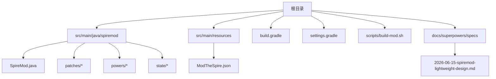
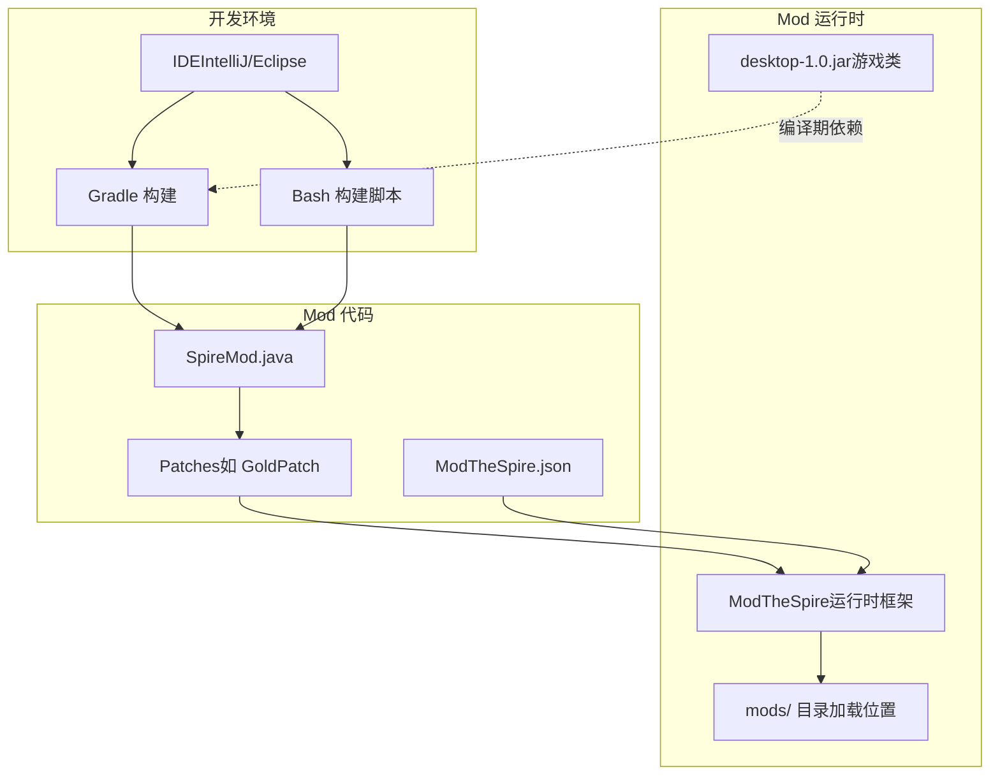
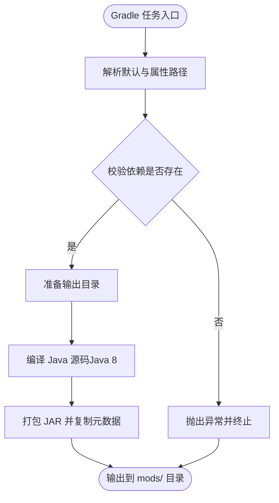
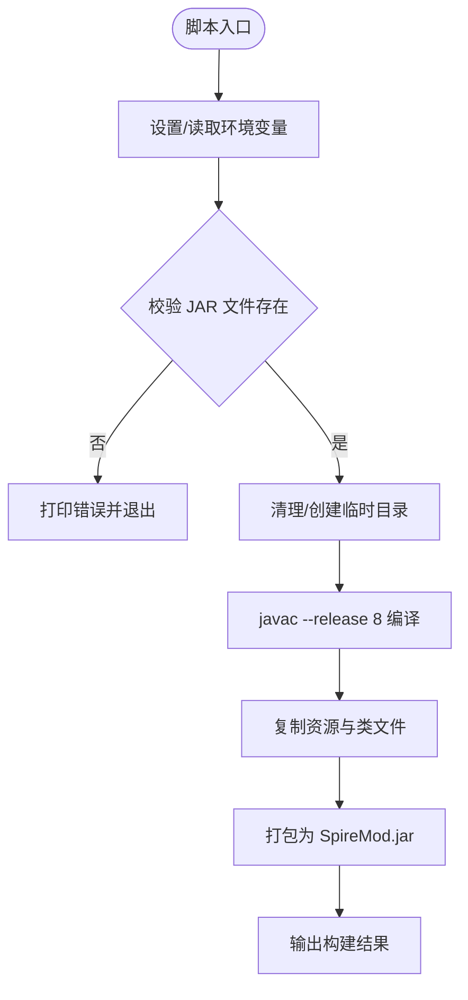
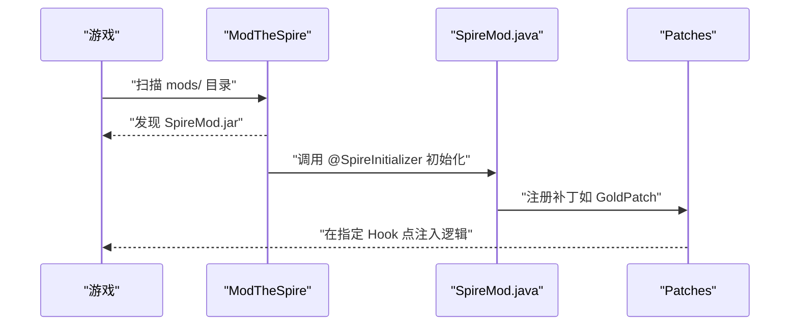
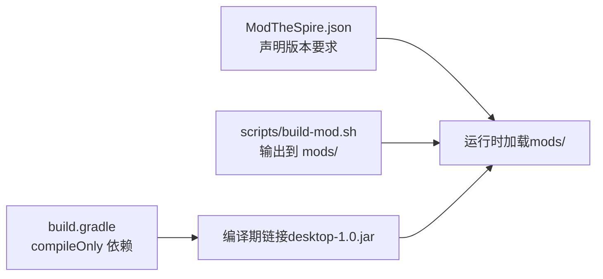

# 开发环境搭建

<cite>
**本文引用的文件**
- [README.md](file://README.md)
- [build.gradle](file://build.gradle)
- [settings.gradle](file://settings.gradle)
- [scripts/build-mod.sh](file://scripts/build-mod.sh)
- [src/main/resources/ModTheSpire.json](file://src/main/resources/ModTheSpire.json)
- [src/main/java/spiremod/SpireMod.java](file://src/main/java/spiremod/SpireMod.java)
- [src/main/java/spiremod/patches/GoldPatch.java](file://src/main/java/spiremod/patches/GoldPatch.java)
- [src/main/java/spiremod/powers/MerchantWrathPower.java](file://src/main/java/spiremod/powers/MerchantWrathPower.java)
- [docs/superpowers/specs/2026-06-15-spiremod-lightweight-design.md](file://docs/superpowers/specs/2026-06-15-spiremod-lightweight-design.md)
</cite>

## 目录
1. [简介](#简介)
2. [项目结构](#项目结构)
3. [核心组件](#核心组件)
4. [架构总览](#架构总览)
5. [详细组件分析](#详细组件分析)
6. [依赖关系分析](#依赖关系分析)
7. [性能与构建建议](#性能与构建建议)
8. [故障排查指南](#故障排查指南)
9. [结论](#结论)
10. [附录：环境验证清单与测试步骤](#附录环境验证清单与测试步骤)

## 简介
本指南面向希望在本地搭建 SpireMod 开发与测试环境的开发者，涵盖以下要点：
- Java 8 环境配置与工具链要求
- IDE 推荐设置（IntelliJ IDEA 或 Eclipse）及必要插件
- Gradle 构建系统配置与依赖管理（ModTheSpire 与 desktop-1.0.jar 的版本匹配）
- Mod 加载器（ModTheSpire）安装与配置
- 环境变量与路径配置
- 常见问题与解决方案
- 环境验证清单与测试步骤

## 项目结构
该仓库采用标准 Java 工程结构，核心源码位于 src/main/java，资源位于 src/main/resources；构建脚本由 Gradle 与 Bash 脚本共同支持。

图表来源
- [build.gradle:1-56](file://build.gradle#L1-L56)
- [settings.gradle:1-2](file://settings.gradle#L1-L2)
- [scripts/build-mod.sh:1-39](file://scripts/build-mod.sh#L1-L39)
- [src/main/resources/ModTheSpire.json:1-10](file://src/main/resources/ModTheSpire.json#L1-L10)
- [docs/superpowers/specs/2026-06-15-spiremod-lightweight-design.md:23-41](file://docs/superpowers/specs/2026-06-15-spiremod-lightweight-design.md#L23-L41)

章节来源
- [build.gradle:1-56](file://build.gradle#L1-L56)
- [settings.gradle:1-2](file://settings.gradle#L1-L2)
- [scripts/build-mod.sh:1-39](file://scripts/build-mod.sh#L1-L39)
- [src/main/resources/ModTheSpire.json:1-10](file://src/main/resources/ModTheSpire.json#L1-L10)
- [docs/superpowers/specs/2026-06-15-spiremod-lightweight-design.md:23-41](file://docs/superpowers/specs/2026-06-15-spiremod-lightweight-design.md#L23-L41)

## 核心组件
- Mod 入口与初始化
  - 入口类通过注解注册 Mod，负责在启动时完成初始化。
  - 参考路径：[SpireMod.java:1-11](file://src/main/java/spiremod/SpireMod.java#L1-L11)
- 金币加成补丁
  - 在角色初始化阶段为玩家增加固定金币，并重置贷款状态。
  - 参考路径：[GoldPatch.java:1-34](file://src/main/java/spiremod/patches/GoldPatch.java#L1-L34)
- 功德（Power）示例
  - 自定义负面效果 Debuff，回合开始造成生命损失。
  - 参考路径：[MerchantWrathPower.java:1-39](file://src/main/java/spiremod/powers/MerchantWrathPower.java#L1-L39)
- Mod 元数据
  - 包含 Mod ID、名称、作者、描述、版本以及对 ModTheSpire 与游戏版本的要求。
  - 参考路径：[ModTheSpire.json:1-10](file://src/main/resources/ModTheSpire.json#L1-L10)

章节来源
- [src/main/java/spiremod/SpireMod.java:1-11](file://src/main/java/spiremod/SpireMod.java#L1-L11)
- [src/main/java/spiremod/patches/GoldPatch.java:1-34](file://src/main/java/spiremod/patches/GoldPatch.java#L1-L34)
- [src/main/java/spiremod/powers/MerchantWrathPower.java:1-39](file://src/main/java/spiremod/powers/MerchantWrathPower.java#L1-L39)
- [src/main/resources/ModTheSpire.json:1-10](file://src/main/resources/ModTheSpire.json#L1-L10)

## 架构总览
SpireMod 的构建与运行涉及三个关键构件：
- Mod 入口与补丁：通过 ModTheSpire 提供的 SpirePatch 机制在游戏生命周期钩子处注入逻辑
- 构建系统：Gradle 与 Bash 脚本分别提供自动化打包与部署
- 运行时环境：ModTheSpire 作为运行时框架，desktop-1.0.jar 作为编译期依赖

图表来源
- [build.gradle:8-29](file://build.gradle#L8-L29)
- [scripts/build-mod.sh:10-13](file://scripts/build-mod.sh#L10-L13)
- [src/main/resources/ModTheSpire.json:7-8](file://src/main/resources/ModTheSpire.json#L7-L8)
- [src/main/java/spiremod/SpireMod.java:5-10](file://src/main/java/spiremod/SpireMod.java#L5-L10)
- [src/main/java/spiremod/patches/GoldPatch.java:9-12](file://src/main/java/spiremod/patches/GoldPatch.java#L9-L12)

## 详细组件分析

### 组件一：Gradle 构建配置
- Java 版本与工具链
  - 使用 Java 8 工具链，确保编译与运行兼容性。
  - 参考路径：[build.gradle:8-12](file://build.gradle#L8-L12)
- 依赖声明
  - desktop-1.0.jar 与 ModTheSpire.jar 作为 compileOnly 依赖，避免打包进最终 Mod。
  - 参考路径：[build.gradle:26-29](file://build.gradle#L26-L29)
- 资源与输出
  - 打包时包含 Mod 元数据文件，并输出至 ModTheSpire 的 mods 目录。
  - 参考路径：[build.gradle:35-42](file://build.gradle#L35-L42)
- 路径与环境变量
  - 默认路径指向 Mac + Steam 的安装位置；可通过 Gradle 属性覆盖。
  - 参考路径：[build.gradle:14-20](file://build.gradle#L14-L20)

图表来源
- [build.gradle:14-20](file://build.gradle#L14-L20)
- [build.gradle:44-54](file://build.gradle#L44-L54)

章节来源
- [build.gradle:8-12](file://build.gradle#L8-L12)
- [build.gradle:26-29](file://build.gradle#L26-L29)
- [build.gradle:35-42](file://build.gradle#L35-L42)
- [build.gradle:14-20](file://build.gradle#L14-L20)

### 组件二：Bash 构建脚本
- 环境变量覆盖
  - 支持通过环境变量覆盖 desktop-1.0.jar、ModTheSpire.jar 与 mods 目录路径。
  - 参考路径：[README.md:25-32](file://README.md#L25-L32)，[scripts/build-mod.sh:10-12](file://scripts/build-mod.sh#L10-L12)
- 编译与打包
  - 使用 javac --release 8 编译，随后打包为 SpireMod.jar 并放置于 mods 目录。
  - 参考路径：[scripts/build-mod.sh:28-36](file://scripts/build-mod.sh#L28-L36)

图表来源
- [scripts/build-mod.sh:10-13](file://scripts/build-mod.sh#L10-L13)
- [scripts/build-mod.sh:15-23](file://scripts/build-mod.sh#L15-L23)
- [scripts/build-mod.sh:25-36](file://scripts/build-mod.sh#L25-L36)

章节来源
- [README.md:25-32](file://README.md#L25-L32)
- [scripts/build-mod.sh:10-13](file://scripts/build-mod.sh#L10-L13)
- [scripts/build-mod.sh:15-23](file://scripts/build-mod.sh#L15-L23)
- [scripts/build-mod.sh:25-36](file://scripts/build-mod.sh#L25-L36)

### 组件三：Mod 元数据与入口
- 元数据文件
  - 包含 Mod ID、名称、作者、描述、版本，以及对 ModTheSpire 与游戏版本的要求。
  - 参考路径：[ModTheSpire.json:1-10](file://src/main/resources/ModTheSpire.json#L1-L10)
- 入口类
  - 使用 @SpireInitializer 注解，负责注册与初始化 Mod。
  - 参考路径：[SpireMod.java:5-10](file://src/main/java/spiremod/SpireMod.java#L5-L10)

图表来源
- [src/main/resources/ModTheSpire.json:1-10](file://src/main/resources/ModTheSpire.json#L1-L10)
- [src/main/java/spiremod/SpireMod.java:5-10](file://src/main/java/spiremod/SpireMod.java#L5-L10)
- [src/main/java/spiremod/patches/GoldPatch.java:9-12](file://src/main/java/spiremod/patches/GoldPatch.java#L9-L12)

章节来源
- [src/main/resources/ModTheSpire.json:1-10](file://src/main/resources/ModTheSpire.json#L1-L10)
- [src/main/java/spiremod/SpireMod.java:5-10](file://src/main/java/spiremod/SpireMod.java#L5-L10)
- [src/main/java/spiremod/patches/GoldPatch.java:9-12](file://src/main/java/spiremod/patches/GoldPatch.java#L9-L12)

## 依赖关系分析
- ModTheSpire 与 desktop-1.0.jar 的版本匹配
  - 元数据中声明了对 ModTheSpire 与游戏版本的要求，确保运行时兼容性。
  - 参考路径：[ModTheSpire.json:7-8](file://src/main/resources/ModTheSpire.json#L7-L8)
- 构建期依赖
  - Gradle 将 desktop-1.0.jar 与 ModTheSpire.jar 作为 compileOnly 依赖，避免打包进最终 Mod。
  - 参考路径：[build.gradle:26-29](file://build.gradle#L26-L29)
- 运行时加载路径
  - ModTheSpire 从相对路径 mods/ 读取 Mod，实际落点位于 SlayTheSpire.app/Contents/Resources/mods/。
  - 参考路径：[README.md:40-46](file://README.md#L40-L46)，[docs/superpowers/specs/2026-06-15-spiremod-lightweight-design.md:100-110](file://docs/superpowers/specs/2026-06-15-spiremod-lightweight-design.md#L100-L110)

图表来源
- [src/main/resources/ModTheSpire.json:7-8](file://src/main/resources/ModTheSpire.json#L7-L8)
- [build.gradle:26-29](file://build.gradle#L26-L29)
- [scripts/build-mod.sh:12-13](file://scripts/build-mod.sh#L12-L13)
- [README.md:40-46](file://README.md#L40-L46)

章节来源
- [src/main/resources/ModTheSpire.json:7-8](file://src/main/resources/ModTheSpire.json#L7-L8)
- [build.gradle:26-29](file://build.gradle#L26-L29)
- [scripts/build-mod.sh:12-13](file://scripts/build-mod.sh#L12-L13)
- [README.md:40-46](file://README.md#L40-L46)
- [docs/superpowers/specs/2026-06-15-spiremod-lightweight-design.md:100-110](file://docs/superpowers/specs/2026-06-15-spiremod-lightweight-design.md#L100-L110)

## 性能与构建建议
- 优先使用 Gradle 构建，便于统一管理依赖与输出路径
- 若需快速迭代，可使用 Bash 脚本进行本地构建与测试
- 保持 Java 8 工具链一致性，避免因语言特性差异导致的编译失败
- 在 CI 环境中，建议显式传入环境变量以覆盖默认路径，确保可重复构建

## 故障排查指南
- 未找到 desktop-1.0.jar 或 ModTheSpire.jar
  - 现象：构建失败并提示 JAR 不存在
  - 处理：通过环境变量或 Gradle 属性覆盖路径，确保路径正确且文件存在
  - 参考路径：[scripts/build-mod.sh:15-23](file://scripts/build-mod.sh#L15-L23)，[build.gradle:47-52](file://build.gradle#L47-L52)
- Mod 未出现在 mods/ 目录
  - 现象：Mod 无法被 ModTheSpire 发现
  - 处理：确认构建输出目录为 SlayTheSpire.app/Contents/Resources/mods/，而非外层目录
  - 参考路径：[README.md:40-46](file://README.md#L40-L46)，[docs/superpowers/specs/2026-06-15-spiremod-lightweight-design.md:100-110](file://docs/superpowers/specs/2026-06-15-spiremod-lightweight-design.md#L100-L110)
- 读档后重复获得奖励
  - 现象：存档再读取时再次触发开局逻辑
  - 处理：确保补丁仅在“新开一局”场景触发，避免在读档流程中重复执行
  - 参考路径：[docs/superpowers/specs/2026-06-15-spiremod-lightweight-design.md:86-91](file://docs/superpowers/specs/2026-06-15-spiremod-lightweight-design.md#L86-L91)

章节来源
- [scripts/build-mod.sh:15-23](file://scripts/build-mod.sh#L15-L23)
- [build.gradle:47-52](file://build.gradle#L47-L52)
- [README.md:40-46](file://README.md#L40-L46)
- [docs/superpowers/specs/2026-06-15-spiremod-lightweight-design.md:86-91](file://docs/superpowers/specs/2026-06-15-spiremod-lightweight-design.md#L86-L91)
- [docs/superpowers/specs/2026-06-15-spiremod-lightweight-design.md:100-110](file://docs/superpowers/specs/2026-06-15-spiremod-lightweight-design.md#L100-L110)

## 结论
通过本指南，您可以在本地完成 SpireMod 的开发环境搭建与 Mod 加载测试。请务必：
- 使用 Java 8 工具链
- 正确配置 ModTheSpire 与 desktop-1.0.jar 的路径
- 将构建产物输出到 ModTheSpire 的 mods/ 目录
- 在测试中验证开局金币加成与遗物发放逻辑

## 附录：环境验证清单与测试步骤
- 环境验证清单
  - 已安装并配置 Java 8 工具链
  - 已安装 ModTheSpire（运行时框架）
  - 已准备 desktop-1.0.jar（编译期依赖）
  - 已将构建产物输出到 SlayTheSpire.app/Contents/Resources/mods/
  - 已在 ModTheSpire 中启用本 Mod
- 测试步骤
  - 通过 ModTheSpire 启动游戏，新建一局
  - 验证：金币在基础值上增加了 200（例如铁甲战士基础 99 → 299）
  - 验证：遗物栏中包含会员卡、送货员、黑星等目标遗物
  - 验证：读档后不会重复获得奖励

章节来源
- [docs/superpowers/specs/2026-06-15-spiremod-lightweight-design.md:86-91](file://docs/superpowers/specs/2026-06-15-spiremod-lightweight-design.md#L86-L91)
- [README.md:40-46](file://README.md#L40-L46)
- [docs/superpowers/specs/2026-06-15-spiremod-lightweight-design.md:100-110](file://docs/superpowers/specs/2026-06-15-spiremod-lightweight-design.md#L100-L110)