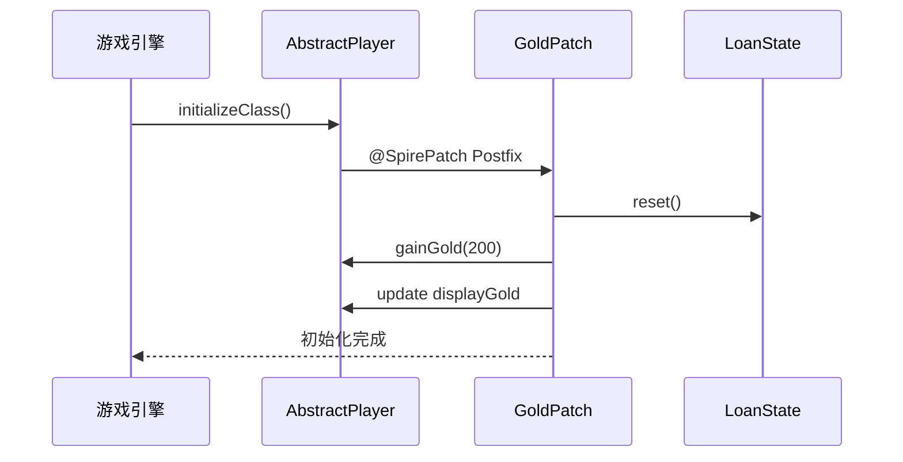
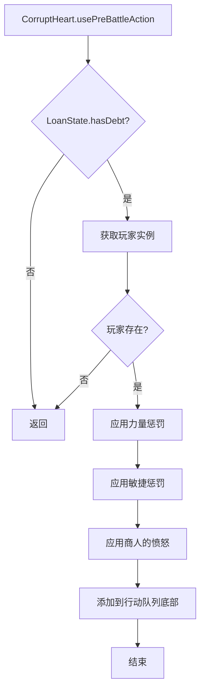
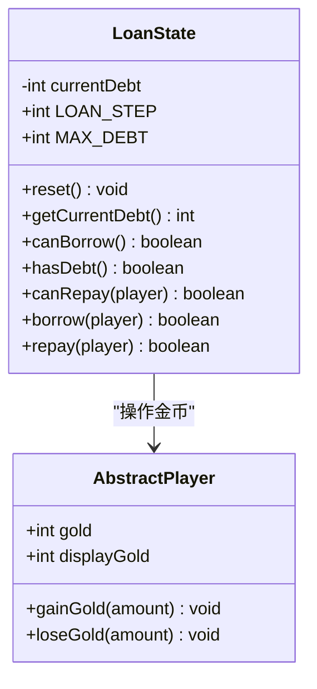
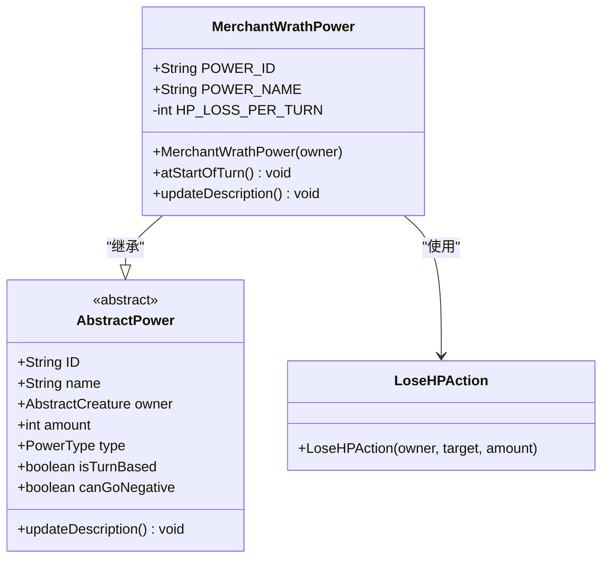
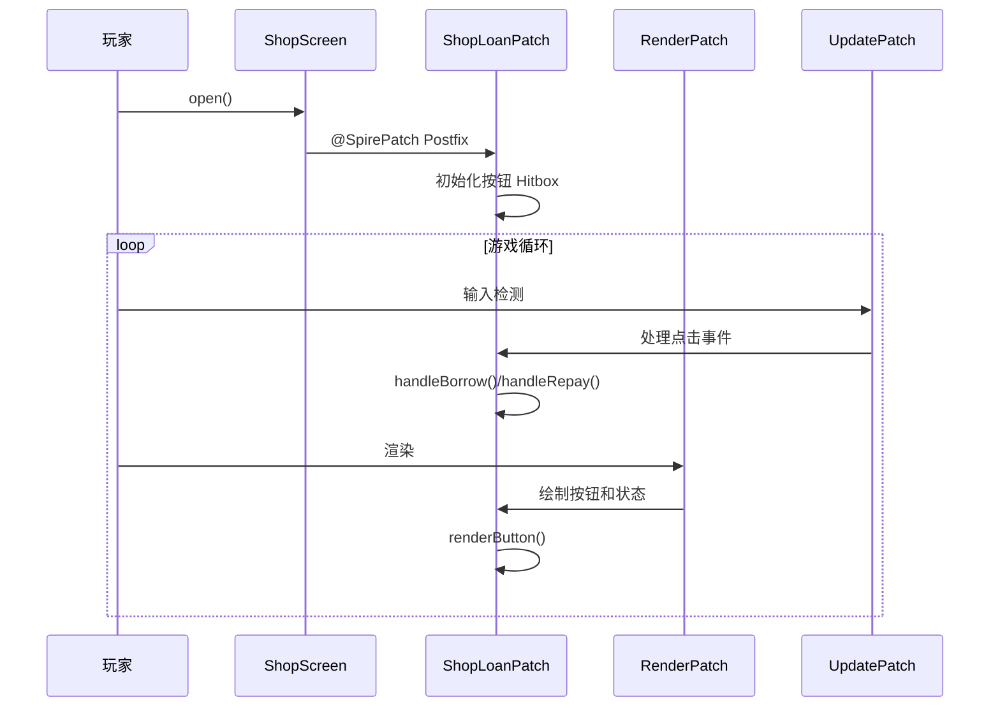
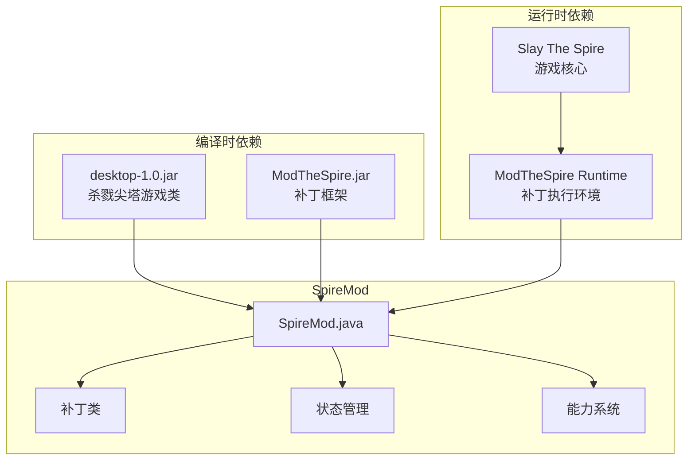
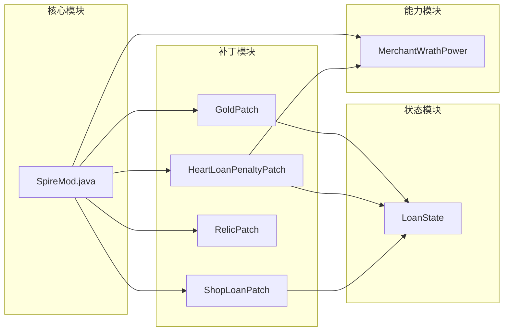

# 扩展开发指南

<cite>
**本文档引用的文件**
- [SpireMod.java](file://src/main/java/spiremod/SpireMod.java)
- [LoanState.java](file://src/main/java/spiremod/state/LoanState.java)
- [MerchantWrathPower.java](file://src/main/java/spiremod/powers/MerchantWrathPower.java)
- [GoldPatch.java](file://src/main/java/spiremod/patches/GoldPatch.java)
- [HeartLoanPenaltyPatch.java](file://src/main/java/spiremod/patches/HeartLoanPenaltyPatch.java)
- [RelicPatch.java](file://src/main/java/spiremod/patches/RelicPatch.java)
- [ShopLoanPatch.java](file://src/main/java/spiremod/patches/ShopLoanPatch.java)
- [build.gradle](file://build.gradle)
- [settings.gradle](file://settings.gradle)
- [README.md](file://README.md)
- [ModTheSpire.json](file://src/main/resources/ModTheSpire.json)
- [2026-06-15-spiremod-lightweight-design.md](file://docs/superpowers/specs/2026-06-15-spiremod-lightweight-design.md)
</cite>

## 目录
1. [简介](#简介)
2. [项目结构](#项目结构)
3. [核心组件](#核心组件)
4. [架构概览](#架构概览)
5. [详细组件分析](#详细组件分析)
6. [依赖关系分析](#依赖关系分析)
7. [性能考虑](#性能考虑)
8. [故障排除指南](#故障排除指南)
9. [结论](#结论)
10. [附录](#附录)

## 简介

SpireMod 是一个基于 ModTheSpire 的轻量级杀戮尖塔扩展开发框架。该框架展示了如何使用纯 SpirePatch 技术创建 Mod，无需依赖 BaseMod。项目包含了完整的补丁系统、状态管理系统、能力系统和 UI 交互功能，为开发者提供了从概念到实现的完整示例。

本指南将深入解析 SpireMod 的架构设计，详细说明如何创建新的补丁类来修改游戏机制，包括补丁生命周期管理、事件监听和 UI 交互。同时，我们将解释状态管理系统的扩展方法，如 LoanState 的扩展和自定义状态的创建，以及新能力类的开发流程，包括 MerchantWrathPower 的设计模式和实现要点。

## 项目结构

SpireMod 采用清晰的模块化组织结构，遵循杀戮尖塔 Mod 的标准目录布局：

```mermaid
graph TB
subgraph "src/main/java/spiremod/"
A[SpireMod.java<br/>@SpireInitializer 入口]
subgraph "patches/"
B[GoldPatch.java<br/>金币初始化补丁]
C[HeartLoanPenaltyPatch.java<br/>心脏债务惩罚补丁]
D[RelicPatch.java<br/>遗物补丁]
E[ShopLoanPatch.java<br/>商店贷款补丁]
end
subgraph "powers/"
F[MerchantWrathPower.java<br/>商人的愤怒能力]
end
subgraph "state/"
G[LoanState.java<br/>贷款状态管理]
end
end
subgraph "src/main/resources/"
H[ModTheSpire.json<br/>Mod 元数据配置]
end
subgraph "构建配置"
I[build.gradle<br/>Gradle 构建脚本]
J[settings.gradle<br/>项目设置]
end
A --> B
A --> C
A --> D
A --> E
A --> F
A --> G
H --> A
I --> A
J --> I
```

**图表来源**
- [SpireMod.java:1-11](file://src/main/java/spiremod/SpireMod.java#L1-L11)
- [GoldPatch.java:1-34](file://src/main/java/spiremod/patches/GoldPatch.java#L1-L34)
- [HeartLoanPenaltyPatch.java:1-41](file://src/main/java/spiremod/patches/HeartLoanPenaltyPatch.java#L1-L41)
- [RelicPatch.java:1-46](file://src/main/java/spiremod/patches/RelicPatch.java#L1-L46)
- [ShopLoanPatch.java:1-203](file://src/main/java/spiremod/patches/ShopLoanPatch.java#L1-L203)
- [MerchantWrathPower.java:1-39](file://src/main/java/spiremod/powers/MerchantWrathPower.java#L1-L39)
- [LoanState.java:1-56](file://src/main/java/spiremod/state/LoanState.java#L1-L56)

**章节来源**
- [SpireMod.java:1-11](file://src/main/java/spiremod/SpireMod.java#L1-L11)
- [build.gradle:1-56](file://build.gradle#L1-L56)
- [settings.gradle:1-2](file://settings.gradle#L1-L2)

## 核心组件

### Mod 初始化器

SpireMod 的入口点是一个标准的 @SpireInitializer 类，负责向 ModTheSpire 注册 Mod 并建立基本的初始化流程。

### 补丁系统

补丁系统是 SpireMod 的核心扩展机制，通过 @SpirePatch 注解在运行时修改游戏行为。系统包含四个主要补丁：

1. **GoldPatch** - 角色初始化时增加金币
2. **HeartLoanPenaltyPatch** - 心脏战斗时应用债务惩罚
3. **RelicPatch** - 初始化时发放特定遗物
4. **ShopLoanPatch** - 商店界面添加贷款/还款功能

### 状态管理系统

LoanState 提供了全局的贷款状态管理，包括债务计算、借贷限制和状态查询功能。

### 能力系统

MerchantWrathPower 展示了如何创建自定义能力，包括视觉效果、状态管理和回合触发逻辑。

**章节来源**
- [SpireMod.java:5-10](file://src/main/java/spiremod/SpireMod.java#L5-L10)
- [GoldPatch.java:9-33](file://src/main/java/spiremod/patches/GoldPatch.java#L9-L33)
- [LoanState.java:5-55](file://src/main/java/spiremod/state/LoanState.java#L5-L55)
- [MerchantWrathPower.java:10-38](file://src/main/java/spiremod/powers/MerchantWrathPower.java#L10-L38)

## 架构概览

SpireMod 采用了分层架构设计，确保各组件之间的松耦合和高内聚：

```mermaid
graph TB
subgraph "Mod 层"
A[SpireMod.java<br/>@SpireInitializer]
end
subgraph "补丁层"
B[GoldPatch<br/>金币补丁]
C[HeartLoanPenaltyPatch<br/>债务惩罚补丁]
D[RelicPatch<br/>遗物补丁]
E[ShopLoanPatch<br/>商店贷款补丁]
end
subgraph "状态管理层"
F[LoanState<br/>贷款状态管理]
end
subgraph "能力层"
G[MerchantWrathPower<br/>商人的愤怒]
end
subgraph "UI 层"
H[ShopLoanPatch.RenderPatch<br/>渲染补丁]
I[ShopLoanPatch.UpdatePatch<br/>更新补丁]
end
subgraph "游戏核心"
J[AbstractPlayer<br/>玩家类]
K[ShopScreen<br/>商店屏幕]
L[CorruptHeart<br/>心脏怪物]
M[AbstractDungeon<br/>地牢管理]
end
A --> B
A --> C
A --> D
A --> E
B --> F
C --> F
C --> G
D --> J
E --> F
E --> H
E --> I
E --> K
F --> J
G --> J
H --> K
I --> K
C --> L
E --> M
```

**图表来源**
- [SpireMod.java:6-9](file://src/main/java/spiremod/SpireMod.java#L6-L9)
- [GoldPatch.java:16-32](file://src/main/java/spiremod/patches/GoldPatch.java#L16-L32)
- [HeartLoanPenaltyPatch.java:20-39](file://src/main/java/spiremod/patches/HeartLoanPenaltyPatch.java#L20-L39)
- [RelicPatch.java:22-44](file://src/main/java/spiremod/patches/RelicPatch.java#L22-L44)
- [ShopLoanPatch.java:46-202](file://src/main/java/spiremod/patches/ShopLoanPatch.java#L46-L202)
- [LoanState.java:14-54](file://src/main/java/spiremod/state/LoanState.java#L14-L54)
- [MerchantWrathPower.java:15-37](file://src/main/java/spiremod/powers/MerchantWrathPower.java#L15-L37)

## 详细组件分析

### 补丁生命周期管理

#### GoldPatch - 金币初始化补丁

GoldPatch 展示了如何在角色初始化阶段添加金币奖励：



**图表来源**
- [GoldPatch.java:16-32](file://src/main/java/spiremod/patches/GoldPatch.java#L16-L32)
- [LoanState.java:14-16](file://src/main/java/spiremod/state/LoanState.java#L14-L16)

#### HeartLoanPenaltyPatch - 债务惩罚补丁

这个补丁展示了如何在特定游戏事件中应用能力：



**图表来源**
- [HeartLoanPenaltyPatch.java:20-39](file://src/main/java/spiremod/patches/HeartLoanPenaltyPatch.java#L20-L39)

**章节来源**
- [GoldPatch.java:9-33](file://src/main/java/spiremod/patches/GoldPatch.java#L9-L33)
- [HeartLoanPenaltyPatch.java:13-40](file://src/main/java/spiremod/patches/HeartLoanPenaltyPatch.java#L13-L40)

### 状态管理系统扩展

#### LoanState - 贷款状态管理

LoanState 提供了完整的贷款状态管理功能：



**图表来源**
- [LoanState.java:5-55](file://src/main/java/spiremod/state/LoanState.java#L5-L55)

**章节来源**
- [LoanState.java:5-55](file://src/main/java/spiremod/state/LoanState.java#L5-L55)

### 能力系统开发

#### MerchantWrathPower - 商人的愤怒

MerchantWrathPower 展示了如何创建自定义能力：



**图表来源**
- [MerchantWrathPower.java:10-38](file://src/main/java/spiremod/powers/MerchantWrathPower.java#L10-L38)

**章节来源**
- [MerchantWrathPower.java:10-38](file://src/main/java/spiremod/powers/MerchantWrathPower.java#L10-L38)

### UI 交互系统

#### ShopLoanPatch - 商店贷款界面

ShopLoanPatch 展示了如何在游戏 UI 中添加自定义交互：



**图表来源**
- [ShopLoanPatch.java:46-202](file://src/main/java/spiremod/patches/ShopLoanPatch.java#L46-L202)

**章节来源**
- [ShopLoanPatch.java:17-202](file://src/main/java/spiremod/patches/ShopLoanPatch.java#L17-L202)

## 依赖关系分析

### 外部依赖

SpireMod 使用 ModTheSpire 作为主要的运行时框架，依赖关系如下：



**图表来源**
- [build.gradle:26-29](file://build.gradle#L26-L29)
- [ModTheSpire.json:7-8](file://src/main/resources/ModTheSpire.json#L7-L8)

### 内部模块依赖



**图表来源**
- [SpireMod.java:6-9](file://src/main/java/spiremod/SpireMod.java#L6-L9)
- [GoldPatch.java:7](file://src/main/java/spiremod/patches/GoldPatch.java#L7)
- [HeartLoanPenaltyPatch.java:10-11](file://src/main/java/spiremod/patches/HeartLoanPenaltyPatch.java#L10-L11)
- [ShopLoanPatch.java:15](file://src/main/java/spiremod/patches/ShopLoanPatch.java#L15)

**章节来源**
- [build.gradle:14-29](file://build.gradle#L14-L29)
- [ModTheSpire.json:1-9](file://src/main/resources/ModTheSpire.json#L1-L9)

## 性能考虑

### 补丁性能优化

1. **最小化反射调用**：所有补丁都使用 @SpirePatch 注解，避免运行时反射开销
2. **延迟初始化**：UI 组件采用延迟初始化策略，只在需要时创建
3. **输入处理优化**：使用 Hitbox 进行高效的鼠标交互检测

### 内存管理

1. **静态状态管理**：LoanState 使用静态变量减少对象创建开销
2. **资源复用**：UI 组件共享相同的纹理资源
3. **及时清理**：补丁在不需要时释放占用的资源

### 游戏循环影响

1. **非阻塞设计**：所有补丁都是异步执行，不影响游戏主循环
2. **条件检查**：每个补丁都有适当的条件检查，避免不必要的操作
3. **错误处理**：完善的空值检查和异常处理机制

## 故障排除指南

### 常见问题及解决方案

#### Mod 无法加载

**问题症状**：游戏启动时 Mod 未显示或报错

**可能原因**：
1. ModTheSpire 版本不兼容
2. desktop-1.0.jar 路径错误
3. ModID 冲突

**解决步骤**：
1. 检查 ModTheSpire.json 中的版本信息
2. 验证 build.gradle 中的 JAR 路径
3. 确认 ModID 在游戏中唯一

#### 补丁不生效

**问题症状**：补丁标记的方法没有被调用

**可能原因**：
1. 方法签名不匹配
2. 补丁类未正确注册
3. 运行时环境问题

**解决步骤**：
1. 使用 ModTheSpire 的调试功能查看补丁注册情况
2. 检查方法签名是否与目标类完全一致
3. 确认 @SpirePatch 注解的参数正确

#### UI 交互失效

**问题症状**：商店中的贷款按钮无法点击

**可能原因**：
1. Hitbox 位置计算错误
2. 输入事件处理异常
3. 渲染顺序问题

**解决步骤**：
1. 检查坐标缩放因子是否正确
2. 验证输入事件的触发条件
3. 确认渲染优先级设置

**章节来源**
- [README.md:13-47](file://README.md#L13-L47)
- [build.gradle:44-55](file://build.gradle#L44-L55)

## 结论

SpireMod 提供了一个完整的、可扩展的杀戮尖塔 Mod 开发框架。通过分析其架构设计和实现细节，我们可以总结出以下关键要点：

1. **简洁性原则**：SpireMod 证明了可以使用纯 SpirePatch 技术创建功能丰富的 Mod，无需复杂的依赖关系

2. **模块化设计**：清晰的分层架构使得各个组件职责明确，易于维护和扩展

3. **最佳实践**：从补丁生命周期管理到 UI 交互，都体现了 Mod 开发的最佳实践

4. **可扩展性**：LoanState 和 MerchantWrathPower 的设计为创建新的状态管理和能力系统提供了模板

对于开发者而言，SpireMod 不仅是一个功能完整的 Mod 示例，更是学习 Mod 开发技术的宝贵资源。通过深入理解其架构和实现，开发者可以快速掌握创建高质量杀戮尖塔 Mod 的技能。

## 附录

### 开发环境设置

#### 依赖项要求

- Java 8 或更高版本
- ModTheSpire 3.30.0 或兼容版本
- Slay The Spire desktop-1.0.jar

#### 构建配置

```bash
# 使用 Gradle 构建
./gradlew build

# 使用本地脚本构建
./scripts/build-mod.sh

# 自定义路径
STS_JAR="/path/to/desktop-1.0.jar" \
MTS_JAR="/path/to/ModTheSpire.jar" \
MODS_DIR="/path/to/SlayTheSpire/mods" \
./scripts/build-mod.sh
```

### 新补丁开发模板

创建新补丁的基本步骤：

1. 创建补丁类并添加 @SpirePatch 注解
2. 实现相应的前置/后置方法
3. 在补丁类中添加必要的逻辑
4. 确保正确的导入语句
5. 测试补丁功能

### 状态管理扩展指南

扩展 LoanState 的建议：

1. 定义新的常量和状态变量
2. 实现相应的状态查询和修改方法
3. 考虑与其他系统的交互
4. 添加适当的边界检查
5. 确保线程安全

### 能力系统开发要点

创建新能力的注意事项：

1. 选择合适的父类（AbstractPower）
2. 正确设置能力属性（类型、持续时间等）
3. 实现必要的回调方法
4. 处理视觉效果和音效
5. 考虑与其他能力的交互