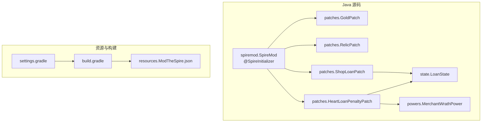
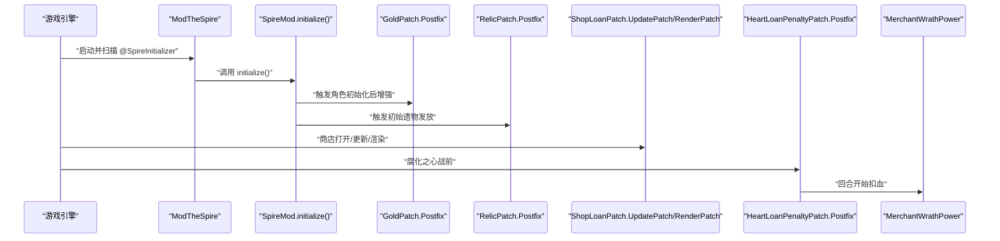
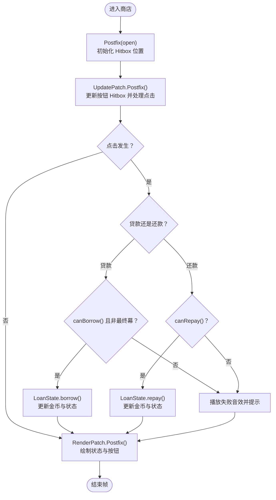
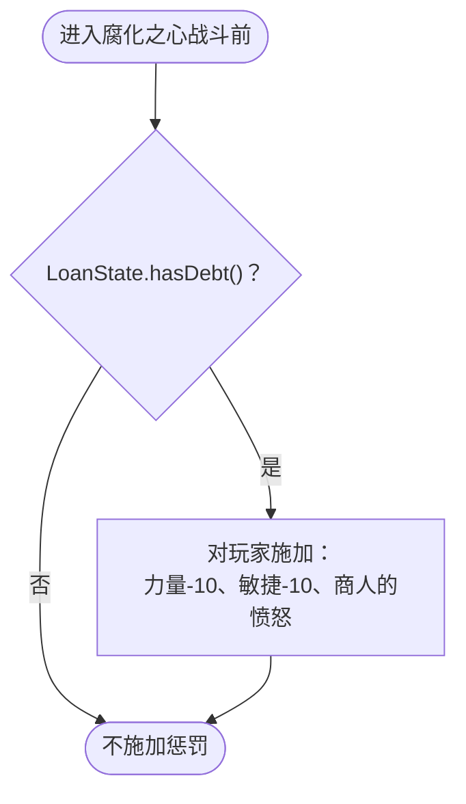
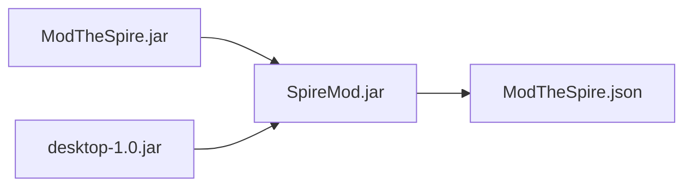

# 编码规范与最佳实践

<cite>
**本文引用的文件**
- [README.md](file://README.md)
- [SpireMod.java](file://src/main/java/spiremod/SpireMod.java)
- [GoldPatch.java](file://src/main/java/spiremod/patches/GoldPatch.java)
- [RelicPatch.java](file://src/main/java/spiremod/patches/RelicPatch.java)
- [HeartLoanPenaltyPatch.java](file://src/main/java/spiremod/patches/HeartLoanPenaltyPatch.java)
- [ShopLoanPatch.java](file://src/main/java/spiremod/patches/ShopLoanPatch.java)
- [MerchantWrathPower.java](file://src/main/java/spiremod/powers/MerchantWrathPower.java)
- [LoanState.java](file://src/main/java/spiremod/state/LoanState.java)
- [build.gradle](file://build.gradle)
- [settings.gradle](file://settings.gradle)
- [ModTheSpire.json](file://src/main/resources/ModTheSpire.json)
- [2026-06-15-spiremod-lightweight-design.md](file://docs/superpowers/specs/2026-06-15-spiremod-lightweight-design.md)
- [2026-06-16-shop-loan-and-heart-penalty-design.md](file://docs/superpowers/specs/2026-06-16-shop-loan-and-heart-penalty-design.md)
- [2026-06-17-spiremod-prd.md](file://docs/superpowers/specs/2026-06-17-spiremod-prd.md)
</cite>

## 目录
1. 引言
2. 项目结构
3. 核心组件
4. 架构总览
5. 组件详解
6. 依赖关系分析
7. 性能与内存考量
8. 错误处理与故障排查
9. 结论
10. 附录

## 引言
本指南面向 SpireMod 项目的开发者，旨在统一编码风格、命名约定与包结构组织原则，明确补丁类（SpirePatch）的编写规范，规范注释与文档生成要求，总结错误处理模式与性能优化建议，并提供代码审查、单元测试与调试技巧，以及重构与质量保障措施。本指南严格依据仓库中的实现与设计文档，确保可操作性与一致性。

## 项目结构
SpireMod 采用“按职责分层”的包结构，核心由以下模块组成：
- 入口与初始化：spiremod.SpireMod（@SpireInitializer）
- 补丁模块：spiremod.patches（围绕游戏关键节点进行前后缀增强）
- 功能性实体：spiremod.powers（自定义 Power）
- 运行时状态：spiremod.state（本局有效状态管理）
- 构建与元数据：build.gradle、settings.gradle、ModTheSpire.json

图表来源
- [SpireMod.java:1-11](file://src/main/java/spiremod/SpireMod.java#L1-L11)
- [GoldPatch.java:1-34](file://src/main/java/spiremod/patches/GoldPatch.java#L1-L34)
- [RelicPatch.java:1-46](file://src/main/java/spiremod/patches/RelicPatch.java#L1-L46)
- [HeartLoanPenaltyPatch.java:1-41](file://src/main/java/spiremod/patches/HeartLoanPenaltyPatch.java#L1-L41)
- [ShopLoanPatch.java:1-203](file://src/main/java/spiremod/patches/ShopLoanPatch.java#L1-L203)
- [MerchantWrathPower.java:1-39](file://src/main/java/spiremod/powers/MerchantWrathPower.java#L1-L39)
- [LoanState.java:1-56](file://src/main/java/spiremod/state/LoanState.java#L1-L56)
- [ModTheSpire.json:1-10](file://src/main/resources/ModTheSpire.json#L1-L10)
- [build.gradle:1-56](file://build.gradle#L1-L56)
- [settings.gradle:1-2](file://settings.gradle#L1-L2)

章节来源
- [2026-06-15-spiremod-lightweight-design.md:23-41](file://docs/superpowers/specs/2026-06-15-spiremod-lightweight-design.md#L23-L41)
- [2026-06-17-spiremod-prd.md:50-71](file://docs/superpowers/specs/2026-06-17-spiremod-prd.md#L50-L71)

## 核心组件
- 初始化入口：@SpireInitializer 类负责注册 Mod，确保 ModTheSpire 能正确加载。
- 补丁类：围绕游戏生命周期的关键节点进行增强，分为 Postfix 前后缀增强与内部子补丁（如 ShopLoanPatch 中的 UpdatePatch/RenderPatch）。
- 自定义 Power：最小化实现，满足特定回合效果。
- 运行时状态：LoanState 提供静态全局状态，仅在本局有效，避免跨局持久化。

章节来源
- [SpireMod.java:5-10](file://src/main/java/spiremod/SpireMod.java#L5-L10)
- [GoldPatch.java:9-32](file://src/main/java/spiremod/patches/GoldPatch.java#L9-L32)
- [RelicPatch.java:17-31](file://src/main/java/spiremod/patches/RelicPatch.java#L17-L31)
- [HeartLoanPenaltyPatch.java:13-39](file://src/main/java/spiremod/patches/HeartLoanPenaltyPatch.java#L13-L39)
- [ShopLoanPatch.java:17-94](file://src/main/java/spiremod/patches/ShopLoanPatch.java#L17-L94)
- [MerchantWrathPower.java:10-38](file://src/main/java/spiremod/powers/MerchantWrathPower.java#L10-L38)
- [LoanState.java:5-55](file://src/main/java/spiremod/state/LoanState.java#L5-L55)

## 架构总览
SpireMod 通过 ModTheSpire 的 @SpireInitializer 注册，随后在游戏关键节点注入补丁逻辑，实现“开局增益 + 商店贷款 + 心脏惩罚”的闭环。LoanState 作为全局状态贯穿商店与战斗前阶段，MerchantWrathPower 作为自定义 Debuff 在回合开始生效。

图表来源
- [SpireMod.java:7-9](file://src/main/java/spiremod/SpireMod.java#L7-L9)
- [GoldPatch.java:16-32](file://src/main/java/spiremod/patches/GoldPatch.java#L16-L32)
- [RelicPatch.java:22-31](file://src/main/java/spiremod/patches/RelicPatch.java#L22-L31)
- [ShopLoanPatch.java:64-148](file://src/main/java/spiremod/patches/ShopLoanPatch.java#L64-L148)
- [HeartLoanPenaltyPatch.java:20-39](file://src/main/java/spiremod/patches/HeartLoanPenaltyPatch.java#L20-L39)
- [MerchantWrathPower.java:28-32](file://src/main/java/spiremod/powers/MerchantWrathPower.java#L28-L32)

## 组件详解

### 补丁类编写规范
- 注解使用
  - @SpirePatch 指定 clz 与 method，method 支持构造函数、静态方法与实例方法签名；若方法重载，需确保签名与目标完全匹配。
  - 对于 UI/输入驱动的补丁，可在同一类内嵌套内部补丁类（如 ShopLoanPatch 的 UpdatePatch/RenderPatch），分别覆盖 open/update/render。
- 方法签名与参数传递
  - Postfix 增强方法签名固定为：修饰符 static void Postfix(目标类实例或上下文对象, ...参数列表)，其中 __instance 为被补丁对象的引用。
  - 参数顺序与类型必须与目标方法签名一致，否则 ModTheSpire 将无法匹配。
- 前后缀增强选择
  - 仅在必要时使用 Postfix；若需改变返回值或提前终止，应评估前置增强风险并谨慎使用 Prefix。
- 防御性编程
  - 对外部对象（如 AbstractDungeon.player）进行空值检查，避免 NPE。
  - 对全局状态（LoanState）进行边界检查，防止越界或重复操作。
- 作用域与副作用
  - 仅在本局有效逻辑中使用静态全局状态；避免跨局持久化。
  - UI 补丁仅在当前屏幕/场景有效，注意生命周期与资源释放。

章节来源
- [GoldPatch.java:9-32](file://src/main/java/spiremod/patches/GoldPatch.java#L9-L32)
- [RelicPatch.java:17-44](file://src/main/java/spiremod/patches/RelicPatch.java#L17-L44)
- [HeartLoanPenaltyPatch.java:13-39](file://src/main/java/spiremod/patches/HeartLoanPenaltyPatch.java#L13-L39)
- [ShopLoanPatch.java:17-94](file://src/main/java/spiremod/patches/ShopLoanPatch.java#L17-L94)

### 商店贷款补丁（ShopLoanPatch）流程

图表来源
- [ShopLoanPatch.java:46-94](file://src/main/java/spiremod/patches/ShopLoanPatch.java#L46-L94)
- [ShopLoanPatch.java:150-185](file://src/main/java/spiremod/patches/ShopLoanPatch.java#L150-L185)
- [LoanState.java:22-54](file://src/main/java/spiremod/state/LoanState.java#L22-L54)

### 心脏战债务惩罚流程

图表来源
- [HeartLoanPenaltyPatch.java:20-39](file://src/main/java/spiremod/patches/HeartLoanPenaltyPatch.java#L20-L39)
- [LoanState.java:26-28](file://src/main/java/spiremod/state/LoanState.java#L26-L28)
- [MerchantWrathPower.java:10-38](file://src/main/java/spiremod/powers/MerchantWrathPower.java#L10-L38)

### 自定义 Power（MerchantWrathPower）
- 继承 AbstractPower，设置 ID、名称、类型与回合标记。
- atStartOfTurn 中触发 LoseHPAction，实现每回合扣血效果。
- updateDescription 用于动态描述文本。

章节来源
- [MerchantWrathPower.java:10-38](file://src/main/java/spiremod/powers/MerchantWrathPower.java#L10-L38)

### 运行时状态（LoanState）
- 静态类，提供 reset、getCurrentDebt、canBorrow、borrow、canRepay、repay 等方法。
- 通过静态字段维护当前债务，仅在本局有效。

章节来源
- [LoanState.java:5-55](file://src/main/java/spiremod/state/LoanState.java#L5-L55)

## 依赖关系分析
- 运行时框架：ModTheSpire（@SpireInitializer、@SpirePatch）
- 游戏类库：desktop-1.0.jar（compileOnly，提供游戏核心类）
- 构建产物：SpireMod.jar 输出至 ModTheSpire 的 mods 目录

图表来源
- [build.gradle:26-29](file://build.gradle#L26-L29)
- [build.gradle:35-55](file://build.gradle#L35-L55)
- [ModTheSpire.json:1-10](file://src/main/resources/ModTheSpire.json#L1-L10)

章节来源
- [build.gradle:14-29](file://build.gradle#L14-L29)
- [build.gradle:35-55](file://build.gradle#L35-L55)
- [ModTheSpire.json:1-10](file://src/main/resources/ModTheSpire.json#L1-L10)

## 性能与内存考量
- 补丁方法应尽量轻量化，避免在 Postfix 中执行重型计算或频繁 IO。
- UI 补丁（如 ShopLoanPatch）仅在当前屏幕生命周期内持有 Hitbox，避免长期驻留导致内存泄漏。
- 使用静态全局状态（LoanState）时，确保在新局开始时重置，避免跨局状态污染。
- 图形绘制采用轻量资源（如 WHITE_SQUARE_IMG），减少纹理切换与批次提交。
- 输入检测与点击判定在 update 中进行，注意节流与避免重复触发。

## 错误处理与故障排查
- 空指针保护：对外部对象（如 AbstractDungeon.player）进行判空后再访问。
- 边界检查：贷款上限与还款条件在业务方法中集中校验，失败时播放失败音效并提示。
- 构建验证：Gradle 任务在打包前检查 STS 与 MTS JAR 是否存在，缺失时报错中断。
- 日志与提示：通过商店语音提示与音效反馈用户操作结果，便于定位问题。

章节来源
- [ShopLoanPatch.java:150-185](file://src/main/java/spiremod/patches/ShopLoanPatch.java#L150-L185)
- [build.gradle:44-54](file://build.gradle#L44-L54)

## 结论
本指南总结了 SpireMod 的编码规范与最佳实践，涵盖补丁类编写、命名与包结构、注释与文档、错误处理、性能与内存管理、线程安全注意事项、代码审查与测试、调试技巧及重构指导。遵循这些规范有助于提升代码一致性、可维护性与稳定性，确保 Mod 在不同环境与版本下可靠运行。

## 附录

### Java 代码风格与命名约定
- 包命名：采用反向域名风格，如 spiremod、spiremod.patches、spiremod.powers、spiremod.state。
- 类命名：采用帕斯卡命名法，补丁类以 Patch 结尾（如 GoldPatch、RelicPatch、ShopLoanPatch、HeartLoanPenaltyPatch）。
- 方法命名：采用驼峰命名法，Postfix 方法统一使用 Postfix，内部补丁类使用 UpdatePatch/RenderPatch 等描述性后缀。
- 常量：全大写加下划线，如 BORROW_LABEL、BUTTON_WIDTH。
- 字段与局部变量：采用驼峰命名法，避免缩写，保持语义清晰。

### 补丁类编写清单
- 明确 @SpirePatch 的 clz 与 method，method 签名与目标一致。
- Postfix 方法签名固定，参数顺序与类型与目标方法一致。
- 对外部对象进行空值检查与边界校验。
- UI 补丁仅在当前场景有效，避免跨场景资源泄漏。
- 仅在本局有效状态中使用静态全局状态，新局开始时重置。

### 注释与文档生成规范
- 类注释：简述职责与作用域，引用相关设计文档链接。
- 方法注释：说明前置条件、后置条件、异常与副作用。
- 关键逻辑注释：解释业务规则与边界条件，如贷款上限、最终幕限制、UI 布局参数来源。
- 文档生成：使用标准 JavaDoc 格式，配合 Gradle 任务生成 API 文档。

### 错误处理模式
- 防御性编程：对所有外部依赖进行判空与边界检查。
- 失败反馈：通过商店语音与音效提示用户，避免静默失败。
- 构建期校验：在打包前检查关键依赖是否存在，失败即刻报错。

### 性能优化建议
- 减少补丁方法中的循环与递归，避免高频调用。
- UI 绘制与输入检测分离，降低耦合度。
- 使用静态常量与轻量资源，减少对象创建与 GC 压力。

### 内存管理与线程安全
- 静态全局状态仅在本局有效，避免跨线程共享。
- UI 资源在离开场景时及时释放，避免长生命周期持有。
- 避免在补丁方法中创建大量临时对象，减少堆压力。

### 代码审查标准
- 正确性：补丁方法签名与目标一致，逻辑覆盖所有分支。
- 可读性：命名规范、注释清晰、方法粒度适中。
- 稳健性：充分的空值与边界检查，失败路径有明确反馈。
- 一致性：遵循项目既定风格与包结构，避免风格漂移。

### 单元测试与调试技巧
- 单元测试：针对 LoanState 的核心方法（borrow/canBorrow/repay/canRepay）编写断言，覆盖边界与失败路径。
- 集成测试：通过 ModTheSpire 启动游戏，按 PRD 与设计文档逐项验证功能。
- 调试技巧：利用商店语音与日志输出定位问题；在补丁方法中添加最小化日志，避免影响性能。

### 重构指导与质量保证
- 重构原则：保持补丁方法单一职责，拆分复杂逻辑为私有辅助方法。
- 质量保证：启用编译期 UTF-8 编码，统一依赖版本，定期更新 ModTheSpire 与游戏 JAR 版本兼容性。