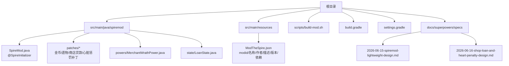
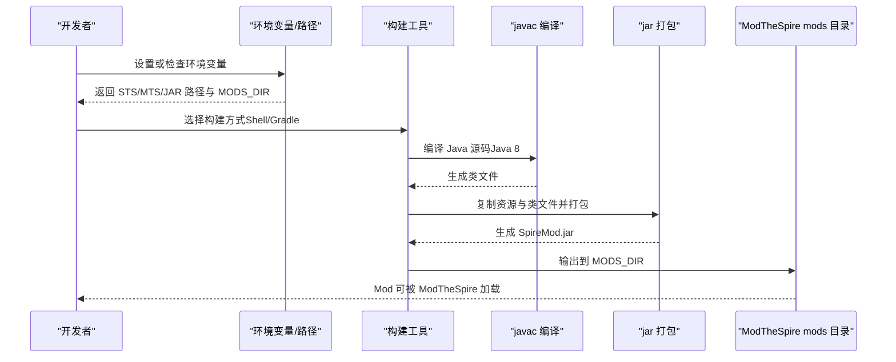
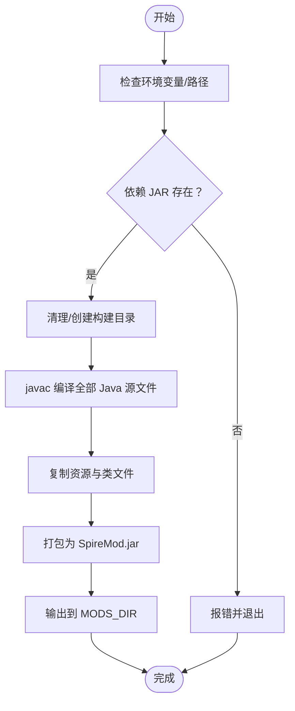
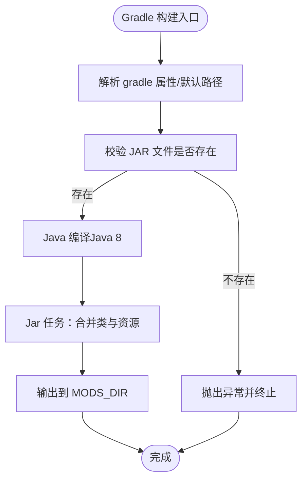
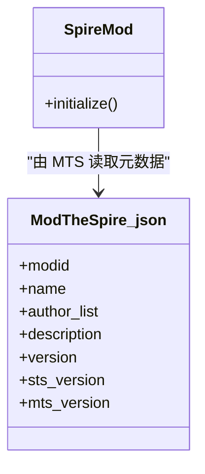
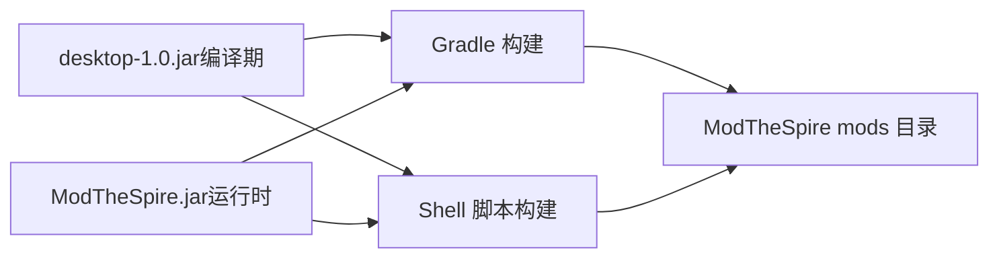

# 快速开始

<cite>
**本文引用的文件**
- [README.md](file://README.md)
- [build.gradle](file://build.gradle)
- [scripts/build-mod.sh](file://scripts/build-mod.sh)
- [src/main/resources/ModTheSpire.json](file://src/main/resources/ModTheSpire.json)
- [src/main/java/spiremod/SpireMod.java](file://src/main/java/spiremod/SpireMod.java)
- [settings.gradle](file://settings.gradle)
- [docs/superpowers/specs/2026-06-15-spiremod-lightweight-design.md](file://docs/superpowers/specs/2026-06-15-spiremod-lightweight-design.md)
- [docs/superpowers/specs/2026-06-16-shop-loan-and-heart-penalty-design.md](file://docs/superpowers/specs/2026-06-16-shop-loan-and-heart-penalty-design.md)
</cite>

## 目录
1. [简介](#简介)
2. [项目结构](#项目结构)
3. [核心组件](#核心组件)
4. [架构总览](#架构总览)
5. [详细组件分析](#详细组件分析)
6. [依赖关系分析](#依赖关系分析)
7. [性能与构建特性](#性能与构建特性)
8. [故障排查指南](#故障排查指南)
9. [结论](#结论)
10. [附录](#附录)

## 简介
本指南面向首次接触 SpireMod 的开发者，帮助你从零完成开发环境搭建、Mod 配置与构建，并提供两种构建方式（Shell 脚本与 Gradle）的对比与适用场景说明。你将学会如何：
- 准备 Java 8、ModTheSpire 与桌面版游戏
- 配置环境变量与路径
- 使用 Shell 脚本或 Gradle 构建并安装 Mod
- 验证安装成功与进行基础功能测试

## 项目结构
该仓库采用“轻量级 Mod”设计，不依赖 BaseMod，仅使用 ModTheSpire 提供的 SpirePatch 能力。核心目录与文件如下：
- 根目录：构建脚本与 Gradle 配置
- src/main/java/spiremod：Mod 初始化入口与若干补丁/能力/状态模块
- src/main/resources：Mod 元数据清单
- scripts：本地构建脚本
- docs：设计文档与 PRD

图表来源
- [settings.gradle:1-2](file://settings.gradle#L1-L2)
- [build.gradle:1-56](file://build.gradle#L1-L56)
- [scripts/build-mod.sh:1-39](file://scripts/build-mod.sh#L1-L39)
- [src/main/resources/ModTheSpire.json:1-10](file://src/main/resources/ModTheSpire.json#L1-L10)
- [src/main/java/spiremod/SpireMod.java:1-11](file://src/main/java/spiremod/SpireMod.java#L1-L11)
- [docs/superpowers/specs/2026-06-15-spiremod-lightweight-design.md:23-41](file://docs/superpowers/specs/2026-06-15-spiremod-lightweight-design.md#L23-L41)

章节来源
- [README.md:1-47](file://README.md#L1-L47)
- [docs/superpowers/specs/2026-06-15-spiremod-lightweight-design.md:23-41](file://docs/superpowers/specs/2026-06-15-spiremod-lightweight-design.md#L23-L41)

## 核心组件
- Mod 初始化入口：通过 @SpireInitializer 注解注册 Mod，确保 ModTheSpire 能正确加载。
- Mod 元数据：ModTheSpire.json 提供 modid、名称、作者、描述、版本以及对 STS 与 MTS 版本的要求。
- 构建系统：提供两套构建方案，分别由 Shell 脚本与 Gradle 驱动，二者均将产物输出至 ModTheSpire 的 mods 目录。

章节来源
- [src/main/java/spiremod/SpireMod.java:1-11](file://src/main/java/spiremod/SpireMod.java#L1-L11)
- [src/main/resources/ModTheSpire.json:1-10](file://src/main/resources/ModTheSpire.json#L1-L10)
- [build.gradle:35-55](file://build.gradle#L35-L55)
- [scripts/build-mod.sh:10-39](file://scripts/build-mod.sh#L10-L39)

## 架构总览
下面的序列图展示了从构建到安装的关键流程，涵盖 Shell 脚本与 Gradle 两种方式的共同目标：校验依赖 JAR、编译源码、打包资源、输出到 ModTheSpire 的 mods 目录。

图表来源
- [scripts/build-mod.sh:10-39](file://scripts/build-mod.sh#L10-L39)
- [build.gradle:14-55](file://build.gradle#L14-L55)

## 详细组件分析

### 环境准备与前置条件
- Java 8：构建脚本与 Gradle 配置均要求 Java 8 工具链。
- ModTheSpire：作为运行时 Patch 框架，必须存在于指定路径。
- 桌面版游戏：需要 desktop-1.0.jar，用于编译期依赖。
- macOS Steam 安装路径：仓库默认指向 Steam 安装目录下的 SlayTheSpire.app/Contents/Resources 下的 JAR 与 mods 目录。

章节来源
- [build.gradle:8-12](file://build.gradle#L8-L12)
- [build.gradle:14-16](file://build.gradle#L14-L16)
- [README.md:38-47](file://README.md#L38-L47)
- [docs/superpowers/specs/2026-06-15-spiremod-lightweight-design.md:100-111](file://docs/superpowers/specs/2026-06-15-spiremod-lightweight-design.md#L100-L111)

### Shell 脚本构建（推荐入门与快速迭代）
- 作用：无需 Gradle，直接使用 javac 与 jar，按约定输出到 ModTheSpire 的 mods 目录。
- 关键步骤：
  - 校验 STS_JAR 与 MTS_JAR 是否存在
  - 创建临时构建目录并编译所有 Java 源文件
  - 复制资源与类文件，打包为 SpireMod.jar
  - 输出到 MODS_DIR
- 环境变量覆盖：可通过设置 STS_JAR、MTS_JAR、MODS_DIR 覆盖默认路径。
- 适用场景：快速验证、无需 Gradle、对路径有特殊需求时。

图表来源
- [scripts/build-mod.sh:10-39](file://scripts/build-mod.sh#L10-L39)

章节来源
- [scripts/build-mod.sh:1-39](file://scripts/build-mod.sh#L1-L39)
- [README.md:13-32](file://README.md#L13-L32)

### Gradle 构建（适合长期工程化）
- 作用：通过 Gradle 统一管理依赖与构建流程，支持属性覆盖与多平台适配。
- 关键点：
  - Java Toolchain 指定 Java 8
  - 默认依赖路径来自用户主目录下的 Steam 安装位置
  - 通过 gradle 属性覆盖默认路径
  - Jar 任务将产物输出到 MODS_DIR
- 适用场景：需要更规范的构建流程、团队协作、CI/CD 或未来扩展。

图表来源
- [build.gradle:14-55](file://build.gradle#L14-L55)

章节来源
- [build.gradle:1-56](file://build.gradle#L1-L56)
- [README.md:34-36](file://README.md#L34-L36)

### Mod 元数据与初始化入口
- Mod 元数据：ModTheSpire.json 包含 modid、名称、作者、描述、版本及对 STS/MTS 版本的要求。
- 初始化入口：@SpireInitializer 注解的 SpireMod 类负责注册 Mod，确保 ModTheSpire 能识别并加载。

图表来源
- [src/main/java/spiremod/SpireMod.java:1-11](file://src/main/java/spiremod/SpireMod.java#L1-L11)
- [src/main/resources/ModTheSpire.json:1-10](file://src/main/resources/ModTheSpire.json#L1-L10)

章节来源
- [src/main/resources/ModTheSpire.json:1-10](file://src/main/resources/ModTheSpire.json#L1-L10)
- [src/main/java/spiremod/SpireMod.java:1-11](file://src/main/java/spiremod/SpireMod.java#L1-L11)

### 构建方式对比与选择建议
- Shell 脚本构建
  - 优点：简单直接、无需 Gradle、易于理解与调试
  - 适用：个人快速验证、路径特殊、无需 CI/CD
- Gradle 构建
  - 优点：工程化程度高、可扩展、属性覆盖灵活
  - 适用：团队协作、未来接入更多自动化流程

章节来源
- [README.md:13-36](file://README.md#L13-L36)
- [build.gradle:1-56](file://build.gradle#L1-L56)
- [scripts/build-mod.sh:1-39](file://scripts/build-mod.sh#L1-L39)

## 依赖关系分析
- 运行时依赖：ModTheSpire（Patch 框架）
- 编译期依赖：desktop-1.0.jar（游戏类）
- 两者均通过环境变量或默认路径定位，最终输出到 ModTheSpire 的 mods 目录

图表来源
- [build.gradle:14-29](file://build.gradle#L14-L29)
- [scripts/build-mod.sh:10-13](file://scripts/build-mod.sh#L10-L13)

章节来源
- [build.gradle:14-29](file://build.gradle#L14-L29)
- [scripts/build-mod.sh:10-13](file://scripts/build-mod.sh#L10-L13)

## 性能与构建特性
- Java 8 工具链：确保兼容性与最小化依赖
- 轻量级设计：不引入 BaseMod，降低构建与运行成本
- 输出路径固定：统一输出到 ModTheSpire 的 mods 目录，便于加载

章节来源
- [build.gradle:8-12](file://build.gradle#L8-L12)
- [docs/superpowers/specs/2026-06-15-spiremod-lightweight-design.md:43-47](file://docs/superpowers/specs/2026-06-15-spiremod-lightweight-design.md#L43-L47)

## 故障排查指南
- 依赖 JAR 不存在
  - 现象：构建失败并提示缺少 desktop-1.0.jar 或 ModTheSpire.jar
  - 解决：确认游戏与 ModTheSpire 的安装路径；通过环境变量覆盖默认路径
- macOS 路径错误
  - 现象：Mod 未出现在 ModTheSpire 的 mods 目录
  - 解决：确保输出到 SlayTheSpire.app/Contents/Resources/mods/，而非外层目录
- 版本不匹配
  - 现象：Mod 无法加载或运行时报错
  - 解决：核对 ModTheSpire.json 中的 STS/MTS 版本要求

章节来源
- [scripts/build-mod.sh:15-23](file://scripts/build-mod.sh#L15-L23)
- [build.gradle:44-54](file://build.gradle#L44-L54)
- [README.md:23-47](file://README.md#L23-L47)
- [src/main/resources/ModTheSpire.json:7-8](file://src/main/resources/ModTheSpire.json#L7-L8)

## 结论
通过本指南，你可以：
- 明确开发环境与前置条件
- 选择合适的构建方式（Shell 脚本或 Gradle）
- 正确配置环境变量与路径
- 成功安装并验证 Mod 的基本功能

## 附录

### 快速开始步骤清单
- 准备 Java 8、ModTheSpire 与桌面版游戏
- 克隆仓库并打开终端
- 选择构建方式：
  - Shell 脚本：执行脚本并根据需要设置环境变量
  - Gradle：使用 Gradle 属性覆盖路径并执行构建
- 启动 ModTheSpire 并验证 Mod 是否加载
- 进行基础功能测试（见下一节）

章节来源
- [README.md:13-32](file://README.md#L13-L32)
- [build.gradle:18-20](file://build.gradle#L18-L20)
- [scripts/build-mod.sh:10-13](file://scripts/build-mod.sh#L10-L13)

### 验证安装与基础功能测试
- 启动游戏并进入 Mod 菜单，确认 Mod 已启用
- 新开一局，验证：
  - 金币在基础值上增加了 200
  - 遗物栏包含会员卡、黑星等原版物品
  - 读档时不重复获得
- 如已实现商店贷款与心脏惩罚功能，可在商店中进行贷款/还款，并在带债进入心脏战时观察惩罚效果

章节来源
- [docs/superpowers/specs/2026-06-15-spiremod-lightweight-design.md:86-91](file://docs/superpowers/specs/2026-06-15-spiremod-lightweight-design.md#L86-L91)
- [docs/superpowers/specs/2026-06-16-shop-loan-and-heart-penalty-design.md:207-221](file://docs/superpowers/specs/2026-06-16-shop-loan-and-heart-penalty-design.md#L207-L221)