# 技术架构

<cite>
**本文引用的文件**
- [README.md](file://README.md)
- [SpireMod.java](file://src/main/java/spiremod/SpireMod.java)
- [GoldPatch.java](file://src/main/java/spiremod/patches/GoldPatch.java)
- [RelicPatch.java](file://src/main/java/spiremod/patches/RelicPatch.java)
- [ShopLoanPatch.java](file://src/main/java/spiremod/patches/ShopLoanPatch.java)
- [HeartLoanPenaltyPatch.java](file://src/main/java/spiremod/patches/HeartLoanPenaltyPatch.java)
- [LoanSavePatch.java](file://src/main/java/spiremod/patches/LoanSavePatch.java)
- [MerchantWrathPower.java](file://src/main/java/spiremod/powers/MerchantWrathPower.java)
- [LoanState.java](file://src/main/java/spiremod/state/LoanState.java)
- [ModTheSpire.json](file://src/main/resources/ModTheSpire.json)
- [build.gradle](file://build.gradle)
- [settings.gradle](file://settings.gradle)
</cite>

## 更新摘要
**变更内容**
- RelicPatch 补丁系统新增钥匙发放逻辑，通过 Settings 类设置 hasRubyKey、hasEmeraldKey、hasSapphireKey 标志位
- 扩展了初始遗物发放功能，解锁 Neow 宝箱的钥匙系统
- 增强了补丁系统的架构能力，支持更复杂的初始状态配置

## 目录
1. [简介](#简介)
2. [项目结构](#项目结构)
3. [核心组件](#核心组件)
4. [架构总览](#架构总览)
5. [详细组件分析](#详细组件分析)
6. [依赖关系分析](#依赖关系分析)
7. [性能与可维护性考量](#性能与可维护性考量)
8. [故障排查指南](#故障排查指南)
9. [结论](#结论)
10. [附录](#附录)

## 简介
本项目是一个基于 ModTheSpire 的轻量级杀戮尖塔 Mod，目标是在每局新游戏开始时为玩家自动提供初始资源，并引入"贷款"玩法与"心脏惩罚"机制。项目采用纯 SpirePatch 设计，不依赖 BaseMod，以最小化外部依赖、降低复杂度为目标，确保构建与运行稳定可靠。

- 主要特性
  - 新局启动时自动获得固定金币与一组起始遗物
  - **新增** 开局自动发放红宝石、绿宝石、蓝宝石钥匙，解锁 Neow 宝箱
  - 引入贷款/还款 UI 与全局债务状态管理
  - 贷款状态持久化存储，支持跨运行数据同步
  - 在心脏战中根据债务施加属性惩罚与持续伤害 Debuff

- 技术路线
  - 使用 @SpireInitializer 标记主入口类
  - 通过 @SpirePatch 注解在关键游戏流程节点注入逻辑
  - 使用轻量级单例式 LoanState 管理全局状态
  - 自定义 MerchantWrathPower 实现持续伤害效果
  - 通过文件系统实现贷款状态的持久化存储

**章节来源**
- [README.md:1-47](file://README.md#L1-L47)

## 项目结构
项目采用按职责分层的目录组织方式：
- src/main/java/spiremod：核心 Java 源码
  - SpireMod.java：Mod 初始化入口
  - patches/：所有 SpirePatch 补丁集合（新增 LoanSavePatch）
  - powers/：自定义能力（Power）实现
  - state/：全局状态管理
- src/main/resources：Mod 元数据与配置
  - ModTheSpire.json：Mod 清单与版本信息
- build.gradle/settings.gradle：Gradle 构建配置
- scripts/build-mod.sh：本地构建脚本

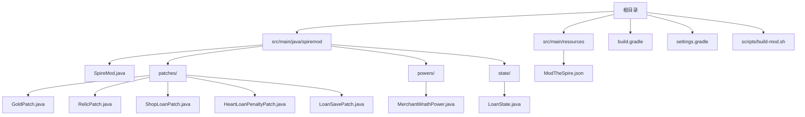

**图表来源**
- [SpireMod.java:1-11](file://src/main/java/spiremod/SpireMod.java#L1-L11)
- [GoldPatch.java:1-59](file://src/main/java/spiremod/patches/GoldPatch.java#L1-L59)
- [RelicPatch.java:1-52](file://src/main/java/spiremod/patches/RelicPatch.java#L1-L52)
- [ShopLoanPatch.java:1-203](file://src/main/java/spiremod/patches/ShopLoanPatch.java#L1-L203)
- [HeartLoanPenaltyPatch.java:1-41](file://src/main/java/spiremod/patches/HeartLoanPenaltyPatch.java#L1-L41)
- [LoanSavePatch.java:1-94](file://src/main/java/spiremod/patches/LoanSavePatch.java#L1-L94)
- [MerchantWrathPower.java:1-39](file://src/main/java/spiremod/powers/MerchantWrathPower.java#L1-L39)
- [LoanState.java:1-60](file://src/main/java/spiremod/state/LoanState.java#L1-L60)
- [ModTheSpire.json:1-10](file://src/main/resources/ModTheSpire.json#L1-L10)

**章节来源**
- [settings.gradle:1-2](file://settings.gradle#L1-L2)

## 核心组件
- 主入口类 SpireMod
  - 通过 @SpireInitializer 标识，ModTheSpire 启动时调用 initialize 方法加载 Mod
- 补丁模块（Patches）
  - GoldPatch：在角色初始化阶段增加金币并重置贷款状态
  - **更新** RelicPatch：在开局发放一组起始遗物，**新增** 自动发放红宝石、绿宝石、蓝宝石钥匙
  - ShopLoanPatch：在商店界面渲染贷款/还款按钮，处理点击与状态显示
  - HeartLoanPenaltyPatch：在心脏战前施加属性惩罚与 MerchantWrathPower
  - **新增** LoanSavePatch：负责贷款状态的持久化存储与恢复
- 能力系统（Powers）
  - MerchantWrathPower：回合开始造成固定伤害
- 状态管理（State）
  - LoanState：全局贷款状态，提供借贷/还款/上限检查等能力

**章节来源**
- [SpireMod.java:5-10](file://src/main/java/spiremod/SpireMod.java#L5-L10)
- [GoldPatch.java:9-38](file://src/main/java/spiremod/patches/GoldPatch.java#L9-L38)
- [RelicPatch.java:18-37](file://src/main/java/spiremod/patches/RelicPatch.java#L18-L37)
- [ShopLoanPatch.java:17-202](file://src/main/java/spiremod/patches/ShopLoanPatch.java#L17-L202)
- [HeartLoanPenaltyPatch.java:13-40](file://src/main/java/spiremod/patches/HeartLoanPenaltyPatch.java#L13-L40)
- [LoanSavePatch.java:11-94](file://src/main/java/spiremod/patches/LoanSavePatch.java#L11-L94)
- [MerchantWrathPower.java:10-38](file://src/main/java/spiremod/powers/MerchantWrathPower.java#L10-L38)
- [LoanState.java:5-55](file://src/main/java/spiremod/state/LoanState.java#L5-L55)

## 架构总览
整体架构遵循"轻量级 + 分层 + 补丁驱动 + 持久化存储"的设计原则：
- 层次划分
  - 入口层：SpireMod 提供初始化入口
  - 补丁层：围绕游戏关键流程节点注入逻辑（新增持久化补丁）
  - 能力层：定义并应用自定义效果
  - 状态层：集中管理全局状态
- 控制流
  - Mod 初始化 → 角色初始化（金币+重置贷款）→ 开局遗物发放（**新增钥匙发放**）→ 商店贷款/还款交互 → 心脏战惩罚 → 状态持久化
- 数据流
  - LoanState 作为单一事实来源，被多个补丁与能力读写；UI 与逻辑通过补丁协调；持久化层通过文件系统实现跨运行数据同步

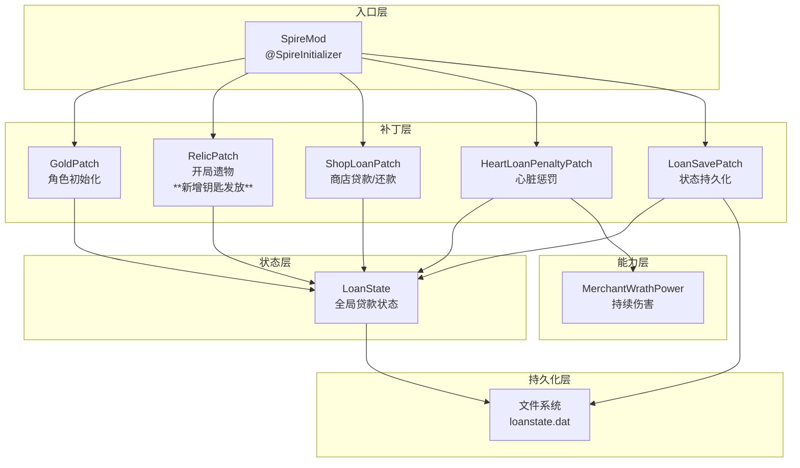

**图表来源**
- [SpireMod.java:5-10](file://src/main/java/spiremod/SpireMod.java#L5-L10)
- [GoldPatch.java:9-38](file://src/main/java/spiremod/patches/GoldPatch.java#L9-L38)
- [RelicPatch.java:18-37](file://src/main/java/spiremod/patches/RelicPatch.java#L18-L37)
- [ShopLoanPatch.java:17-202](file://src/main/java/spiremod/patches/ShopLoanPatch.java#L17-L202)
- [HeartLoanPenaltyPatch.java:13-40](file://src/main/java/spiremod/patches/HeartLoanPenaltyPatch.java#L13-L40)
- [LoanSavePatch.java:11-94](file://src/main/java/spiremod/patches/LoanSavePatch.java#L11-L94)
- [MerchantWrathPower.java:10-38](file://src/main/java/spiremod/powers/MerchantWrathPower.java#L10-L38)
- [LoanState.java:5-55](file://src/main/java/spiremod/state/LoanState.java#L5-L55)

## 详细组件分析

### 主入口类 SpireMod
- 职责
  - 通过 @SpireInitializer 标识，向 ModTheSpire 注册 Mod
  - initialize 方法用于实例化 Mod 并触发后续补丁注册
- 设计考量
  - 轻量级：仅包含最少必要逻辑，避免引入复杂初始化流程
  - 易于集成：与 ModTheSpire 的约定一致，便于工具链识别

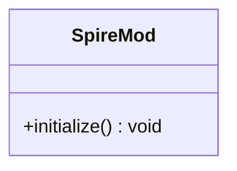

**图表来源**
- [SpireMod.java:5-10](file://src/main/java/spiremod/SpireMod.java#L5-L10)

**章节来源**
- [SpireMod.java:5-10](file://src/main/java/spiremod/SpireMod.java#L5-L10)

### 补丁系统与生命周期

#### 补丁工作原理
- 注解驱动
  - @SpirePatch 指定目标类与方法，ModTheSpire 在运行时扫描并注入
  - 支持多种注入点（如 Postfix），在目标方法执行后插入逻辑
- 生命周期管理
  - 补丁在 Mod 初始化后由 ModTheSpire 自动注册
  - 补丁逻辑与游戏状态解耦，通过全局状态或参数传递数据

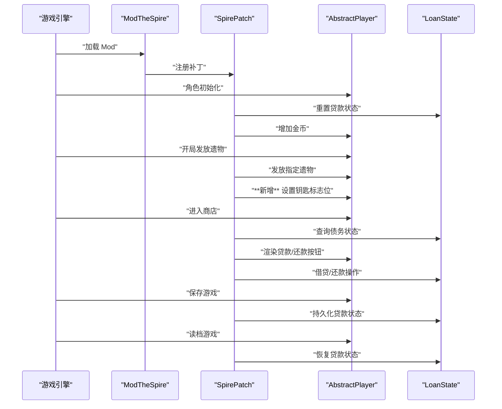

**图表来源**
- [GoldPatch.java:9-38](file://src/main/java/spiremod/patches/GoldPatch.java#L9-L38)
- [RelicPatch.java:18-37](file://src/main/java/spiremod/patches/RelicPatch.java#L18-L37)
- [ShopLoanPatch.java:17-202](file://src/main/java/spiremod/patches/ShopLoanPatch.java#L17-L202)
- [LoanSavePatch.java:23-78](file://src/main/java/spiremod/patches/LoanSavePatch.java#L23-L78)
- [LoanState.java:14-54](file://src/main/java/spiremod/state/LoanState.java#L14-L54)

**章节来源**
- [GoldPatch.java:9-38](file://src/main/java/spiremod/patches/GoldPatch.java#L9-L38)
- [RelicPatch.java:18-37](file://src/main/java/spiremod/patches/RelicPatch.java#L18-L37)
- [ShopLoanPatch.java:17-202](file://src/main/java/spiremod/patches/ShopLoanPatch.java#L17-L202)
- [HeartLoanPenaltyPatch.java:13-40](file://src/main/java/spiremod/patches/HeartLoanPenaltyPatch.java#L13-L40)
- [LoanSavePatch.java:11-94](file://src/main/java/spiremod/patches/LoanSavePatch.java#L11-L94)

#### 代码注入机制
- 目标定位
  - 通过 @SpirePatch(clz = ..., method = ...) 精确绑定到目标类与方法
- 执行时机
  - Postfix：在目标方法返回后执行，适合副作用注入（如修改金币、添加遗物）
- 输入输出
  - 补丁通过参数访问目标对象状态（如 AbstractPlayer），并通过全局状态（LoanState）进行跨模块通信

**章节来源**
- [GoldPatch.java:9-38](file://src/main/java/spiremod/patches/GoldPatch.java#L9-L38)
- [RelicPatch.java:18-37](file://src/main/java/spiremod/patches/RelicPatch.java#L18-L37)
- [ShopLoanPatch.java:17-202](file://src/main/java/spiremod/patches/ShopLoanPatch.java#L17-L202)

### 状态管理：LoanState
- 单例式设计
  - 私有构造器防止实例化，静态字段与方法集中管理全局状态
- 功能边界
  - 债务上限、当前债务、借贷/还款能力、是否欠债判断
- 与补丁协作
  - GoldPatch 在开局重置债务
  - ShopLoanPatch 读取/更新债务状态
  - HeartLoanPenaltyPatch 根据债务施加惩罚

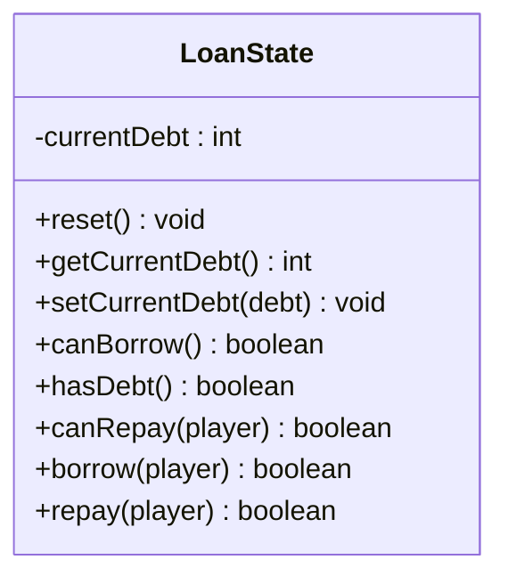

**图表来源**
- [LoanState.java:5-60](file://src/main/java/spiremod/state/LoanState.java#L5-L60)

**章节来源**
- [LoanState.java:5-60](file://src/main/java/spiremod/state/LoanState.java#L5-L60)

### 贷款持久化系统

#### 文件存储方案
- 存储格式：纯文本文件，仅存储当前债务数值
- 文件命名：loanstate.dat
- 存储位置：通过反射调用 SaveHelper.getSaveDir() 获取游戏存档目录
- 存储策略：
  - 存档时：将当前债务写入文件，无债务时删除文件避免残留
  - 读档时：从文件读取债务值，文件不存在则重置状态

#### 反射API访问模式
- 通过反射访问 SaveHelper.getSaveDir()（私有方法）
- 使用 Method.setAccessible(true) 允许访问私有成员
- 异常处理：捕获所有反射异常并回退到安全状态

#### 跨运行数据同步机制
- 写入时机：SaveHelper.saveIfAppropriate 后置补丁
- 读取时机：AbstractDungeon.loadSave 后置补丁
- 安全性：文件不存在时自动重置，解析失败时回退到初始状态
- 一致性：新局启动时删除残留文件，防止旧数据污染

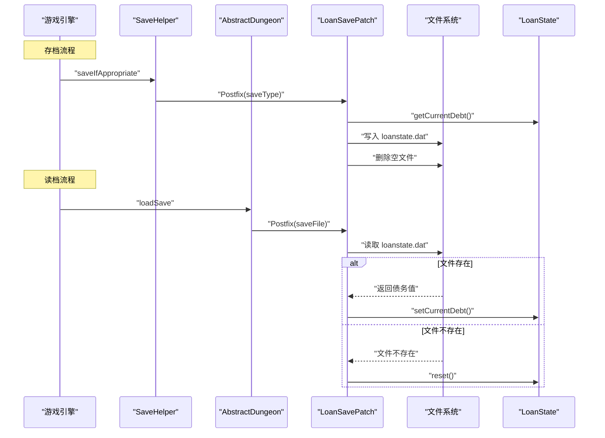

**图表来源**
- [LoanSavePatch.java:23-78](file://src/main/java/spiremod/patches/LoanSavePatch.java#L23-L78)

**章节来源**
- [LoanSavePatch.java:11-94](file://src/main/java/spiremod/patches/LoanSavePatch.java#L11-L94)

### 能力系统：MerchantWrathPower
- 设计要点
  - 继承 AbstractPower，定义 Debuff 类型与回合开始触发逻辑
  - 使用内置图片资源简化视觉表现
- 与贷款系统的联动
  - 在心脏战中若存在债务，则施加该能力，形成"债务惩罚闭环"

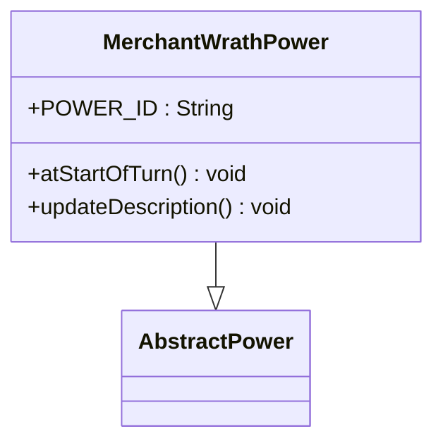

**图表来源**
- [MerchantWrathPower.java:10-38](file://src/main/java/spiremod/powers/MerchantWrathPower.java#L10-L38)

**章节来源**
- [MerchantWrathPower.java:10-38](file://src/main/java/spiremod/powers/MerchantWrathPower.java#L10-L38)
- [HeartLoanPenaltyPatch.java:18-39](file://src/main/java/spiremod/patches/HeartLoanPenaltyPatch.java#L18-L39)

### 补丁模块详解

#### GoldPatch：开局金币与贷款状态重置
- 注入点：AbstractPlayer.initializeClass
- 行为：重置贷款状态并增加固定金币
- 防护：仅在新局启动时生效，避免读档重复发放
- **更新**：新增反射调用删除残留贷款文件，防止跨运行数据污染

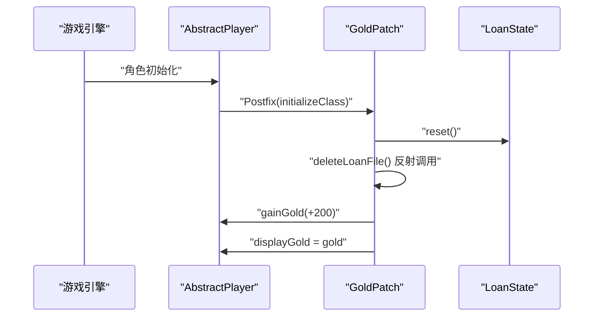

**图表来源**
- [GoldPatch.java:9-38](file://src/main/java/spiremod/patches/GoldPatch.java#L9-L38)
- [GoldPatch.java:43-57](file://src/main/java/spiremod/patches/GoldPatch.java#L43-L57)
- [LoanState.java:14-20](file://src/main/java/spiremod/state/LoanState.java#L14-L20)

**章节来源**
- [GoldPatch.java:9-38](file://src/main/java/spiremod/patches/GoldPatch.java#L9-L38)
- [GoldPatch.java:43-57](file://src/main/java/spiremod/patches/GoldPatch.java#L43-L57)

#### RelicPatch：开局遗物发放与钥匙系统
- 注入点：AbstractPlayer.initializeStarterRelics
- 行为：逐项检查并发放指定遗物，避免重复
- **新增** 钥匙发放逻辑：设置 Settings.hasRubyKey、Settings.hasEmeraldKey、Settings.hasSapphireKey 标志位
- 集成：与全局状态协同，确保只在新局发放

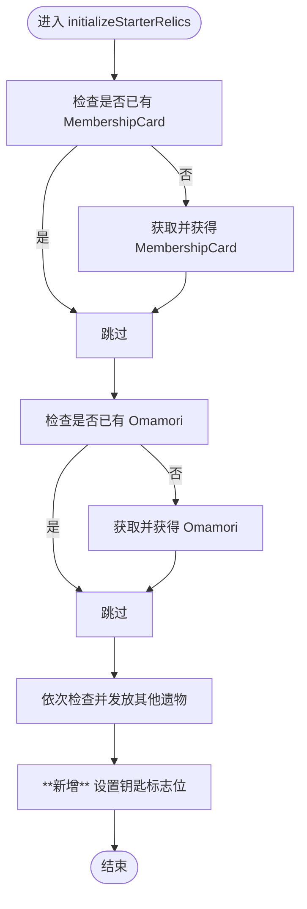

**图表来源**
- [RelicPatch.java:18-37](file://src/main/java/spiremod/patches/RelicPatch.java#L18-L37)

**章节来源**
- [RelicPatch.java:18-37](file://src/main/java/spiremod/patches/RelicPatch.java#L18-L37)

#### ShopLoanPatch：商店贷款/还款 UI 与交互
- 注入点
  - open：初始化按钮 Hitbox 与位置
  - update：处理鼠标点击与交互逻辑
  - render：绘制债务状态与按钮
- 交互规则
  - 贷款：非最终幕且未达上限时可用
  - 还款：有债务且金币足够时可用
  - 最终幕禁用贷款
- 与状态层协作：读取/更新 LoanState

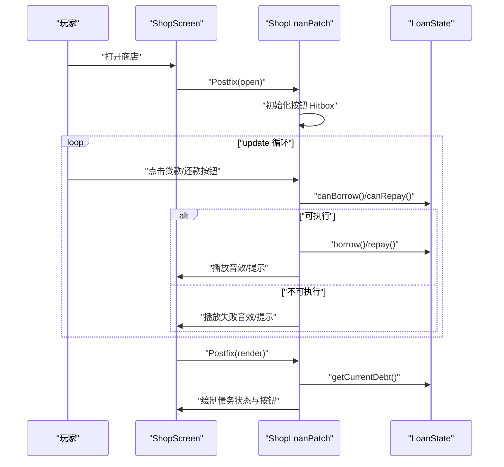

**图表来源**
- [ShopLoanPatch.java:17-202](file://src/main/java/spiremod/patches/ShopLoanPatch.java#L17-L202)
- [LoanState.java:14-54](file://src/main/java/spiremod/state/LoanState.java#L14-L54)

**章节来源**
- [ShopLoanPatch.java:17-202](file://src/main/java/spiremod/patches/ShopLoanPatch.java#L17-L202)

#### HeartLoanPenaltyPatch：心脏战惩罚
- 注入点：CorruptHeart.usePreBattleAction
- 行为：若存在债务，施加力量/敏捷惩罚与 MerchantWrathPower
- 设计意图：将"债务"转化为游戏体验中的持续压力

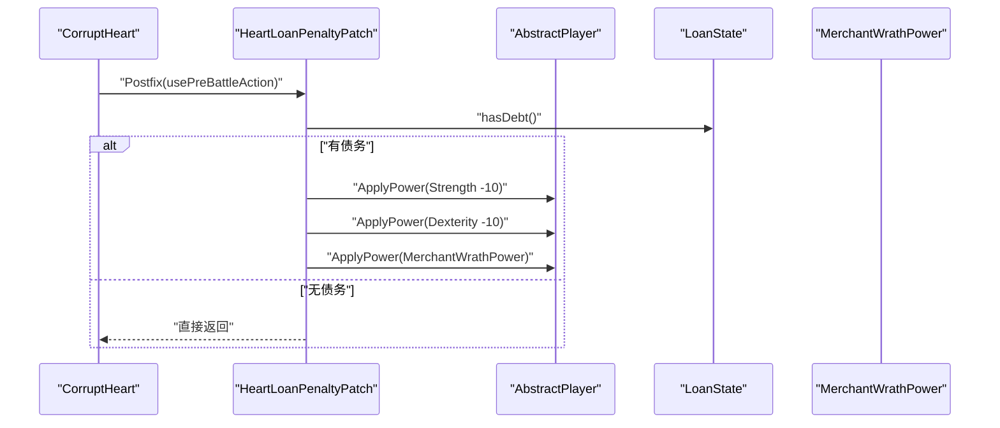

**图表来源**
- [HeartLoanPenaltyPatch.java:13-40](file://src/main/java/spiremod/patches/HeartLoanPenaltyPatch.java#L13-L40)
- [MerchantWrathPower.java:10-38](file://src/main/java/spiremod/powers/MerchantWrathPower.java#L10-L38)
- [LoanState.java:26-28](file://src/main/java/spiremod/state/LoanState.java#L26-L28)

**章节来源**
- [HeartLoanPenaltyPatch.java:13-40](file://src/main/java/spiremod/patches/HeartLoanPenaltyPatch.java#L13-L40)
- [MerchantWrathPower.java:10-38](file://src/main/java/spiremod/powers/MerchantWrathPower.java#L10-L38)

## 依赖关系分析
- 外部依赖
  - ModTheSpire：运行时补丁框架
  - desktop-1.0.jar：游戏类库（编译期）
- 内部依赖
  - 补丁层依赖状态层（LoanState）
  - 能力层依赖状态层（间接通过补丁触发）
  - **新增** 持久化层依赖文件系统
  - **新增** RelicPatch 依赖 Settings 类进行钥匙状态管理

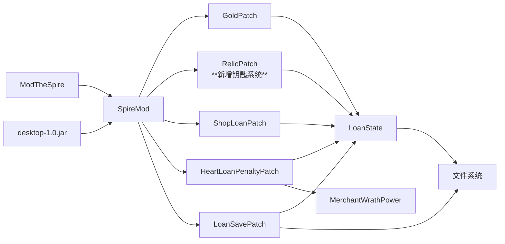

**图表来源**
- [build.gradle:26-29](file://build.gradle#L26-L29)
- [SpireMod.java:3](file://src/main/java/spiremod/SpireMod.java#L3)
- [GoldPatch.java:3](file://src/main/java/spiremod/patches/GoldPatch.java#L3)
- [RelicPatch.java:16](file://src/main/java/spiremod/patches/RelicPatch.java#L16)
- [ShopLoanPatch.java:5](file://src/main/java/spiremod/patches/ShopLoanPatch.java#L5)
- [HeartLoanPenaltyPatch.java:3](file://src/main/java/spiremod/patches/HeartLoanPenaltyPatch.java#L3)
- [LoanSavePatch.java:3](file://src/main/java/spiremod/patches/LoanSavePatch.java#L3)
- [MerchantWrathPower.java:8](file://src/main/java/spiremod/powers/MerchantWrathPower.java#L8)
- [LoanState.java:3](file://src/main/java/spiremod/state/LoanState.java#L3)

**章节来源**
- [build.gradle:26-29](file://build.gradle#L26-L29)
- [ModTheSpire.json:1-10](file://src/main/resources/ModTheSpire.json#L1-L10)

## 性能与可维护性考量
- 轻量级设计
  - 不依赖 BaseMod，减少运行时开销与潜在冲突
  - 仅在关键节点注入逻辑，避免高频回调
- 单例模式
  - LoanState 以静态方法提供统一状态访问，降低对象创建成本
- 工厂模式
  - RelicPatch 中通过 RelicLibrary 获取并复制遗物，遵循"按需创建"的工厂思想
- **新增** 持久化优化
  - 文件I/O操作仅在存档/读档时触发，不影响游戏正常流程性能
  - 反射调用缓存结果，减少重复反射开销
- **新增** 钥匙系统优化
  - Settings 类标志位设置为一次性操作，避免重复检查开销
  - 与遗物发放流程合并，减少额外的补丁注入点
- 可测试性
  - 将业务逻辑集中在补丁与状态层，便于单元测试与回归验证

## 故障排查指南
- Mod 未加载
  - 检查 ModTheSpire.json 的 modid 与名称是否正确
  - 确认 Mod 包含在 ModTheSpire 的 mods 目录
- 金币/遗物未生效
  - 确认补丁注入点是否匹配目标类与方法
  - 验证新局启动而非读档场景
- **新增** 钥匙未解锁 Neow 宝箱
  - 检查 RelicPatch 是否正确设置 Settings.hasRubyKey、Settings.hasEmeraldKey、Settings.hasSapphireKey
  - 确认补丁在 AbstractPlayer.initializeStarterRelics 注入点正确执行
  - 验证 Settings 类的标志位是否被游戏引擎正确读取
- 商店贷款按钮无效
  - 检查是否处于最终幕（禁用贷款）
  - 确认债务未达上限且金币充足
- 心脏战无惩罚
  - 确认存在债务状态
  - 检查 MerchantWrathPower 是否被成功应用
- **新增** 贷款状态丢失
  - 检查 loanstate.dat 文件是否存在且可读
  - 确认 SaveHelper.getSaveDir() 能够正确获取存档目录
  - 验证文件权限和磁盘空间

**章节来源**
- [README.md:13-47](file://README.md#L13-L47)
- [ShopLoanPatch.java:187-201](file://src/main/java/spiremod/patches/ShopLoanPatch.java#L187-L201)
- [HeartLoanPenaltyPatch.java:20-39](file://src/main/java/spiremod/patches/HeartLoanPenaltyPatch.java#L20-L39)
- [LoanSavePatch.java:83-92](file://src/main/java/spiremod/patches/LoanSavePatch.java#L83-L92)
- [RelicPatch.java:33-36](file://src/main/java/spiremod/patches/RelicPatch.java#L33-L36)

## 结论
本项目通过"轻量级 + 分层 + 补丁驱动 + 持久化存储"的架构，在保证功能完整性的同时最大化可维护性与稳定性。补丁系统以 @SpirePatch 为核心，围绕游戏关键节点注入逻辑；状态层集中管理全局状态；能力系统提供可复用的游戏效果；**新增的贷款持久化系统**通过文件存储和反射API实现了跨运行的数据同步。

**最新架构增强**：RelicPatch 补丁系统现已包含钥匙发放逻辑，通过 Settings 类设置 hasRubyKey、hasEmeraldKey、hasSapphireKey 标志位，这不仅扩展了初始状态配置能力，还为玩家解锁 Neow 宝箱提供了便利。这一增强体现了补丁系统的灵活性和可扩展性，能够在不破坏现有架构的前提下添加新的功能模块。

该设计既满足 ModTheSpire 的运行要求，又为后续扩展（如更多补丁、状态与能力）提供了清晰的演进路径。通过将钥匙系统与现有的遗物发放流程整合，形成了更加完整的新局体验。

## 附录
- 构建与部署
  - Gradle 构建脚本自动将产物输出至 ModTheSpire 的 mods 目录
  - 本地构建脚本支持环境变量覆盖路径
- 版本与元信息
  - Mod 清单包含 modid、名称、作者、描述与依赖版本
- **新增** 持久化文件格式
  - loanstate.dat：纯文本文件，存储整数形式的当前债务值
  - 文件编码：UTF-8
  - 文件权限：读写权限，随游戏存档目录权限设置
- **新增** 钥匙系统配置
  - Settings.hasRubyKey：红宝石钥匙标志位
  - Settings.hasEmeraldKey：绿宝石钥匙标志位  
  - Settings.hasSapphireKey：蓝宝石钥匙标志位
  - 作用：解锁 Neow 宝箱的钥匙系统

**章节来源**
- [build.gradle:35-55](file://build.gradle#L35-L55)
- [ModTheSpire.json:1-10](file://src/main/resources/ModTheSpire.json#L1-L10)
- [README.md:13-47](file://README.md#L13-L47)
- [LoanSavePatch.java:18](file://src/main/java/spiremod/patches/LoanSavePatch.java#L18)
- [RelicPatch.java:33-36](file://src/main/java/spiremod/patches/RelicPatch.java#L33-L36)