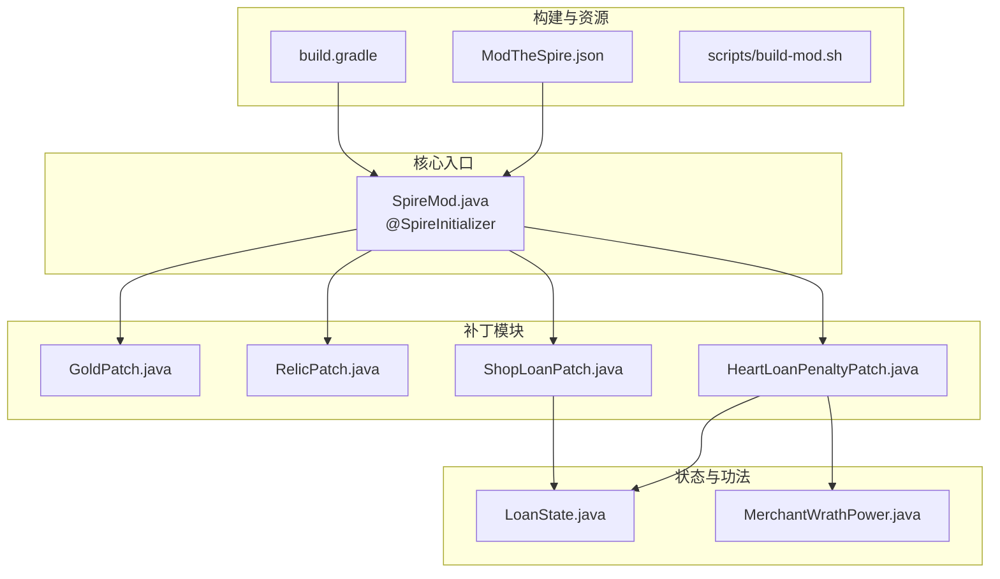
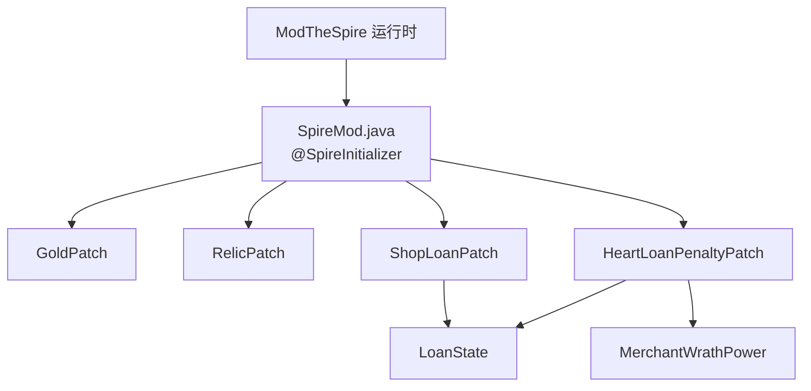
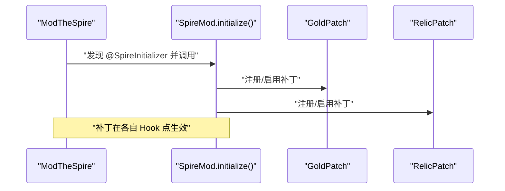
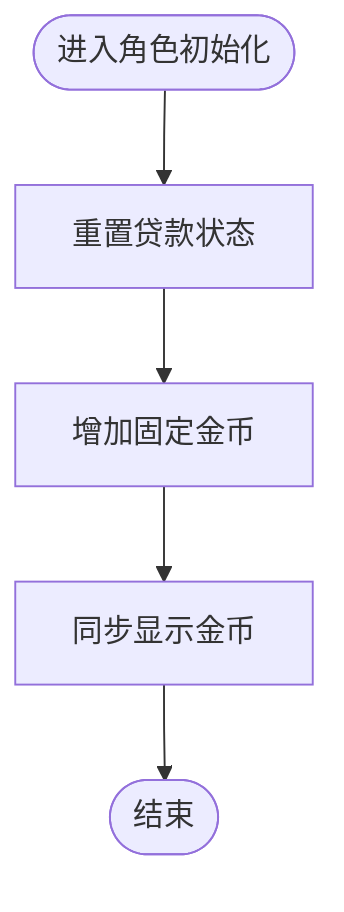
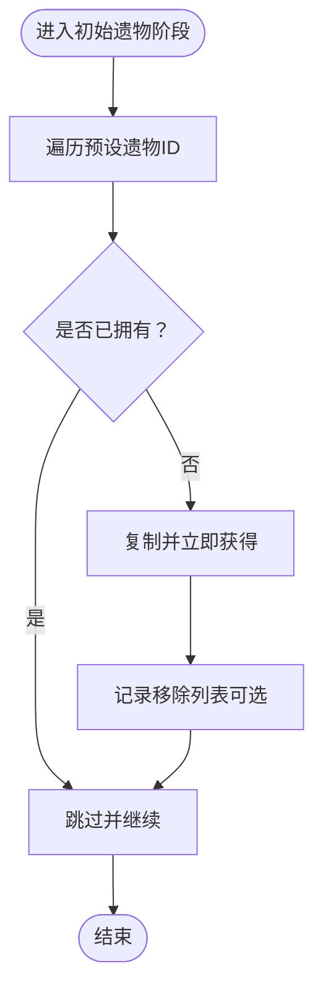
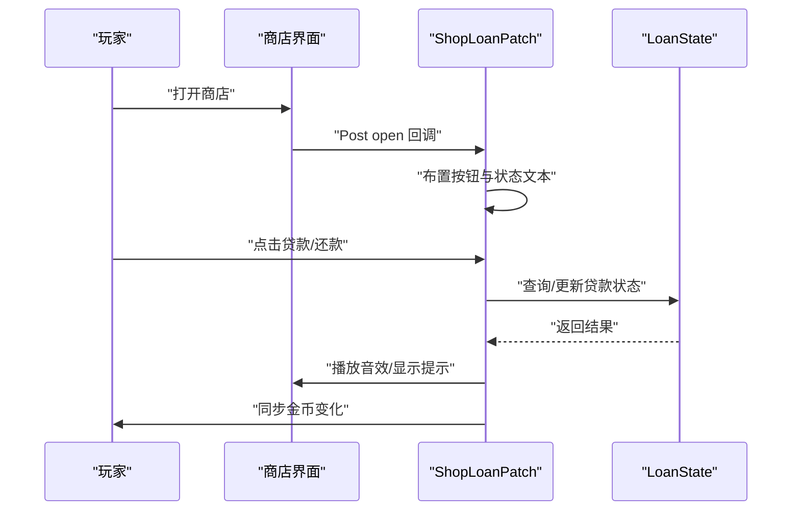
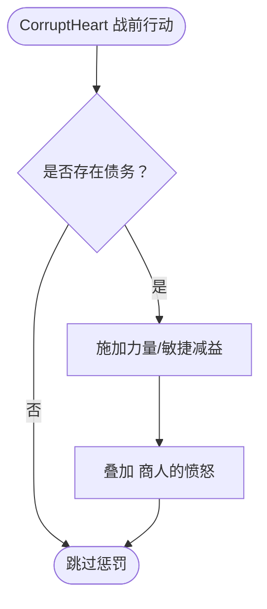
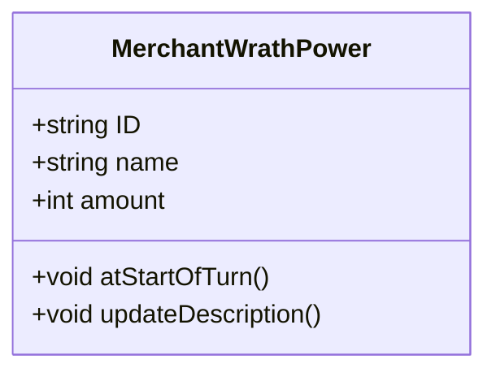
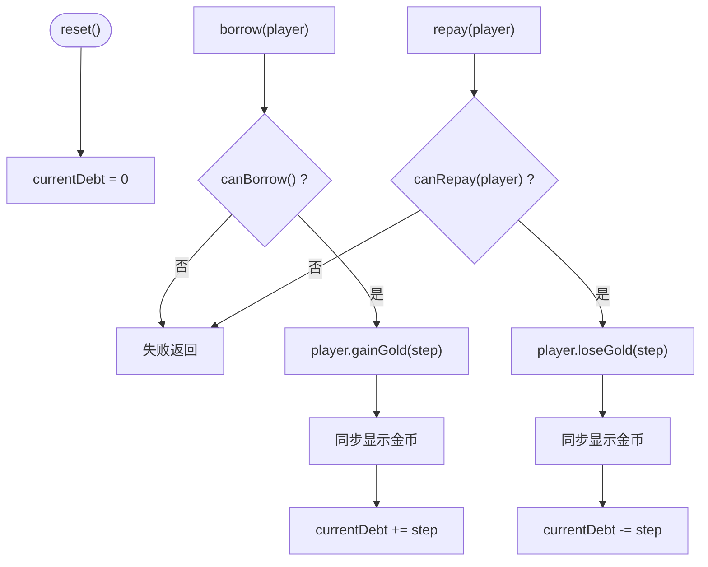
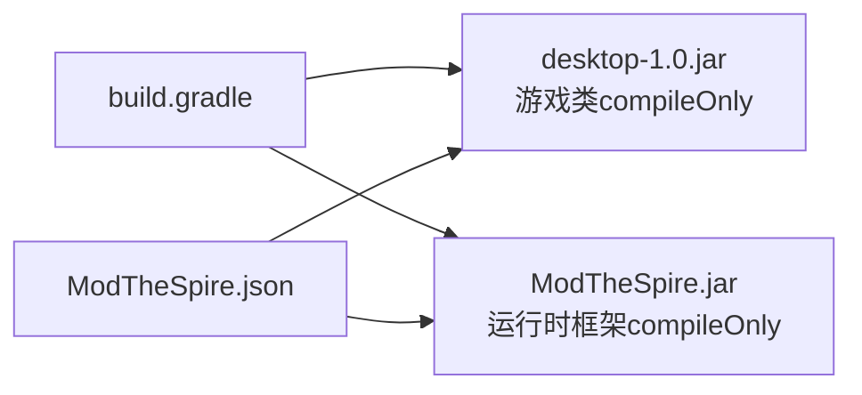

# 整体设计

<cite>
**本文引用的文件**
- [README.md](file://README.md)
- [2026-06-15-spiremod-lightweight-design.md](file://docs/superpowers/specs/2026-06-15-spiremod-lightweight-design.md)
- [build.gradle](file://build.gradle)
- [SpireMod.java](file://src/main/java/spiremod/SpireMod.java)
- [ModTheSpire.json](file://src/main/resources/ModTheSpire.json)
- [GoldPatch.java](file://src/main/java/spiremod/patches/GoldPatch.java)
- [RelicPatch.java](file://src/main/java/spiremod/patches/RelicPatch.java)
- [ShopLoanPatch.java](file://src/main/java/spiremod/patches/ShopLoanPatch.java)
- [HeartLoanPenaltyPatch.java](file://src/main/java/spiremod/patches/HeartLoanPenaltyPatch.java)
- [MerchantWrathPower.java](file://src/main/java/spiremod/powers/MerchantWrathPower.java)
- [LoanState.java](file://src/main/java/spiremod/state/LoanState.java)
</cite>

## 目录
1. [引言](#引言)
2. [项目结构](#项目结构)
3. [核心组件](#核心组件)
4. [架构总览](#架构总览)
5. [详细组件分析](#详细组件分析)
6. [依赖分析](#依赖分析)
7. [性能考量](#性能考量)
8. [故障排查指南](#故障排查指南)
9. [结论](#结论)
10. [附录](#附录)

## 引言
本文件面向希望理解 SpireMod 轻量级 Mod 设计与实现的读者，系统阐述其设计理念、模块化组织、注册机制、初始化流程以及技术权衡。SpireMod 以“最小改动、最大收益”为目标，通过 ModTheSpire 的 Patch 机制对游戏运行时进行安全、可维护的增强，避免引入复杂框架或自定义资源，从而降低学习成本与维护负担。

## 项目结构
SpireMod 采用按职责分层的模块化布局：
- 根级配置与构建：Gradle 构建脚本与本地构建脚本，统一输出到 ModTheSpire 的 mods 目录。
- 资源清单：ModTheSpire.json 提供元数据与版本约束。
- 核心入口：SpireMod.java 使用 @SpireInitializer 注解暴露初始化入口。
- 补丁模块：patches 包含多个细粒度的 SpirePatch，分别作用于金币、遗物、商店贷款交互与心脏战惩罚。
- 功法模块：powers 包含自定义 Debuff 功法 MerchantWrathPower。
- 状态模块：state 提供贷款全局状态管理 LoanState。
- 文档规范：docs/superpowers/specs 下存放设计文档与规范。

图表来源
- [build.gradle:1-56](file://build.gradle#L1-L56)
- [ModTheSpire.json:1-10](file://src/main/resources/ModTheSpire.json#L1-L10)
- [SpireMod.java:1-11](file://src/main/java/spiremod/SpireMod.java#L1-L11)
- [GoldPatch.java:1-34](file://src/main/java/spiremod/patches/GoldPatch.java#L1-L34)
- [RelicPatch.java:1-46](file://src/main/java/spiremod/patches/RelicPatch.java#L1-L46)
- [ShopLoanPatch.java:1-203](file://src/main/java/spiremod/patches/ShopLoanPatch.java#L1-L203)
- [HeartLoanPenaltyPatch.java:1-41](file://src/main/java/spiremod/patches/HeartLoanPenaltyPatch.java#L1-L41)
- [LoanState.java:1-56](file://src/main/java/spiremod/state/LoanState.java#L1-L56)
- [MerchantWrathPower.java:1-39](file://src/main/java/spiremod/powers/MerchantWrathPower.java#L1-L39)

章节来源
- [README.md:1-47](file://README.md#L1-L47)
- [2026-06-15-spiremod-lightweight-design.md:23-41](file://docs/superpowers/specs/2026-06-15-spiremod-lightweight-design.md#L23-L41)
- [build.gradle:14-29](file://build.gradle#L14-L29)

## 核心组件
- 初始化入口与注册
  - @SpireInitializer 注解用于声明主类为 Mod 初始化入口，ModTheSpire 在加载时调用该入口完成注册与初始化。
  - 初始化流程由入口类触发，随后各补丁生效，确保在正确时机注入行为。
- 补丁子系统
  - 金币补丁：在角色初始化阶段增加固定金币，并重置贷款状态，避免读档重复发放。
  - 遗物补丁：在初始遗物阶段追加一组原版遗物，使用“存在即跳过”的策略防止重复。
  - 商店贷款补丁：在商店界面渲染与更新阶段添加贷款/还款按钮，与贷款状态联动。
  - 心脏战惩罚补丁：在 CorruptHeart 战前应用力量/敏捷减益与商人的愤怒 Debuff。
- 状态与功法
  - 贷款状态：集中管理当前债务、上限、借还逻辑与显示同步。
  - 商人的愤怒：回合开始扣除固定生命值的 Debuff 功法，描述文本动态更新。

章节来源
- [SpireMod.java:5-10](file://src/main/java/spiremod/SpireMod.java#L5-L10)
- [GoldPatch.java:9-33](file://src/main/java/spiremod/patches/GoldPatch.java#L9-L33)
- [RelicPatch.java:17-45](file://src/main/java/spiremod/patches/RelicPatch.java#L17-L45)
- [ShopLoanPatch.java:17-202](file://src/main/java/spiremod/patches/ShopLoanPatch.java#L17-L202)
- [HeartLoanPenaltyPatch.java:13-40](file://src/main/java/spiremod/patches/HeartLoanPenaltyPatch.java#L13-L40)
- [MerchantWrathPower.java:10-38](file://src/main/java/spiremod/powers/MerchantWrathPower.java#L10-L38)
- [LoanState.java:5-55](file://src/main/java/spiremod/state/LoanState.java#L5-L55)

## 架构总览
下图展示了 SpireMod 的高层架构与组件交互：入口类负责注册；补丁模块在各自 Hook 点注入行为；状态与功法作为支撑模块被补丁与游戏逻辑间接使用。

图表来源
- [SpireMod.java:3-10](file://src/main/java/spiremod/SpireMod.java#L3-L10)
- [GoldPatch.java:3-33](file://src/main/java/spiremod/patches/GoldPatch.java#L3-L33)
- [RelicPatch.java:3-45](file://src/main/java/spiremod/patches/RelicPatch.java#L3-L45)
- [ShopLoanPatch.java:3-202](file://src/main/java/spiremod/patches/ShopLoanPatch.java#L3-L202)
- [HeartLoanPenaltyPatch.java:3-40](file://src/main/java/spiremod/patches/HeartLoanPenaltyPatch.java#L3-L40)
- [LoanState.java:3-55](file://src/main/java/spiremod/state/LoanState.java#L3-L55)
- [MerchantWrathPower.java:3-38](file://src/main/java/spiremod/powers/MerchantWrathPower.java#L3-L38)

## 详细组件分析

### 初始化与注册机制
- @SpireInitializer 的作用
  - 标记入口类，使 ModTheSpire 能在加载时定位并调用初始化方法，完成 Mod 的注册与生命周期绑定。
- 初始化流程
  - 入口类提供静态 initialize 方法，内部实例化自身，确保补丁模块在运行时可用。
  - 该流程与 ModTheSpire 的扫描与装配机制配合，无需额外注册表或反射配置。

图表来源
- [SpireMod.java:5-10](file://src/main/java/spiremod/SpireMod.java#L5-L10)
- [GoldPatch.java:9-12](file://src/main/java/spiremod/patches/GoldPatch.java#L9-L12)
- [RelicPatch.java:17-20](file://src/main/java/spiremod/patches/RelicPatch.java#L17-L20)

章节来源
- [SpireMod.java:3-10](file://src/main/java/spiremod/SpireMod.java#L3-L10)
- [2026-06-15-spiremod-lightweight-design.md:51-54](file://docs/superpowers/specs/2026-06-15-spiremod-lightweight-design.md#L51-L54)

### 金币增益补丁（GoldPatch）
- Hook 目标：角色初始化阶段，确保仅在新局开始时生效。
- 行为：增加固定金币并同步显示值；同时重置贷款状态，避免跨局债务延续。
- 防护：基于初始化阶段的 Hook，天然避免读档场景重复触发。

图表来源
- [GoldPatch.java:16-32](file://src/main/java/spiremod/patches/GoldPatch.java#L16-L32)

章节来源
- [GoldPatch.java:9-33](file://src/main/java/spiremod/patches/GoldPatch.java#L9-L33)
- [2026-06-15-spiremod-lightweight-design.md:55-59](file://docs/superpowers/specs/2026-06-15-spiremod-lightweight-design.md#L55-L59)

### 初始遗物补丁（RelicPatch）
- Hook 目标：初始遗物初始化阶段。
- 行为：按顺序追加一组原版遗物，若已拥有则跳过，避免重复。
- 防护：通过“存在即跳过”检查，保证新局唯一性。

图表来源
- [RelicPatch.java:22-44](file://src/main/java/spiremod/patches/RelicPatch.java#L22-L44)

章节来源
- [RelicPatch.java:17-45](file://src/main/java/spiremod/patches/RelicPatch.java#L17-L45)
- [2026-06-15-spiremod-lightweight-design.md:61-74](file://docs/superpowers/specs/2026-06-15-spiremod-lightweight-design.md#L61-L74)

### 商店贷款补丁（ShopLoanPatch）
- 功能概览：在商店打开时绘制贷款/还款按钮，点击后根据贷款状态执行借还操作，并播放音效与提示。
- 交互细节：
  - 按钮位置与尺寸适配缩放设置。
  - 鼠标悬停高亮与禁用态颜色区分。
  - 显示当前债务/上限状态文本。
- 规则限制：
  - 最终幕（TheEnding）禁止贷款。
  - 债务不得超过上限。
  - 还款需要足够金币。
- 状态联动：与 LoanState 协作，借还成功后同步玩家金币与显示值。

图表来源
- [ShopLoanPatch.java:46-94](file://src/main/java/spiremod/patches/ShopLoanPatch.java#L46-L94)
- [ShopLoanPatch.java:100-148](file://src/main/java/spiremod/patches/ShopLoanPatch.java#L100-L148)
- [ShopLoanPatch.java:150-185](file://src/main/java/spiremod/patches/ShopLoanPatch.java#L150-L185)
- [LoanState.java:14-54](file://src/main/java/spiremod/state/LoanState.java#L14-L54)

章节来源
- [ShopLoanPatch.java:17-202](file://src/main/java/spiremod/patches/ShopLoanPatch.java#L17-L202)
- [2026-06-15-spiremod-lightweight-design.md:75-77](file://docs/superpowers/specs/2026-06-15-spiremod-lightweight-design.md#L75-L77)

### 心脏战惩罚补丁（HeartLoanPenaltyPatch）
- 触发条件：当玩家对 CorruptHeart 施展战前行动时，且玩家存在未还清的债务。
- 惩罚内容：施加力量与敏捷减益，并叠加“商人的愤怒” Debuff。
- 与贷款系统的耦合：通过 LoanState 查询债务状态，确保惩罚只在有债时生效。

图表来源
- [HeartLoanPenaltyPatch.java:20-39](file://src/main/java/spiremod/patches/HeartLoanPenaltyPatch.java#L20-L39)
- [MerchantWrathPower.java:10-38](file://src/main/java/spiremod/powers/MerchantWrathPower.java#L10-L38)
- [LoanState.java:22-28](file://src/main/java/spiremod/state/LoanState.java#L22-L28)

章节来源
- [HeartLoanPenaltyPatch.java:13-40](file://src/main/java/spiremod/patches/HeartLoanPenaltyPatch.java#L13-L40)
- [MerchantWrathPower.java:10-38](file://src/main/java/spiremod/powers/MerchantWrathPower.java#L10-L38)

### 商人的愤怒功法（MerchantWrathPower）
- 类型：Debuff 功法，回合开始时造成固定生命值损失。
- 特性：非回合制叠加、不可为负、描述文本随数值更新。
- 与贷款系统的关联：作为心脏战惩罚的一部分，体现“债务带来的持续代价”。

图表来源
- [MerchantWrathPower.java:10-38](file://src/main/java/spiremod/powers/MerchantWrathPower.java#L10-L38)

章节来源
- [MerchantWrathPower.java:10-38](file://src/main/java/spiremod/powers/MerchantWrathPower.java#L10-L38)

### 贷款状态（LoanState）
- 职责：集中管理贷款额度、上限、借还规则与与玩家金币的同步。
- 关键点：
  - 债务重置：在新局开始时归零。
  - 借还校验：上限判断、金币充足性。
  - 显示同步：借还后更新显示金币，保持 UI 一致性。

图表来源
- [LoanState.java:14-54](file://src/main/java/spiremod/state/LoanState.java#L14-L54)

章节来源
- [LoanState.java:5-55](file://src/main/java/spiremod/state/LoanState.java#L5-L55)

## 依赖分析
- 运行时依赖
  - ModTheSpire：提供 Patch 框架与运行时注入能力。
  - Slay the Spire 游戏 JAR：提供游戏类与接口，编译期依赖。
- 构建依赖
  - Gradle 插件与工具链：Java 8 工具链、UTF-8 编码。
  - 本地构建脚本：简化输出路径与环境变量覆盖。
- 版本约束
  - ModTheSpire 与游戏版本在清单中明确，确保兼容性。

图表来源
- [build.gradle:26-29](file://build.gradle#L26-L29)
- [ModTheSpire.json:7-8](file://src/main/resources/ModTheSpire.json#L7-L8)

章节来源
- [build.gradle:14-29](file://build.gradle#L14-L29)
- [ModTheSpire.json:1-10](file://src/main/resources/ModTheSpire.json#L1-L10)
- [2026-06-15-spiremod-lightweight-design.md:43-47](file://docs/superpowers/specs/2026-06-15-spiremod-lightweight-design.md#L43-L47)

## 性能考量
- 轻量补丁策略
  - 仅在必要 Hook 点注入行为，避免全局监听与高频轮询，降低运行时开销。
- 状态集中化
  - 将贷款状态收敛至 LoanState，减少分散读写与重复计算。
- UI 绘制与输入
  - 按钮绘制与 Hitbox 更新仅在商店界面生效，避免对其他界面造成影响。
- 编译与打包
  - 通过 Gradle 统一输出到 mods 目录，减少手工部署错误与时间成本。

## 故障排查指南
- 构建失败
  - 检查游戏 JAR 与 ModTheSpire JAR 路径是否正确，必要时通过环境变量覆盖。
  - 确认 mods 目录存在且可写。
- Mod 未加载
  - 确认清单文件中的 modid、名称与版本正确，且与运行时版本匹配。
  - 确保入口类带有 @SpireInitializer 注解且可被扫描。
- 行为异常
  - 新局金币未增加：检查金币补丁 Hook 是否在角色初始化阶段触发。
  - 遗物重复获得：确认“存在即跳过”逻辑是否生效。
  - 商店按钮无效：检查按钮 Hitbox 与输入事件处理是否在商店界面生效。
  - 心脏战无惩罚：确认债务状态与 Hook 条件满足。

章节来源
- [build.gradle:44-54](file://build.gradle#L44-L54)
- [README.md:23-32](file://README.md#L23-L32)
- [ModTheSpire.json:1-10](file://src/main/resources/ModTheSpire.json#L1-L10)
- [GoldPatch.java:28-32](file://src/main/java/spiremod/patches/GoldPatch.java#L28-L32)
- [RelicPatch.java:33-44](file://src/main/java/spiremod/patches/RelicPatch.java#L33-L44)
- [ShopLoanPatch.java:46-94](file://src/main/java/spiremod/patches/ShopLoanPatch.java#L46-L94)
- [HeartLoanPenaltyPatch.java:20-39](file://src/main/java/spiremod/patches/HeartLoanPenaltyPatch.java#L20-L39)

## 结论
SpireMod 以“轻量、清晰、可维护”为核心设计哲学，通过最小化的补丁集合与集中式状态管理，在不引入复杂框架的前提下实现了稳定的 Mod 功能。其模块化布局与严格的 Hook 约束，既保障了性能与稳定性，也为未来扩展提供了清晰的边界与路径。

## 附录
- 本地构建与路径说明
  - 仓库提供本地构建脚本与 Gradle 构建配置，默认输出到 ModTheSpire 的 mods 目录，便于快速验证。
- 设计文档与规范
  - 项目内包含轻量设计说明文档，涵盖项目结构、依赖、Hook 点候选、测试要点与构建细节。

章节来源
- [README.md:13-47](file://README.md#L13-L47)
- [2026-06-15-spiremod-lightweight-design.md:86-111](file://docs/superpowers/specs/2026-06-15-spiremod-lightweight-design.md#L86-L111)