# 组件关系

<cite>
**本文档引用的文件**
- [SpireMod.java](file://src/main/java/spiremod/SpireMod.java)
- [LoanState.java](file://src/main/java/spiremod/state/LoanState.java)
- [MerchantWrathPower.java](file://src/main/java/spiremod/powers/MerchantWrathPower.java)
- [GoldPatch.java](file://src/main/java/spiremod/patches/GoldPatch.java)
- [HeartLoanPenaltyPatch.java](file://src/main/java/spiremod/patches/HeartLoanPenaltyPatch.java)
- [RelicPatch.java](file://src/main/java/spiremod/patches/RelicPatch.java)
- [ShopLoanPatch.java](file://src/main/java/spiremod/patches/ShopLoanPatch.java)
- [build.gradle](file://build.gradle)
- [ModTheSpire.json](file://src/main/resources/ModTheSpire.json)
- [README.md](file://README.md)
</cite>

## 目录
1. [简介](#简介)
2. [项目结构](#项目结构)
3. [核心组件](#核心组件)
4. [架构概览](#架构概览)
5. [详细组件分析](#详细组件分析)
6. [依赖关系分析](#依赖关系分析)
7. [性能考虑](#性能考虑)
8. [故障排除指南](#故障排除指南)
9. [结论](#结论)

## 简介

SpireMod 是一个轻量级的《杀戮尖塔》Mod，通过 ModTheSpire 框架实现对游戏核心机制的增强。该 Mod 的主要目标是在玩家每次新游戏开始时提供额外的游戏资源和支持，同时引入基于贷款系统的经济机制。

该 Mod 的设计遵循轻量级原则，仅包含必要的功能模块，避免过度复杂的架构。通过精心设计的补丁系统和状态管理机制，实现了与游戏核心系统的无缝集成。

## 项目结构

SpireMod 采用清晰的分层架构组织，将不同的功能职责分离到相应的包中：

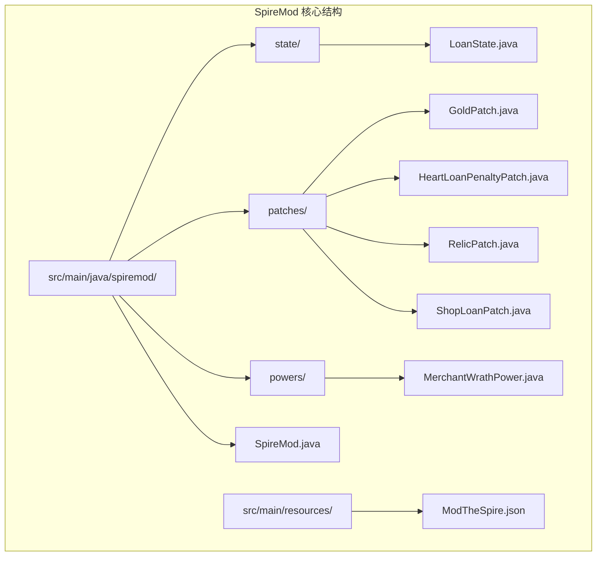

**图表来源**
- [SpireMod.java:1-11](file://src/main/java/spiremod/SpireMod.java#L1-L11)
- [LoanState.java:1-56](file://src/main/java/spiremod/state/LoanState.java#L1-L56)

**章节来源**
- [SpireMod.java:1-11](file://src/main/java/spiremod/SpireMod.java#L1-L11)
- [build.gradle:1-56](file://build.gradle#L1-L56)

## 核心组件

SpireMod 的核心由四个主要组件构成，每个组件都有明确的职责分工：

### 1. 主入口组件 (SpireMod)
负责 Mod 的初始化和注册，是整个 Mod 的协调中心。

### 2. 全局状态中心 (LoanState)
管理贷款系统的全局状态，提供统一的状态访问接口。

### 3. 补丁模块组 (Patches)
通过 ModTheSpire 的补丁机制修改游戏行为，实现功能扩展。

### 4. 能力系统 (Powers)
为游戏添加新的能力效果，增强玩家体验。

**章节来源**
- [SpireMod.java:5-10](file://src/main/java/spiremod/SpireMod.java#L5-L10)
- [LoanState.java:5-56](file://src/main/java/spiremod/state/LoanState.java#L5-L56)

## 架构概览

SpireMod 采用了基于补丁模式的架构设计，通过 ModTheSpire 框架实现对游戏核心类的非侵入式修改。整体架构呈现为中心辐射状，所有功能模块都围绕 LoanState 这个核心状态管理中心进行协作。

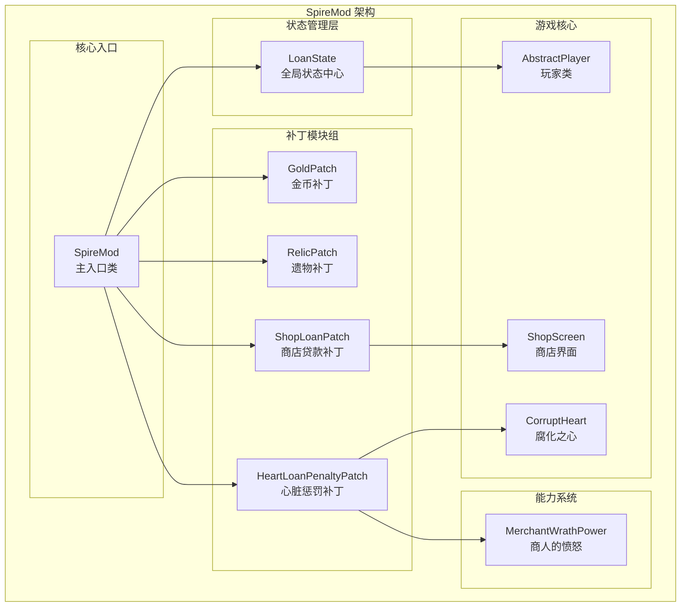

**图表来源**
- [SpireMod.java:5-10](file://src/main/java/spiremod/SpireMod.java#L5-L10)
- [LoanState.java:5-56](file://src/main/java/spiremod/state/LoanState.java#L5-L56)
- [GoldPatch.java:9-33](file://src/main/java/spiremod/patches/GoldPatch.java#L9-L33)
- [RelicPatch.java:17-45](file://src/main/java/spiremod/patches/RelicPatch.java#L17-L45)
- [ShopLoanPatch.java:17-202](file://src/main/java/spiremod/patches/ShopLoanPatch.java#L17-L202)
- [HeartLoanPenaltyPatch.java:13-40](file://src/main/java/spiremod/patches/HeartLoanPenaltyPatch.java#L13-L40)

## 详细组件分析

### 主入口类 (SpireMod)

SpireMod 主入口类是整个 Mod 的协调中心，采用最小化的实现方式，专注于 Mod 的初始化和注册。

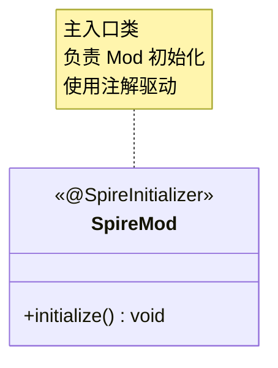

**图表来源**
- [SpireMod.java:5-10](file://src/main/java/spiremod/SpireMod.java#L5-L10)

**章节来源**
- [SpireMod.java:5-10](file://src/main/java/spiremod/SpireMod.java#L5-L10)

### 全局状态中心 (LoanState)

LoanState 是整个 Mod 的核心状态管理中心，采用单例模式设计，提供统一的贷款状态访问接口。

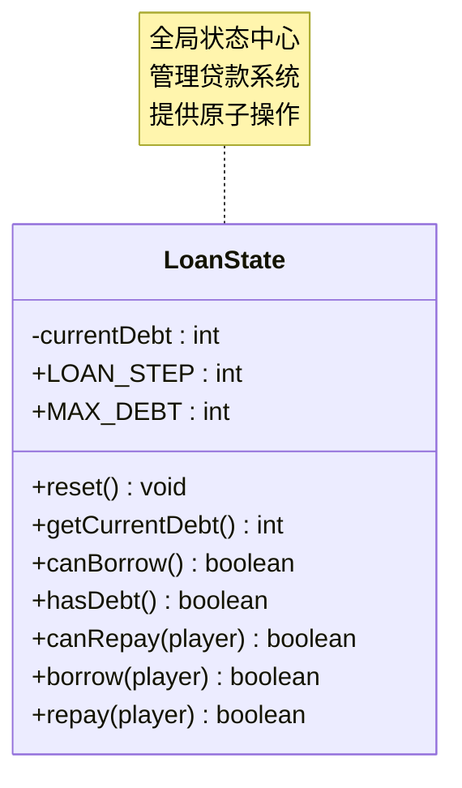

**图表来源**
- [LoanState.java:5-56](file://src/main/java/spiremod/state/LoanState.java#L5-L56)

LoanState 的设计特点：
- **常量配置**：定义了贷款步长和最大债务限制
- **状态封装**：内部维护当前债务状态，防止外部直接修改
- **原子操作**：提供完整的借入和还款操作，确保状态一致性
- **边界检查**：在所有操作前进行状态验证

**章节来源**
- [LoanState.java:5-56](file://src/main/java/spiremod/state/LoanState.java#L5-L56)

### 补丁模块组

补丁模块组通过 ModTheSpire 的补丁机制实现对游戏核心行为的修改。每个补丁都针对特定的游戏场景和时机。

#### 金币补丁 (GoldPatch)

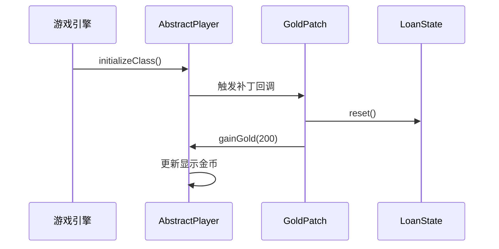

**图表来源**
- [GoldPatch.java:16-32](file://src/main/java/spiremod/patches/GoldPatch.java#L16-L32)

#### 商店贷款补丁 (ShopLoanPatch)

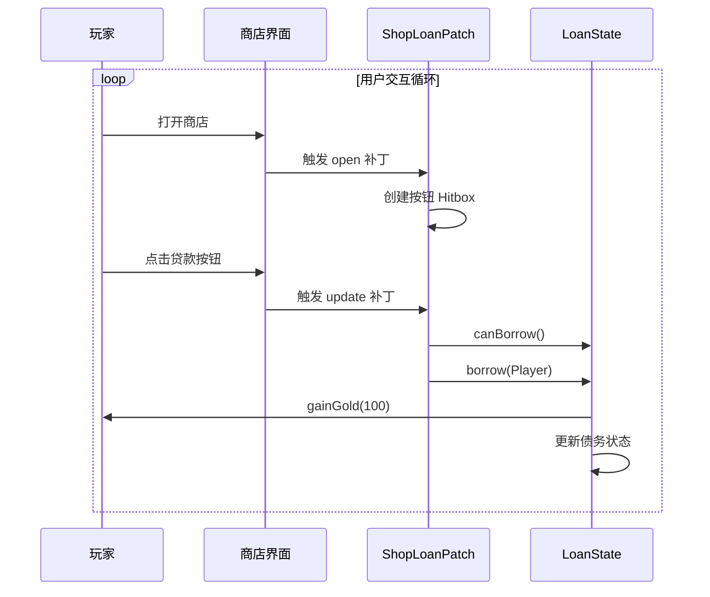

**图表来源**
- [ShopLoanPatch.java:46-94](file://src/main/java/spiremod/patches/ShopLoanPatch.java#L46-L94)
- [ShopLoanPatch.java:150-166](file://src/main/java/spiremod/patches/ShopLoanPatch.java#L150-L166)

#### 心脏惩罚补丁 (HeartLoanPenaltyPatch)

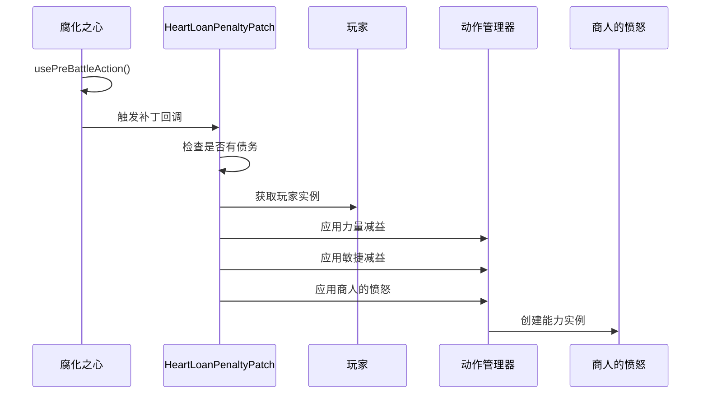

**图表来源**
- [HeartLoanPenaltyPatch.java:20-39](file://src/main/java/spiremod/patches/HeartLoanPenaltyPatch.java#L20-L39)

#### 遗物补丁 (RelicPatch)

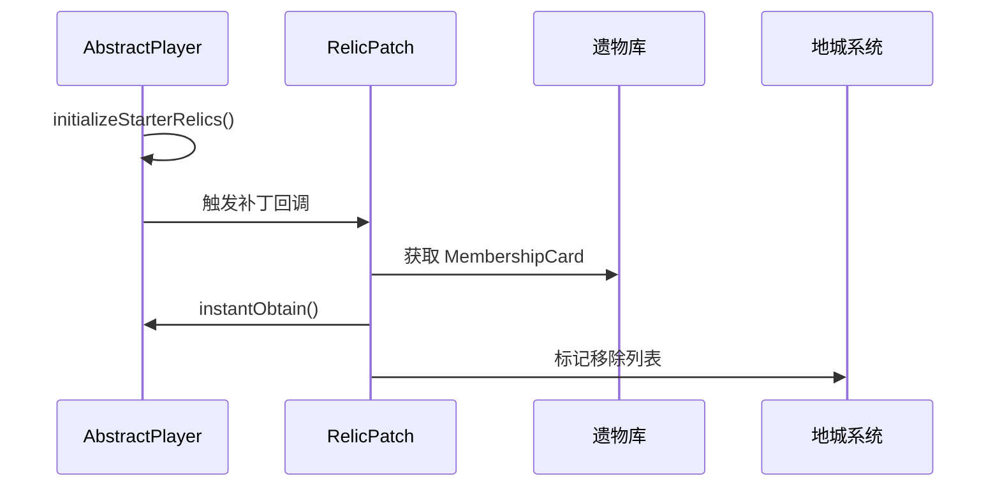

**图表来源**
- [RelicPatch.java:22-44](file://src/main/java/spiremod/patches/RelicPatch.java#L22-L44)

**章节来源**
- [GoldPatch.java:9-33](file://src/main/java/spiremod/patches/GoldPatch.java#L9-L33)
- [ShopLoanPatch.java:17-202](file://src/main/java/spiremod/patches/ShopLoanPatch.java#L17-L202)
- [HeartLoanPenaltyPatch.java:13-40](file://src/main/java/spiremod/patches/HeartLoanPenaltyPatch.java#L13-L40)
- [RelicPatch.java:17-45](file://src/main/java/spiremod/patches/RelicPatch.java#L17-L45)

### 能力系统 (MerchantWrathPower)

商人的愤怒是一个基于回合的负面能力，每回合开始时造成固定的生命值损失。

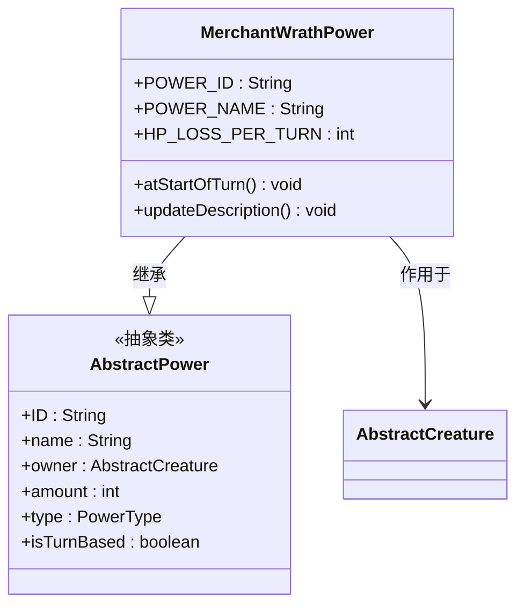

**图表来源**
- [MerchantWrathPower.java:10-38](file://src/main/java/spiremod/powers/MerchantWrathPower.java#L10-L38)

**章节来源**
- [MerchantWrathPower.java:10-38](file://src/main/java/spiremod/powers/MerchantWrathPower.java#L10-L38)

## 依赖关系分析

SpireMod 的组件间依赖关系呈现清晰的层次结构，所有组件都围绕 LoanState 进行协作。

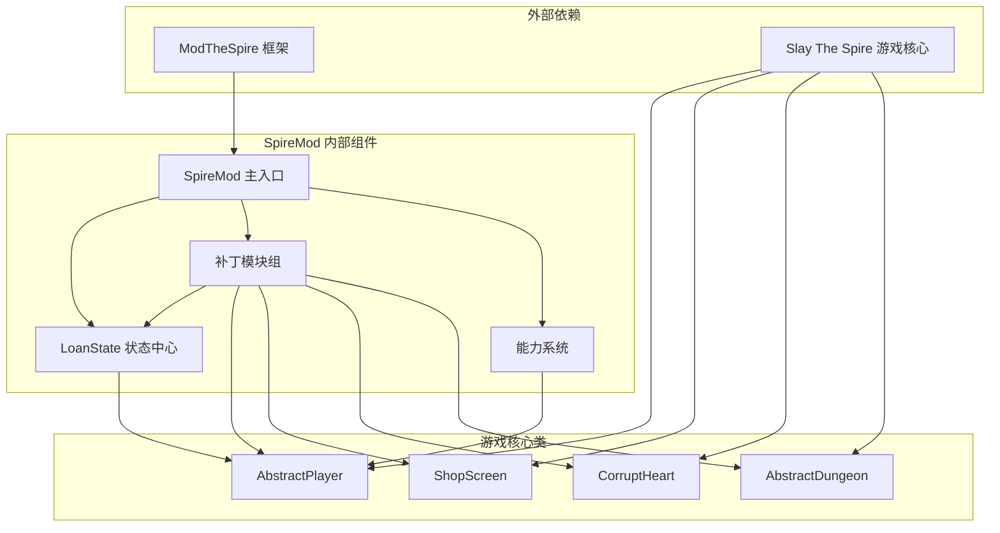

**图表来源**
- [SpireMod.java:3-3](file://src/main/java/spiremod/SpireMod.java#L3-L3)
- [LoanState.java:3-3](file://src/main/java/spiremod/state/LoanState.java#L3-L3)
- [GoldPatch.java:3-7](file://src/main/java/spiremod/patches/GoldPatch.java#L3-L7)
- [ShopLoanPatch.java:3-15](file://src/main/java/spiremod/patches/ShopLoanPatch.java#L3-L15)

### 数据流图

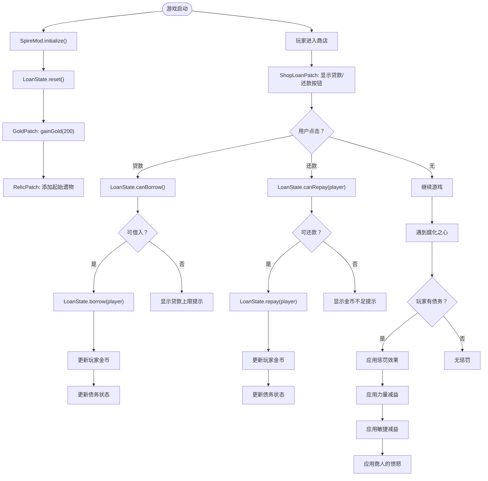

**图表来源**
- [GoldPatch.java:29-31](file://src/main/java/spiremod/patches/GoldPatch.java#L29-L31)
- [ShopLoanPatch.java:150-180](file://src/main/java/spiremod/patches/ShopLoanPatch.java#L150-L180)
- [HeartLoanPenaltyPatch.java:20-39](file://src/main/java/spiremod/patches/HeartLoanPenaltyPatch.java#L20-L39)

### 组件协作关系

SpireMod 中各组件之间的协作关系体现了良好的关注点分离：

1. **状态管理**：LoanState 作为唯一真相源，所有补丁模块都通过它进行状态查询和修改
2. **事件驱动**：补丁模块响应游戏事件，在合适的时机执行相应的逻辑
3. **能力集成**：能力系统与补丁模块协同工作，形成完整的游戏体验

**章节来源**
- [LoanState.java:34-54](file://src/main/java/spiremod/state/LoanState.java#L34-L54)
- [HeartLoanPenaltyPatch.java:30-38](file://src/main/java/spiremod/patches/HeartLoanPenaltyPatch.java#L30-L38)

## 性能考虑

SpireMod 在设计时充分考虑了性能优化：

### 内存管理
- 使用静态方法和字段减少对象创建开销
- 单例模式确保 LoanState 的唯一性
- 及时释放补丁创建的临时对象

### 计算效率
- 所有状态检查都在内存中完成，避免磁盘 I/O
- 使用简单的数学运算进行状态计算
- 避免在热路径中进行复杂的对象操作

### 渲染优化
- ShopLoanPatch 使用高效的渲染方法
- 按需创建 Hitbox 对象，避免不必要的内存分配

## 故障排除指南

### 常见问题及解决方案

#### Mod 加载失败
**症状**：游戏启动时 Mod 未加载
**原因**：依赖的 JAR 文件缺失或路径错误
**解决方案**：
1. 检查 desktop-1.0.jar 是否存在于指定路径
2. 验证 ModTheSpire.jar 的可用性
3. 确认 Mod 输出目录存在且可写

#### 贷款功能异常
**症状**：贷款或还款操作无效
**原因**：LoanState 状态不一致或玩家金币不足
**解决方案**：
1. 检查 LoanState.getCurrentDebt() 返回值
2. 验证玩家金币是否足够
3. 确认没有超过最大债务限制

#### 补丁失效
**症状**：补丁逻辑未生效
**原因**：补丁目标类或方法名变更
**解决方案**：
1. 检查 ModTheSpire 版本兼容性
2. 验证补丁注解中的类和方法名
3. 确认补丁优先级设置正确

**章节来源**
- [build.gradle:44-54](file://build.gradle#L44-L54)
- [ShopLoanPatch.java:182-185](file://src/main/java/spiremod/patches/ShopLoanPatch.java#L182-L185)

## 结论

SpireMod 展示了一个优秀的轻量级 Mod 设计范例，通过精心设计的组件关系和状态管理机制，成功实现了对游戏核心系统的增强。其关键优势包括：

1. **清晰的架构设计**：组件职责明确，依赖关系简单
2. **高效的状态管理**：LoanState 提供了统一的状态访问接口
3. **优雅的补丁集成**：通过 ModTheSpire 实现非侵入式功能扩展
4. **良好的用户体验**：功能完整且易于理解和使用

该设计为其他 Mod 开发提供了宝贵的参考，特别是在组件解耦、状态管理和性能优化方面。通过遵循这些最佳实践，开发者可以创建出既强大又稳定的 Mod 作品。