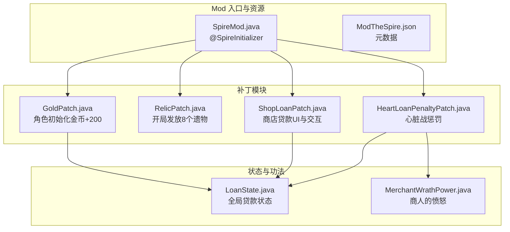
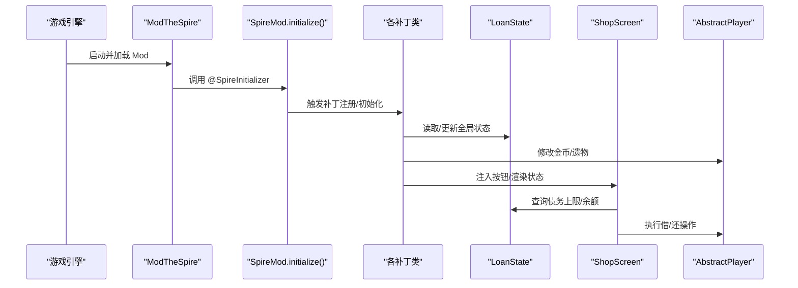
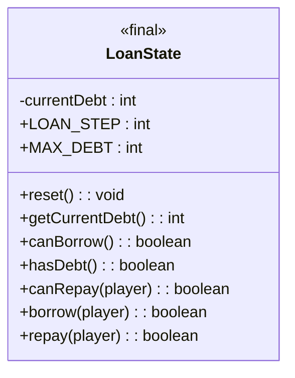
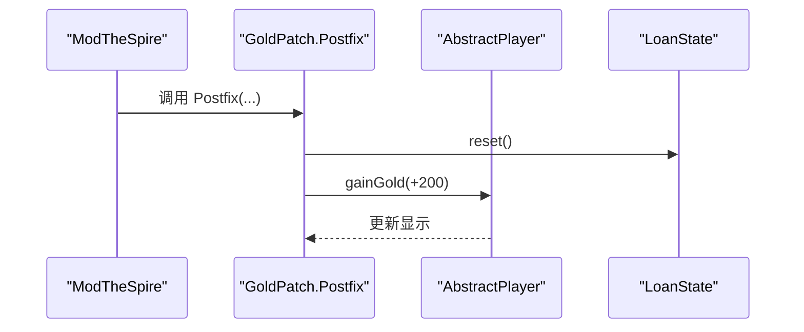
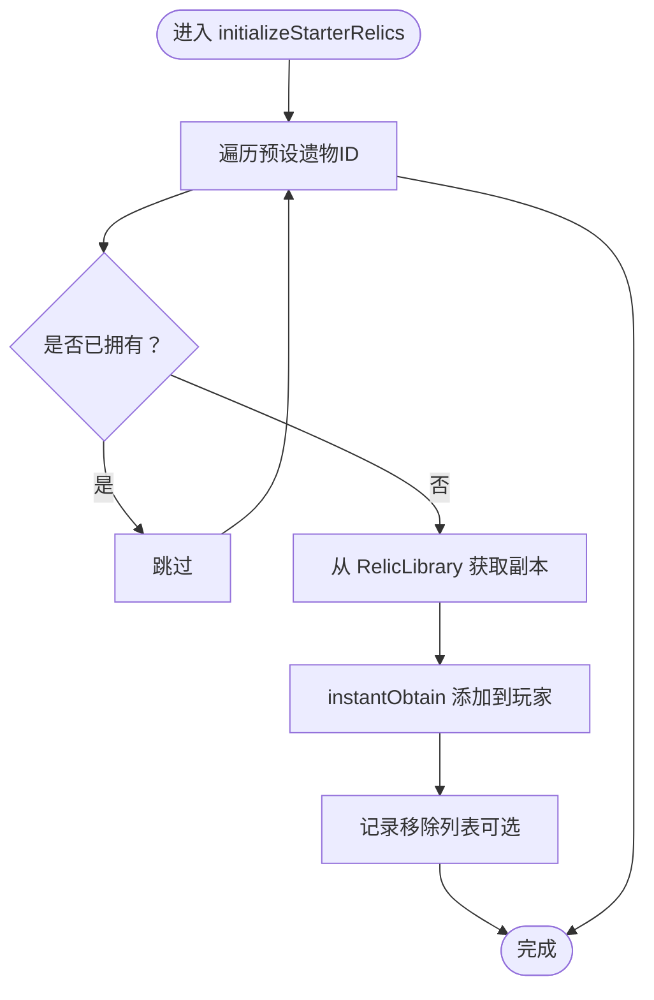
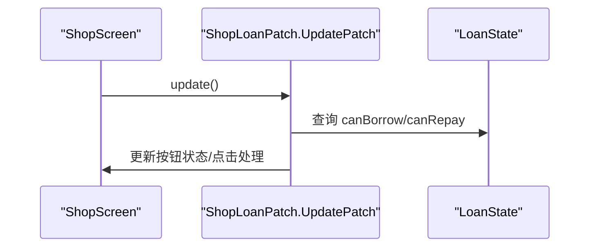
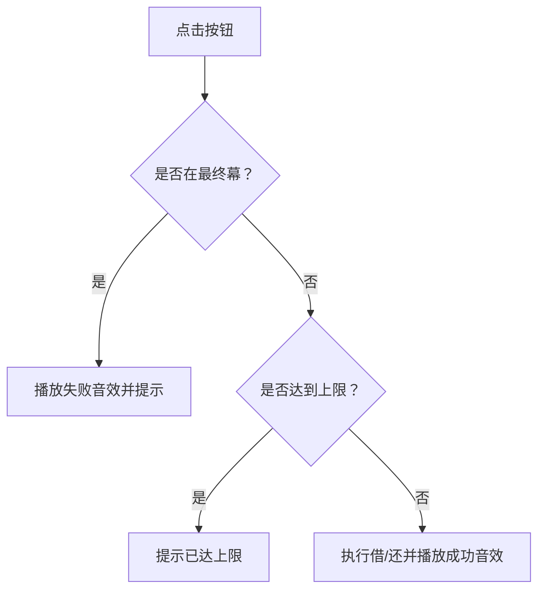
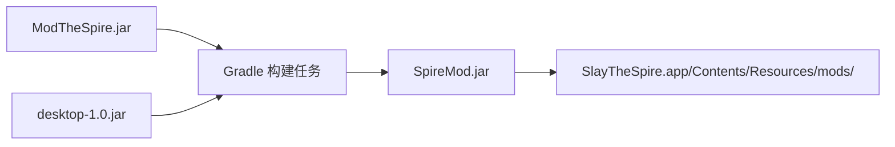

# 设计模式

<cite>
**本文引用的文件**
- [SpireMod.java](file://src/main/java/spiremod/SpireMod.java)
- [LoanState.java](file://src/main/java/spiremod/state/LoanState.java)
- [GoldPatch.java](file://src/main/java/spiremod/patches/GoldPatch.java)
- [RelicPatch.java](file://src/main/java/spiremod/patches/RelicPatch.java)
- [ShopLoanPatch.java](file://src/main/java/spiremod/patches/ShopLoanPatch.java)
- [HeartLoanPenaltyPatch.java](file://src/main/java/spiremod/patches/HeartLoanPenaltyPatch.java)
- [MerchantWrathPower.java](file://src/main/java/spiremod/powers/MerchantWrathPower.java)
- [ModTheSpire.json](file://src/main/resources/ModTheSpire.json)
- [build.gradle](file://build.gradle)
- [settings.gradle](file://settings.gradle)
- [2026-06-15-spiremod-lightweight-design.md](file://docs/superpowers/specs/2026-06-15-spiremod-lightweight-design.md)
</cite>

## 目录
1. [引言](#引言)
2. [项目结构](#项目结构)
3. [核心组件](#核心组件)
4. [架构总览](#架构总览)
5. [详细组件分析](#详细组件分析)
6. [依赖分析](#依赖分析)
7. [性能考虑](#性能考虑)
8. [故障排查指南](#故障排查指南)
9. [结论](#结论)
10. [附录](#附录)

## 引言
本文件系统性梳理 SpireMod 中的设计模式应用，重点围绕以下主题展开：
- 单例模式在 LoanState 中的实现与作用：静态方法、全局状态管理、线程安全与生命周期控制。
- 补丁模式（Patch Pattern）的工作原理：通过 SpirePatch 注解实现非侵入式的游戏修改，以及与 ModTheSpire 的协作方式。
- 工厂模式在遗物发放逻辑中的应用：统一的“按需获取”流程与可扩展的新增机制。
- 其他设计模式：观察者模式（事件驱动）、策略模式（条件分支与行为选择）等在项目中的体现与最佳实践。

## 项目结构
SpireMod 采用“轻量级补丁式 Mod”的架构，不依赖 BaseMod，直接基于 ModTheSpire 的 SpirePatch 机制进行钩子注入。项目主要由以下模块构成：
- 初始化入口：SpireMod.java，负责注册 Mod。
- 补丁模块：patches 包下包含多个 SpirePatch 实现，分别用于金币初始化、遗物发放、商店贷款 UI 与交互、心脏战惩罚等。
- 状态模块：state 包下的 LoanState 提供全局贷款状态的集中管理。
- 功法模块：powers 包下的 MerchantWrathPower 为贷款惩罚的可视化表现。
- 资源与构建：ModTheSpire.json 提供元数据；Gradle 脚本负责打包与输出。

图表来源
- [SpireMod.java:5-10](file://src/main/java/spiremod/SpireMod.java#L5-L10)
- [GoldPatch.java:9-32](file://src/main/java/spiremod/patches/GoldPatch.java#L9-L32)
- [RelicPatch.java:17-31](file://src/main/java/spiremod/patches/RelicPatch.java#L17-L31)
- [ShopLoanPatch.java:17-58](file://src/main/java/spiremod/patches/ShopLoanPatch.java#L17-L58)
- [HeartLoanPenaltyPatch.java:13-39](file://src/main/java/spiremod/patches/HeartLoanPenaltyPatch.java#L13-L39)
- [LoanState.java:5-55](file://src/main/java/spiremod/state/LoanState.java#L5-L55)
- [MerchantWrathPower.java:10-38](file://src/main/java/spiremod/powers/MerchantWrathPower.java#L10-L38)

章节来源
- [2026-06-15-spiremod-lightweight-design.md:23-41](file://docs/superpowers/specs/2026-06-15-spiremod-lightweight-design.md#L23-L41)
- [build.gradle:26-29](file://build.gradle#L26-L29)

## 核心组件
- 初始化入口：SpireMod.java 使用 @SpireInitializer 注解，确保 Mod 在启动时被 ModTheSpire 正确注册。
- 补丁集合：GoldPatch、RelicPatch、ShopLoanPatch、HeartLoanPenaltyPatch 分别在角色初始化、开局遗物发放、商店贷款交互、心脏战惩罚等关键节点注入行为。
- 全局状态：LoanState 提供静态方法管理贷款额度、借还逻辑与状态查询，形成单一事实来源。
- 功法表现：MerchantWrathPower 将贷款惩罚以游戏内“商人的愤怒”形式呈现，增强反馈与沉浸感。

章节来源
- [SpireMod.java:5-10](file://src/main/java/spiremod/SpireMod.java#L5-L10)
- [LoanState.java:5-55](file://src/main/java/spiremod/state/LoanState.java#L5-L55)
- [MerchantWrathPower.java:10-38](file://src/main/java/spiremod/powers/MerchantWrathPower.java#L10-L38)

## 架构总览
SpireMod 的整体架构遵循“入口注册 + 补丁注入 + 状态中心 + 功法表现”的分层设计。ModTheSpire 作为运行时框架负责扫描并执行补丁；补丁通过静态方法与全局状态交互；状态模块集中管理跨场景的状态；功法模块提供可视化的状态反馈。

图表来源
- [SpireMod.java:7-9](file://src/main/java/spiremod/SpireMod.java#L7-L9)
- [GoldPatch.java:28-32](file://src/main/java/spiremod/patches/GoldPatch.java#L28-L32)
- [RelicPatch.java:22-31](file://src/main/java/spiremod/patches/RelicPatch.java#L22-L31)
- [ShopLoanPatch.java:46-58](file://src/main/java/spiremod/patches/ShopLoanPatch.java#L46-L58)
- [LoanState.java:14-54](file://src/main/java/spiremod/state/LoanState.java#L14-L54)

## 详细组件分析

### 单例模式与全局状态：LoanState
- 实现要点
  - 私有构造函数防止实例化，确保唯一性。
  - 静态字段保存全局状态（当前债务），静态方法提供统一访问与变更接口。
  - 提供 reset、getCurrentDebt、canBorrow、hasDebt、canRepay、borrow、repay 等方法，形成稳定的 API。
- 生命周期与线程安全
  - 由于 ModTheSpire 的补丁在游戏主循环中执行，且 LoanState 仅维护整型状态，未涉及复杂并发，因此无需额外同步。
  - reset 在角色初始化时调用，确保每局开始时状态归零。
- 应用场景
  - 商店贷款 UI：根据 LoanState 的状态决定按钮显示与可用性。
  - 心脏战惩罚：当存在债务时施加多重 debuff。
  - 借还逻辑：统一处理金币增减与显示刷新。

图表来源
- [LoanState.java:5-55](file://src/main/java/spiremod/state/LoanState.java#L5-L55)

章节来源
- [LoanState.java:5-55](file://src/main/java/spiremod/state/LoanState.java#L5-L55)
- [GoldPatch.java:28-32](file://src/main/java/spiremod/patches/GoldPatch.java#L28-L32)
- [ShopLoanPatch.java:106-122](file://src/main/java/spiremod/patches/ShopLoanPatch.java#L106-L122)
- [HeartLoanPenaltyPatch.java:20-39](file://src/main/java/spiremod/patches/HeartLoanPenaltyPatch.java#L20-L39)

### 补丁模式（Patch Pattern）与 SpirePatch 注解
- 工作原理
  - 通过 @SpirePatch 指定目标类与方法，ModTheSpire 在运行时动态注入补丁方法（如 Postfix）。
  - 补丁方法通常以“前置/后置”形式参与原有逻辑，实现非侵入式修改。
- 在项目中的应用
  - GoldPatch：在角色初始化后增加金币并重置贷款状态。
  - RelicPatch：在开局初始化遗物时追加指定遗物（去重）。
  - ShopLoanPatch：在商店打开、更新、渲染阶段注入贷款按钮与交互逻辑，并与 LoanState 协同。
  - HeartLoanPenaltyPatch：在心脏战前行动阶段根据贷款状态施加惩罚。
- 最佳实践
  - 明确 Hook 点与参数签名，避免误改核心逻辑。
  - 使用 Postfix 保持原有行为不变，必要时通过条件判断短路。
  - 对 UI 注入要谨慎，确保只在合适场景显示与交互。

图表来源
- [GoldPatch.java:9-32](file://src/main/java/spiremod/patches/GoldPatch.java#L9-L32)
- [LoanState.java:14-16](file://src/main/java/spiremod/state/LoanState.java#L14-L16)

章节来源
- [GoldPatch.java:9-32](file://src/main/java/spiremod/patches/GoldPatch.java#L9-L32)
- [RelicPatch.java:17-45](file://src/main/java/spiremod/patches/RelicPatch.java#L17-L45)
- [ShopLoanPatch.java:17-203](file://src/main/java/spiremod/patches/ShopLoanPatch.java#L17-L203)
- [HeartLoanPenaltyPatch.java:13-41](file://src/main/java/spiremod/patches/HeartLoanPenaltyPatch.java#L13-L41)

### 工厂模式在遗物发放中的应用
- 统一处理流程
  - RelicPatch 在角色初始化阶段批量发放遗物，内部通过“若缺失则获取”的流程保证幂等性。
  - obtainIfMissing 方法封装了“查找 → 复制 → 获得”的工厂式步骤，屏蔽底层细节。
- 扩展机制
  - 新增遗物只需在初始化列表中添加 ID，并确保 RelicLibrary 中存在对应实现。
  - 该模式天然支持未来按需扩展，无需改动核心逻辑。
- 与补丁模式结合
  - 通过 Postfix 注入，避免直接修改游戏源码或引入外部依赖。

图表来源
- [RelicPatch.java:22-44](file://src/main/java/spiremod/patches/RelicPatch.java#L22-L44)

章节来源
- [RelicPatch.java:17-45](file://src/main/java/spiremod/patches/RelicPatch.java#L17-L45)

### 观察者模式与事件驱动
- 事件驱动特征
  - ModTheSpire 通过补丁机制在特定生命周期事件（如商店打开、更新、渲染）触发相应逻辑。
  - ShopLoanPatch 在 open/update/render 三个阶段分别注入行为，体现了典型的事件驱动模式。
- 观察者视角
  - LoanState 可视为“被观察对象”，其状态变化影响多个观察者（UI、惩罚逻辑等）。
  - 通过静态方法访问，避免了显式的订阅/取消订阅机制，但保持了清晰的耦合边界。

图表来源
- [ShopLoanPatch.java:64-94](file://src/main/java/spiremod/patches/ShopLoanPatch.java#L64-L94)
- [LoanState.java:22-32](file://src/main/java/spiremod/state/LoanState.java#L22-L32)

章节来源
- [ShopLoanPatch.java:64-94](file://src/main/java/spiremod/patches/ShopLoanPatch.java#L64-L94)

### 策略模式与条件分支
- 条件策略
  - ShopLoanPatch 中多处条件判断（如是否在最终幕、是否可借、是否可还）体现了策略模式的“条件选择”思想。
  - 不同条件下执行不同的 UI 行为（显示/禁用按钮、播放音效、显示提示语）。
- 策略扩展
  - 可通过新增条件分支或引入枚举/策略类进一步抽象“可借/可还”的判定规则，提升可维护性。

图表来源
- [ShopLoanPatch.java:150-180](file://src/main/java/spiremod/patches/ShopLoanPatch.java#L150-L180)

章节来源
- [ShopLoanPatch.java:150-180](file://src/main/java/spiremod/patches/ShopLoanPatch.java#L150-L180)

### 商人的愤怒：功法表现与状态联动
- 功能定位
  - MerchantWrathPower 作为 debuff，在回合开始时造成固定伤害，直观体现贷款的代价。
- 与贷款系统的联动
  - 心脏战惩罚触发时叠加该功法，强化“债务惩罚”的叙事一致性。
- 设计意义
  - 将数值惩罚转化为可视化的游戏体验，提升玩家对系统机制的理解与记忆。

章节来源
- [MerchantWrathPower.java:10-38](file://src/main/java/spiremod/powers/MerchantWrathPower.java#L10-L38)
- [HeartLoanPenaltyPatch.java:30-39](file://src/main/java/spiremod/patches/HeartLoanPenaltyPatch.java#L30-L39)

## 依赖分析
- 运行时依赖
  - ModTheSpire：提供补丁框架与运行时注入能力。
  - desktop-1.0.jar：游戏类库，用于编译期类型解析与补丁目标定位。
- 构建与打包
  - Gradle 任务将编译产物与资源打包至 ModTheSpire 的 mods 目录，确保本地加载。

图表来源
- [build.gradle:26-29](file://build.gradle#L26-L29)
- [build.gradle:35-43](file://build.gradle#L35-L43)

章节来源
- [build.gradle:14-29](file://build.gradle#L14-L29)
- [build.gradle:35-55](file://build.gradle#L35-L55)
- [settings.gradle:1-2](file://settings.gradle#L1-L2)
- [ModTheSpire.json:1-10](file://src/main/resources/ModTheSpire.json#L1-L10)

## 性能考虑
- 补丁注入开销
  - 仅在目标方法被调用时执行补丁逻辑，通常开销极小。
- UI 注入优化
  - ShopLoanPatch 中对按钮 Hitbox 的复用与颜色状态切换，避免频繁创建对象。
- 状态查询
  - LoanState 的静态方法为 O(1)，查询成本低，适合高频调用。
- 建议
  - 避免在补丁中进行重型计算或频繁 IO。
  - 对 UI 绘制与输入检测进行节流，减少不必要的重绘。

## 故障排查指南
- Mod 未加载
  - 检查 ModTheSpire.json 的 modid、name、描述与版本是否正确。
  - 确认 Gradle 任务输出路径与 ModTheSpire 期望路径一致。
- 补丁未生效
  - 确认 @SpirePatch 的目标类与方法签名与游戏版本匹配。
  - 检查补丁方法是否为静态且命名规范（如 Postfix）。
- 贷款状态异常
  - 确保在角色初始化时调用了 LoanState.reset。
  - 检查借还逻辑中的条件判断与金币更新是否正确。
- 商店按钮不可见
  - 检查 shouldShowBorrowButton/shouldShowRepayButton 的条件逻辑。
  - 确认 Final Act 场景的特殊限制逻辑。

章节来源
- [ModTheSpire.json:1-10](file://src/main/resources/ModTheSpire.json#L1-L10)
- [build.gradle:35-55](file://build.gradle#L35-L55)
- [GoldPatch.java:28-32](file://src/main/java/spiremod/patches/GoldPatch.java#L28-L32)
- [ShopLoanPatch.java:187-199](file://src/main/java/spiremod/patches/ShopLoanPatch.java#L187-L199)

## 结论
SpireMod 以轻量级补丁为核心，结合单例状态、工厂式发放与事件驱动的补丁模式，实现了简洁而强大的 Mod 功能。LoanState 作为全局状态中心，贯穿多个补丁与 UI 交互；RelicPatch 展示了工厂模式在“按需获取”场景中的优雅应用；补丁模式则提供了非侵入式的扩展能力。通过明确的职责划分与清晰的接口设计，项目在可维护性与可扩展性之间取得了良好平衡。

## 附录
- 关键实现路径参考
  - 初始化入口：[SpireMod.java:5-10](file://src/main/java/spiremod/SpireMod.java#L5-L10)
  - 全局状态：[LoanState.java:5-55](file://src/main/java/spiremod/state/LoanState.java#L5-L55)
  - 金币注入：[GoldPatch.java:9-32](file://src/main/java/spiremod/patches/GoldPatch.java#L9-L32)
  - 遗物发放：[RelicPatch.java:17-45](file://src/main/java/spiremod/patches/RelicPatch.java#L17-L45)
  - 商店贷款：[ShopLoanPatch.java:17-203](file://src/main/java/spiremod/patches/ShopLoanPatch.java#L17-L203)
  - 心脏惩罚：[HeartLoanPenaltyPatch.java:13-41](file://src/main/java/spiremod/patches/HeartLoanPenaltyPatch.java#L13-L41)
  - 功法表现：[MerchantWrathPower.java:10-38](file://src/main/java/spiremod/powers/MerchantWrathPower.java#L10-L38)
  - 构建与资源：[build.gradle:26-55](file://build.gradle#L26-L55)、[ModTheSpire.json:1-10](file://src/main/resources/ModTheSpire.json#L1-L10)