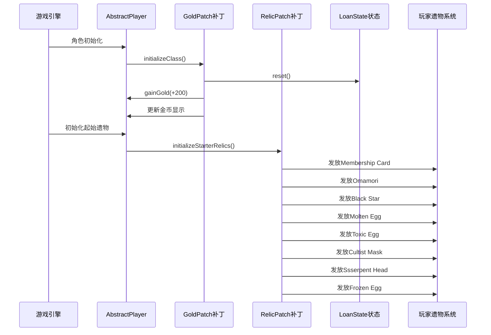
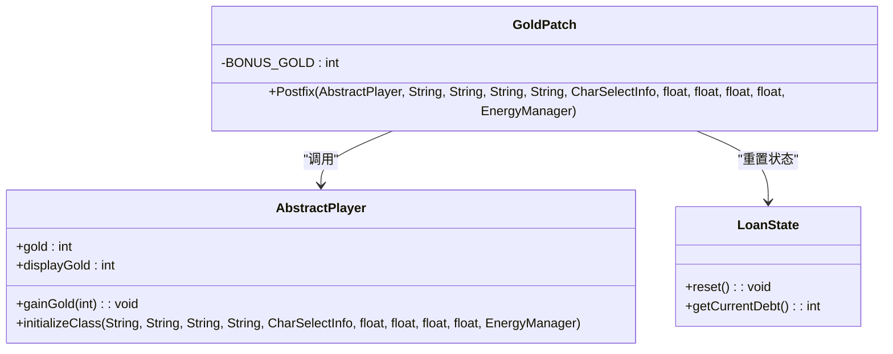
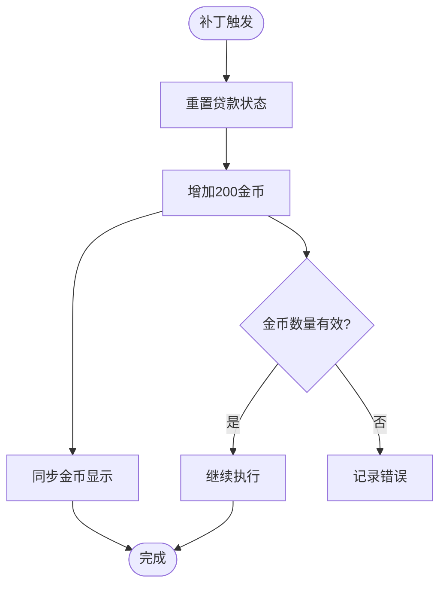
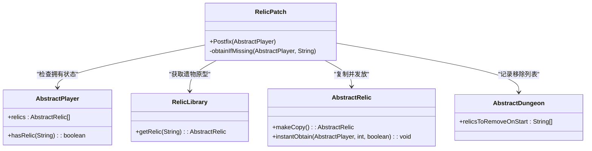
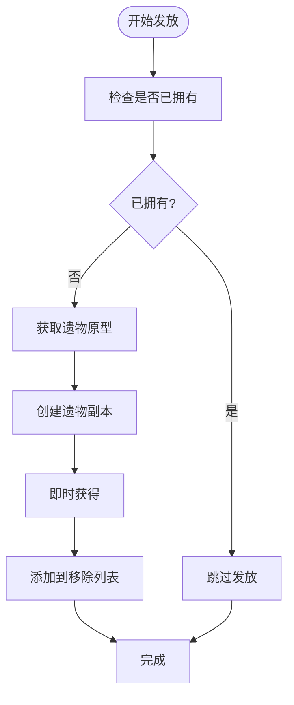
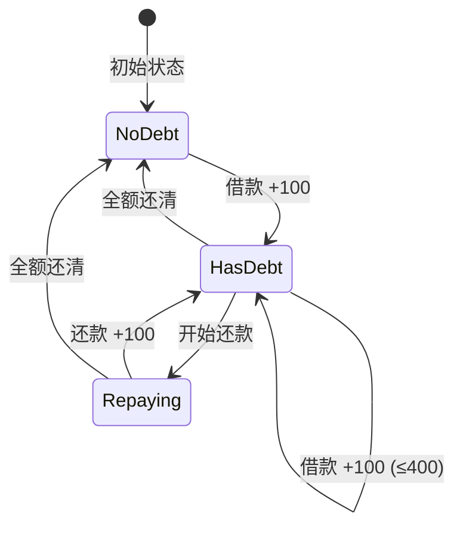
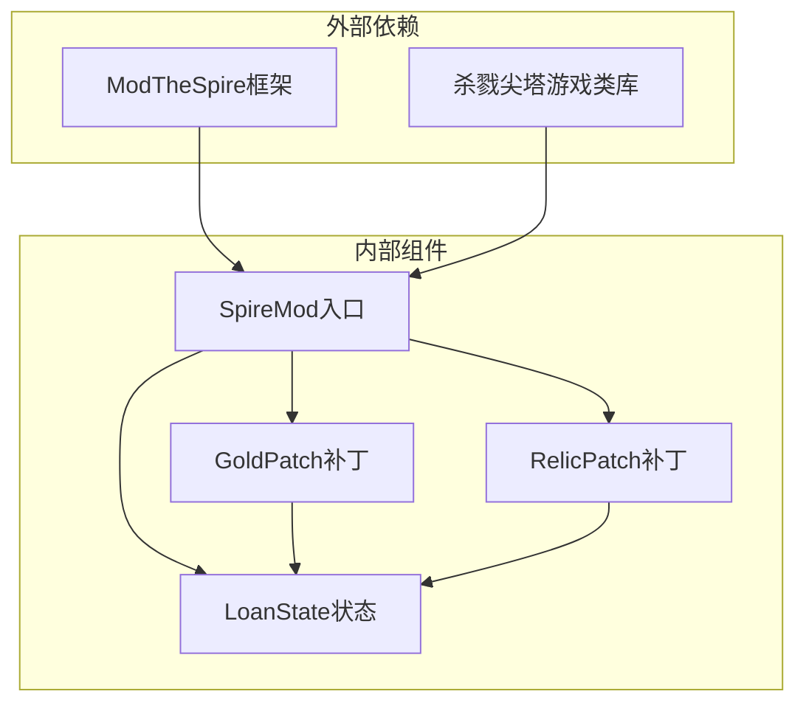

# 初始资源增益系统

<cite>
**本文档引用的文件**
- [GoldPatch.java](file://src/main/java/spiremod/patches/GoldPatch.java)
- [RelicPatch.java](file://src/main/java/spiremod/patches/RelicPatch.java)
- [LoanState.java](file://src/main/java/spiremod/state/LoanState.java)
- [SpireMod.java](file://src/main/java/spiremod/SpireMod.java)
- [ModTheSpire.json](file://src/main/resources/ModTheSpire.json)
- [2026-06-15-spiremod-lightweight-design.md](file://docs/superpowers/specs/2026-06-15-spiremod-lightweight-design.md)
- [README.md](file://README.md)
- [build.gradle](file://build.gradle)
- [build-mod.sh](file://scripts/build-mod.sh)
</cite>

## 目录
1. [简介](#简介)
2. [项目结构](#项目结构)
3. [核心组件](#核心组件)
4. [架构概览](#架构概览)
5. [详细组件分析](#详细组件分析)
6. [依赖关系分析](#依赖关系分析)
7. [性能考虑](#性能考虑)
8. [故障排除指南](#故障排除指南)
9. [结论](#结论)
10. [附录](#附录)

## 简介

SpireMod 是一个轻量级的《杀戮尖塔》Mod，专门设计用于为玩家提供初始资源增益体验。该系统的核心目标是在每次新游戏开始时自动为玩家提供 +200 金币和一系列强力原版遗物，从而降低游戏初期的经济压力并提升整体游戏体验。

该系统采用纯 SpirePatch 实现，不依赖 BaseMod，通过 ModTheSpire 框架提供的补丁机制，在游戏的关键节点注入自定义逻辑。系统包含两个主要功能模块：金币增益机制和强力遗物发放系统。

## 项目结构

SpireMod 项目采用简洁的分层架构，主要包含以下核心组件：

```mermaid
graph TB
subgraph "核心模块"
A[SpireMod.java<br/>@SpireInitializer入口]
B[patches/<br/>补丁模块]
C[state/<br/>状态管理]
D[resources/<br/>资源配置]
end
subgraph "补丁组件"
E[GoldPatch.java<br/>金币增益补丁]
F[RelicPatch.java<br/>遗物发放补丁]
G[ShopLoanPatch.java<br/>商店贷款补丁]
H[HeartLoanPenaltyPatch.java<br/>心脏惩罚补丁]
end
subgraph "状态管理"
I[LoanState.java<br/>贷款状态管理]
end
subgraph "配置文件"
J[ModTheSpire.json<br/>Mod元数据]
end
A --> B
A --> C
A --> D
B --> E
B --> F
B --> G
B --> H
C --> I
D --> J
```

**图表来源**
- [SpireMod.java:1-11](file://src/main/java/spiremod/SpireMod.java#L1-L11)
- [GoldPatch.java:1-34](file://src/main/java/spiremod/patches/GoldPatch.java#L1-L34)
- [RelicPatch.java:1-46](file://src/main/java/spiremod/patches/RelicPatch.java#L1-L46)
- [LoanState.java:1-56](file://src/main/java/spiremod/state/LoanState.java#L1-L56)

**章节来源**
- [SpireMod.java:1-11](file://src/main/java/spiremod/SpireMod.java#L1-L11)
- [ModTheSpire.json:1-10](file://src/main/resources/ModTheSpire.json#L1-L10)
- [2026-06-15-spiremod-lightweight-design.md:23-41](file://docs/superpowers/specs/2026-06-15-spiremod-lightweight-design.md#L23-L41)

## 核心组件

### 金币增益系统

金币增益系统通过 GoldPatch 补丁实现，为每次新游戏提供 +200 金币的初始资源。该系统的核心特点包括：

- **触发时机**：在角色初始化阶段自动触发
- **金额设置**：固定 +200 金币
- **状态重置**：同时重置贷款状态
- **显示同步**：确保金币显示与实际余额一致

### 强力遗物发放系统

强力遗物发放系统通过 RelicPatch 补丁实现，自动为玩家提供 8 个精选的原版强力遗物。这些遗物经过精心挑选，涵盖不同的游戏玩法风格：

- **Membership Card**：商店永久半价
- **Omamori**：抵挡前 2 次负面效果
- **Black Star**：精英怪掉落 2 个遗物
- **Molten Egg**：获得攻击牌时自动升级
- **Toxic Egg**：获得技能牌时自动升级
- **Cultist Mask**：战斗后最大生命 +1
- **Ssserpent Head**：进入 ? 房间 +50 金币
- **Frozen Egg**：获得能力牌时自动升级

**章节来源**
- [GoldPatch.java:9-32](file://src/main/java/spiremod/patches/GoldPatch.java#L9-L32)
- [RelicPatch.java:17-31](file://src/main/java/spiremod/patches/RelicPatch.java#L17-L31)
- [2026-06-15-spiremod-lightweight-design.md:9-21](file://docs/superpowers/specs/2026-06-15-spiremod-lightweight-design.md#L9-L21)

## 架构概览

系统采用事件驱动的架构模式，通过 ModTheSpire 的补丁机制在游戏生命周期的关键节点注入自定义逻辑：



**图表来源**
- [GoldPatch.java:16-32](file://src/main/java/spiremod/patches/GoldPatch.java#L16-L32)
- [RelicPatch.java:22-44](file://src/main/java/spiremod/patches/RelicPatch.java#L22-L44)
- [LoanState.java:14-16](file://src/main/java/spiremod/state/LoanState.java#L14-L16)

## 详细组件分析

### GoldPatch 组件分析

GoldPatch 是系统中最核心的补丁组件，负责实现 +200 金币的初始资源增益。

#### 类结构图



**图表来源**
- [GoldPatch.java:13-32](file://src/main/java/spiremod/patches/GoldPatch.java#L13-L32)
- [LoanState.java:5-16](file://src/main/java/spiremod/state/LoanState.java#L5-L16)

#### 触发机制分析

GoldPatch 使用 `@SpirePatch` 注解指定在 `AbstractPlayer.initializeClass` 方法执行后触发。这种设计确保了：

1. **时机准确性**：在角色完全初始化后执行，避免访问未初始化的属性
2. **唯一性保证**：仅在新游戏开始时触发，读档时不会重复执行
3. **状态一致性**：先重置贷款状态，再增加金币，确保初始状态的正确性

#### 金币分配逻辑



**图表来源**
- [GoldPatch.java:29-32](file://src/main/java/spiremod/patches/GoldPatch.java#L29-L32)

**章节来源**
- [GoldPatch.java:9-32](file://src/main/java/spiremod/patches/GoldPatch.java#L9-L32)

### RelicPatch 组件分析

RelicPatch 负责实现强力遗物的自动发放系统，包含复杂的防重复发放机制。

#### 类结构图



**图表来源**
- [RelicPatch.java:21-44](file://src/main/java/spiremod/patches/RelicPatch.java#L21-L44)
- [RelicPatch.java:33-44](file://src/main/java/spiremod/patches/RelicPatch.java#L33-L44)

#### 遗物发放算法

RelicPatch 实现了一个高效的防重复发放算法：

1. **存在性检查**：使用 `player.hasRelic(relicId)` 检查玩家是否已经拥有该遗物
2. **原型获取**：通过 `RelicLibrary.getRelic(relicId).makeCopy()` 获取遗物原型并创建副本
3. **即时获得**：调用 `relic.instantObtain(player, index, false)` 将遗物直接添加到玩家遗物栏
4. **状态记录**：将遗物ID添加到 `AbstractDungeon.relicsToRemoveOnStart` 列表中

#### 防重复机制设计



**图表来源**
- [RelicPatch.java:33-44](file://src/main/java/spiremod/patches/RelicPatch.java#L33-L44)

**章节来源**
- [RelicPatch.java:17-44](file://src/main/java/spiremod/patches/RelicPatch.java#L17-L44)

### LoanState 状态管理

LoanState 提供了全局的贷款状态管理，支持 +100 金币的分期借款功能，最大欠款 500 金币。

#### 状态管理图



**图表来源**
- [LoanState.java:14-54](file://src/main/java/spiremod/state/LoanState.java#L14-L54)

**章节来源**
- [LoanState.java:5-56](file://src/main/java/spiremod/state/LoanState.java#L5-L56)

## 依赖关系分析

系统采用松耦合的设计，各组件之间的依赖关系清晰明确：



**图表来源**
- [SpireMod.java:5-10](file://src/main/java/spiremod/SpireMod.java#L5-L10)
- [GoldPatch.java:3-7](file://src/main/java/spiremod/patches/GoldPatch.java#L3-L7)
- [RelicPatch.java:3-7](file://src/main/java/spiremod/patches/RelicPatch.java#L3-L7)

### 外部依赖说明

- **ModTheSpire**：提供补丁框架和运行时环境
- **桌面版本**：包含游戏的核心类定义
- **Java 8**：确保兼容性和跨平台支持

**章节来源**
- [build.gradle:26-29](file://build.gradle#L26-L29)
- [2026-06-15-spiremod-lightweight-design.md:43-47](file://docs/superpowers/specs/2026-06-15-spiremod-lightweight-design.md#L43-L47)

## 性能考虑

### 内存使用优化

- **延迟加载**：遗物通过原型复制机制创建，避免重复实例化
- **状态缓存**：贷款状态使用静态变量存储，减少内存分配
- **短生命周期**：补丁对象在方法执行后立即被垃圾回收

### 执行效率

- **常量时间操作**：金币增益和遗物检查都是 O(1) 操作
- **最小化IO**：所有操作都在内存中完成，无磁盘或网络IO
- **批量处理**：一次初始化可处理多个补丁，减少方法调用开销

## 故障排除指南

### 常见问题及解决方案

#### 问题1：金币增益未生效
**症状**：新游戏开始后金币没有 +200
**可能原因**：
- 补丁未正确注册
- 角色初始化顺序问题
- Mod加载失败

**解决步骤**：
1. 检查 ModTheSpire 控制台日志
2. 验证 `@SpireInitializer` 注解是否正确
3. 确认补丁类的包路径正确

#### 问题2：遗物重复发放
**症状**：玩家拥有多个相同遗物
**可能原因**：
- 防重复检查失效
- 遗物ID不匹配
- 状态管理异常

**解决步骤**：
1. 检查 `player.hasRelic(relicId)` 返回值
2. 验证遗物ID字符串一致性
3. 确认 `AbstractDungeon.relicsToRemoveOnStart` 列表状态

#### 问题3：Mod加载失败
**症状**：游戏启动时报错，Mod无法加载
**可能原因**：
- 编译环境配置错误
- 依赖库版本不匹配
- 构建脚本路径问题

**解决步骤**：
1. 检查 `build.gradle` 中的JAR路径
2. 验证 `ModTheSpire.json` 配置
3. 确认构建脚本的环境变量设置

**章节来源**
- [2026-06-15-spiremod-lightweight-design.md:86-91](file://docs/superpowers/specs/2026-06-15-spiremod-lightweight-design.md#L86-L91)

## 结论

SpireMod 的初始资源增益系统通过精心设计的补丁架构，成功实现了 +200 金币和强力遗物的自动化发放。系统采用纯 SpirePatch 实现，不依赖 BaseMod，具有以下优势：

1. **轻量级设计**：最小化代码复杂度，提高维护性
2. **高可靠性**：完善的错误处理和状态管理机制
3. **可扩展性**：清晰的架构为未来功能扩展奠定基础
4. **兼容性**：严格遵循 ModTheSpire 框架规范

该系统为《杀戮尖塔》玩家提供了更好的初始游戏体验，降低了入门门槛，同时保持了游戏的核心挑战性。

## 附录

### 配置参数说明

| 参数 | 类型 | 默认值 | 说明 |
|------|------|--------|------|
| BONUS_GOLD | int | 200 | 金币增益数量 |
| LOAN_STEP | int | 100 | 每次借款金额 |
| MAX_DEBT | int | 500 | 最大允许欠款 |
| MOD_ID | string | "spiremod" | Mod标识符 |
| MOD_NAME | string | "SpireMod" | Mod显示名称 |

### 自定义扩展建议

1. **动态配置**：添加配置文件支持用户自定义增益数值
2. **条件发放**：根据角色类型或难度等级调整发放内容
3. **渐进式增益**：实现随游戏进度逐步增加的资源增益
4. **成就系统**：为首次获得特定遗物添加成就解锁

### 代码示例路径

- 补丁注解使用：[GoldPatch.java:9-12](file://src/main/java/spiremod/patches/GoldPatch.java#L9-L12)
- 遗物获取算法：[RelicPatch.java:33-44](file://src/main/java/spiremod/patches/RelicPatch.java#L33-L44)
- 状态管理机制：[LoanState.java:14-54](file://src/main/java/spiremod/state/LoanState.java#L14-L54)