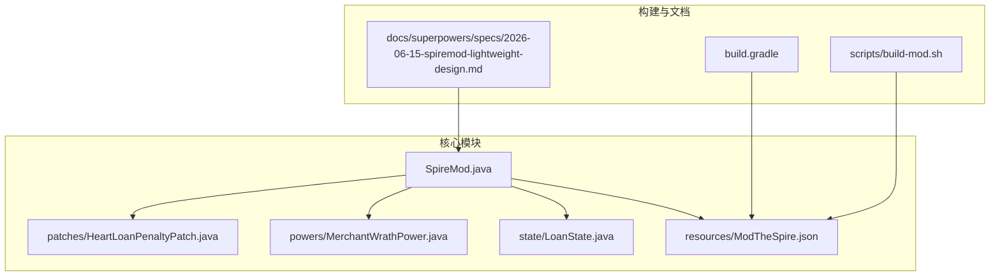
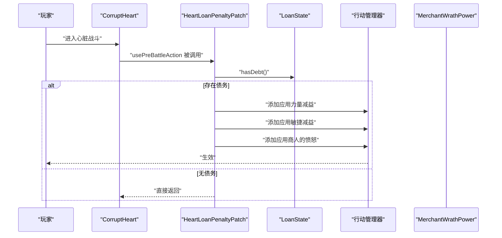
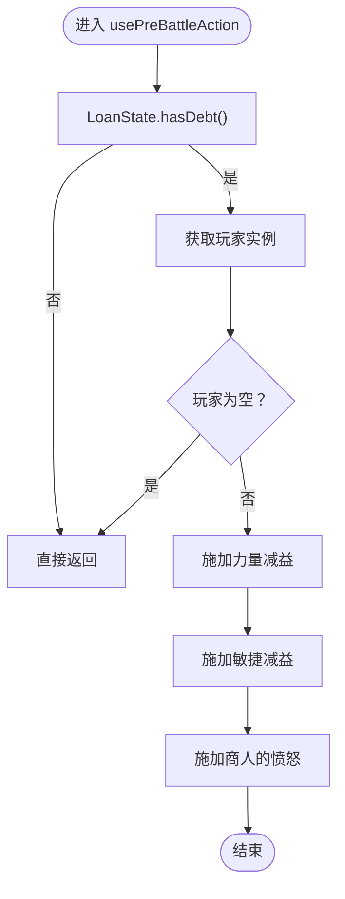
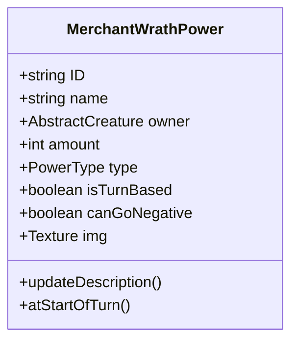
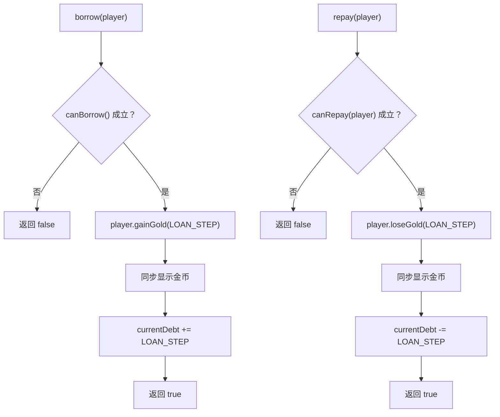
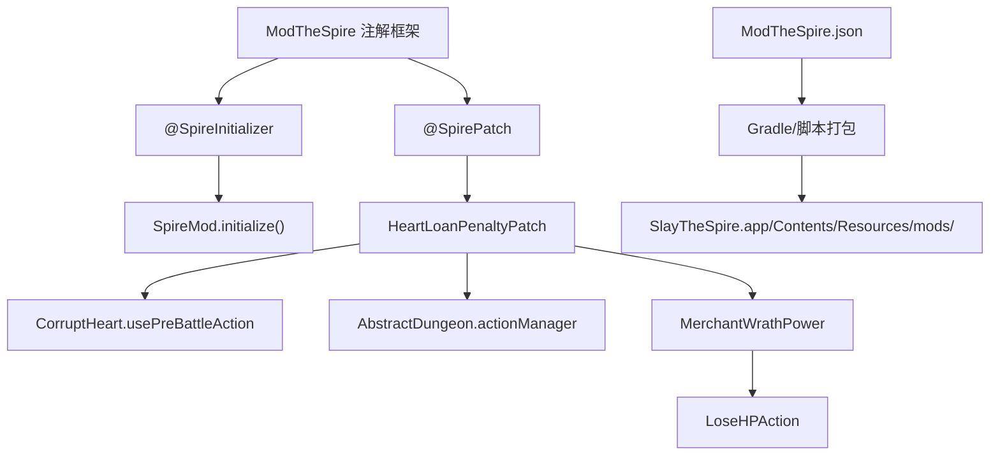

# 战斗惩罚系统

<cite>
**本文引用的文件**
- [HeartLoanPenaltyPatch.java](file://src/main/java/spiremod/patches/HeartLoanPenaltyPatch.java)
- [MerchantWrathPower.java](file://src/main/java/spiremod/powers/MerchantWrathPower.java)
- [LoanState.java](file://src/main/java/spiremod/state/LoanState.java)
- [SpireMod.java](file://src/main/java/spiremod/SpireMod.java)
- [ModTheSpire.json](file://src/main/resources/ModTheSpire.json)
- [2026-06-15-spiremod-lightweight-design.md](file://docs/superpowers/specs/2026-06-15-spiremod-lightweight-design.md)
- [build.gradle](file://build.gradle)
- [build-mod.sh](file://scripts/build-mod.sh)
</cite>

## 目录
1. [简介](#简介)
2. [项目结构](#项目结构)
3. [核心组件](#核心组件)
4. [架构总览](#架构总览)
5. [详细组件分析](#详细组件分析)
6. [依赖关系分析](#依赖关系分析)
7. [性能考量](#性能考量)
8. [故障排除指南](#故障排除指南)
9. [结论](#结论)
10. [附录](#附录)

## 简介
本文件聚焦于“战斗惩罚系统”的设计与实现，围绕心脏战斗时的债务惩罚机制展开，详细说明 HeartLoanPenaltyPatch 补丁如何监听 Boss 战事件并触发惩罚效果；同时深入解析 MerchantWrathPower 能力类的设计，包括商人的愤怒效果实现、生命值损失机制与视觉反馈系统。文档还提供补丁注解使用范式、能力触发条件与数值计算逻辑的示例路径，以及战斗平衡性分析、惩罚强度调节与与其他游戏机制的协调方式，并给出玩家策略调整与风险控制的实现建议。

## 项目结构
该 Mod 采用轻量级 SpirePatch 架构，不依赖 BaseMod，通过 ModTheSpire 提供的运行时补丁框架实现功能扩展。项目主要由以下模块组成：
- patches：存放运行时补丁类，用于拦截游戏事件并注入行为
- powers：存放自定义能力/增益/减益效果
- state：存放全局状态管理类
- resources：存放 Mod 元数据配置文件
- docs：存放设计文档与规范

图表来源
- [SpireMod.java:1-11](file://src/main/java/spiremod/SpireMod.java#L1-L11)
- [HeartLoanPenaltyPatch.java:1-41](file://src/main/java/spiremod/patches/HeartLoanPenaltyPatch.java#L1-L41)
- [MerchantWrathPower.java:1-39](file://src/main/java/spiremod/powers/MerchantWrathPower.java#L1-L39)
- [LoanState.java:1-56](file://src/main/java/spiremod/state/LoanState.java#L1-L56)
- [ModTheSpire.json:1-10](file://src/main/resources/ModTheSpire.json#L1-L10)
- [build.gradle:1-55](file://build.gradle#L1-L55)
- [build-mod.sh:1-38](file://scripts/build-mod.sh#L1-L38)
- [2026-06-15-spiremod-lightweight-design.md:1-111](file://docs/superpowers/specs/2026-06-15-spiremod-lightweight-design.md#L1-L111)

章节来源
- [2026-06-15-spiremod-lightweight-design.md:23-41](file://docs/superpowers/specs/2026-06-15-spiremod-lightweight-design.md#L23-L41)
- [build.gradle:14-29](file://build.gradle#L14-L29)
- [build-mod.sh:10-38](file://scripts/build-mod.sh#L10-L38)

## 核心组件
- HeartLoanPenaltyPatch：Boss 战前置动作拦截器，当玩家存在债务时对玩家施加力量与敏捷的负向状态，并附加商人的愤怒能力。
- MerchantWrathPower：基于回合开始的持续性减益，每回合造成固定生命值损失，并提供视觉反馈。
- LoanState：全局贷款状态管理，维护当前债务、最大债务上限与借还逻辑。

章节来源
- [HeartLoanPenaltyPatch.java:13-40](file://src/main/java/spiremod/patches/HeartLoanPenaltyPatch.java#L13-L40)
- [MerchantWrathPower.java:10-38](file://src/main/java/spiremod/powers/MerchantWrathPower.java#L10-L38)
- [LoanState.java:5-55](file://src/main/java/spiremod/state/LoanState.java#L5-L55)

## 架构总览
战斗惩罚系统以“事件驱动 + 状态驱动”为核心：
- 事件驱动：HeartLoanPenaltyPatch 在 CorruptHeart 使用前置动作时被触发，检查是否存在债务。
- 状态驱动：LoanState 提供债务状态查询与变更接口，决定是否执行惩罚。
- 能力驱动：若满足条件，系统向玩家施加多个负面状态（力量、敏捷、商人的愤怒），形成连带惩罚效果。

图表来源
- [HeartLoanPenaltyPatch.java:20-39](file://src/main/java/spiremod/patches/HeartLoanPenaltyPatch.java#L20-L39)
- [LoanState.java:26-28](file://src/main/java/spiremod/state/LoanState.java#L26-L28)

## 详细组件分析

### HeartLoanPenaltyPatch 补丁
- 补丁注解与目标
  - 使用 @SpirePatch 标注，目标类为 CorruptHeart，目标方法为 usePreBattleAction。
  - 该注解声明了补丁的拦截点，确保在 Boss 战前置阶段执行逻辑。
- 触发条件
  - 仅当 LoanState.hasDebt() 返回真时才执行惩罚。
  - 若玩家对象为空或不存在债务，则直接返回，避免空指针与无效操作。
- 惩罚效果
  - 对玩家施加力量与敏捷的负向状态，数值为固定惩罚值。
  - 同时施加 MerchantWrathPower，形成持续性的回合开始伤害。
- 执行顺序
  - 力量减益 → 敏捷减益 → 商人的愤怒，按顺序添加至底部队列，保证执行顺序与可见性。

图表来源
- [HeartLoanPenaltyPatch.java:20-39](file://src/main/java/spiremod/patches/HeartLoanPenaltyPatch.java#L20-L39)
- [LoanState.java:26-28](file://src/main/java/spiremod/state/LoanState.java#L26-L28)

章节来源
- [HeartLoanPenaltyPatch.java:13-40](file://src/main/java/spiremod/patches/HeartLoanPenaltyPatch.java#L13-L40)

### MerchantWrathPower 能力类
- 能力标识与类型
  - 使用自定义 ID，类型为 Debuff，回合内生效且不可为负值。
- 数值与描述
  - 回合开始时造成固定生命值损失，描述文本动态更新。
- 视觉反馈
  - atStartOfTurn 中触发闪屏提示，增强玩家感知。
- 生命周期
  - 作为回合开始型能力，每轮都会触发一次伤害，直至被移除或回合结束。

图表来源
- [MerchantWrathPower.java:10-38](file://src/main/java/spiremod/powers/MerchantWrathPower.java#L10-L38)

章节来源
- [MerchantWrathPower.java:10-38](file://src/main/java/spiremod/powers/MerchantWrathPower.java#L10-L38)

### LoanState 全局状态
- 状态常量
  - 借款步长与最大债务上限，用于控制可借额度与偿还节奏。
- 查询与变更
  - 提供当前债务查询、是否欠债判断、能否借款/还款的判定。
  - 借款与还款分别更新玩家金币与全局债务值，并同步显示金币。
- 防护措施
  - 借款前检查上限，还款前检查是否有债务与玩家存在，避免异常状态。

图表来源
- [LoanState.java:34-54](file://src/main/java/spiremod/state/LoanState.java#L34-L54)

章节来源
- [LoanState.java:5-55](file://src/main/java/spiremod/state/LoanState.java#L5-L55)

## 依赖关系分析
- 运行时框架
  - ModTheSpire 提供 @SpireInitializer 与 @SpirePatch 注解支持，SpireMod.java 作为初始化入口注册 Mod。
- 游戏对象依赖
  - HeartLoanPenaltyPatch 依赖 CorruptHeart 的前置动作方法、玩家与行动管理器。
  - MerchantWrathPower 依赖 LoseHPAction 与回合开始回调。
- 配置与打包
  - ModTheSpire.json 提供 modid、名称、版本与依赖版本信息。
  - build.gradle 与 build-mod.sh 将资源与字节码打包到 ModTheSpire 的 mods 目录。

图表来源
- [SpireMod.java:5-10](file://src/main/java/spiremod/SpireMod.java#L5-L10)
- [HeartLoanPenaltyPatch.java:13-16](file://src/main/java/spiremod/patches/HeartLoanPenaltyPatch.java#L13-L16)
- [MerchantWrathPower.java:28-32](file://src/main/java/spiremod/powers/MerchantWrathPower.java#L28-L32)
- [ModTheSpire.json:1-10](file://src/main/resources/ModTheSpire.json#L1-L10)
- [build.gradle:35-42](file://build.gradle#L35-L42)
- [build-mod.sh:33-36](file://scripts/build-mod.sh#L33-L36)

章节来源
- [SpireMod.java:5-10](file://src/main/java/spiremod/SpireMod.java#L5-L10)
- [HeartLoanPenaltyPatch.java:13-16](file://src/main/java/spiremod/patches/HeartLoanPenaltyPatch.java#L13-L16)
- [MerchantWrathPower.java:28-32](file://src/main/java/spiremod/powers/MerchantWrathPower.java#L28-L32)
- [ModTheSpire.json:1-10](file://src/main/resources/ModTheSpire.json#L1-L10)
- [build.gradle:35-42](file://build.gradle#L35-L42)
- [build-mod.sh:33-36](file://scripts/build-mod.sh#L33-L36)

## 性能考量
- 补丁执行成本
  - HeartLoanPenaltyPatch 仅在 Boss 战前置阶段执行，开销极低，且通过早期返回减少无效分支。
- 能力触发频率
  - MerchantWrathPower 每回合触发一次，属于常规频率，对帧率影响可忽略。
- 状态访问
  - LoanState 为静态状态管理，访问成本低，避免频繁对象创建。
- 建议
  - 如需进一步优化，可在补丁中缓存玩家实例与行动管理器引用，减少重复查找。

## 故障排除指南
- 未触发惩罚
  - 检查是否存在债务：LoanState.hasDebt() 是否返回真。
  - 确认补丁注解目标是否正确匹配 CorruptHeart 的前置动作方法。
- 空指针异常
  - 确保在补丁中对玩家对象进行非空检查后再施加效果。
- 生效但无视觉反馈
  - MerchantWrathPower 的闪屏在 atStartOfTurn 中触发，确认回合开始阶段是否正确调用。
- 构建失败
  - 确认 desktop-1.0.jar 与 ModTheSpire.jar 路径正确，Gradle/脚本构建脚本中的路径与实际安装路径一致。

章节来源
- [HeartLoanPenaltyPatch.java:20-28](file://src/main/java/spiremod/patches/HeartLoanPenaltyPatch.java#L20-L28)
- [MerchantWrathPower.java:28-32](file://src/main/java/spiremod/powers/MerchantWrathPower.java#L28-L32)
- [build.gradle:45-54](file://build.gradle#L45-L54)
- [build-mod.sh:15-23](file://scripts/build-mod.sh#L15-L23)

## 结论
战斗惩罚系统通过 HeartLoanPenaltyPatch 与 MerchantWrathPower 的协同，实现了“债务即代价”的核心机制：在心脏战斗中对玩家施加多重负面状态，形成持续伤害与属性削弱，有效提升战斗难度与策略深度。LoanState 提供清晰的状态边界与借还逻辑，确保惩罚强度可控并与玩家决策挂钩。整体设计简洁高效，符合轻量级 SpirePatch 架构的要求，并为后续扩展（如惩罚倍率、特殊抗性等）预留空间。

## 附录

### 补丁注解使用范式
- @SpirePatch(clz = 目标类, method = 目标方法)：声明补丁拦截点，确保与游戏内部方法签名一致。
- 在补丁类中使用 Postfix/Prefix 等变体时，注意与目标方法的调用时机与参数传递。

章节来源
- [HeartLoanPenaltyPatch.java:13-16](file://src/main/java/spiremod/patches/HeartLoanPenaltyPatch.java#L13-L16)

### 能力触发条件与数值计算
- 触发条件：仅当 LoanState.hasDebt() 为真时触发。
- 数值计算：力量与敏捷减益为固定惩罚值；商人的愤怒为每回合固定生命值损失。
- 计算复杂度：均为 O(1)，无循环或递归。

章节来源
- [HeartLoanPenaltyPatch.java:18-38](file://src/main/java/spiremod/patches/HeartLoanPenaltyPatch.java#L18-L38)
- [MerchantWrathPower.java:13-31](file://src/main/java/spiremod/powers/MerchantWrathPower.java#L13-L31)

### 战斗平衡性分析与调节建议
- 强度调节
  - 力量/敏捷减益：可按当前债务比例线性增加，使高负债者承受更大压力。
  - 商人的愤怒：可随回合数累积，或与当前血量挂钩，形成“越打越难”的体验。
- 抗性与减免
  - 引入抗性能力或装备，允许玩家在特定条件下减免部分惩罚。
- 与其他机制的协调
  - 与商店贷款联动：限制在有债务期间无法使用某些商店功能，或提高利息。
  - 与遗物/能力配合：某些遗物可抵消部分惩罚，鼓励玩家围绕策略选择取舍。

### 玩家策略调整与风险控制
- 借贷策略
  - 控制借债节奏，避免在心脏战前过度负债导致惩罚过强。
  - 利用回合间隙偿还部分债务，降低惩罚强度。
- 防御与规避
  - 优先选择能减少负面状态或提供回复的卡牌与遗物。
  - 在心脏战前准备足够的资源以应对持续伤害。