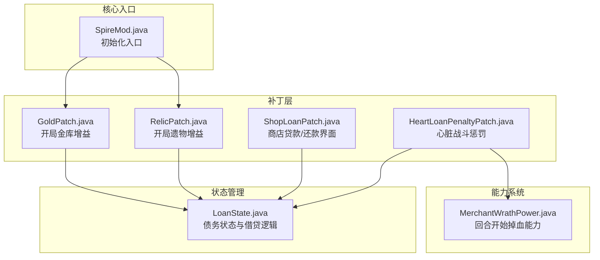
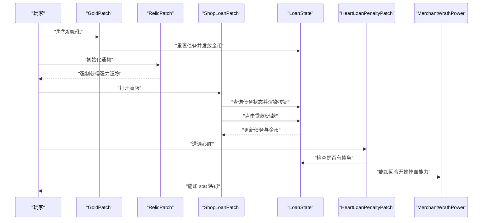
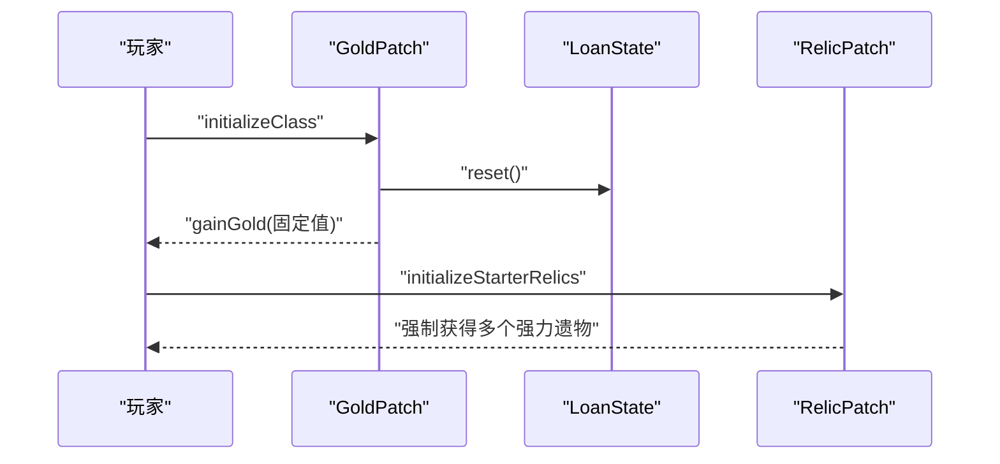
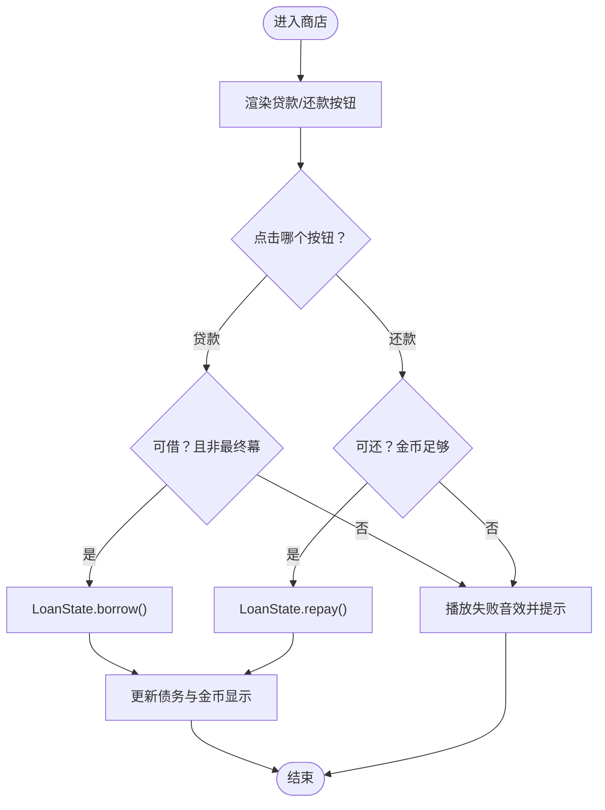
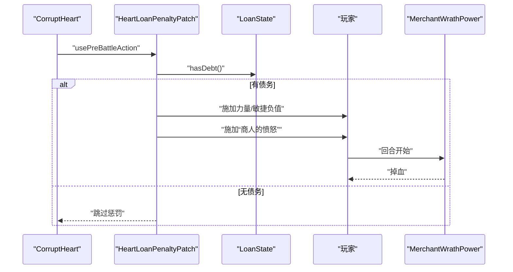
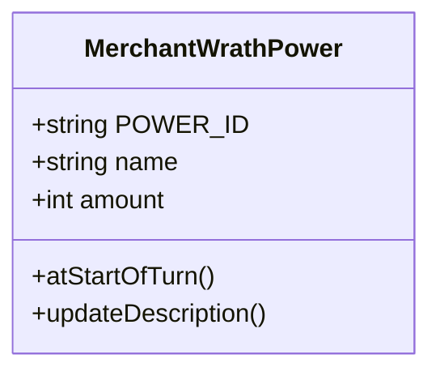
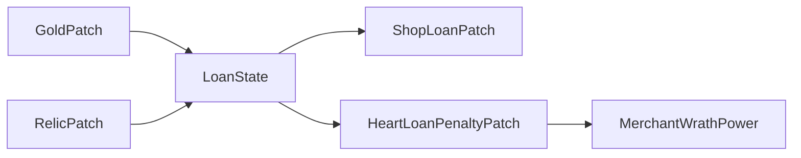

# 核心功能

<cite>
**本文引用的文件**
- [SpireMod.java](file://src/main/java/spiremod/SpireMod.java)
- [LoanState.java](file://src/main/java/spiremod/state/LoanState.java)
- [MerchantWrathPower.java](file://src/main/java/spiremod/powers/MerchantWrathPower.java)
- [GoldPatch.java](file://src/main/java/spiremod/patches/GoldPatch.java)
- [HeartLoanPenaltyPatch.java](file://src/main/java/spiremod/patches/HeartLoanPenaltyPatch.java)
- [RelicPatch.java](file://src/main/java/spiremod/patches/RelicPatch.java)
- [ShopLoanPatch.java](file://src/main/java/spiremod/patches/ShopLoanPatch.java)
- [ModTheSpire.json](file://src/main/resources/ModTheSpire.json)
- [README.md](file://README.md)
- [build.gradle](file://build.gradle)
- [settings.gradle](file://settings.gradle)
</cite>

## 目录
1. [简介](#简介)
2. [项目结构](#项目结构)
3. [核心组件](#核心组件)
4. [架构总览](#架构总览)
5. [详细组件分析](#详细组件分析)
6. [依赖关系分析](#依赖关系分析)
7. [性能考量](#性能考量)
8. [故障排查指南](#故障排查指南)
9. [结论](#结论)
10. [附录](#附录)

## 简介
本文件面向 SpireMod 的核心功能，围绕四大模块进行系统化说明：
- 初始资源增益系统（开局 +200 金币与强力遗物）
- 经济系统（贷款/还款机制）
- 战斗惩罚系统（心脏战斗时的债务惩罚）
- 商人愤怒能力（持续回合开始掉血）

文档将解释各模块的实现原理、触发条件、参数配置、用户体验影响，并梳理模块间的相互作用与依赖关系；同时提供可扩展性建议、测试方法与调试技巧，帮助开发者快速理解与二次开发。

## 项目结构
SpireMod 采用按职责分层的组织方式：
- patches 层：通过 ModTheSpire Patch 对游戏原生逻辑进行增强或替换
- state 层：集中管理全局状态（如债务状态）
- powers 层：定义新能力（如“商人的愤怒”）
- 入口类：Mod 初始化入口

图表来源
- [SpireMod.java:1-11](file://src/main/java/spiremod/SpireMod.java#L1-L11)
- [LoanState.java:1-56](file://src/main/java/spiremod/state/LoanState.java#L1-L56)
- [MerchantWrathPower.java:1-39](file://src/main/java/spiremod/powers/MerchantWrathPower.java#L1-L39)
- [GoldPatch.java:1-34](file://src/main/java/spiremod/patches/GoldPatch.java#L1-L34)
- [RelicPatch.java:1-46](file://src/main/java/spiremod/patches/RelicPatch.java#L1-L46)
- [ShopLoanPatch.java:1-203](file://src/main/java/spiremod/patches/ShopLoanPatch.java#L1-L203)
- [HeartLoanPenaltyPatch.java:1-41](file://src/main/java/spiremod/patches/HeartLoanPenaltyPatch.java#L1-L41)

章节来源
- [SpireMod.java:1-11](file://src/main/java/spiremod/SpireMod.java#L1-L11)
- [README.md:1-47](file://README.md#L1-L47)

## 核心组件
本节对四大核心功能逐一解析，包括实现原理、触发条件、关键参数与用户影响。

- 初始资源增益系统
  - 原理：在角色初始化时重置债务状态并发放固定金币；同时强制给予若干强力遗物。
  - 触发：角色选择完成、进入第一幕前的初始化阶段。
  - 关键参数：开局金币增益数值、遗物列表。
  - 用户体验：开局即拥有可观资金与强力遗物，降低早期压力。

- 经济系统（贷款/还款）
  - 原理：通过全局债务状态控制借贷额度与还款条件；在商店界面添加贷款/还款按钮，调用状态机完成增减金。
  - 触发：商店打开时显示按钮；点击按钮执行借贷操作。
  - 关键参数：单次借贷步长、最大债务上限、是否允许在最终幕贷款。
  - 用户体验：灵活的资金调度，但需承担债务上限与还款条件约束。

- 战斗惩罚系统（心脏战斗时的债务惩罚）
  - 原理：当玩家有债务且遭遇心脏时，在战前施加力量/敏捷负值与“商人的愤怒”能力。
  - 触发：CorruptHeart 使用预战斗动作时。
  - 关键参数：stat 惩罚值、是否应用“商人的愤怒”。
  - 用户体验：高风险高回报策略下，债务会带来显著战斗劣势。

- 商人愤怒能力
  - 原理：回合开始时造成固定伤害；作为“债务惩罚”的一部分被施加。
  - 触发：回合开始阶段。
  - 关键参数：每回合掉血量。
  - 用户体验：持续压力迫使尽快还清债务，形成节奏闭环。

章节来源
- [GoldPatch.java:1-34](file://src/main/java/spiremod/patches/GoldPatch.java#L1-L34)
- [RelicPatch.java:1-46](file://src/main/java/spiremod/patches/RelicPatch.java#L1-L46)
- [LoanState.java:1-56](file://src/main/java/spiremod/state/LoanState.java#L1-L56)
- [ShopLoanPatch.java:1-203](file://src/main/java/spiremod/patches/ShopLoanPatch.java#L1-L203)
- [HeartLoanPenaltyPatch.java:1-41](file://src/main/java/spiremod/patches/HeartLoanPenaltyPatch.java#L1-L41)
- [MerchantWrathPower.java:1-39](file://src/main/java/spiremod/powers/MerchantWrathPower.java#L1-L39)

## 架构总览
SpireMod 的整体架构以“状态中心 + 补丁增强 + 能力系统”为核心：
- 状态中心：LoanState 提供统一的债务状态与借贷规则
- 补丁增强：GoldPatch、RelicPatch 在开局阶段注入资源；ShopLoanPatch 在商店界面注入交互；HeartLoanPenaltyPatch 在特定敌人战斗前施加惩罚
- 能力系统：MerchantWrathPower 作为回合开始掉血的 debuff 能力

图表来源
- [GoldPatch.java:16-32](file://src/main/java/spiremod/patches/GoldPatch.java#L16-L32)
- [RelicPatch.java:22-31](file://src/main/java/spiremod/patches/RelicPatch.java#L22-L31)
- [ShopLoanPatch.java:46-94](file://src/main/java/spiremod/patches/ShopLoanPatch.java#L46-L94)
- [LoanState.java:14-54](file://src/main/java/spiremod/state/LoanState.java#L14-L54)
- [HeartLoanPenaltyPatch.java:20-39](file://src/main/java/spiremod/patches/HeartLoanPenaltyPatch.java#L20-L39)
- [MerchantWrathPower.java:28-32](file://src/main/java/spiremod/powers/MerchantWrathPower.java#L28-L32)

## 详细组件分析

### 初始资源增益系统
- 功能要点
  - 开局金币增益：在角色初始化后立即发放固定数量金币，并同步显示值
  - 强力遗物：在初始化阶段强制获得一组强力遗物，确保开局强度
- 实现要点
  - 金币增益通过角色初始化补丁完成，同时重置债务状态
  - 遗物增益通过遍历预设 ID 列表，若未持有则复制并即时获得
- 参数与配置
  - 开局金币增益数值由补丁内常量定义
  - 遗物列表由补丁内的固定集合决定
- 用户体验
  - 显著降低早期资金压力，提升容错率与探索欲望

图表来源
- [GoldPatch.java:16-32](file://src/main/java/spiremod/patches/GoldPatch.java#L16-L32)
- [RelicPatch.java:22-31](file://src/main/java/spiremod/patches/RelicPatch.java#L22-L31)

章节来源
- [GoldPatch.java:1-34](file://src/main/java/spiremod/patches/GoldPatch.java#L1-L34)
- [RelicPatch.java:1-46](file://src/main/java/spiremod/patches/RelicPatch.java#L1-L46)

### 经济系统（贷款/还款机制）
- 功能要点
  - 债务上限与步长：单次借贷步长与最大债务上限由状态机定义
  - 交互界面：在商店打开时渲染贷款/还款按钮，支持悬停与点击反馈
  - 条件限制：最终幕禁止贷款；还款需要玩家金币足够
- 实现要点
  - 状态机负责增减金与债务计算，并暴露查询接口
  - 商店补丁在 open/update/render 生命周期中注入按钮与逻辑
- 参数与配置
  - 单次借贷步长、最大债务上限、按钮位置与颜色、提示文本
- 用户体验
  - 提供灵活的资金调度，但需权衡风险与收益

图表来源
- [ShopLoanPatch.java:46-94](file://src/main/java/spiremod/patches/ShopLoanPatch.java#L46-L94)
- [ShopLoanPatch.java:150-180](file://src/main/java/spiremod/patches/ShopLoanPatch.java#L150-L180)
- [LoanState.java:34-54](file://src/main/java/spiremod/state/LoanState.java#L34-L54)

章节来源
- [LoanState.java:1-56](file://src/main/java/spiremod/state/LoanState.java#L1-L56)
- [ShopLoanPatch.java:1-203](file://src/main/java/spiremod/patches/ShopLoanPatch.java#L1-L203)

### 战斗惩罚系统（心脏战斗时的债务惩罚）
- 功能要点
  - 债务惩罚：当玩家有债务时，遭遇心脏会在战前施加 stat 惩罚与“商人的愤怒”
  - 能力施加：回合开始掉血能力在回合开始时生效
- 实现要点
  - 心脏预战斗动作补丁检测债务状态，若存在则施加多种 debuff
  - “商人的愤怒”作为独立能力注册，回合开始时触发掉血
- 参数与配置
  - stat 惩罚值、掉血量、触发条件
- 用户体验
  - 高风险策略的即时反噬，形成“债主”心理压力

图表来源
- [HeartLoanPenaltyPatch.java:20-39](file://src/main/java/spiremod/patches/HeartLoanPenaltyPatch.java#L20-L39)
- [MerchantWrathPower.java:28-32](file://src/main/java/spiremod/powers/MerchantWrathPower.java#L28-L32)

章节来源
- [HeartLoanPenaltyPatch.java:1-41](file://src/main/java/spiremod/patches/HeartLoanPenaltyPatch.java#L1-L41)
- [MerchantWrathPower.java:1-39](file://src/main/java/spiremod/powers/MerchantWrathPower.java#L1-L39)

### 商人愤怒能力
- 功能要点
  - 回合开始掉血：回合开始时对拥有者造成固定数值的伤害
  - 能力类型：debuff，不可叠加为负值
- 实现要点
  - 能力注册与描述更新；回合开始事件中触发掉血动作
- 参数与配置
  - 掉血量、能力图标、描述文本
- 用户体验
  - 形成持续压力，促使玩家尽快偿还债务

图表来源
- [MerchantWrathPower.java:10-39](file://src/main/java/spiremod/powers/MerchantWrathPower.java#L10-L39)

章节来源
- [MerchantWrathPower.java:1-39](file://src/main/java/spiremod/powers/MerchantWrathPower.java#L1-L39)

## 依赖关系分析
- 内部依赖
  - 所有补丁均依赖 LoanState 进行债务状态查询与变更
  - 心脏战斗惩罚依赖 MerchantWrathPower 作为能力载体
- 外部依赖
  - ModTheSpire 注入式补丁框架
  - 游戏内部的商店界面、角色初始化、敌人预战斗等生命周期
- 潜在耦合与风险
  - 商店按钮与输入处理紧密耦合，需注意渲染与交互顺序
  - 心脏战斗惩罚与能力系统耦合，需避免重复施加

图表来源
- [LoanState.java:1-56](file://src/main/java/spiremod/state/LoanState.java#L1-L56)
- [ShopLoanPatch.java:1-203](file://src/main/java/spiremod/patches/ShopLoanPatch.java#L1-L203)
- [HeartLoanPenaltyPatch.java:1-41](file://src/main/java/spiremod/patches/HeartLoanPenaltyPatch.java#L1-L41)
- [MerchantWrathPower.java:1-39](file://src/main/java/spiremod/powers/MerchantWrathPower.java#L1-L39)
- [GoldPatch.java:1-34](file://src/main/java/spiremod/patches/GoldPatch.java#L1-L34)
- [RelicPatch.java:1-46](file://src/main/java/spiremod/patches/RelicPatch.java#L1-L46)

章节来源
- [build.gradle:26-29](file://build.gradle#L26-L29)
- [ModTheSpire.json:1-10](file://src/main/resources/ModTheSpire.json#L1-L10)

## 性能考量
- 补丁开销
  - 商店界面补丁在渲染与更新阶段频繁计算按钮状态，建议保持状态查询为 O(1)，已满足
- 能力触发
  - 回合开始掉血仅在回合开始时触发一次，开销极低
- 建议
  - 将按钮颜色与布局参数抽取为配置项，便于统一风格与减少硬编码
  - 在大规模补丁场景下，优先使用最小化补丁范围与最短生命周期

## 故障排查指南
- 问题：商店中看不到贷款/还款按钮
  - 检查是否处于最终幕（最终幕禁用贷款）
  - 检查债务是否已达上限
  - 检查金币是否足够用于还款
- 问题：贷款/还款无效
  - 确认 LoanState 的 canBorrow/canRepay 返回值
  - 确认角色对象非空
- 问题：心脏战斗未施加惩罚
  - 确认玩家是否存在债务
  - 确认补丁是否正确绑定到敌人预战斗动作
- 问题：能力未生效或重复叠加
  - 检查回合开始事件是否正确触发
  - 检查能力是否被重复施加

章节来源
- [ShopLoanPatch.java:187-201](file://src/main/java/spiremod/patches/ShopLoanPatch.java#L187-L201)
- [HeartLoanPenaltyPatch.java:20-39](file://src/main/java/spiremod/patches/HeartLoanPenaltyPatch.java#L20-L39)
- [MerchantWrathPower.java:28-32](file://src/main/java/spiremod/powers/MerchantWrathPower.java#L28-L32)

## 结论
SpireMod 通过“状态中心 + 补丁增强 + 能力系统”的设计，实现了从开局资源增益到战斗惩罚的完整闭环。经济系统提供了灵活的资金调度，而债务惩罚与“商人的愤怒”则形成了清晰的风险与收益权衡。该架构具备良好的可扩展性，便于进一步定制参数、新增交互与能力。

## 附录
- 自定义扩展建议
  - 参数化：将贷款步长、最大债务、掉血量、stat 惩罚值等提取为配置项
  - 新增能力：基于 MerchantWrathPower 的模式新增更多回合开始效果
  - 新增触发：在其他敌人或场景中引入债务相关的惩罚
- 测试方法
  - 单元测试：针对 LoanState 的 canBorrow/canRepay/borrow/repay 进行边界测试
  - 场景测试：模拟不同债务水平下的商店交互与心脏战斗
  - 回放验证：确认回合开始掉血与能力叠加行为符合预期
- 调试技巧
  - 使用日志输出关键分支（如债务上限、金币不足、最终幕判断）
  - 在补丁中临时增加视觉反馈（如按钮颜色变化）以验证交互路径
  - 分阶段验证：先验证状态机，再验证补丁集成，最后验证战斗惩罚