# 经济系统

<cite>
**本文档引用的文件**
- [ShopLoanPatch.java](file://src/main/java/spiremod/patches/ShopLoanPatch.java)
- [LoanSavePatch.java](file://src/main/java/spiremod/patches/LoanSavePatch.java)
- [LoanState.java](file://src/main/java/spiremod/state/LoanState.java)
- [GoldPatch.java](file://src/main/java/spiremod/patches/GoldPatch.java)
- [HeartLoanPenaltyPatch.java](file://src/main/java/spiremod/patches/HeartLoanPenaltyPatch.java)
- [RelicPatch.java](file://src/main/java/spiremod/patches/RelicPatch.java)
- [MerchantWrathPower.java](file://src/main/java/spiremod/powers/MerchantWrathPower.java)
- [SpireMod.java](file://src/main/java/spiremod/SpireMod.java)
- [ModTheSpire.json](file://src/main/resources/ModTheSpire.json)
</cite>

## 目录
1. [简介](#简介)
2. [项目结构](#项目结构)
3. [核心组件](#核心组件)
4. [架构概览](#架构概览)
5. [详细组件分析](#详细组件分析)
6. [依赖关系分析](#依赖关系分析)
7. [性能考虑](#性能考虑)
8. [故障排除指南](#故障排除指南)
9. [结论](#结论)
10. [扩展开发指南](#扩展开发指南)

## 简介

SpireMod 是一个轻量级的《杀戮尖塔》模组，专注于经济系统的深度整合。该模组通过五个核心补丁实现了完整的贷款系统：`ShopLoanPatch` 在商店界面添加贷款功能，`LoanSavePatch` 提供贷款状态的持久化存储，`LoanState` 管理贷款状态，`GoldPatch` 初始化玩家金币，以及 `HeartLoanPenaltyPatch` 实施贷款惩罚机制。

**更新** 新增了贷款持久化补丁系统，确保贷款状态在游戏存档和读档过程中得到正确保存和恢复，增强了系统的完整性和用户体验。

贷款系统采用增量式设计，每次贷款和还款均为100金币，最大债务限制为500金币。系统通过ModTheSpire框架的补丁机制无缝集成到游戏核心功能中，为玩家提供策略性的经济选择。

## 项目结构

该项目采用清晰的分层架构，按照功能模块组织代码：

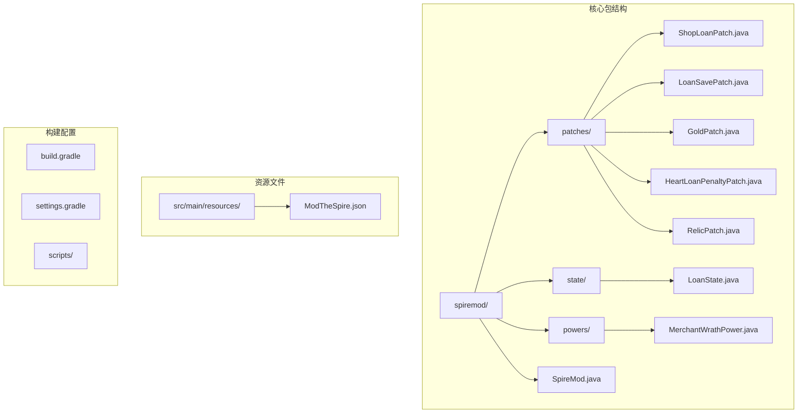

**图表来源**
- [SpireMod.java:1-11](file://src/main/java/spiremod/SpireMod.java#L1-L11)
- [ShopLoanPatch.java:1-203](file://src/main/java/spiremod/patches/ShopLoanPatch.java#L1-L203)
- [LoanSavePatch.java:1-94](file://src/main/java/spiremod/patches/LoanSavePatch.java#L1-L94)
- [LoanState.java:1-60](file://src/main/java/spiremod/state/LoanState.java#L1-L60)

**章节来源**
- [SpireMod.java:1-11](file://src/main/java/spiremod/SpireMod.java#L1-L11)
- [build.gradle:1-56](file://build.gradle#L1-L56)

## 核心组件

### 贷款状态持久化系统

**更新** 新增了完整的贷款状态持久化机制，确保玩家的贷款状态在游戏存档和读档过程中得到正确保存和恢复。

`LoanSavePatch` 类实现了贷款状态的文件级持久化：

- **存档机制**：在游戏存档时自动将当前债务写入专用文件
- **读档恢复**：在游戏读档时从文件中恢复之前的贷款状态
- **文件管理**：无债务时自动清理存档文件，避免数据残留
- **反射调用**：通过反射访问SaveHelper的私有方法获取存档目录

### 贷款状态管理器

`LoanState` 类是整个经济系统的核心，采用静态方法设计模式，提供统一的状态管理和业务逻辑：

- **贷款金额单位**：每次贷款和还款固定为100金币（LOAN_STEP）
- **最大债务限制**：500金币（MAX_DEBT），防止无限借贷
- **状态跟踪**：维护当前债务余额，支持重置和查询操作
- **业务验证**：提供完整的借贷验证逻辑
- **状态同步**：与游戏金币状态保持实时同步

### 商店贷款补丁

`ShopLoanPatch` 实现了商店界面的贷款功能，通过ModTheSpire的补丁机制拦截商店屏幕的生命周期：

- **界面元素**：添加贷款按钮和还款按钮
- **状态显示**：实时显示当前债务和最大债务限制
- **交互处理**：响应鼠标点击和悬停事件
- **视觉反馈**：提供颜色变化和文本提示

### 金币初始化补丁

`GoldPatch` 在新游戏开始时为玩家提供初始金币和物品：

- **初始金币**：+200金币奖励
- **随机物品**：提供多种稀有物品作为启动资源
- **状态重置**：确保每次新游戏从零开始
- **文件清理**：删除上局残留的贷款存档文件

### 心脏贷款惩罚补丁

`HeartLoanPenaltyPatch` 实施了贷款的策略性惩罚机制：

- **统计惩罚**：对有债务的玩家施加力量和敏捷惩罚
- **负面效果**：附加商人愤怒状态效果
- **游戏平衡**：通过风险控制机制平衡贷款系统的收益

**章节来源**
- [LoanSavePatch.java:1-94](file://src/main/java/spiremod/patches/LoanSavePatch.java#L1-L94)
- [LoanState.java:1-60](file://src/main/java/spiremod/state/LoanState.java#L1-L60)
- [ShopLoanPatch.java:1-203](file://src/main/java/spiremod/patches/ShopLoanPatch.java#L1-L203)
- [GoldPatch.java:1-59](file://src/main/java/spiremod/patches/GoldPatch.java#L1-L59)
- [HeartLoanPenaltyPatch.java:1-41](file://src/main/java/spiremod/patches/HeartLoanPenaltyPatch.java#L1-L41)

## 架构概览

贷款系统采用插件化架构，通过ModTheSpire框架实现非侵入式的游戏修改，并新增了持久化层确保状态的长期保存：

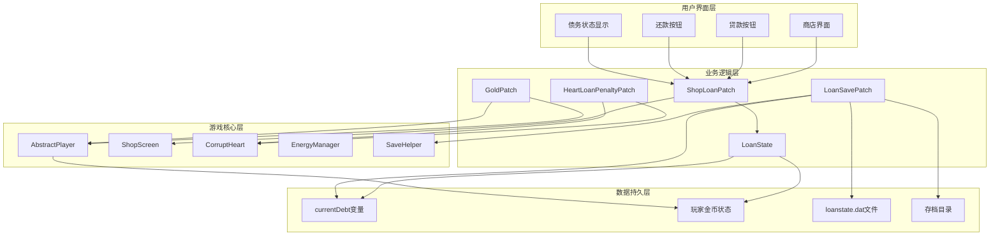

**图表来源**
- [ShopLoanPatch.java:17-203](file://src/main/java/spiremod/patches/ShopLoanPatch.java#L17-L203)
- [LoanSavePatch.java:16-94](file://src/main/java/spiremod/patches/LoanSavePatch.java#L16-L94)
- [LoanState.java:5-60](file://src/main/java/spiremod/state/LoanState.java#L5-L60)
- [GoldPatch.java:13-59](file://src/main/java/spiremod/patches/GoldPatch.java#L13-L59)
- [HeartLoanPenaltyPatch.java:13-41](file://src/main/java/spiremod/patches/HeartLoanPenaltyPatch.java#L13-L41)

系统的关键特性包括：

- **非阻塞设计**：所有补丁都使用Postfix方法，不影响原有功能
- **状态隔离**：贷款状态独立于游戏其他部分，避免副作用
- **条件执行**：根据游戏状态动态启用或禁用功能
- **错误处理**：提供完善的边界检查和错误反馈
- **持久化保障**：通过文件系统确保贷款状态的长期保存

## 详细组件分析

### LoanSavePatch 组件分析

**更新** 新增了完整的贷款状态持久化组件，实现了贷款系统的核心数据持久化功能。

`LoanSavePatch` 类提供了两个核心补丁来管理贷款状态的存档和读档：

#### 类结构图

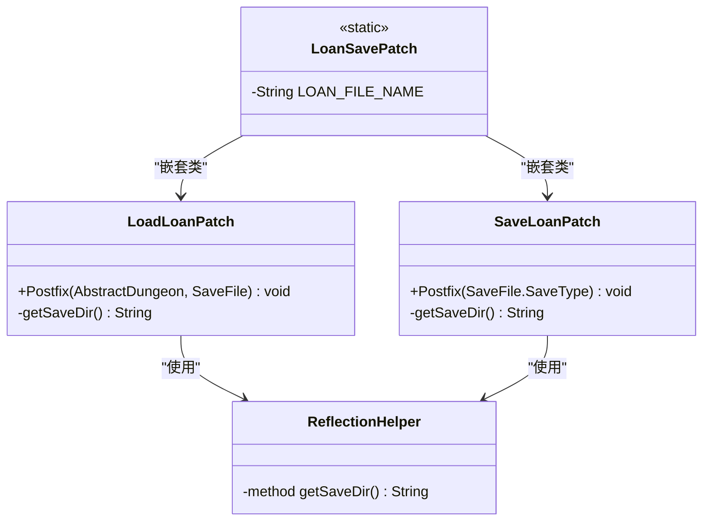

**图表来源**
- [LoanSavePatch.java:16-94](file://src/main/java/spiremod/patches/LoanSavePatch.java#L16-L94)

#### 存档流程

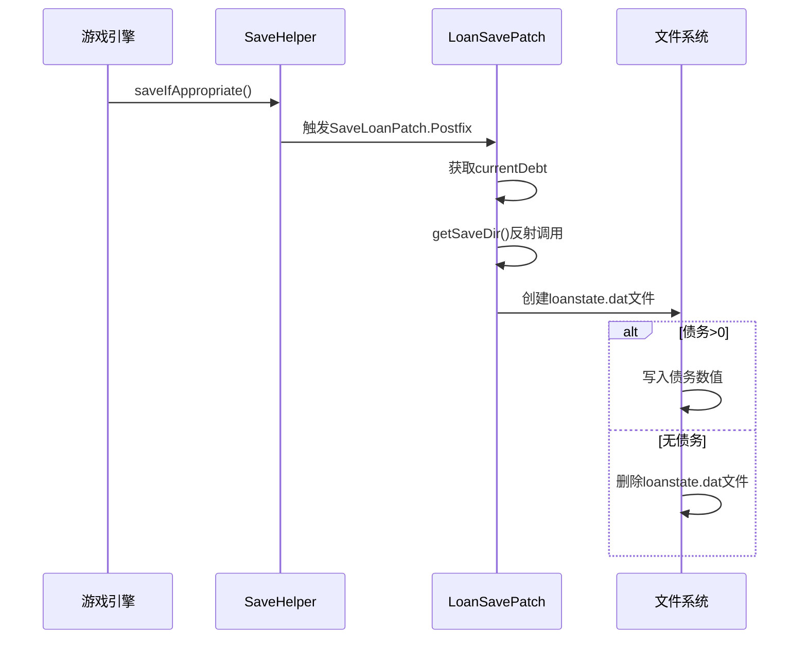

**图表来源**
- [LoanSavePatch.java:23-47](file://src/main/java/spiremod/patches/LoanSavePatch.java#L23-L47)

#### 读档流程

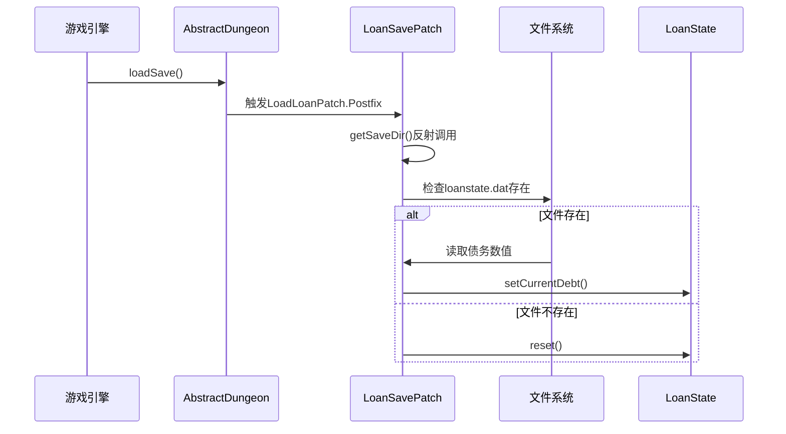

**图表来源**
- [LoanSavePatch.java:52-78](file://src/main/java/spiremod/patches/LoanSavePatch.java#L52-L78)

#### 错误处理机制

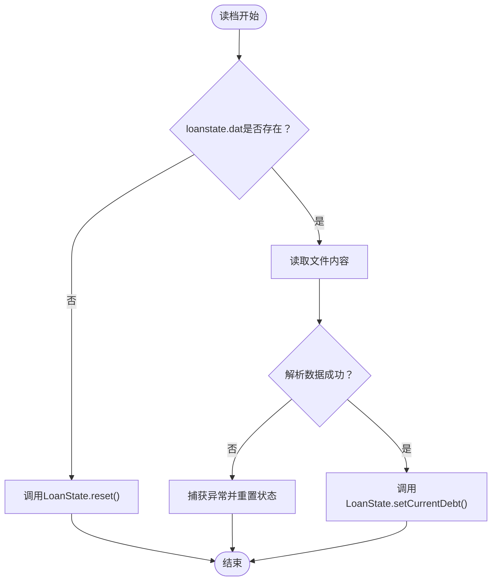

**图表来源**
- [LoanSavePatch.java:67-77](file://src/main/java/spiremod/patches/LoanSavePatch.java#L67-L77)

**章节来源**
- [LoanSavePatch.java:1-94](file://src/main/java/spiremod/patches/LoanSavePatch.java#L1-L94)

### ShopLoanPatch 组件分析

`ShopLoanPatch` 是贷款系统的核心界面组件，实现了商店屏幕的完整贷款功能：

#### 类结构图

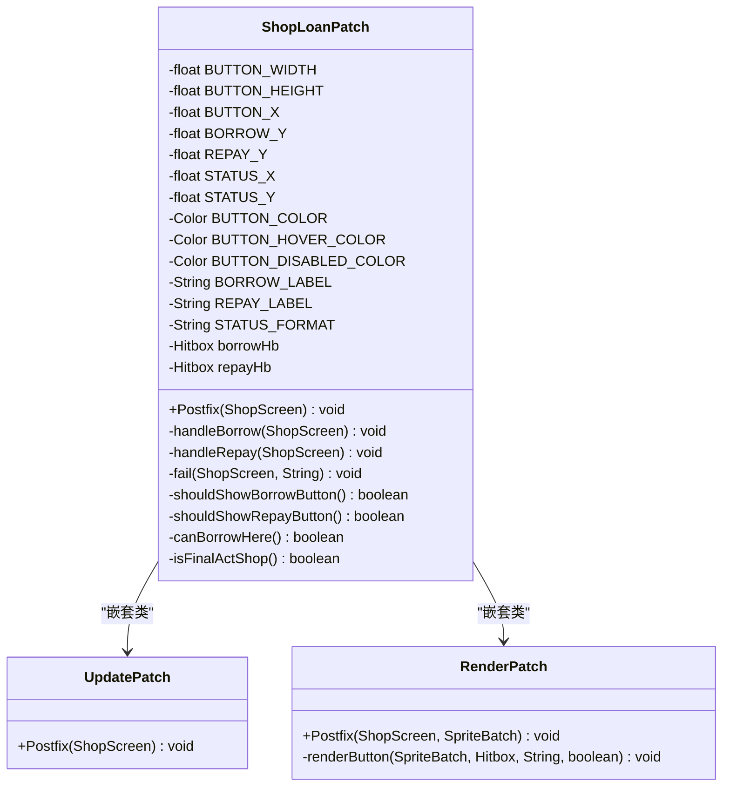

**图表来源**
- [ShopLoanPatch.java:21-203](file://src/main/java/spiremod/patches/ShopLoanPatch.java#L21-L203)

#### 界面交互流程

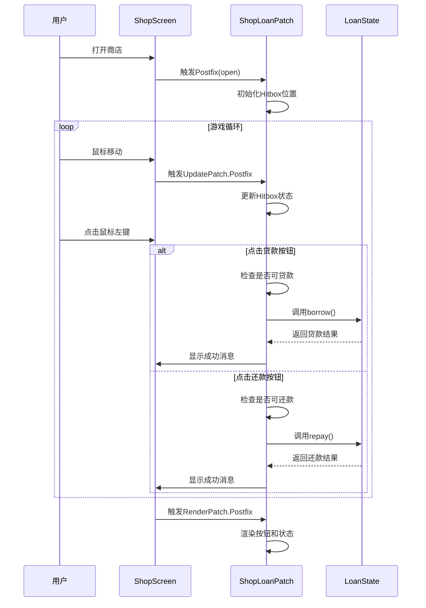

**图表来源**
- [ShopLoanPatch.java:64-148](file://src/main/java/spiremod/patches/ShopLoanPatch.java#L64-L148)
- [LoanState.java:38-58](file://src/main/java/spiremod/state/LoanState.java#L38-L58)

#### 错误处理流程

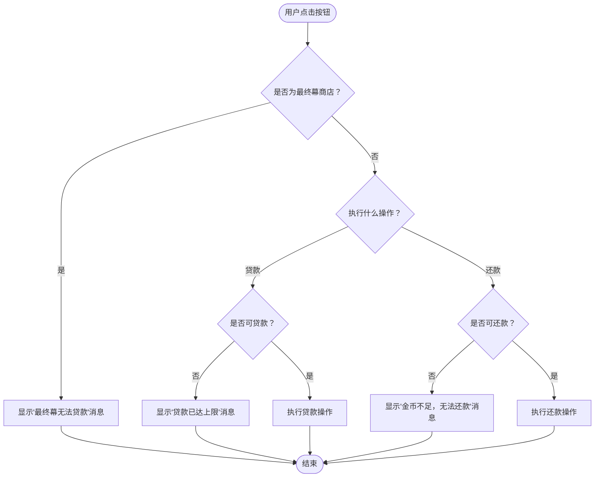

**图表来源**
- [ShopLoanPatch.java:150-185](file://src/main/java/spiremod/patches/ShopLoanPatch.java#L150-L185)

**章节来源**
- [ShopLoanPatch.java:1-203](file://src/main/java/spiremod/patches/ShopLoanPatch.java#L1-L203)

### LoanState 组件分析

`LoanState` 类实现了贷款系统的完整业务逻辑，采用单例模式的静态方法设计：

#### 类结构图

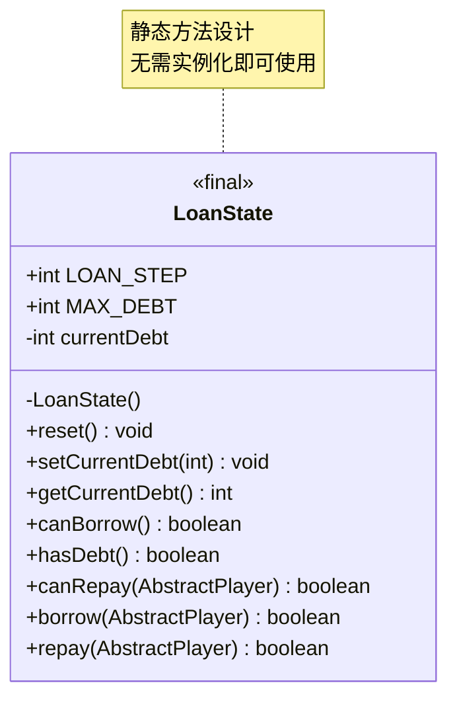

**图表来源**
- [LoanState.java:5-60](file://src/main/java/spiremod/state/LoanState.java#L5-L60)

#### 状态管理流程

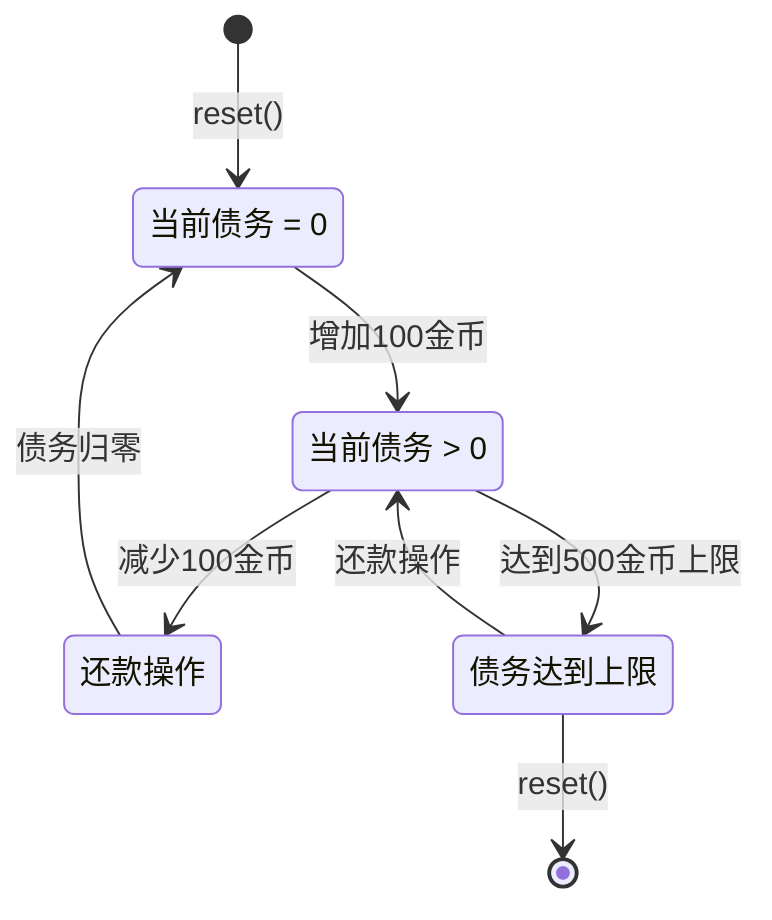

**图表来源**
- [LoanState.java:14-58](file://src/main/java/spiremod/state/LoanState.java#L14-L58)

#### 贷款规则实现

贷款系统遵循以下核心规则：

1. **增量交易**：每次贷款和还款固定为100金币
2. **上限控制**：最大债务为500金币，防止无限借贷
3. **资金验证**：还款前必须确保玩家有足够的金币
4. **状态同步**：贷款和还款同时更新游戏内金币显示
5. **边界保护**：自动限制债务在有效范围内

**章节来源**
- [LoanState.java:1-60](file://src/main/java/spiremod/state/LoanState.java#L1-L60)

### GoldPatch 组件分析

`GoldPatch` 补丁负责在游戏开始时初始化玩家的经济状态：

#### 初始化流程

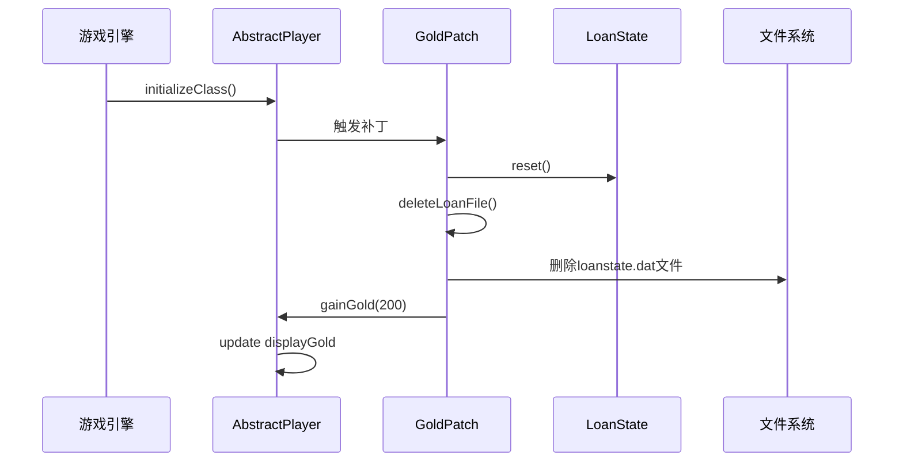

**图表来源**
- [GoldPatch.java:21-38](file://src/main/java/spiremod/patches/GoldPatch.java#L21-L38)

**章节来源**
- [GoldPatch.java:1-59](file://src/main/java/spiremod/patches/GoldPatch.java#L1-L59)

### HeartLoanPenaltyPatch 组件分析

`HeartLoanPenaltyPatch` 实施了贷款的策略性惩罚机制：

#### 惩罚触发流程

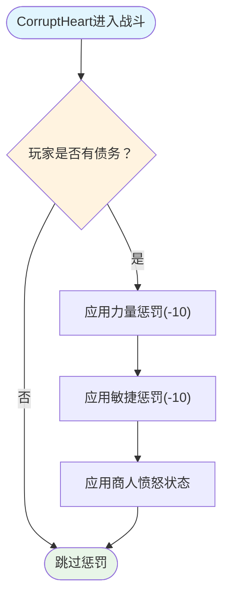

**图表来源**
- [HeartLoanPenaltyPatch.java:20-39](file://src/main/java/spiremod/patches/HeartLoanPenaltyPatch.java#L20-L39)

**章节来源**
- [HeartLoanPenaltyPatch.java:1-41](file://src/main/java/spiremod/patches/HeartLoanPenaltyPatch.java#L1-L41)

## 依赖关系分析

贷款系统的依赖关系简洁明了，主要依赖于ModTheSpire框架和游戏核心类，并新增了文件系统依赖：

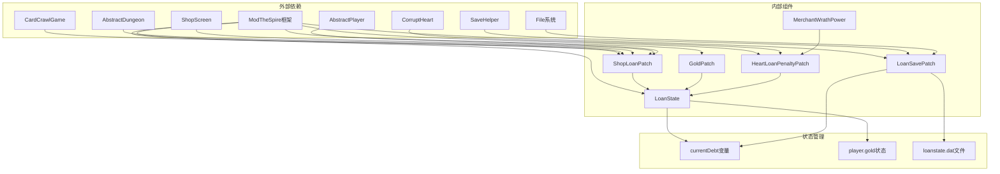

**图表来源**
- [ShopLoanPatch.java:3-15](file://src/main/java/spiremod/patches/ShopLoanPatch.java#L3-L15)
- [LoanSavePatch.java:3-9](file://src/main/java/spiremod/patches/LoanSavePatch.java#L3-L9)
- [LoanState.java:3-5](file://src/main/java/spiremod/state/LoanState.java#L3-L5)

### 关键依赖说明

1. **ModTheSpire框架**：提供补丁机制和游戏钩子
2. **游戏核心类**：访问玩家状态和游戏场景
3. **文件系统**：用于贷款状态的持久化存储
4. **状态管理**：维护贷款系统的全局状态

**章节来源**
- [ShopLoanPatch.java:1-203](file://src/main/java/spiremod/patches/ShopLoanPatch.java#L1-L203)
- [LoanSavePatch.java:1-94](file://src/main/java/spiremod/patches/LoanSavePatch.java#L1-L94)
- [LoanState.java:1-60](file://src/main/java/spiremod/state/LoanState.java#L1-L60)

## 性能考虑

贷款系统的性能优化主要体现在以下几个方面：

### 内存管理
- **静态状态**：使用静态变量存储贷款状态，避免频繁的对象创建
- **Hitbox复用**：重用按钮的Hitbox对象，减少内存分配
- **字符串缓存**：预定义常量字符串，避免重复创建
- **文件句柄管理**：及时关闭文件流，避免资源泄漏

### 计算效率
- **简单算法**：贷款计算仅涉及基本的加减运算
- **快速验证**：使用简单的比较操作进行状态检查
- **条件短路**：在验证失败时立即返回，避免不必要的计算
- **反射缓存**：反射调用仅在必要时执行

### 渲染优化
- **批量绘制**：使用SpriteBatch进行批量图形渲染
- **条件渲染**：仅在需要时渲染按钮和状态信息
- **颜色缓存**：预定义颜色值，避免运行时计算

### 文件系统优化
- **延迟写入**：仅在有债务变化时才写入文件
- **原子操作**：文件写入采用一次性写入，避免部分写入
- **异常处理**：完善的文件操作异常处理机制

## 故障排除指南

### 常见问题及解决方案

#### 贷款按钮不可用
**症状**：贷款按钮显示为灰色且无法点击
**原因**：
- 已达到最大债务限制
- 当前处于最终幕商店
- 游戏状态异常

**解决方法**：
1. 检查当前债务是否达到500金币
2. 确认当前不在最终幕（TheEnding ID）
3. 重新加载游戏或重启模组

#### 还款失败
**症状**：尝试还款时显示"金币不足，无法还款"
**原因**：
- 玩家金币少于100金币
- 系统检测到玩家没有债务
- 游戏状态损坏

**解决方法**：
1. 确保玩家至少有100金币
2. 检查贷款状态是否正确
3. 重新开始游戏或重置贷款状态

#### 状态不同步
**症状**：界面显示的债务与实际不符
**原因**：
- 贷款状态未正确重置
- 游戏保存数据损坏
- 模组版本冲突

**解决方法**：
1. 使用`LoanState.reset()`重置状态
2. 删除游戏存档重新开始
3. 检查模组兼容性

#### 存档文件问题
**症状**：游戏存档后贷款状态丢失
**原因**：
- loanstate.dat文件损坏
- 存档目录权限问题
- 反射调用失败

**解决方法**：
1. 检查存档目录权限
2. 删除损坏的loanstate.dat文件
3. 重新开始游戏创建新的存档文件

**章节来源**
- [ShopLoanPatch.java:150-185](file://src/main/java/spiremod/patches/ShopLoanPatch.java#L150-L185)
- [LoanSavePatch.java:67-77](file://src/main/java/spiremod/patches/LoanSavePatch.java#L67-L77)
- [LoanState.java:14-16](file://src/main/java/spiremod/state/LoanState.java#L14-L16)

## 结论

SpireMod 的经济系统通过精心设计的贷款机制为《杀戮尖塔》提供了深度的策略性玩法。系统的核心优势包括：

### 设计亮点
- **渐进式学习曲线**：从简单的金币奖励到复杂的贷款策略
- **风险与回报平衡**：通过惩罚机制控制过度借贷
- **无缝集成**：利用ModTheSpire框架实现非侵入式修改
- **持久化保障**：新增的文件系统持久化确保状态长期保存
- **可扩展性**：模块化的组件设计便于功能扩展

### 技术成就
- **状态管理**：简洁高效的静态状态管理模式
- **用户界面**：直观的按钮设计和即时反馈
- **错误处理**：完善的边界检查和用户友好的错误提示
- **性能优化**：最小化的性能影响和内存占用
- **数据持久化**：可靠的文件系统存档机制

### 游戏价值
贷款系统不仅增加了游戏的策略深度，还为玩家提供了更多决策机会。通过合理的风险控制和平衡性设计，系统确保了游戏体验的流畅性和公平性。

## 扩展开发指南

### 新增贷款功能

要为贷款系统添加新功能，建议遵循以下步骤：

#### 1. 定义新的业务规则
```java
// 在LoanState中添加新方法
public static boolean canUpgrade() {
    return currentDebt >= UPGRADE_THRESHOLD && player.hasRelic(UPGRADE_RELIC);
}

public static boolean upgrade() {
    if (!canUpgrade()) return false;
    // 实现升级逻辑
    return true;
}
```

#### 2. 更新UI界面
```java
// 在ShopLoanPatch中添加新按钮
private static Hitbox upgradeHb;

// 在Postfix中初始化
upgradeHb.move(BUTTON_X, UPGRADE_Y);

// 在render中显示
if (shouldShowUpgradeButton()) {
    renderButton(sb, upgradeHb, UPGRADE_LABEL, canUpgrade());
}
```

#### 3. 实现状态同步
确保新功能与现有状态管理系统保持一致，使用相同的验证和错误处理模式。

### 持久化扩展

**更新** 如需扩展持久化功能，可以参考现有的LoanSavePatch模式：

#### 1. 创建新的持久化补丁
```java
@SpirePatch(
    clz = SaveHelper.class,
    method = "saveIfAppropriate"
)
public static class NewSavePatch {
    public static void Postfix(SaveFile.SaveType saveType) {
        // 实现新的数据保存逻辑
        String data = serializeNewData();
        writeToFile(data);
    }
}
```

#### 2. 实现读档恢复
```java
@SpirePatch(
    clz = AbstractDungeon.class,
    method = "loadSave"
)
public static class NewLoadPatch {
    public static void Postfix(AbstractDungeon __instance, SaveFile saveFile) {
        // 实现数据恢复逻辑
        String data = readFromFile();
        if (data != null) {
            deserializeNewData(data);
        }
    }
}
```

### 性能优化建议

#### 1. 缓存常用数据
```java
private static Integer cachedDebt = null;
private static Long lastUpdate = 0L;

public static int getCachedDebt() {
    long now = System.currentTimeMillis();
    if (cachedDebt == null || now - lastUpdate > CACHE_DURATION) {
        cachedDebt = currentDebt;
        lastUpdate = now;
    }
    return cachedDebt;
}
```

#### 2. 异步处理复杂计算
对于需要大量计算的功能，考虑使用异步处理避免阻塞游戏主线程。

### 测试策略

#### 1. 单元测试
为每个业务逻辑方法编写测试用例，验证边界条件和异常情况。

#### 2. 集成测试
模拟完整的游戏流程，测试贷款系统的整体行为。

#### 3. 兼容性测试
确保新功能与现有模组和游戏版本的兼容性。

#### 4. 持久化测试
专门测试存档和读档功能，确保数据完整性。

### 最佳实践

#### 1. 错误处理
始终包含完整的错误检查和用户反馈机制。

#### 2. 状态一致性
确保所有状态变更都通过统一的接口进行，避免状态不一致。

#### 3. 文档维护
为每个新功能编写详细的文档和注释，便于后续维护。

#### 4. 性能监控
定期监控性能指标，确保新功能不会影响游戏流畅度。

通过遵循这些指导原则，开发者可以安全地扩展贷款系统，同时保持系统的稳定性和性能。