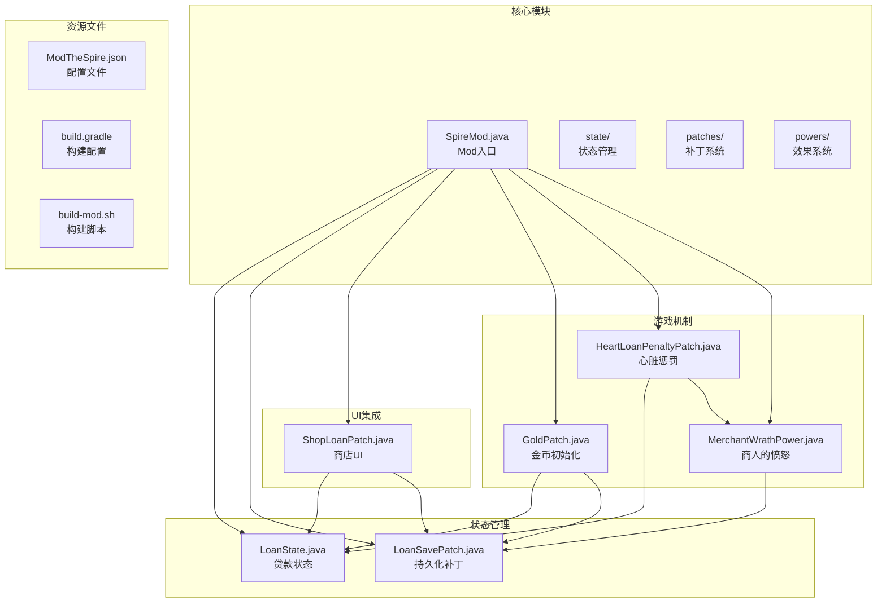
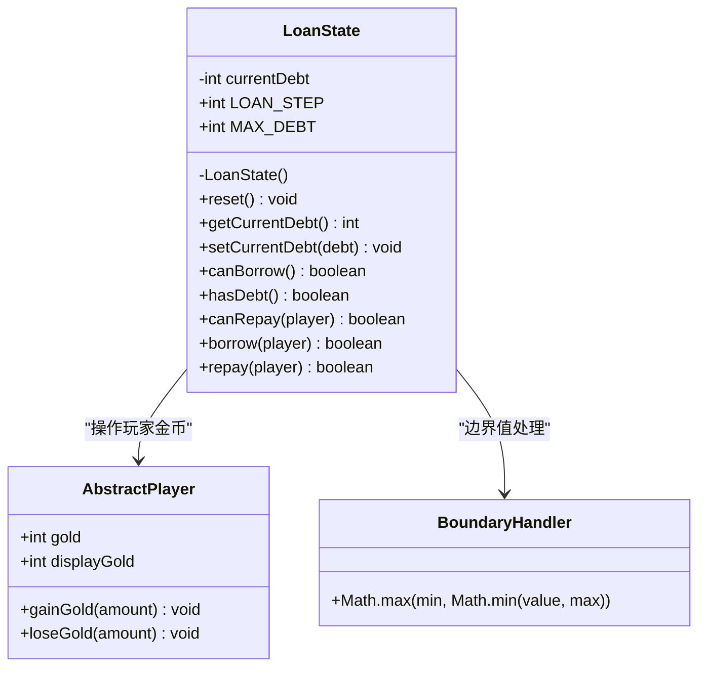
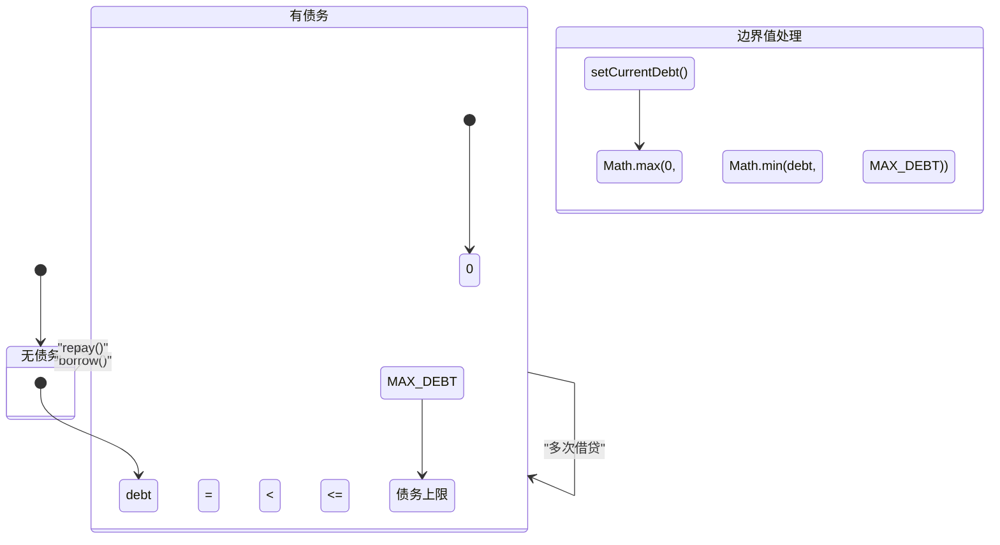
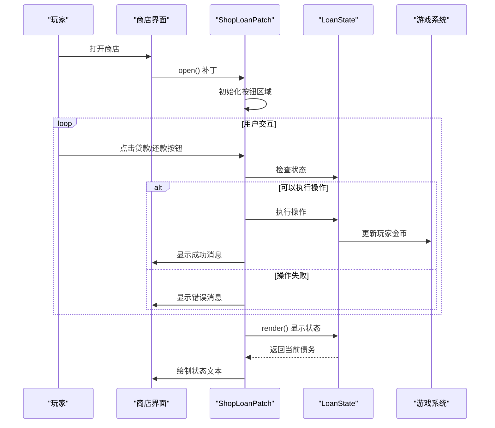
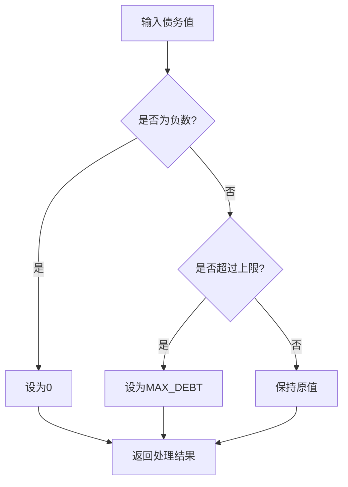
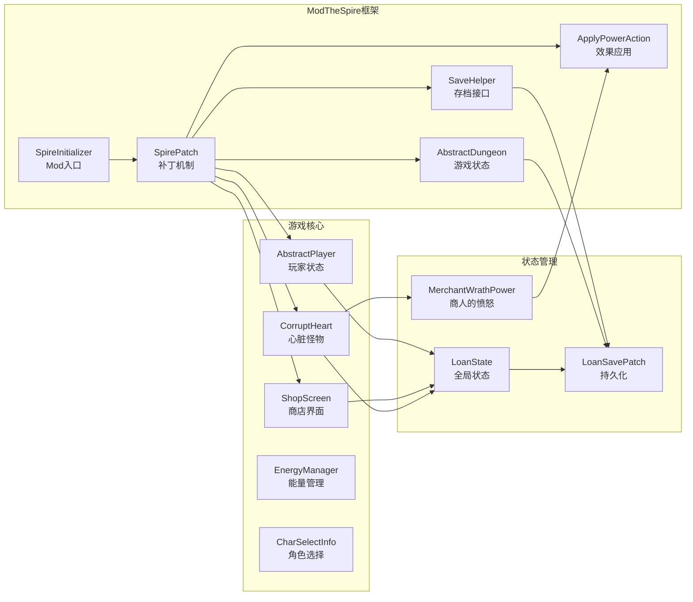
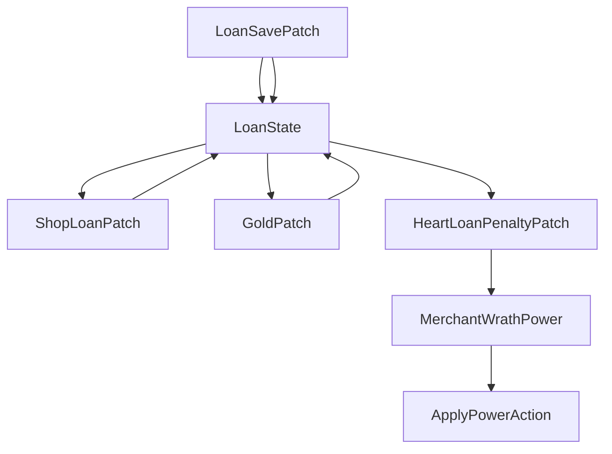

# 状态管理

<cite>
**本文档引用的文件**
- [LoanState.java](file://src/main/java/spiremod/state/LoanState.java)
- [LoanSavePatch.java](file://src/main/java/spiremod/patches/LoanSavePatch.java)
- [ShopLoanPatch.java](file://src/main/java/spiremod/patches/ShopLoanPatch.java)
- [GoldPatch.java](file://src/main/java/spiremod/patches/GoldPatch.java)
- [HeartLoanPenaltyPatch.java](file://src/main/java/spiremod/patches/HeartLoanPenaltyPatch.java)
- [MerchantWrathPower.java](file://src/main/java/spiremod/powers/MerchantWrathPower.java)
- [SpireMod.java](file://src/main/java/spiremod/SpireMod.java)
- [ModTheSpire.json](file://src/main/resources/ModTheSpire.json)
- [2026-06-15-spiremod-lightweight-design.md](file://docs/superpowers/specs/2026-06-15-spiremod-lightweight-design.md)
- [build.gradle](file://build.gradle)
- [build-mod.sh](file://scripts/build-mod.sh)
</cite>

## 更新摘要
**变更内容**
- 新增贷款状态持久化机制的详细实现
- 添加边界值处理逻辑的完整说明
- 更新状态同步策略以包含持久化支持
- 增强错误处理和数据验证机制
- 完善状态管理的最佳实践指导

## 目录
1. [简介](#简介)
2. [项目结构](#项目结构)
3. [核心组件](#核心组件)
4. [架构概览](#架构概览)
5. [详细组件分析](#详细组件分析)
6. [持久化机制](#持久化机制)
7. [边界值处理](#边界值处理)
8. [依赖关系分析](#依赖关系分析)
9. [性能考虑](#性能考虑)
10. [故障排除指南](#故障排除指南)
11. [结论](#结论)

## 简介

SpireMod 是一个轻量级的《杀戮尖塔》Mod，采用纯 SpirePatch 技术实现，无需依赖 BaseMod。该 Mod 的状态管理系统围绕 LoanState 类构建，实现了贷款功能的核心逻辑，包括债务管理、状态同步、用户界面集成和持久化机制。

LoanState 类是整个 Mod 的核心状态容器，负责维护全局的贷款状态，包括当前债务金额、最大债务限制和相关的操作方法。该系统通过 ModTheSpire 的补丁机制与游戏的核心功能进行深度集成，提供了完整的贷款生命周期管理，包括状态的持久化存储和恢复。

## 项目结构

SpireMod 采用模块化的项目结构，主要分为以下几个关键部分：



**图表来源**
- [SpireMod.java:1-11](file://src/main/java/spiremod/SpireMod.java#L1-L11)
- [LoanState.java:1-60](file://src/main/java/spiremod/state/LoanState.java#L1-L60)
- [LoanSavePatch.java:1-94](file://src/main/java/spiremod/patches/LoanSavePatch.java#L1-L94)
- [ShopLoanPatch.java:1-203](file://src/main/java/spiremod/patches/ShopLoanPatch.java#L1-L203)

**章节来源**
- [SpireMod.java:1-11](file://src/main/java/spiremod/SpireMod.java#L1-L11)
- [2026-06-15-spiremod-lightweight-design.md:23-41](file://docs/superpowers/specs/2026-06-15-spiremod-lightweight-design.md#L23-L41)

## 核心组件

### LoanState 类设计

LoanState 是一个静态工具类，采用了单例模式的变体设计，通过私有构造函数确保不可实例化，所有方法均为静态方法。该类的设计体现了以下特点：

#### 数据结构设计
- **currentDebt**: 当前债务金额，使用 `static` 关键字确保全局唯一性
- **LOAN_STEP**: 固定的贷款步长，每次贷款/还款的基础单位（100金币）
- **MAX_DEBT**: 最大债务限制，防止无限贷款（500金币）

#### 状态管理机制
LoanState 通过静态字段实现全局状态管理，所有访问和修改都通过静态方法进行，确保了状态的一致性和可访问性。

**章节来源**
- [LoanState.java:5-24](file://src/main/java/spiremod/state/LoanState.java#L5-L24)
- [LoanState.java:9](file://src/main/java/spiremod/state/LoanState.java#L9)

### 状态同步策略

系统采用事件驱动的状态同步机制，包括持久化同步：

1. **初始化同步**: 在角色初始化时重置贷款状态并增加初始金币
2. **UI同步**: 商店界面实时显示当前债务状态
3. **游戏机制同步**: 心脏战时根据债务状态应用惩罚效果
4. **持久化同步**: 自动保存和恢复贷款状态

**章节来源**
- [GoldPatch.java:34-38](file://src/main/java/spiremod/patches/GoldPatch.java#L34-L38)
- [ShopLoanPatch.java:106-122](file://src/main/java/spiremod/patches/ShopLoanPatch.java#L106-L122)
- [HeartLoanPenaltyPatch.java:20-39](file://src/main/java/spiremod/patches/HeartLoanPenaltyPatch.java#L20-L39)

## 架构概览

SpireMod 的状态管理系统采用分层架构设计，从底层的状态管理到上层的用户界面集成形成了完整的状态处理链路，现在还包括持久化层：

```mermaid
graph TD
subgraph "持久化层"
A[LoanSavePatch<br/>状态持久化]
B[SaveHelper<br/>存档接口]
C[文件系统<br/>loanstate.dat]
end
subgraph "状态管理层"
D[LoanState<br/>全局状态容器]
E[状态常量<br/>LOAN_STEP, MAX_DEBT]
end
subgraph "业务逻辑层"
F[borrow()<br/>贷款操作]
G[repay()<br/>还款操作]
H[canBorrow()<br/>贷款检查]
I[canRepay()<br/>还款检查]
J[setCurrentDebt()<br/>边界值处理]
end
subgraph "集成层"
K[ShopLoanPatch<br/>商店UI集成]
L[GoldPatch<br/>初始化集成]
M[HeartLoanPenaltyPatch<br/>惩罚机制]
end
subgraph "外部依赖"
N[AbstractPlayer<br/>玩家状态]
O[ShopScreen<br/>商店界面]
P[CorruptHeart<br/>心脏怪物]
Q[ApplyPowerAction<br/>效果应用]
R[SaveFile<br/>存档文件]
end
A --> B
A --> C
A --> D
D --> F
D --> G
D --> H
D --> I
D --> J
F --> N
G --> N
K --> D
K --> O
L --> D
L --> R
M --> D
M --> P
M --> Q
H --> D
I --> D
I --> N
J --> D
```

**图表来源**
- [LoanSavePatch.java:23-78](file://src/main/java/spiremod/patches/LoanSavePatch.java#L23-L78)
- [LoanState.java:38-58](file://src/main/java/spiremod/state/LoanState.java#L38-L58)
- [ShopLoanPatch.java:150-180](file://src/main/java/spiremod/patches/ShopLoanPatch.java#L150-L180)
- [GoldPatch.java:34-38](file://src/main/java/spiremod/patches/GoldPatch.java#L34-L38)
- [HeartLoanPenaltyPatch.java:20-39](file://src/main/java/spiremod/patches/HeartLoanPenaltyPatch.java#L20-L39)

## 详细组件分析

### LoanState 类详细分析

#### 类结构图



**图表来源**
- [LoanState.java:5-59](file://src/main/java/spiremod/state/LoanState.java#L5-L59)

#### 状态转换逻辑

LoanState 实现了完整的状态转换图，包括边界值处理：



**图表来源**
- [LoanState.java:18-24](file://src/main/java/spiremod/state/LoanState.java#L18-L24)
- [LoanState.java:38-58](file://src/main/java/spiremod/state/LoanState.java#L38-L58)

#### 方法详细说明

##### 基础状态管理方法

| 方法 | 参数 | 返回值 | 功能描述 | 边界处理 |
|------|------|--------|----------|----------|
| reset() | 无 | void | 将当前债务重置为0 | 无 |
| getCurrentDebt() | 无 | int | 获取当前债务金额 | 无 |
| hasDebt() | 无 | boolean | 检查是否存在债务 | 无 |

##### 边界值处理方法

| 方法 | 参数 | 返回值 | 功能描述 | 错误处理 |
|------|------|--------|----------|----------|
| setCurrentDebt(int debt) | debt | void | 设置债务金额并进行边界检查 | 使用 Math.max(0, Math.min(debt, MAX_DEBT)) |

##### 贷款操作方法

| 方法 | 参数 | 返回值 | 功能描述 | 错误处理 |
|------|------|--------|----------|----------|
| canBorrow() | 无 | boolean | 检查是否可以贷款 | 检查债务上限 |
| borrow(AbstractPlayer) | player | boolean | 执行贷款操作 | 空指针检查、上限检查 |
| canRepay(AbstractPlayer) | player | boolean | 检查是否可以还款 | 债务检查、金币检查 |
| repay(AbstractPlayer) | player | boolean | 执行还款操作 | 还款条件检查、金币不足处理 |

**章节来源**
- [LoanState.java:14-59](file://src/main/java/spiremod/state/LoanState.java#L14-L59)

### 商店UI集成组件

#### ShopLoanPatch 类分析

ShopLoanPatch 通过 ModTheSpire 的补丁机制与商店界面深度集成：



**图表来源**
- [ShopLoanPatch.java:46-93](file://src/main/java/spiremod/patches/ShopLoanPatch.java#L46-L93)
- [ShopLoanPatch.java:150-180](file://src/main/java/spiremod/patches/ShopLoanPatch.java#L150-L180)

#### UI状态同步机制

商店界面通过以下方式保持与贷款状态的同步：

1. **实时状态显示**: 在渲染阶段动态获取并显示当前债务状态
2. **按钮状态控制**: 根据贷款状态动态启用/禁用贷款和还款按钮
3. **交互反馈**: 提供成功和失败的操作反馈消息

**章节来源**
- [ShopLoanPatch.java:100-122](file://src/main/java/spiremod/patches/ShopLoanPatch.java#L100-L122)
- [ShopLoanPatch.java:187-202](file://src/main/java/spiremod/patches/ShopLoanPatch.java#L187-L202)

### 游戏机制集成

#### 初始状态设置

GoldPatch 补丁在角色初始化时执行以下操作：

1. **状态重置**: 调用 `LoanState.reset()` 将债务重置为0
2. **旧文件清理**: 删除可能存在的遗留贷款存档文件
3. **金币奖励**: 为玩家增加200金币
4. **显示同步**: 更新显示的金币数量

#### 债务惩罚机制

HeartLoanPenaltyPatch 在心脏战前应用以下惩罚：

1. **状态检查**: 检查玩家是否有债务
2. **属性惩罚**: 应用力量和敏捷的负向效果
3. **特殊效果**: 添加商人的愤怒效果

**章节来源**
- [GoldPatch.java:34-38](file://src/main/java/spiremod/patches/GoldPatch.java#L34-L38)
- [HeartLoanPenaltyPatch.java:20-39](file://src/main/java/spiremod/patches/HeartLoanPenaltyPatch.java#L20-L39)

## 持久化机制

### 贷款状态持久化设计

LoanSavePatch 实现了完整的贷款状态持久化机制，确保玩家的贷款状态可以在游戏存档和读档之间正确保存和恢复。

#### 持久化策略

```mermaid
flowchart TD
A[游戏状态] --> B{债务状态检查}
B --> |有债务| C[保存到文件]
B --> |无债务| D[删除存档文件]
C --> E[loanstate.dat]
D --> F[删除文件]
E --> G[读档时恢复]
F --> H[重置状态]
G --> I[LoanState.setCurrentDebt()]
H --> J[LoanState.reset()]
```

**图表来源**
- [LoanSavePatch.java:28-46](file://src/main/java/spiremod/patches/LoanSavePatch.java#L28-L46)
- [LoanSavePatch.java:57-77](file://src/main/java/spiremod/patches/LoanSavePatch.java#L57-L77)

#### 存档流程

当游戏进行存档时，LoanSavePatch 会自动执行以下步骤：

1. **获取当前债务**: 从 LoanState 中获取当前债务金额
2. **定位存档目录**: 通过反射调用 SaveHelper.getSaveDir() 获取存档路径
3. **文件处理**: 
   - 如果债务大于0，则将债务值写入 loanstate.dat 文件
   - 如果债务等于0，则删除可能存在的存档文件
4. **异常处理**: 捕获并记录任何 IO 异常

#### 读档流程

当游戏进行读档时，LoanSavePatch 会自动执行以下步骤：

1. **定位存档目录**: 通过反射调用 SaveHelper.getSaveDir() 获取存档路径
2. **文件检查**: 检查 loanstate.dat 文件是否存在
3. **状态恢复**:
   - 如果文件存在，读取债务值并调用 LoanState.setCurrentDebt()
   - 如果文件不存在，调用 LoanState.reset() 重置状态
4. **错误处理**: 捕获并记录任何 IO 或格式化异常，确保系统安全回退

**章节来源**
- [LoanSavePatch.java:23-78](file://src/main/java/spiremod/patches/LoanSavePatch.java#L23-L78)

### 持久化技术实现

#### 反射机制

LoanSavePatch 使用 Java 反射机制访问 SaveHelper 类的私有方法：

```java
private static String getSaveDir() {
    try {
        Method method = SaveHelper.class.getDeclaredMethod("getSaveDir");
        method.setAccessible(true);
        return (String) method.invoke(null);
    } catch (Exception e) {
        e.printStackTrace();
        return null;
    }
}
```

这种方法允许 Mod 访问 ModTheSpire 框架的内部功能，但需要谨慎处理可能的兼容性问题。

#### 文件存储格式

贷款状态以简单的文本格式存储，每行包含一个整数表示的债务金额：

```
100
```

这种格式简单可靠，易于调试和手动修改。

**章节来源**
- [LoanSavePatch.java:83-92](file://src/main/java/spiremod/patches/LoanSavePatch.java#L83-L92)

## 边界值处理

### 边界值处理机制

LoanState 实现了严格的边界值处理机制，确保债务状态始终在有效范围内。

#### 边界值定义

- **最小值**: 0（不能有负债）
- **最大值**: 500（MAX_DEBT 常量）
- **步长**: 100（LOAN_STEP 常量）

#### 边界值处理逻辑



**图表来源**
- [LoanState.java:18-20](file://src/main/java/spiremod/state/LoanState.java#L18-L20)

#### 具体实现

边界值处理通过 `Math.max(0, Math.min(debt, MAX_DEBT))` 实现：

1. **下限检查**: `Math.max(0, debt)` 确保债务不会为负数
2. **上限检查**: `Math.min(debt, MAX_DEBT)` 确保债务不超过最大限制
3. **组合效果**: 两个操作的组合确保债务值始终在 [0, MAX_DEBT] 范围内

#### 边界值处理的应用场景

1. **直接设置债务**: `setCurrentDebt()` 方法自动处理边界值
2. **计算债务**: 贷款和还款操作通过加减法间接影响边界值
3. **状态恢复**: 从存档文件读取的债务值会被自动规范化

**章节来源**
- [LoanState.java:18-20](file://src/main/java/spiremod/state/LoanState.java#L18-L20)

### 错误处理和数据验证

#### 输入验证

LoanState 对所有外部输入进行严格验证：

1. **空指针检查**: `borrow()` 和 `repay()` 方法检查玩家对象
2. **状态检查**: `canBorrow()` 和 `canRepay()` 方法检查当前状态
3. **金币验证**: `canRepay()` 方法检查玩家金币数量

#### 异常处理

持久化机制包含完善的异常处理：

1. **IO 异常**: 文件读写失败时记录错误并继续游戏
2. **格式异常**: 存档文件格式错误时重置状态
3. **反射异常**: SaveHelper 方法调用失败时安全回退

**章节来源**
- [LoanState.java:38-58](file://src/main/java/spiremod/state/LoanState.java#L38-L58)
- [LoanSavePatch.java:73-76](file://src/main/java/spiremod/patches/LoanSavePatch.java#L73-L76)

## 依赖关系分析

### 外部依赖关系

SpireMod 的状态管理系统依赖于以下外部组件：



**图表来源**
- [SpireMod.java:5-10](file://src/main/java/spiremod/SpireMod.java#L5-L10)
- [LoanSavePatch.java:3-6](file://src/main/java/spiremod/patches/LoanSavePatch.java#L3-L6)
- [HeartLoanPenaltyPatch.java:3-11](file://src/main/java/spiremod/patches/HeartLoanPenaltyPatch.java#L3-L11)

### 内部组件依赖

状态管理系统内部各组件之间的依赖关系：



**图表来源**
- [ShopLoanPatch.java:15](file://src/main/java/spiremod/patches/ShopLoanPatch.java#L15)
- [HeartLoanPenaltyPatch.java:11](file://src/main/java/spiremod/patches/HeartLoanPenaltyPatch.java#L11)
- [LoanSavePatch.java:16](file://src/main/java/spiremod/patches/LoanSavePatch.java#L16)

**章节来源**
- [LoanState.java:3](file://src/main/java/spiremod/state/LoanState.java#L3)
- [ShopLoanPatch.java:15](file://src/main/java/spiremod/patches/ShopLoanPatch.java#L15)

## 性能考虑

### 线程安全性分析

LoanState 类目前采用静态字段存储状态，在 ModTheSpire 的单线程环境中运行良好。由于 ModTheSpire 的补丁机制在游戏主线程中执行，不存在多线程竞争问题。

**潜在改进方案**:
- 使用 `volatile` 关键字确保内存可见性
- 考虑使用 `AtomicInteger` 替代普通整型字段
- 在需要时添加适当的同步机制

### 内存使用优化

1. **静态字段**: 使用静态字段减少对象创建开销
2. **常量优化**: 将常量定义为 `final` 字段
3. **方法内联**: 静态方法便于编译器优化
4. **延迟初始化**: 按需创建 Hitbox 对象

### 计算复杂度

- **状态查询**: O(1) 时间复杂度
- **状态更新**: O(1) 时间复杂度
- **状态检查**: O(1) 时间复杂度
- **边界值处理**: O(1) 时间复杂度
- **持久化操作**: O(1) 时间复杂度

### I/O 性能优化

1. **文件缓存**: 使用缓冲流减少磁盘 I/O 次数
2. **条件写入**: 仅在有债务时才写入文件
3. **原子操作**: 文件写入和删除操作相对独立
4. **异常短路**: 发生异常时快速失败并恢复

## 故障排除指南

### 常见问题及解决方案

#### 问题1: 贷款操作无效
**症状**: 点击贷款按钮无反应
**可能原因**:
- 已达到最大债务限制
- 玩家金币不足
- 系统处于最终幕
- 存档文件损坏

**解决方法**:
1. 检查 `LoanState.canBorrow()` 返回值
2. 验证玩家金币数量
3. 确认当前 dungeon 是否为最终幕
4. 检查 loanstate.dat 文件是否存在且格式正确

#### 问题2: 状态显示异常
**症状**: 商店界面显示的债务状态不正确
**可能原因**:
- UI更新时机不当
- 状态未正确同步
- 持久化文件冲突

**解决方法**:
1. 确保在 `render()` 方法中调用状态查询
2. 检查 `displayGold` 的更新逻辑
3. 验证持久化文件的读写权限

#### 问题3: 债务惩罚未生效
**症状**: 心脏战时没有收到惩罚效果
**可能原因**:
- 未正确检测债务状态
- 效果应用顺序错误
- 存档状态恢复失败

**解决方法**:
1. 验证 `LoanState.hasDebt()` 的调用
2. 检查效果应用的时机和顺序
3. 查看持久化机制的日志输出

#### 问题4: 存档/读档失败
**症状**: 游戏无法正常保存或加载贷款状态
**可能原因**:
- SaveHelper 反射调用失败
- 文件权限问题
- 存档目录不存在
- 文件格式错误

**解决方法**:
1. 检查 ModTheSpire 版本兼容性
2. 验证存档目录的读写权限
3. 手动删除损坏的 loanstate.dat 文件
4. 查看游戏日志中的异常信息

**章节来源**
- [ShopLoanPatch.java:150-180](file://src/main/java/spiremod/patches/ShopLoanPatch.java#L150-L180)
- [HeartLoanPenaltyPatch.java:20-39](file://src/main/java/spiremod/patches/HeartLoanPenaltyPatch.java#L20-L39)
- [LoanSavePatch.java:73-76](file://src/main/java/spiremod/patches/LoanSavePatch.java#L73-L76)

### 调试技巧

1. **日志记录**: 在关键方法中添加状态检查日志
2. **断点调试**: 在补丁方法的关键位置设置断点
3. **状态监控**: 定期打印当前债务状态用于验证
4. **文件检查**: 手动查看 loanstate.dat 文件的内容
5. **版本兼容**: 确认 ModTheSpire 版本的兼容性

### 最佳实践建议

1. **边界值测试**: 始终测试边界值（0和MAX_DEBT）的情况
2. **异常处理**: 为所有外部依赖添加适当的异常处理
3. **状态一致性**: 确保所有状态修改都有对应的撤销机制
4. **性能监控**: 监控持久化操作的性能影响
5. **兼容性测试**: 测试不同 ModTheSpire 版本的兼容性

## 结论

SpireMod 的状态管理系统展现了优秀的软件工程实践，通过精心设计的 LoanState 类实现了简洁而强大的贷款功能。系统的主要优势包括：

1. **设计简洁**: 采用静态工具类设计，API 简洁明了
2. **集成紧密**: 通过 ModTheSpire 补丁机制与游戏核心深度集成
3. **扩展性强**: 易于添加新的状态检查和操作方法
4. **维护友好**: 代码结构清晰，职责单一
5. **持久化完整**: 实现了完整的状态保存和恢复机制
6. **边界处理严谨**: 通过严格的边界值处理确保数据完整性
7. **错误处理完善**: 包含全面的异常处理和安全回退机制

该系统为 Mod 开发提供了良好的状态管理范例，展示了如何在不依赖复杂框架的情况下实现高质量的游戏功能扩展。通过合理的架构设计和严格的边界检查，系统在保证功能完整性的同时，也确保了运行时的稳定性和可靠性。

新增的持久化机制进一步增强了系统的实用性，使得玩家可以在不同的游戏会话之间保持贷款状态，提供了更加流畅的游戏体验。边界值处理逻辑确保了数据的完整性和一致性，防止了各种边界情况导致的问题。