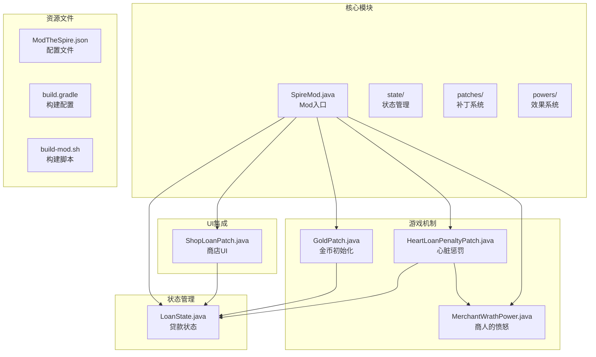
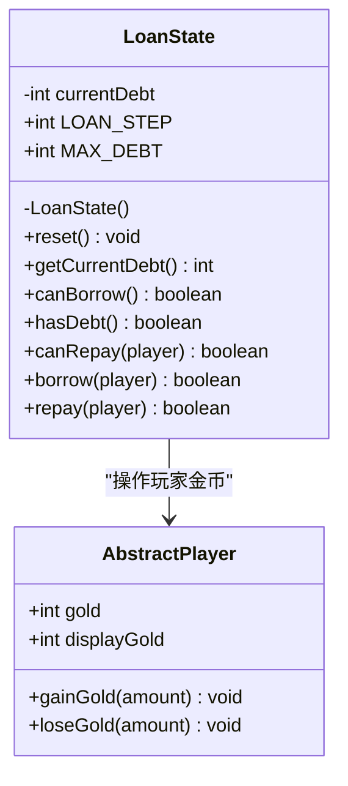
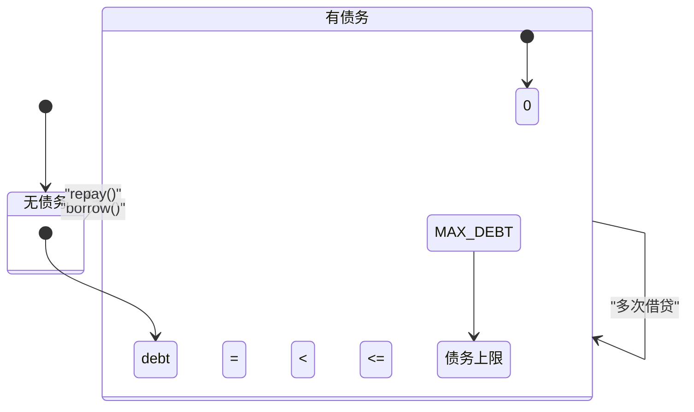
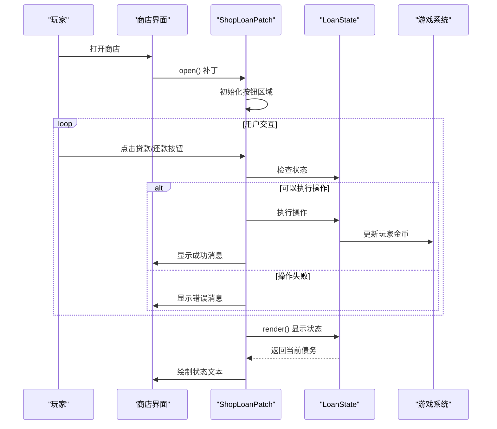
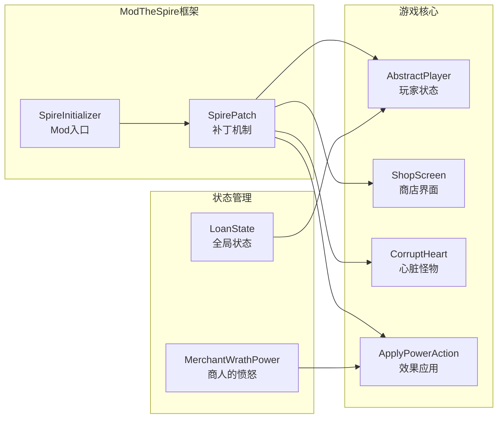
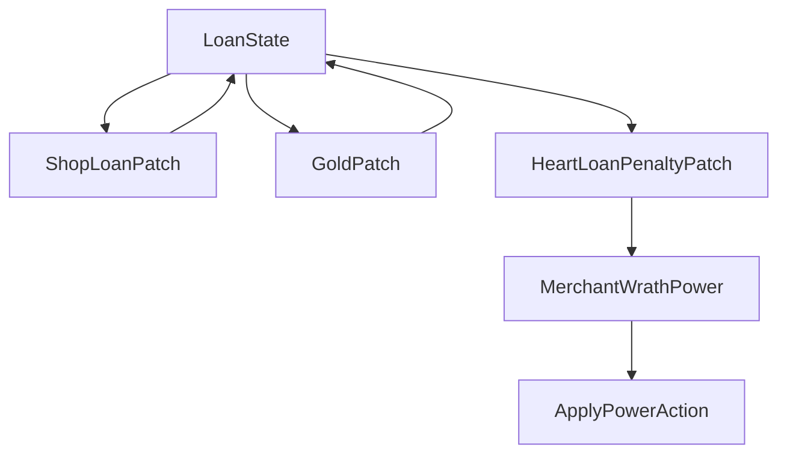

# 状态管理

<cite>
**本文档引用的文件**
- [LoanState.java](file://src/main/java/spiremod/state/LoanState.java)
- [ShopLoanPatch.java](file://src/main/java/spiremod/patches/ShopLoanPatch.java)
- [GoldPatch.java](file://src/main/java/spiremod/patches/GoldPatch.java)
- [HeartLoanPenaltyPatch.java](file://src/main/java/spiremod/patches/HeartLoanPenaltyPatch.java)
- [MerchantWrathPower.java](file://src/main/java/spiremod/powers/MerchantWrathPower.java)
- [SpireMod.java](file://src/main/java/spiremod/SpireMod.java)
- [ModTheSpire.json](file://src/main/resources/ModTheSpire.json)
- [2026-06-15-spiremod-lightweight-design.md](file://docs/superpowers/specs/2026-06-15-spiremod-lightweight-design.md)
- [build.gradle](file://build.gradle)
- [build-mod.sh](file://scripts/build-mod.sh)
</cite>

## 目录
1. [简介](#简介)
2. [项目结构](#项目结构)
3. [核心组件](#核心组件)
4. [架构概览](#架构概览)
5. [详细组件分析](#详细组件分析)
6. [依赖关系分析](#依赖关系分析)
7. [性能考虑](#性能考虑)
8. [故障排除指南](#故障排除指南)
9. [结论](#结论)

## 简介

SpireMod 是一个轻量级的《杀戮尖塔》Mod，采用纯 SpirePatch 技术实现，无需依赖 BaseMod。该 Mod 的状态管理系统围绕 LoanState 类构建，实现了贷款功能的核心逻辑，包括债务管理、状态同步和用户界面集成。

LoanState 类是整个 Mod 的核心状态容器，负责维护全局的贷款状态，包括当前债务金额、最大债务限制和相关的操作方法。该系统通过 ModTheSpire 的补丁机制与游戏的核心功能进行深度集成，提供了完整的贷款生命周期管理。

## 项目结构

SpireMod 采用模块化的项目结构，主要分为以下几个关键部分：



**图表来源**
- [SpireMod.java:1-11](file://src/main/java/spiremod/SpireMod.java#L1-L11)
- [LoanState.java:1-56](file://src/main/java/spiremod/state/LoanState.java#L1-L56)
- [ShopLoanPatch.java:1-202](file://src/main/java/spiremod/patches/ShopLoanPatch.java#L1-L202)

**章节来源**
- [SpireMod.java:1-11](file://src/main/java/spiremod/SpireMod.java#L1-L11)
- [2026-06-15-spiremod-lightweight-design.md:23-41](file://docs/superpowers/specs/2026-06-15-spiremod-lightweight-design.md#L23-L41)

## 核心组件

### LoanState 类设计

LoanState 是一个静态工具类，采用了单例模式的变体设计，通过私有构造函数确保不可实例化，所有方法均为静态方法。该类的设计体现了以下特点：

#### 数据结构设计
- **currentDebt**: 当前债务金额，使用 `static` 关键字确保全局唯一性
- **LOAN_STEP**: 固定的贷款步长，每次贷款/还款的基础单位
- **MAX_DEBT**: 最大债务限制，防止无限贷款

#### 状态管理机制
LoanState 通过静态字段实现全局状态管理，所有访问和修改都通过静态方法进行，确保了状态的一致性和可访问性。

**章节来源**
- [LoanState.java:5-12](file://src/main/java/spiremod/state/LoanState.java#L5-L12)
- [LoanState.java:9](file://src/main/java/spiremod/state/LoanState.java#L9)

### 状态同步策略

系统采用事件驱动的状态同步机制：

1. **初始化同步**: 在角色初始化时重置贷款状态并增加初始金币
2. **UI同步**: 商店界面实时显示当前债务状态
3. **游戏机制同步**: 心脏战时根据债务状态应用惩罚效果

**章节来源**
- [GoldPatch.java:29](file://src/main/java/spiremod/patches/GoldPatch.java#L29)
- [ShopLoanPatch.java:109](file://src/main/java/spiremod/patches/ShopLoanPatch.java#L109)
- [HeartLoanPenaltyPatch.java:21](file://src/main/java/spiremod/patches/HeartLoanPenaltyPatch.java#L21)

## 架构概览

SpireMod 的状态管理系统采用分层架构设计，从底层的状态管理到上层的用户界面集成形成了完整的状态处理链路：

```mermaid
graph TD
subgraph "状态管理层"
A[LoanState<br/>全局状态容器]
B[状态常量<br/>LOAN_STEP, MAX_DEBT]
end
subgraph "业务逻辑层"
C[borrow()<br/>贷款操作]
D[repay()<br/>还款操作]
E[canBorrow()<br/>贷款检查]
F[canRepay()<br/>还款检查]
end
subgraph "集成层"
G[ShopLoanPatch<br/>商店UI集成]
H[GoldPatch<br/>初始化集成]
I[HeartLoanPenaltyPatch<br/>惩罚机制]
end
subgraph "外部依赖"
J[AbstractPlayer<br/>玩家状态]
K[ShopScreen<br/>商店界面]
L[CorruptHeart<br/>心脏怪物]
end
A --> C
A --> D
A --> E
A --> F
C --> J
D --> J
G --> A
G --> K
H --> A
I --> A
I --> L
E --> A
F --> A
F --> J
```

**图表来源**
- [LoanState.java:34-54](file://src/main/java/spiremod/state/LoanState.java#L34-L54)
- [ShopLoanPatch.java:150-180](file://src/main/java/spiremod/patches/ShopLoanPatch.java#L150-L180)
- [GoldPatch.java:29](file://src/main/java/spiremod/patches/GoldPatch.java#L29)
- [HeartLoanPenaltyPatch.java:20-39](file://src/main/java/spiremod/patches/HeartLoanPenaltyPatch.java#L20-L39)

## 详细组件分析

### LoanState 类详细分析

#### 类结构图



**图表来源**
- [LoanState.java:5-55](file://src/main/java/spiremod/state/LoanState.java#L5-L55)

#### 状态转换逻辑

LoanState 实现了完整的状态转换图：



**图表来源**
- [LoanState.java:22-28](file://src/main/java/spiremod/state/LoanState.java#L22-L28)
- [LoanState.java:34-54](file://src/main/java/spiremod/state/LoanState.java#L34-L54)

#### 方法详细说明

##### 基础状态管理方法

| 方法 | 参数 | 返回值 | 功能描述 |
|------|------|--------|----------|
| reset() | 无 | void | 将当前债务重置为0 |
| getCurrentDebt() | 无 | int | 获取当前债务金额 |
| hasDebt() | 无 | boolean | 检查是否存在债务 |

##### 贷款操作方法

| 方法 | 参数 | 返回值 | 功能描述 | 错误处理 |
|------|------|--------|----------|----------|
| canBorrow() | 无 | boolean | 检查是否可以贷款 | 检查债务上限 |
| borrow(AbstractPlayer) | player | boolean | 执行贷款操作 | 空指针检查 |
| canRepay(AbstractPlayer) | player | boolean | 检查是否可以还款 | 债务检查、金币检查 |
| repay(AbstractPlayer) | player | boolean | 执行还款操作 | 还款条件检查 |

**章节来源**
- [LoanState.java:14-54](file://src/main/java/spiremod/state/LoanState.java#L14-L54)

### 商店UI集成组件

#### ShopLoanPatch 类分析

ShopLoanPatch 通过 ModTheSpire 的补丁机制与商店界面深度集成：



**图表来源**
- [ShopLoanPatch.java:46-93](file://src/main/java/spiremod/patches/ShopLoanPatch.java#L46-L93)
- [ShopLoanPatch.java:150-180](file://src/main/java/spiremod/patches/ShopLoanPatch.java#L150-L180)

#### UI状态同步机制

商店界面通过以下方式保持与贷款状态的同步：

1. **实时状态显示**: 在渲染阶段动态获取并显示当前债务状态
2. **按钮状态控制**: 根据贷款状态动态启用/禁用贷款和还款按钮
3. **交互反馈**: 提供成功和失败的操作反馈消息

**章节来源**
- [ShopLoanPatch.java:100-122](file://src/main/java/spiremod/patches/ShopLoanPatch.java#L100-L122)
- [ShopLoanPatch.java:187-197](file://src/main/java/spiremod/patches/ShopLoanPatch.java#L187-L197)

### 游戏机制集成

#### 初始状态设置

GoldPatch 补丁在角色初始化时执行以下操作：

1. **状态重置**: 调用 `LoanState.reset()` 将债务重置为0
2. **金币奖励**: 为玩家增加200金币
3. **显示同步**: 更新显示的金币数量

#### 债务惩罚机制

HeartLoanPenaltyPatch 在心脏战前应用以下惩罚：

1. **状态检查**: 检查玩家是否有债务
2. **属性惩罚**: 应用力量和敏捷的负向效果
3. **特殊效果**: 添加商人的愤怒效果

**章节来源**
- [GoldPatch.java:29-31](file://src/main/java/spiremod/patches/GoldPatch.java#L29-L31)
- [HeartLoanPenaltyPatch.java:20-39](file://src/main/java/spiremod/patches/HeartLoanPenaltyPatch.java#L20-L39)

## 依赖关系分析

### 外部依赖关系

SpireMod 的状态管理系统依赖于以下外部组件：



**图表来源**
- [SpireMod.java:5-10](file://src/main/java/spiremod/SpireMod.java#L5-L10)
- [ShopLoanPatch.java:15](file://src/main/java/spiremod/patches/ShopLoanPatch.java#L15)
- [HeartLoanPenaltyPatch.java:11](file://src/main/java/spiremod/patches/HeartLoanPenaltyPatch.java#L11)

### 内部组件依赖

状态管理系统内部各组件之间的依赖关系：



**图表来源**
- [ShopLoanPatch.java:15](file://src/main/java/spiremod/patches/ShopLoanPatch.java#L15)
- [HeartLoanPenaltyPatch.java:11](file://src/main/java/spiremod/patches/HeartLoanPenaltyPatch.java#L11)

**章节来源**
- [LoanState.java:3](file://src/main/java/spiremod/state/LoanState.java#L3)
- [ShopLoanPatch.java:15](file://src/main/java/spiremod/patches/ShopLoanPatch.java#L15)

## 性能考虑

### 线程安全性分析

LoanState 类目前采用静态字段存储状态，在 ModTheSpire 的单线程环境中运行良好。由于 ModTheSpire 的补丁机制在游戏主线程中执行，不存在多线程竞争问题。

**潜在改进方案**:
- 使用 `volatile` 关键字确保内存可见性
- 考虑使用 `AtomicInteger` 替代普通整型字段
- 在需要时添加适当的同步机制

### 内存使用优化

1. **静态字段**: 使用静态字段减少对象创建开销
2. **常量优化**: 将常量定义为 `final` 字段
3. **方法内联**: 静态方法便于编译器优化

### 计算复杂度

- **状态查询**: O(1) 时间复杂度
- **状态更新**: O(1) 时间复杂度
- **状态检查**: O(1) 时间复杂度

## 故障排除指南

### 常见问题及解决方案

#### 问题1: 贷款操作无效
**症状**: 点击贷款按钮无反应
**可能原因**:
- 已达到最大债务限制
- 玩家金币不足
- 系统处于最终幕

**解决方法**:
1. 检查 `LoanState.canBorrow()` 返回值
2. 验证玩家金币数量
3. 确认当前 dungeon 是否为最终幕

#### 问题2: 状态显示异常
**症状**: 商店界面显示的债务状态不正确
**可能原因**:
- UI更新时机不当
- 状态未正确同步

**解决方法**:
1. 确保在 `render()` 方法中调用状态查询
2. 检查 `displayGold` 的更新逻辑

#### 问题3: 债务惩罚未生效
**症状**: 心脏战时没有收到惩罚效果
**可能原因**:
- 未正确检测债务状态
- 效果应用顺序错误

**解决方法**:
1. 验证 `LoanState.hasDebt()` 的调用
2. 检查效果应用的时机和顺序

**章节来源**
- [ShopLoanPatch.java:150-180](file://src/main/java/spiremod/patches/ShopLoanPatch.java#L150-L180)
- [HeartLoanPenaltyPatch.java:20-39](file://src/main/java/spiremod/patches/HeartLoanPenaltyPatch.java#L20-L39)

### 调试技巧

1. **日志记录**: 在关键方法中添加状态检查日志
2. **断点调试**: 在补丁方法的关键位置设置断点
3. **状态监控**: 定期打印当前债务状态用于验证

## 结论

SpireMod 的状态管理系统展现了优秀的软件工程实践，通过精心设计的 LoanState 类实现了简洁而强大的贷款功能。系统的主要优势包括：

1. **设计简洁**: 采用静态工具类设计，API 简洁明了
2. **集成紧密**: 通过 ModTheSpire 补丁机制与游戏核心深度集成
3. **扩展性强**: 易于添加新的状态检查和操作方法
4. **维护友好**: 代码结构清晰，职责单一

该系统为 Mod 开发提供了良好的状态管理范例，展示了如何在不依赖复杂框架的情况下实现高质量的游戏功能扩展。通过合理的架构设计和严格的边界检查，系统在保证功能完整性的同时，也确保了运行时的稳定性和可靠性。