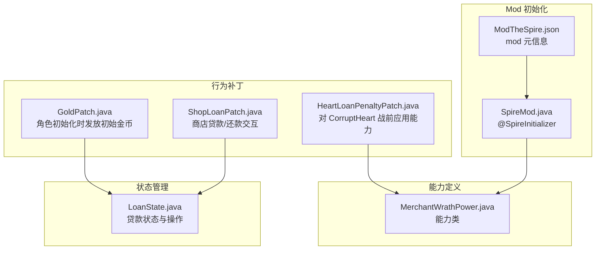
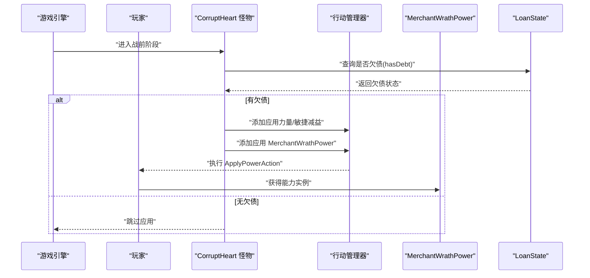
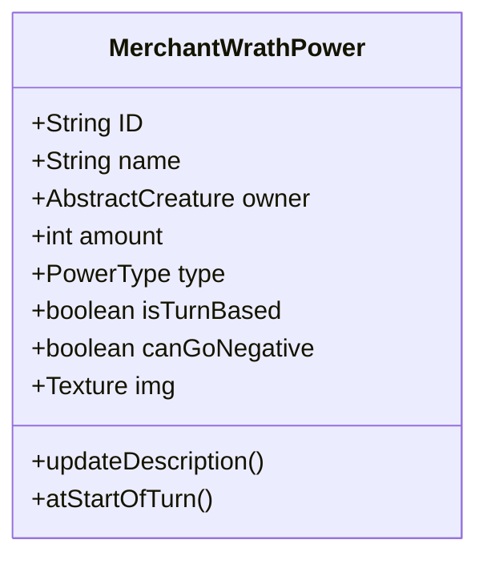
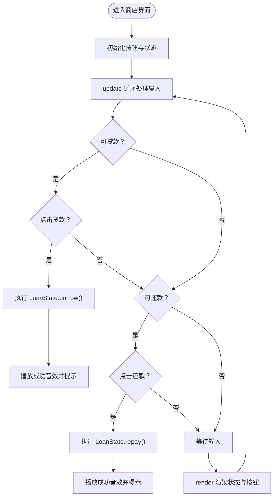
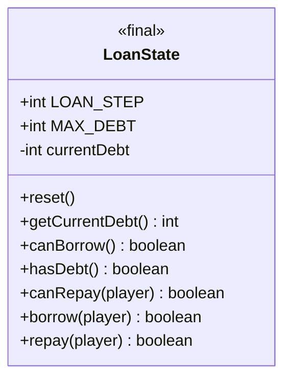
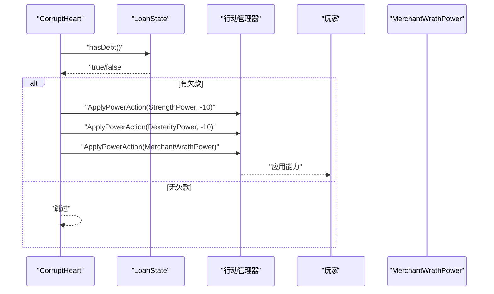
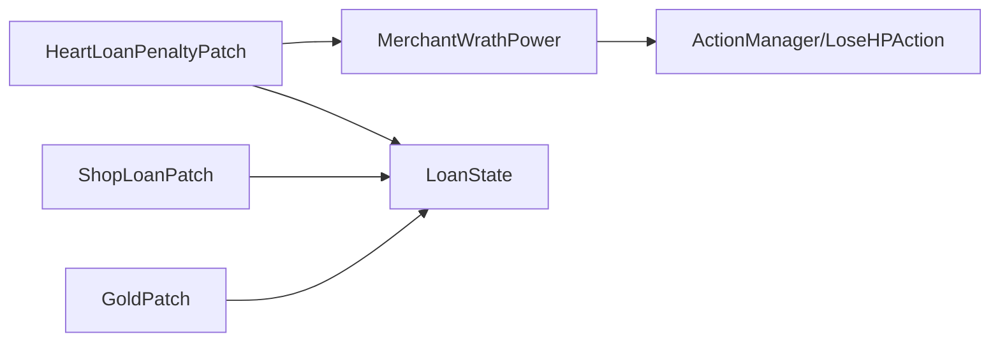

# 能力系统

<cite>
**本文引用的文件**
- [MerchantWrathPower.java](file://src/main/java/spiremod/powers/MerchantWrathPower.java)
- [HeartLoanPenaltyPatch.java](file://src/main/java/spiremod/patches/HeartLoanPenaltyPatch.java)
- [ShopLoanPatch.java](file://src/main/java/spiremod/patches/ShopLoanPatch.java)
- [GoldPatch.java](file://src/main/java/spiremod/patches/GoldPatch.java)
- [LoanState.java](file://src/main/java/spiremod/state/LoanState.java)
- [SpireMod.java](file://src/main/java/spiremod/SpireMod.java)
- [ModTheSpire.json](file://src/main/resources/ModTheSpire.json)
- [README.md](file://README.md)
</cite>

## 目录
1. [简介](#简介)
2. [项目结构](#项目结构)
3. [核心组件](#核心组件)
4. [架构总览](#架构总览)
5. [详细组件分析](#详细组件分析)
6. [依赖关系分析](#依赖关系分析)
7. [性能考量](#性能考量)
8. [故障排查指南](#故障排查指南)
9. [结论](#结论)
10. [附录：自定义能力开发指南](#附录自定义能力开发指南)

## 简介
本文件围绕 SpireMod 的“能力系统”进行系统化梳理，重点聚焦于 MerchantWrathPower（商人的愤怒）能力的实现与设计，涵盖其效果原理、生命值损失机制、视觉反馈、与游戏核心机制的集成方式（注册、激活、移除）、计算逻辑、持续时间与触发条件，并给出自定义能力开发的指导与扩展性建议。同时，结合补丁与状态模块，说明能力系统如何与商店贷款、角色初始金、以及特定怪物行为联动。

## 项目结构
SpireMod 的能力系统主要由以下层次构成：
- 功能入口与初始化：通过 Mod 初始化器完成加载。
- 能力定义：能力类位于 powers 包，继承游戏提供的能力基类。
- 行为补丁：通过 ModTheSpire Patch 对游戏事件进行拦截与增强。
- 状态管理：通过独立的状态类维护全局状态（如贷款状态）。
- 资源与元数据：Mod 元信息与构建配置。

图表来源
- [SpireMod.java:1-11](file://src/main/java/spiremod/SpireMod.java#L1-L11)
- [ModTheSpire.json:1-10](file://src/main/resources/ModTheSpire.json#L1-L10)
- [MerchantWrathPower.java:1-39](file://src/main/java/spiremod/powers/MerchantWrathPower.java#L1-L39)
- [HeartLoanPenaltyPatch.java:1-41](file://src/main/java/spiremod/patches/HeartLoanPenaltyPatch.java#L1-L41)
- [ShopLoanPatch.java:1-203](file://src/main/java/spiremod/patches/ShopLoanPatch.java#L1-L203)
- [GoldPatch.java:1-33](file://src/main/java/spiremod/patches/GoldPatch.java#L1-L33)
- [LoanState.java:1-56](file://src/main/java/spiremod/state/LoanState.java#L1-L56)

章节来源
- [SpireMod.java:1-11](file://src/main/java/spiremod/SpireMod.java#L1-L11)
- [ModTheSpire.json:1-10](file://src/main/resources/ModTheSpire.json#L1-L10)
- [README.md:1-47](file://README.md#L1-L47)

## 核心组件
- MerchantWrathPower：定义“商人的愤怒”能力，每回合开始造成固定生命值损失；具备视觉反馈与描述更新。
- HeartLoanPenaltyPatch：在特定怪物战前根据玩家是否有债务，叠加力量/敏捷减益并施加该能力。
- ShopLoanPatch：在商店界面提供贷款/还款按钮与状态显示，与贷款状态联动。
- LoanState：集中管理贷款额度、最大欠款、借还逻辑与可用性判断。
- GoldPatch：角色初始化时重置贷款状态并发放初始金币。
- SpireMod 与 ModTheSpire.json：Mod 初始化与元信息声明。

章节来源
- [MerchantWrathPower.java:1-39](file://src/main/java/spiremod/powers/MerchantWrathPower.java#L1-L39)
- [HeartLoanPenaltyPatch.java:1-41](file://src/main/java/spiremod/patches/HeartLoanPenaltyPatch.java#L1-L41)
- [ShopLoanPatch.java:1-203](file://src/main/java/spiremod/patches/ShopLoanPatch.java#L1-L203)
- [LoanState.java:1-56](file://src/main/java/spiremod/state/LoanState.java#L1-L56)
- [GoldPatch.java:1-33](file://src/main/java/spiremod/patches/GoldPatch.java#L1-L33)
- [SpireMod.java:1-11](file://src/main/java/spiremod/SpireMod.java#L1-L11)
- [ModTheSpire.json:1-10](file://src/main/resources/ModTheSpire.json#L1-L10)

## 架构总览
能力系统采用“能力类 + 行为补丁 + 状态模块”的分层设计：
- 能力类负责效果定义与生命周期回调。
- 行为补丁负责在合适时机将能力应用到玩家或怪物。
- 状态模块负责跨场景的状态持久与业务规则。
- 初始化器与资源文件确保 Mod 正确加载与发布。

图表来源
- [HeartLoanPenaltyPatch.java:20-39](file://src/main/java/spiremod/patches/HeartLoanPenaltyPatch.java#L20-L39)
- [LoanState.java:22-28](file://src/main/java/spiremod/state/LoanState.java#L22-L28)
- [MerchantWrathPower.java:10-26](file://src/main/java/spiremod/powers/MerchantWrathPower.java#L10-L26)

## 详细组件分析

### MerchantWrathPower 能力类
- 设计要点
  - 继承能力基类，设置唯一 ID、名称、拥有者、数值、类型与是否回合基于标志。
  - 使用统一的空白纹理作为图标占位。
  - 描述文本动态拼接数值，便于国际化与本地化。
- 触发与效果
  - 回合开始时触发，执行一次自身闪动与一次对拥有者的伤害动作。
  - 伤害数值固定，不可为负数，避免出现“回血”等异常情况。
- 可视化反馈
  - 闪动用于提示回合开始时的效果触发，提升玩家感知。
- 生命周期
  - 未标记为回合基础能力，因此不会因回合结束而自然消失；需外部逻辑控制其存在性（例如与贷款状态绑定）。

图表来源
- [MerchantWrathPower.java:10-38](file://src/main/java/spiremod/powers/MerchantWrathPower.java#L10-L38)

章节来源
- [MerchantWrathPower.java:10-38](file://src/main/java/spiremod/powers/MerchantWrathPower.java#L10-L38)

### 商店贷款与还款交互（ShopLoanPatch）
- 功能概述
  - 在商店界面渲染贷款/还款按钮与当前债务状态。
  - 响应点击事件，调用贷款状态模块执行借还操作。
  - 提供失败提示与成功提示，播放音效。
- 交互流程
  - open 阶段：初始化按钮区域与悬停状态。
  - update 阶段：处理输入与点击，调用借还处理函数。
  - render 阶段：绘制状态文本与按钮外观。
- 条件限制
  - 最终幕（TheEnding）禁用贷款。
  - 借款额度不能超过最大欠款。
  - 还款需要玩家金币足够。
- 失败与成功反馈
  - 通过商店屏幕的语音与音效反馈结果。

图表来源
- [ShopLoanPatch.java:46-185](file://src/main/java/spiremod/patches/ShopLoanPatch.java#L46-L185)
- [LoanState.java:34-54](file://src/main/java/spiremod/state/LoanState.java#L34-L54)

章节来源
- [ShopLoanPatch.java:1-203](file://src/main/java/spiremod/patches/ShopLoanPatch.java#L1-L203)
- [LoanState.java:1-56](file://src/main/java/spiremod/state/LoanState.java#L1-L56)

### 贷款状态管理（LoanState）
- 数据模型
  - 当前欠款、单次借还步长、最大欠款。
  - 提供重置、查询、借还与可用性判断方法。
- 业务规则
  - 借款上限检查、金币充足检查、最终幕禁贷。
- 与能力的关联
  - 能力仅在存在欠款时被应用，形成“债务越大，惩罚越强”的闭环。

图表来源
- [LoanState.java:5-55](file://src/main/java/spiremod/state/LoanState.java#L5-L55)

章节来源
- [LoanState.java:1-56](file://src/main/java/spiremod/state/LoanState.java#L1-L56)

### 行为补丁：CorruptHeart 战前惩罚（HeartLoanPenaltyPatch）
- 触发条件
  - 怪物使用战前行动时，若玩家存在欠款，则叠加力量与敏捷减益，并施加“商人的愤怒”能力。
- 应用顺序
  - 先施加属性减益，再施加能力，保证玩家在战斗中处于劣势。
- 与能力系统的关系
  - 将能力的触发与“债务”状态解耦，使能力成为可复用的游戏机制的一部分。

图表来源
- [HeartLoanPenaltyPatch.java:20-39](file://src/main/java/spiremod/patches/HeartLoanPenaltyPatch.java#L20-L39)
- [LoanState.java:26-28](file://src/main/java/spiremod/state/LoanState.java#L26-L28)
- [MerchantWrathPower.java:10-26](file://src/main/java/spiremod/powers/MerchantWrathPower.java#L10-L26)

章节来源
- [HeartLoanPenaltyPatch.java:1-41](file://src/main/java/spiremod/patches/HeartLoanPenaltyPatch.java#L1-L41)
- [LoanState.java:1-56](file://src/main/java/spiremod/state/LoanState.java#L1-L56)
- [MerchantWrathPower.java:1-39](file://src/main/java/spiremod/powers/MerchantWrathPower.java#L1-L39)

### 初始金与贷款重置（GoldPatch）
- 触发时机
  - 角色初始化时，重置贷款状态并发放初始金币。
- 作用
  - 为新一局提供资金起点，同时确保贷款状态清零，避免跨局状态污染。

章节来源
- [GoldPatch.java:1-33](file://src/main/java/spiremod/patches/GoldPatch.java#L1-L33)
- [LoanState.java:14-16](file://src/main/java/spiremod/state/LoanState.java#L14-L16)

## 依赖关系分析
- 能力类依赖
  - MerchantWrathPower 依赖游戏能力基类与行动管理器，用于回合开始时的闪动与造成伤害。
- 补丁依赖
  - HeartLoanPenaltyPatch 依赖商店贷款状态与行动管理器，用于在特定怪物战前施加能力。
  - ShopLoanPatch 依赖商店屏幕、输入系统与贷款状态，用于交互式借还。
  - GoldPatch 依赖角色初始化流程与贷款状态，用于开局重置。
- 状态依赖
  - 所有与金钱/债务相关的逻辑集中在 LoanState，避免分散耦合。

图表来源
- [MerchantWrathPower.java:4-31](file://src/main/java/spiremod/powers/MerchantWrathPower.java#L4-L31)
- [HeartLoanPenaltyPatch.java:30-38](file://src/main/java/spiremod/patches/HeartLoanPenaltyPatch.java#L30-L38)
- [ShopLoanPatch.java:15,46-185](file://src/main/java/spiremod/patches/ShopLoanPatch.java#L15,46-L185)
- [GoldPatch.java:29-32](file://src/main/java/spiremod/patches/GoldPatch.java#L29-L32)
- [LoanState.java:14-54](file://src/main/java/spiremod/state/LoanState.java#L14-L54)

章节来源
- [MerchantWrathPower.java:1-39](file://src/main/java/spiremod/powers/MerchantWrathPower.java#L1-L39)
- [HeartLoanPenaltyPatch.java:1-41](file://src/main/java/spiremod/patches/HeartLoanPenaltyPatch.java#L1-L41)
- [ShopLoanPatch.java:1-203](file://src/main/java/spiremod/patches/ShopLoanPatch.java#L1-L203)
- [GoldPatch.java:1-33](file://src/main/java/spiremod/patches/GoldPatch.java#L1-L33)
- [LoanState.java:1-56](file://src/main/java/spiremod/state/LoanState.java#L1-L56)

## 性能考量
- 能力触发频率
  - MerchantWrathPower 在每回合开始触发，属于高频事件；但其逻辑简单（闪动 + 一次伤害），开销极低。
- 补丁交互
  - 商店补丁在 update/render 中进行输入检测与绘制，建议保持最小化计算，避免在热路径中做昂贵操作。
- 状态访问
  - LoanState 为静态工具类，访问成本低；注意在多线程或异步场景下避免竞态（当前 Mod 环境下无需担心）。
- 图像与音效
  - 能力图标使用统一纹理，减少资源占用；提示音效与语音按需播放，避免冗余。

## 故障排查指南
- 能力未生效
  - 检查是否满足触发条件（例如 CorruptHeart 战前应用时的欠款判定）。
  - 确认能力 ID 与名称是否正确，避免与其他能力冲突。
- 生命值损失异常
  - 确认 amount 字段未被外部修改；canGoNegative 为 false，避免出现负值回血。
- 商店贷款按钮不可用
  - 检查当前是否处于最终幕（禁贷）。
  - 检查当前欠款是否已达上限或金币是否足够。
- 金币显示不同步
  - 确保在借还后同步显示金币（已通过 displayGold 同步）。

章节来源
- [MerchantWrathPower.java:15-37](file://src/main/java/spiremod/powers/MerchantWrathPower.java#L15-L37)
- [HeartLoanPenaltyPatch.java:20-39](file://src/main/java/spiremod/patches/HeartLoanPenaltyPatch.java#L20-L39)
- [ShopLoanPatch.java:150-185](file://src/main/java/spiremod/patches/ShopLoanPatch.java#L150-L185)
- [LoanState.java:34-54](file://src/main/java/spiremod/state/LoanState.java#L34-L54)

## 结论
SpireMod 的能力系统以 MerchantWrathPower 为核心，通过补丁与状态模块实现了“债务驱动的惩罚机制”。该设计具备清晰的职责分离、良好的扩展性与较低的运行时开销。能力的触发条件明确、视觉反馈直观，且与商店贷款交互紧密衔接，形成完整的经济与战斗闭环。未来可在能力类型、持续时间、叠加层数、条件分支等方面进一步拓展，以支持更丰富的玩法。

## 附录：自定义能力开发指南
- 继承关系与基类
  - 新能力类应继承能力基类，设置 ID、名称、拥有者、数值、类型与回合基础标志。
  - 类型可选择增益或减益；回合基础能力会在回合结束时自动移除。
- 接口与回调
  - atStartOfTurn：回合开始时触发，适合造成伤害、抽牌、回复等一次性效果。
  - atEndOfTurn：回合结束时触发，适合持续性负面效果或清理逻辑。
  - updateDescription：根据数值动态更新描述文本，便于本地化。
- 计算逻辑与参数
  - amount 字段用于承载数值；可依据外部状态动态调整。
  - canGoNegative 控制是否允许负值；对于伤害类能力通常设为 false。
- 触发条件与集成
  - 通过补丁在合适的事件节点（如怪物战前、商店交互、角色初始化）应用能力。
  - 与状态模块解耦，避免硬编码，提高可维护性。
- 视觉与反馈
  - 使用闪动、图标与描述文本提升玩家感知；必要时可引入音效与动画。
- 最佳实践
  - 保持能力逻辑简单、可预测；避免在热路径中进行复杂计算。
  - 明确能力的生命周期与移除条件，防止状态泄漏。
  - 为能力提供清晰的描述文本，便于翻译与用户理解。
  - 将触发条件与业务规则抽象到状态模块，便于测试与演进。