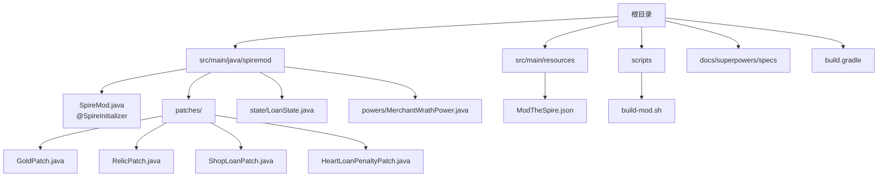
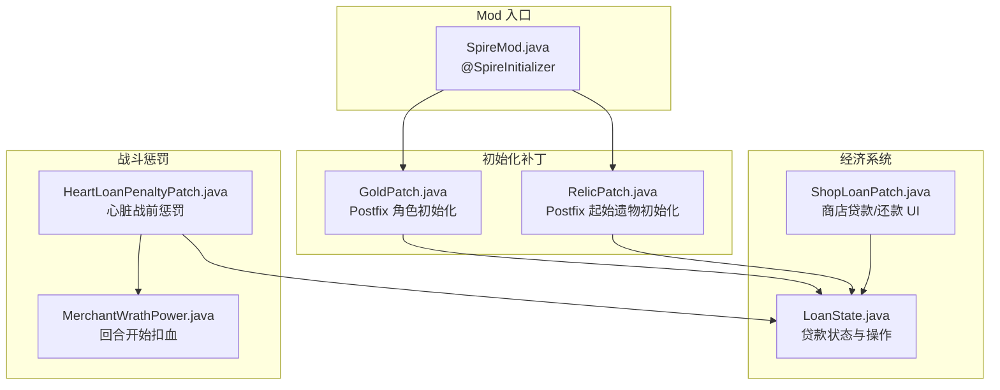
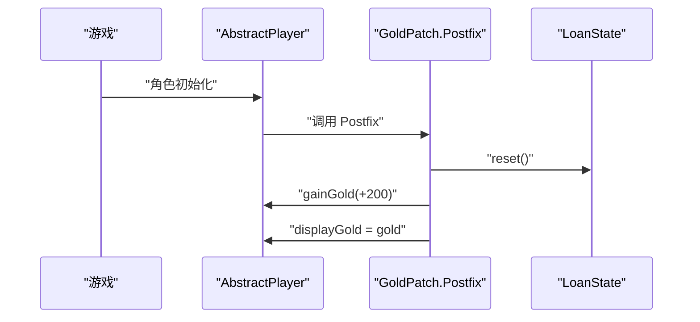
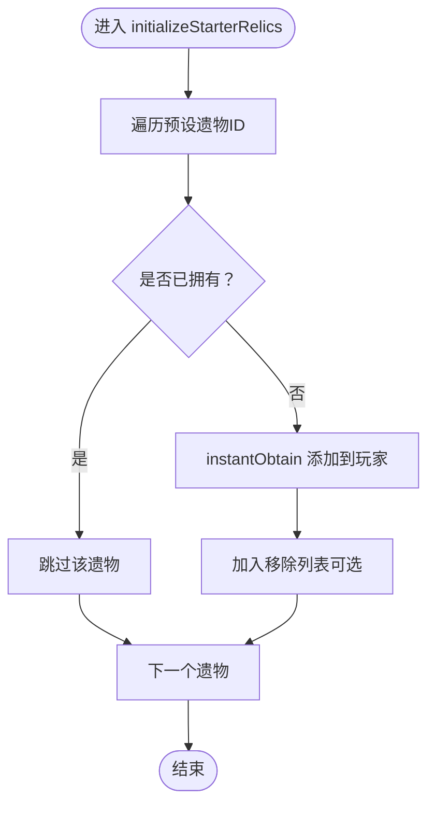
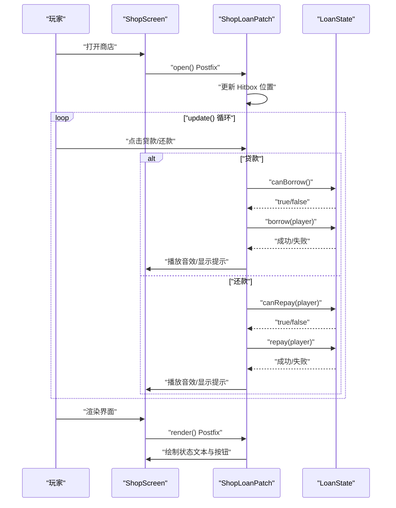
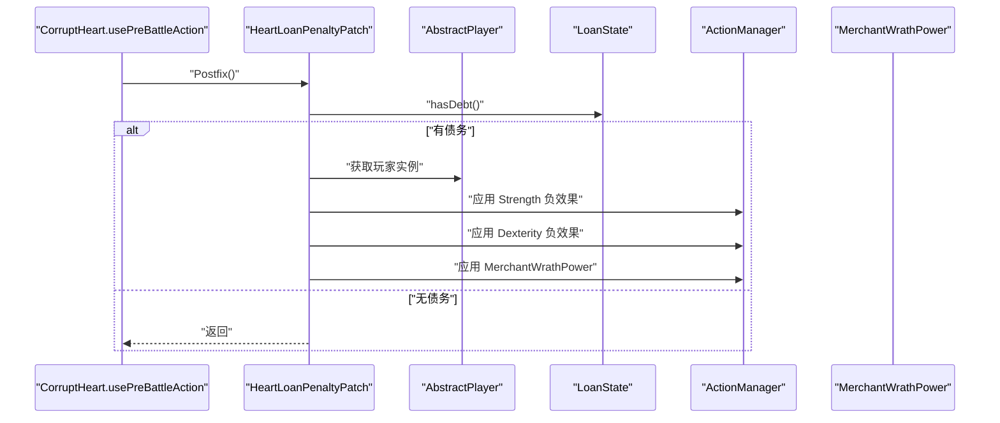
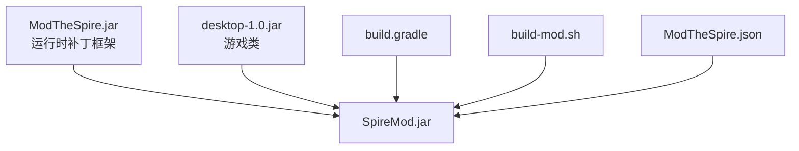

# 项目概述

<cite>
**本文引用的文件**
- [README.md](file://README.md)
- [SpireMod.java](file://src/main/java/spiremod/SpireMod.java)
- [ModTheSpire.json](file://src/main/resources/ModTheSpire.json)
- [GoldPatch.java](file://src/main/java/spiremod/patches/GoldPatch.java)
- [RelicPatch.java](file://src/main/java/spiremod/patches/RelicPatch.java)
- [ShopLoanPatch.java](file://src/main/java/spiremod/patches/ShopLoanPatch.java)
- [HeartLoanPenaltyPatch.java](file://src/main/java/spiremod/patches/HeartLoanPenaltyPatch.java)
- [LoanState.java](file://src/main/java/spiremod/state/LoanState.java)
- [MerchantWrathPower.java](file://src/main/java/spiremod/powers/MerchantWrathPower.java)
- [build-mod.sh](file://scripts/build-mod.sh)
- [build.gradle](file://build.gradle)
- [2026-06-15-spiremod-lightweight-design.md](file://docs/superpowers/specs/2026-06-15-spiremod-lightweight-design.md)
</cite>

## 目录
1. [引言](#引言)
2. [项目结构](#项目结构)
3. [核心组件](#核心组件)
4. [架构总览](#架构总览)
5. [详细组件分析](#详细组件分析)
6. [依赖关系分析](#依赖关系分析)
7. [性能考量](#性能考量)
8. [故障排除指南](#故障排除指南)
9. [结论](#结论)
10. [附录](#附录)

## 引言
SpireMod 是一个轻量级的《杀戮尖塔》Mod，旨在为每局新游戏提供即时的经济与资源增益，同时引入可玩的借贷与惩罚机制，帮助玩家在早期阶段建立更强的生存与战斗基础。其核心目标是：
- 在每局开局自动提供金币与强力原版遗物，降低早期资源压力
- 提供简洁直观的贷款/还款界面，增强策略深度
- 通过“心脏战债务惩罚”机制平衡高风险高回报玩法
- 保持对游戏原版内容的尊重与兼容，避免引入自定义美术或音效

该项目采用补丁模式（基于 ModTheSpire）而非直接修改游戏代码，确保与游戏版本更新的兼容性与稳定性，并最小化对游戏核心逻辑的侵入。

## 项目结构
SpireMod 的工程结构清晰，遵循 ModTheSpire 标准布局：
- Java 源码位于 src/main/java/spiremod，包含入口类、补丁、状态管理与自定义能力
- 资源文件位于 src/main/resources，包含 Mod 元数据配置
- 构建脚本位于根目录，支持 Gradle 与本地 shell 脚本两种方式
- 文档位于 docs/superpowers/specs，记录设计文档与未来规划

图表来源
- [SpireMod.java:1-11](file://src/main/java/spiremod/SpireMod.java#L1-L11)
- [ModTheSpire.json:1-10](file://src/main/resources/ModTheSpire.json#L1-L10)
- [GoldPatch.java:1-34](file://src/main/java/spiremod/patches/GoldPatch.java#L1-L34)
- [RelicPatch.java:1-46](file://src/main/java/spiremod/patches/RelicPatch.java#L1-L46)
- [ShopLoanPatch.java:1-203](file://src/main/java/spiremod/patches/ShopLoanPatch.java#L1-L203)
- [HeartLoanPenaltyPatch.java:1-41](file://src/main/java/spiremod/patches/HeartLoanPenaltyPatch.java#L1-L41)
- [LoanState.java:1-56](file://src/main/java/spiremod/state/LoanState.java#L1-L56)
- [MerchantWrathPower.java:1-39](file://src/main/java/spiremod/powers/MerchantWrathPower.java#L1-L39)
- [build-mod.sh:1-39](file://scripts/build-mod.sh#L1-L39)
- [build.gradle:1-56](file://build.gradle#L1-L56)

章节来源
- [README.md:1-47](file://README.md#L1-L47)
- [2026-06-15-spiremod-lightweight-design.md:23-41](file://docs/superpowers/specs/2026-06-15-spiremod-lightweight-design.md#L23-L41)

## 核心组件
- 入口与注册：SpireMod.java 使用 @SpireInitializer 注解，向 ModTheSpire 注册 Mod
- 金币增益：GoldPatch 在角色初始化后为玩家增加固定金币，并重置贷款状态
- 遗物发放：RelicPatch 在初始化起始遗物时追加一组强力原版遗物，避免重复获得
- 经济系统：LoanState 管理贷款额度与还款逻辑；ShopLoanPatch 提供商店中的贷款/还款按钮与状态显示
- 战斗惩罚：HeartLoanPenaltyPatch 在心脏战前对有债务的玩家施加属性削弱与“商人的愤怒”Debuff
- 自定义能力：MerchantWrathPower 实现回合开始时造成固定伤害的 Debuff 效果

章节来源
- [SpireMod.java:5-10](file://src/main/java/spiremod/SpireMod.java#L5-L10)
- [GoldPatch.java:9-33](file://src/main/java/spiremod/patches/GoldPatch.java#L9-L33)
- [RelicPatch.java:17-45](file://src/main/java/spiremod/patches/RelicPatch.java#L17-L45)
- [LoanState.java:5-56](file://src/main/java/spiremod/state/LoanState.java#L5-L56)
- [ShopLoanPatch.java:17-203](file://src/main/java/spiremod/patches/ShopLoanPatch.java#L17-L203)
- [HeartLoanPenaltyPatch.java:13-40](file://src/main/java/spiremod/patches/HeartLoanPenaltyPatch.java#L13-L40)
- [MerchantWrathPower.java:10-39](file://src/main/java/spiremod/powers/MerchantWrathPower.java#L10-L39)

## 架构总览
SpireMod 采用“补丁驱动”的轻量级架构，围绕 ModTheSpire 的 SpirePatch 机制对游戏关键节点进行后置增强。整体交互如下：
- 初始化阶段：GoldPatch 与 RelicPatch 分别在角色初始化与起始遗物初始化时注入金币与遗物
- 商店阶段：ShopLoanPatch 在商店打开时渲染贷款/还款按钮与状态文本，并处理点击事件
- 战斗阶段：HeartLoanPenaltyPatch 在心脏战前根据贷款状态施加惩罚
- 状态管理：LoanState 提供全局贷款状态与操作接口，贯穿多个补丁

图表来源
- [SpireMod.java:5-10](file://src/main/java/spiremod/SpireMod.java#L5-L10)
- [GoldPatch.java:9-33](file://src/main/java/spiremod/patches/GoldPatch.java#L9-L33)
- [RelicPatch.java:17-45](file://src/main/java/spiremod/patches/RelicPatch.java#L17-L45)
- [LoanState.java:5-56](file://src/main/java/spiremod/state/LoanState.java#L5-L56)
- [ShopLoanPatch.java:17-203](file://src/main/java/spiremod/patches/ShopLoanPatch.java#L17-L203)
- [HeartLoanPenaltyPatch.java:13-40](file://src/main/java/spiremod/patches/HeartLoanPenaltyPatch.java#L13-L40)
- [MerchantWrathPower.java:10-39](file://src/main/java/spiremod/powers/MerchantWrathPower.java#L10-L39)

## 详细组件分析

### 入口与注册（SpireMod.java）
- 作用：通过 @SpireInitializer 注解标记初始化入口，使 Mod 能被 ModTheSpire 正确加载
- 关键点：静态 initialize 方法实例化自身，完成注册流程

章节来源
- [SpireMod.java:5-10](file://src/main/java/spiremod/SpireMod.java#L5-L10)

### 金币增益（GoldPatch.java）
- Hook 目标：角色初始化阶段的方法
- 行为：在新局开始时为玩家增加固定金币，并同步显示金币数值
- 防护：仅在新局初始化时生效，避免读档时重复触发

图表来源
- [GoldPatch.java:9-33](file://src/main/java/spiremod/patches/GoldPatch.java#L9-L33)
- [LoanState.java:14-16](file://src/main/java/spiremod/state/LoanState.java#L14-L16)

章节来源
- [GoldPatch.java:9-33](file://src/main/java/spiremod/patches/GoldPatch.java#L9-L33)

### 遗物发放（RelicPatch.java）
- Hook 目标：起始遗物初始化阶段
- 行为：向玩家遗物栏追加一组强力原版遗物，若已拥有则跳过
- 防护：通过检查避免重复获得，保证新局唯一性

图表来源
- [RelicPatch.java:17-45](file://src/main/java/spiremod/patches/RelicPatch.java#L17-L45)

章节来源
- [RelicPatch.java:17-45](file://src/main/java/spiremod/patches/RelicPatch.java#L17-L45)

### 经济系统（LoanState.java + ShopLoanPatch.java）
- LoanState：维护当前债务、最大债务上限、借/还逻辑与可用性判断
- ShopLoanPatch：在商店界面渲染贷款/还款按钮，处理输入事件，播放音效与提示文本，并限制最终幕不可贷款

图表来源
- [ShopLoanPatch.java:17-203](file://src/main/java/spiremod/patches/ShopLoanPatch.java#L17-L203)
- [LoanState.java:22-54](file://src/main/java/spiremod/state/LoanState.java#L22-L54)

章节来源
- [LoanState.java:5-56](file://src/main/java/spiremod/state/LoanState.java#L5-L56)
- [ShopLoanPatch.java:17-203](file://src/main/java/spiremod/patches/ShopLoanPatch.java#L17-L203)

### 战斗惩罚（HeartLoanPenaltyPatch.java + MerchantWrathPower.java）
- HeartLoanPenaltyPatch：在心脏战前对有债务的玩家施加力量/敏捷负效果，并叠加“商人的愤怒”
- MerchantWrathPower：回合开始时造成固定伤害，持续整个战斗

图表来源
- [HeartLoanPenaltyPatch.java:13-40](file://src/main/java/spiremod/patches/HeartLoanPenaltyPatch.java#L13-L40)
- [MerchantWrathPower.java:10-39](file://src/main/java/spiremod/powers/MerchantWrathPower.java#L10-L39)

章节来源
- [HeartLoanPenaltyPatch.java:13-40](file://src/main/java/spiremod/patches/HeartLoanPenaltyPatch.java#L13-L40)
- [MerchantWrathPower.java:10-39](file://src/main/java/spiremod/powers/MerchantWrathPower.java#L10-L39)

## 依赖关系分析
- 运行时框架：ModTheSpire（补丁框架）
- 编译期依赖：desktop-1.0.jar（游戏类）
- 构建工具：Gradle 或本地 shell 脚本
- Mod 元数据：ModTheSpire.json 描述 modid、名称、作者、描述与版本要求

图表来源
- [build.gradle:26-29](file://build.gradle#L26-L29)
- [build-mod.sh:10-23](file://scripts/build-mod.sh#L10-L23)
- [ModTheSpire.json:1-10](file://src/main/resources/ModTheSpire.json#L1-L10)

章节来源
- [build.gradle:26-29](file://build.gradle#L26-L29)
- [build-mod.sh:10-23](file://scripts/build-mod.sh#L10-L23)
- [ModTheSpire.json:1-10](file://src/main/resources/ModTheSpire.json#L1-L10)

## 性能考量
- 补丁粒度小：每个补丁只关注单一 Hook 点，减少不必要的计算与内存占用
- 状态集中：贷款状态由 LoanState 统一管理，避免分散逻辑带来的重复判断
- UI 最小化：商店按钮与状态文本仅在需要时渲染，减少渲染开销
- 输入处理：Hitbox 与输入检测在 update 中按需更新，避免常驻监听

## 故障排除指南
- 构建失败（Gradle）
  - 检查 desktop-1.0.jar 与 ModTheSpire.jar 是否存在
  - 确认 mods 目录可写
  - 参考构建脚本中的默认路径设置
- 构建失败（Shell）
  - 确保 javac 可执行且支持 Java 8
  - 检查 STS_JAR、MTS_JAR、MODS_DIR 环境变量
- Mod 未加载
  - 确认 ModTheSpire 读取的是正确的 mods 目录
  - 检查 ModTheSpire.json 的 modid 与版本字段
- 功能异常
  - 新局金币未增加：检查 GoldPatch 的 Hook 是否正确
  - 遗物未发放：检查 RelicPatch 的 ID 列表与 obtainIfMissing 逻辑
  - 商店贷款按钮不可见：确认当前关卡非最终幕且未达到上限
  - 心脏战无惩罚：确认玩家有债务且补丁已生效

章节来源
- [build.gradle:44-54](file://build.gradle#L44-L54)
- [build-mod.sh:15-23](file://scripts/build-mod.sh#L15-L23)
- [ShopLoanPatch.java:187-201](file://src/main/java/spiremod/patches/ShopLoanPatch.java#L187-L201)
- [HeartLoanPenaltyPatch.java:20-28](file://src/main/java/spiremod/patches/HeartLoanPenaltyPatch.java#L20-L28)

## 结论
SpireMod 通过轻量级补丁模式，在不破坏游戏原版体验的前提下，为玩家提供了显著的开局增益与可玩的经济策略。其设计强调：
- 易于维护：补丁职责单一，状态集中管理
- 兼容性强：基于 ModTheSpire，避免直接修改游戏代码
- 策略深度：贷款/还款与战斗惩罚形成正反馈与负反馈闭环
- 可扩展性：模块化结构便于后续添加更多功能（如商店 UI 扩展、更多惩罚类型）

## 附录
- 版本与元数据
  - Mod ID：spiremod
  - 名称：SpireMod
  - 作者：stephenzhuang
  - 描述：每局开局 +200 金币与多件强力原版遗物
  - 依赖：ModTheSpire 3.30.0，Slay the Spire 12-18-2022
- 构建与安装
  - 支持 Gradle 与本地 shell 脚本两种构建方式
  - 默认输出至 ModTheSpire 的 mods 目录
  - 可通过环境变量覆盖路径

章节来源
- [ModTheSpire.json:1-10](file://src/main/resources/ModTheSpire.json#L1-L10)
- [README.md:13-47](file://README.md#L13-L47)
- [build.gradle:14-20](file://build.gradle#L14-L20)
- [build-mod.sh:10-13](file://scripts/build-mod.sh#L10-L13)